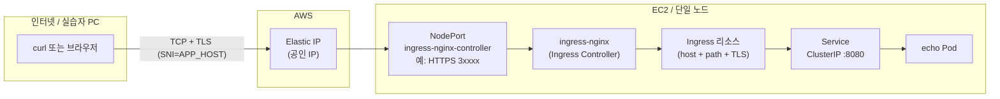
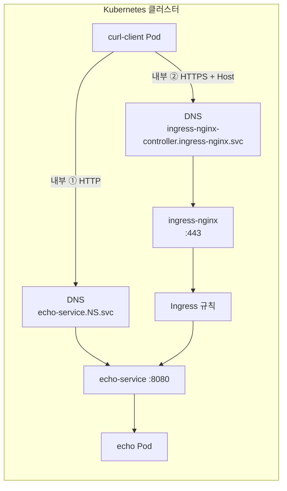
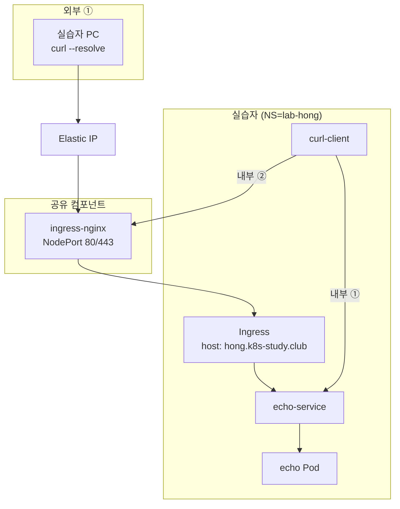

# EC2 단일 노드 Kubernetes 실습 가이드

이 문서는 레포의 `AWS/scripts`로 올린 **EC2 한 대 + kubeadm 클러스터**에서, **Ingress(TLS) + echo 앱 + 내부/외부 호출** 실습을 하기 위한 절차를 정리합니다.

**호출 검증은 `ingressLab.sh` 기준으로 총 세 가지**로 정리합니다: **내부 ①·② 두 번**(둘 다 `curl-client` Pod 안의 `curl`)과 **외부 ① 한 번**(실습자 PC에서 공인 IP·HTTPS NodePort로 `curl --resolve`). (선택) EC2 SSH 셸에서 `127.0.0.1:HTTPS NodePort`로 붙는 방법은 §6.2에 따로 적어 두었습니다.

---

## 1. 전체 구성이 어떻게 동작하는지

### 1.1 한 줄 요약

- **EC2 한 대**가 **Kubernetes control plane + worker(단일 노드)** 역할을 합니다.
- **ingress-nginx**가 클러스터의 **Ingress Controller**이며, **baremetal/NodePort** 방식으로 **HTTP·HTTPS 포트가 노드(공인 IP)에 노출**됩니다.
- 실습자는 **서로 다른 Namespace**와 **서로 다른 서브도메인(`APP_HOST`)**으로 Ingress를 나누고, **같은 Elastic IP**로 외부에서 각자의 경로로 접근합니다.

### 1.2 트래픽 흐름 (외부 → 앱)

아래는 **실습자 PC에서 HTTPS로 Ingress를 탄 뒤 echo Pod까지** 가는 흐름입니다. (HTTPS는 보통 **443이 아니라 Ingress Controller의 NodePort**입니다.)



### 1.3 트래픽 흐름 (클러스터 내부 검증)

`ingressLab.sh`는 **`curl-client` Pod 안에서 `kubectl exec … curl`** 로 두 가지를 검증합니다.

| 구분 | 경로 | 의미 |
|------|------|------|
| **내부 ①** | `curl-client` → **Cluster DNS** → `echo-service:8080` | **Ingress 없이** Service로만 직통 (같은 NS의 echo Pod으로 로드밸런싱). |
| **내부 ②** | `curl-client` → **Cluster DNS** → `ingress-nginx-controller.ingress-nginx:443` (`Host: APP_HOST`, HTTPS, `-k`) | **다른 네임스페이스의 Ingress Controller Pod**로 들어간 뒤, Ingress 규칙에 따라 **echo Service → Pod**으로 라우팅 (**Pod 간 + Ingress 경유**). |



---

## 2. 운영자: EC2 및 클러스터 만들기

### 2.1 사전 준비

- **AWS 계정**, **AWS CLI v2** 설치 및 `aws configure`로 자격 증명
- 대상 리전에 **EC2 키 페어** 생성 (이름만 기억해 두면 됨. 예: `Kubernetes_study`)
- **기본 VPC**가 있는 리전을 사용합니다 (`create-lab-ec2.sh`가 기본 VPC/서브넷을 사용합니다).

### 2.2 인스턴스 생성 스크립트

로컬(또는 CI)에서:

```bash
cd AWS/scripts

export AWS_REGION=ap-northeast-2
export KEY_NAME=Kubernetes_study

./create-lab-ec2.sh
```

| 환경 변수 | 설명 |
|-----------|------|
| `AWS_REGION` | **필수** |
| `KEY_NAME` | **필수**. 해당 리전의 키 페어 **이름** |
| `INSTANCE_TYPE` | 선택. 기본 `t3.large` |
| `ALLOCATE_EIP` | 선택. 기본 `true` (고정 공인 IP) |
| `SECURITY_GROUP_NAME` | 선택. 기본 `k8s-lab-sg` |

스크립트가 하는 일의 요지:

- 기본 VPC에 **보안 그룹** 생성(또는 재사용): **22, 6443, 80, 443, 30000–32767** 인바운드
- **Ubuntu 22.04** AMI로 EC2 실행
- **user-data**로 `bootstrap-k8s.sh` 실행: **containerd + kubeadm 단일 노드 + Calico + ingress-nginx(baremetal)**
- **Elastic IP**를 미리 할당해 인증서 SAN에 넣은 뒤 인스턴스에 연결

### 2.3 부팅 완료 대기

인스턴스가 `running`이 된 뒤에도 **cloud-init / kubeadm**은 수 분 걸릴 수 있습니다.

```bash
ssh -i ~/.ssh/키파일.pem ubuntu@<Elastic_IP>
tail -f /var/log/bootstrap-k8s.log
```

로그 끝에 오류 없이 완료되면:

```bash
kubectl get nodes
kubectl get pods -n ingress-nginx
kubectl get ingressclass
```

`IngressClass` 이름 **`nginx`**가 보이면 Ingress 실습 준비가 된 것입니다.

---

## 3. 실습자: SSH 접속

### 3.1 접속 명령

```bash
ssh -i <개인키_파일_경로> ubuntu@<Elastic_IP>
```

- **`<개인키_파일_경로>`**: 키 페어를 만들 때 받은 `.pem` 등 (예: `~/.ssh/Kubernetes_study.pem`)
- 첫 접속 시 **호스트 키 확인**에 `yes` 입력

### 3.2 macOS에서 자주 나는 이슈

- **Downloads 폴더**: 터미널이 `chmod`나 `ssh -i ~/Downloads/...`를 막을 수 있습니다. 키를 **`~/.ssh/`**로 옮기고 `chmod 400 ~/.ssh/키이름.pem` 권장.
- **`kubectl`**: 부트스트랩이 `ubuntu` 사용자 홈에 `~/.kube/config`를 복사해 둡니다. `ubuntu`로 로그인한 상태에서 `kubectl` 사용.

---

## 4. 운영자: DNS (Route53) — 여러 실습자용 서브도메인

- **도메인** 하나를 Route53 Hosted Zone에 둡니다.
- **여러 A 레코드**(또는 한 번에 여러 이름)로 **서브도메인 → 동일 Elastic IP**를 가리킵니다.

예 (도메인이 **`k8s-study.club`**, Route53 Hosted Zone이 해당 도메인일 때):

| Route53 Record name | 타입 | 값 | 결과 FQDN |
|---------------------|------|-----|-----------|
| `hong` | A | `<Elastic IP>` | `hong.k8s-study.club` |
| `kim` | A | `<Elastic IP>` | `kim.k8s-study.club` |

Record name은 Hosted Zone 이름을 제외한 **한 단락**만 적는 경우가 많습니다. `APP_HOST`에는 **완전한 FQDN**(예: `hong.k8s-study.club`)을 넣습니다.

Ingress는 **호스트 이름**으로 규칙이 갈리므로, IP는 같아도 **서브도메인별로 다른 Ingress(다른 Namespace)**로 라우팅됩니다.

---

## 5. 실습자: 앱·Ingress 올리기 (`ingressLab.sh`)

EC2에 스크립트가 있다고 가정합니다 (레포에서 `AWS/scripts/ingressLab.sh` 복사).

### 5.1 반드시 정할 값

| 변수 | 의미 |
|------|------|
| **`NS`** | **필수.** 본인만 쓰는 Namespace (동료와 겹치면 안 됨). 예: `lab-hong` |
| **`APP_HOST`** | **도메인으로 외부 검증할 때 필수.** 사용할 **서브도메인 전체 FQDN**(예: `hong.k8s-study.club`). **운영자에게 서브도메인 사용을 요청**하고, 운영자가 Route53에 **해당 이름으로 A 레코드(값 = 이 실습 클러스터 Elastic IP)** 를 등록한 뒤 **그와 동일한 문자열**을 `APP_HOST`에 넣습니다. |
| `APP_HOST` 생략 | 메타데이터에 공인 IP가 있으면 자동으로 **`<공인IP>.nip.io`** (Route53 없이 혼자 테스트할 때) |

**실습 안내용 문구(운영자가 실습자에게 전달 가능):**  
「**본인이 쓰고 싶은 서브도메인(FQDN)을 운영자에게 요청할 것.** 운영자가 Route53에 **그 FQDN에 대한 A 레코드**(값은 안내받은 **Elastic IP**)를 등록한 뒤, **`export APP_HOST=`에 등록된 FQDN과 동일하게** 넣고 `ingressLab.sh`를 실행할 것.**」

**도메인(`APP_HOST`)을 쓰는 실습자는**, 위 요청·등록이 끝난 뒤 `dig`/`nslookup` 등으로 **FQDN이 Elastic IP로 조회되는지** 확인한 다음 스크립트를 실행하는 것을 권장합니다.

### 5.2 실행 예

**여러 명이 같은 클러스터에서 실습할 때:**

```bash
export NS=lab-hong
export APP_HOST=hong.k8s-study.club
chmod +x ./ingressLab.sh
./ingressLab.sh
```

**혼자 Route53 없이:**

```bash
export NS=lab-me
./ingressLab.sh
```

스크립트가 하는 일:

1. **echo Deployment**, **ClusterIP Service**, **Ingress(TLS + `ingressClassName: nginx`)** 생성  
2. **`curl-client` Pod** 안에서 **내부 ①·②** 각각 실행 (§6.0 표 참고)  
3. **외부 ①**에 해당하는 **`curl --resolve` 예시** 및, (선택) **EC2 호스트에서 NodePort**로 붙는 예시를 화면에 출력

---

## 6. 실습자: 테스트 요청 정리

### 6.0 요약 — 내부 2번 + 외부 1번

| 번호 | 분류 | 실행 위치 | 무엇을 검증하는가 |
|------|------|------------|-------------------|
| **내부 ①** | 클러스터 내부 | `curl-client` Pod (`kubectl exec … curl`) | **echo Service**로만 HTTP 직통 (Ingress 비경유). |
| **내부 ②** | 클러스터 내부 | `curl-client` Pod (`kubectl exec … curl`) | **ingress-nginx** Service(`:443`) + `Host: APP_HOST`로 Ingress를 탄 뒤 echo까지 (**Pod 간 + Ingress 경유**). |
| **외부 ①** | 인터넷 → 노드 | **실습자 PC** 등 클러스터 밖 | `curl --resolve` → **Elastic IP : HTTPS NodePort**로 공인망에서 Ingress 진입 (실제 사용자 유입과 동일에 가깝게 검증). |

`ingressLab.sh`는 **내부 ①·②를 자동 실행**하고, **외부 ①**에 쓸 `curl` 예시(및 선택적으로 EC2에서 NodePort로 붙는 예시)를 마지막에 출력합니다.

### 6.1 내부 ①·② (`ingressLab.sh`가 `curl-client` 안에서 실행)

- **출발지**: 같은 Namespace의 **`curl-client` Pod** (`kubectl exec … curl`).
- **내부 ① (Service 직통, Ingress 비경유)**  
  - **목적지**: `http://echo-service.<NS>.svc.cluster.local:8080<INGRESS_PATH>`  
  - **의미**: Pod 네트워크에서 **Cluster DNS**로 **echo Service**에만 붙는 경로.
- **내부 ② (Ingress 경유, Pod → ingress-nginx → echo)**  
  - **목적지**: `https://ingress-nginx-controller.ingress-nginx.svc.cluster.local:443<INGRESS_PATH>`  
  - **헤더**: `-H "Host: <APP_HOST>"` (Ingress가 호스트로 규칙을 고름)  
  - **TLS**: `-k` (자체서명)  
  - **의미**: 클러스터 안의 **다른 Service(ingress-nginx)** 로 들어가 **Ingress 리소스**를 탄 뒤 echo로 가는 경로 (외부 NodePort와 동일한 L7 동작을 **Pod 간**으로 재현).

### 6.2 외부 ① — 본인 PC 등 (클러스터 밖)

**외부 ①**은 **인터넷에서 Elastic IP와 HTTPS NodePort로 Ingress에 들어가는 경로**입니다.

Ingress Controller는 **baremetal**이라 **HTTPS = 443이 아니라 NodePort**(예: `31234`)입니다.

스크립트 마지막에 출력되는 형태:

```bash
curl -vk --resolve ${APP_HOST}:${HTTPS_NP}:${PUBLIC_IP} \
  "https://${APP_HOST}:${HTTPS_NP}${INGRESS_PATH}"
```

**숫자 예시** (`APP_HOST=hong.k8s-study.club`, `PUBLIC_IP=54.116.143.69`, `HTTPS_NP=31234`, 경로 `/echo`):

```bash
curl -vk --resolve hong.k8s-study.club:31234:54.116.143.69 \
  "https://hong.k8s-study.club:31234/echo"
```

- **`--resolve`**: “`호스트:포트`로 붙을 때 DNS 말고 이 IP로 연결해라” (SNI/Host는 그대로 `hong.k8s-study.club`)
- **`-k`**: 자체서명 TLS라 인증서 검증 생략

**(선택)** **EC2 SSH 셸(노드 호스트)** 에서 NodePort만 빠르게 볼 때는 아래처럼 **HTTPS + Host**를 쓰면 **200**입니다. (HTTP NodePort만 쓰면 TLS Ingress에서 **308**으로 HTTPS로 보내는 경우가 많습니다.) 이는 **외부 ①과 같은 Ingress 진입점**이지만, 트래픽 출발지가 **루프백**인 경우입니다.

```bash
curl -sS -k -o /dev/null -w '%{http_code}\n' -H "Host: ${APP_HOST}" \
  "https://127.0.0.1:${HTTPS_NP}${INGRESS_PATH}"
```

클러스터 **안**에서 Ingress까지 타려면 **내부 ②**(`curl-client` → `ingress-nginx-controller...:443`)를 사용합니다.

### 6.3 `curl -vk` 출력 읽기 (**외부 ①**과 대응)

맥(또는 EC2)에서 아래처럼 **HTTPS NodePort**로 호출하면 `curl -vk` 가 연결·TLS·HTTP까지 풀어서 보여 줍니다.

```bash
curl -vk --resolve ${APP_HOST}:${HTTPS_NP}:${PUBLIC_IP} \
  "https://${APP_HOST}:${HTTPS_NP}${INGRESS_PATH}"
```

아래는 **§6.4 다이어그램 순서**(**외부 ①**: PC → EIP → ingress-nginx → …)와 로그를 맞춘 설명입니다.

| 로그에서 보이는 것 | 이 실습 구성에서의 의미 |
|--------------------|-------------------------|
| `Trying ...:30710` / `Connected to ... port 30710` | **Elastic IP**로 들어온 TCP가 **노드의 HTTPS NodePort**(ingress-nginx-controller)에 붙었음을 뜻합니다. |
| `TLS handshake` … `Server certificate: CN=<APP_HOST>` | **Ingress에 연결한 TLS Secret**으로 **ingress-nginx가 TLS 종료**하는 중입니다. (자체서명이면 검증 경고가 나올 수 있음) |
| `ALPN: server accepted h2`, `GET ... HTTP/2` | 컨트롤러가 **HTTP/2**로 응답하는 경우가 많습니다. |
| `< HTTP/2 200` | Ingress가 **호스트·경로 Ingress 규칙**에 맞춰 백엔드로 넘긴 뒤 **정상 응답**을 받았다는 뜻입니다. |
| `strict-transport-security` | **HSTS** — 브라우저 등에 “HTTPS를 써라”는 헤더입니다. |

**응답 본문**(echoserver가 출력하는 긴 텍스트)은 “앱이 받은 HTTP 요청”을 그대로 보여 주는 디버그 페이지입니다. 흐름과 연결하면 다음처럼 읽으면 됩니다.

- **`Hostname: echo-…`**: 요청을 실제로 처리한 **echo Pod** 이름입니다. (Ingress → **Service** → **Endpoint Pod**)
- **`request_uri=http://<APP_HOST>:8080/echo`**: Ingress가 백엔드로 넘길 때의 **클러스터 내부 URL**입니다. **8080**은 `echo-service`의 **Service 포트**이고, TLS는 Ingress에서 이미 끝난 뒤라 **백엔드 구간은 HTTP**로 보이는 것이 일반적입니다.
- **`host=...:30710`**: 클라이언트가 보낸 **Host** 헤더(여기서는 NodePort가 붙은 형태)입니다.
- **`x-forwarded-for` / `x-real-ip` / `x-forwarded-proto=https`**: 클라이언트가 **노드 밖(공인망)** 에 있을 때, **nginx(Ingress)** 가 백엔드가 원 요청을 알 수 있게 붙이는 **프록시 관례 헤더**입니다. (`x-forwarded-proto`가 https인 것은 “클라이언트는 HTTPS로 왔다”는 정보)

**한 줄 요약:** `curl -vk` 로그는 **공인 IP:HTTPS NodePort까지 왔다가, ingress-nginx에서 TLS가 끝나고, Ingress 규칙에 따라 echo Service로 프록시되어 200이 난 과정**을 단계별로 보여 주는 것이고, 본문은 **그 결과 echo Pod이 받은 요청의 스냅샷**입니다.

### 6.4 전체 그림 (`hong.k8s-study.club` / `NS=lab-hong` 기준)



---

## 7. 스크립트 파일 위치 (레포 기준)

| 파일 | 역할 |
|------|------|
| `AWS/scripts/create-lab-ec2.sh` | EC2 + SG + EIP + user-data 실행 |
| `AWS/scripts/bootstrap-k8s.sh` | 첫 부팅 시 kubeadm / Calico / ingress-nginx 설치 |
| `AWS/scripts/ingressLab.sh` | 실습자용 echo + Service + Ingress + curl-client |

---

## 8. 주의 사항

- **동일 EC2 / 동일 kubeconfig**: SSH로 들어오는 실습자가 전부 **cluster-admin**에 가깝게 동작할 수 있습니다. **Namespace 이름 규칙**으로 서로 덮어쓰지 않도록 합의하는 것이 좋습니다.
- **보안 그룹**: 실습용으로 넓게 열려 있습니다. 운영 환경에서는 **SSH·API(6443)는 본인 IP로 제한**하는 것이 좋습니다.
- **비용**: EC2·EIP·트래픽에 따른 요금이 발생합니다. 실습 후 인스턴스·EIP 해제를 권장합니다.
