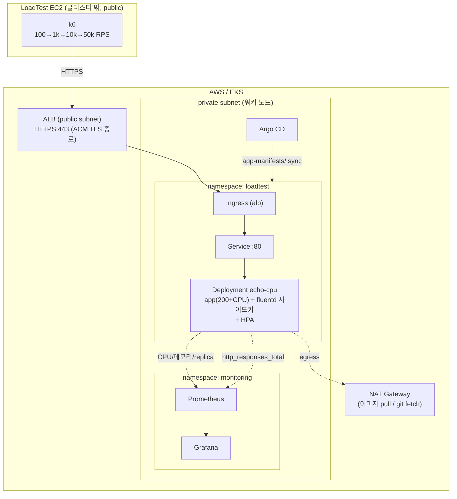
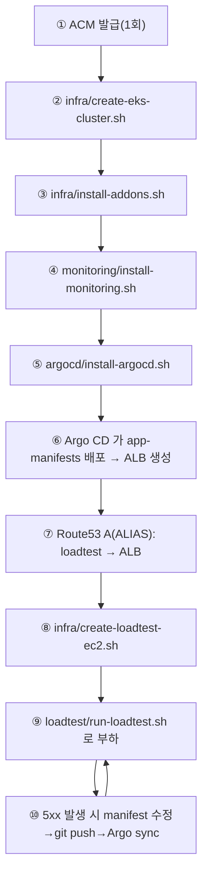

# LoadTestLab — EKS 부하 테스트 / HPA / GitOps 실습 가이드

EKS 위에 **HTTPS 진입점(ALB+ACM)** 을 가진 앱을 띄우고, **LoadTest EC2**에서 초당 요청수를
**100 → 1,000 → 10,000 → 50,000 RPS** 로 올려가며, **Deployment(Replica/Resource/사이드카) + HPA**
를 단계적으로 강화해 **200 응답 100% 유지**를 목표로 합니다. 매니페스트는 **Argo CD(GitOps)** 로 배포합니다.

---

## 1. 전체 아키텍처



| 구간 | 프로토콜 | 비고 |
|------|----------|------|
| LoadTest EC2 → ALB | HTTPS(443) | ACM 인증서로 TLS 종료 |
| ALB → Pod | HTTP(80) | VPC 내부 평문 |
| 워커 노드 → 인터넷 | NAT 경유 | 이미지 pull, Argo CD git fetch |

---

## 2. 사전 작업 (운영자, 실습 전 1회)

| # | 작업 | 비고 |
|---|------|------|
| 1 | 로컬에 `aws` CLI v2, `eksctl`, `kubectl`, `helm`, `envsubst` 설치 | |
| 2 | `aws configure` 자격 증명 | |
| 3 | 해당 리전 **EC2 키페어** 준비 | LoadTest EC2 SSH 용 |
| 4 | **ACM 인증서 1회 발급** (아래 §2.1) | `loadtest.k8s-study.club`, EKS 와 **동일 리전** |
| 5 | (클러스터·Ingress 기동 후) **Route53 A(ALIAS): `loadtest` → ALB** (§2.3) | ALB 생성된 뒤 |

### 2.1 ACM 인증서 발급 (1회, DNS 검증)

**전제:** `k8s-study.club` Public Hosted Zone 이 Route53 에 있어야 합니다.

> **중요:** ALB 에 붙이는 ACM 인증서는 **EKS 클러스터와 같은 리전**에 있어야 합니다.
> (예: EKS 가 `ap-northeast-2` 이면 ACM 도 `ap-northeast-2`. `us-east-1` 에 만들면 ALB 에 사용 불가.)

#### 도메인 선택

| 방식 | 도메인 예 | 용도 |
|------|-----------|------|
| **서브도메인 1개** (권장) | `loadtest.k8s-study.club` | 이 실습 단일 진입점 |
| 와일드카드 | `*.k8s-study.club` | 여러 서브도메인 재사용 시 |

이 실습의 `APP_HOST` / Ingress host 는 **`loadtest.k8s-study.club`** 입니다.

#### 방법 A — AWS 콘솔 (가장 직관적)

1. **Certificate Manager (ACM)** 콘솔 → **리전을 `ap-northeast-2`(서울)로 선택**
2. **Request certificate** → **Request a public certificate**
3. **Fully qualified domain name:** `loadtest.k8s-study.club`
4. **Validation method:** **DNS validation**
5. **Key algorithm:** RSA 2048 (기본값)
6. **Request** 클릭
7. 생성된 인증서 상세 → **Domains** → **Create records in Route53** 클릭
   - Hosted Zone 이 같은 계정에 있으면 검증용 **CNAME 이 자동 생성**됩니다.
8. 1~5분 후 상태가 **Pending validation** → **Issued** 로 변경
9. 인증서 상세에서 **ARN** 복사 (기록해 두기, 선택 사항)

```
arn:aws:acm:ap-northeast-2:<ACCOUNT_ID>:certificate/<UUID>
```

#### 방법 B — AWS CLI (스크립트화)

```bash
export AWS_REGION=ap-northeast-2
export DOMAIN=loadtest.k8s-study.club

# 1) 인증서 요청
CERT_ARN=$(aws acm request-certificate \
  --region "${AWS_REGION}" \
  --domain-name "${DOMAIN}" \
  --validation-method DNS \
  --query CertificateArn --output text)
echo "Certificate ARN: ${CERT_ARN}"

# 2) DNS 검증용 CNAME 정보 조회
aws acm describe-certificate \
  --region "${AWS_REGION}" \
  --certificate-arn "${CERT_ARN}" \
  --query 'Certificate.DomainValidationOptions[0].ResourceRecord' \
  --output json
# → Name, Type(CNAME), Value 가 출력됨

# 3) Route53 Hosted Zone ID 확인
HOSTED_ZONE_ID=$(aws route53 list-hosted-zones-by-name \
  --dns-name k8s-study.club \
  --query 'HostedZones[0].Id' --output text | sed 's|/hostedzone/||')
echo "Hosted Zone ID: ${HOSTED_ZONE_ID}"

# 4) 검증 CNAME 등록 (아래 Name/Value 는 2)번 출력값으로 교체)
VALIDATION_NAME="_abc123.loadtest.k8s-study.club"
VALIDATION_VALUE="_xyz789.acm-validations.aws."

aws route53 change-resource-record-sets \
  --hosted-zone-id "${HOSTED_ZONE_ID}" \
  --change-batch "$(cat <<EOF
{
  "Changes": [{
    "Action": "UPSERT",
    "ResourceRecordSet": {
      "Name": "${VALIDATION_NAME}",
      "Type": "CNAME",
      "TTL": 300,
      "ResourceRecords": [{ "Value": "${VALIDATION_VALUE}" }]
    }
  }]
}
EOF
)"

# 5) Issued 될 때까지 대기
aws acm wait certificate-validated \
  --region "${AWS_REGION}" \
  --certificate-arn "${CERT_ARN}"
echo "ACM 인증서 발급 완료: ${CERT_ARN}"
```

#### ACM 발급 확인

```bash
aws acm describe-certificate \
  --region ap-northeast-2 \
  --certificate-arn "${CERT_ARN}" \
  --query 'Certificate.Status' --output text
# Issued
```

#### Ingress 와 ACM 연동

- **인증서는 운영자가 1회만 발급**합니다. 실습 중 manifest 를 바꿔도 재발급하지 않습니다.
- `app-manifests/ingress.yaml` 의 host(`loadtest.k8s-study.club`)와 ACM 도메인이 **일치**해야 합니다.
- AWS Load Balancer Controller 는 Ingress host 와 일치하는 ACM 인증서를 **자동 탐색**합니다.
  → 매니페스트에 ARN 을 넣지 않아도 동작합니다.
- ARN 을 고정하고 싶으면 `ingress.yaml` 의 `certificate-arn` 주석을 해제해 넣으세요.

### 2.2 ACM vs Route53 A 레코드 (헷갈리기 쉬운 부분)

| 작업 | 목적 | 시점 |
|------|------|------|
| **ACM DNS 검증 CNAME** | “이 도메인 소유자” 증명 → **인증서 발급** | 클러스터 구축 **전** |
| **Route53 A(ALIAS) → ALB** | `loadtest.k8s-study.club` 이 **ALB IP로 연결** | Ingress 로 ALB 생성 **후** |

ACM 은 HTTPS **인증서**만 발급합니다. 도메인이 ALB 로 가려면 **A(ALIAS) 레코드**가 별도로 필요합니다.

### 2.3 Route53 A(ALIAS) — ALB 생성 후 (1회)

Ingress 가 sync 되면 ALB 가 생성됩니다.

```bash
kubectl -n loadtest get ingress echo-cpu
# ADDRESS 컬럼 = xxx.ap-northeast-2.elb.amazonaws.com
```

Route53 Hosted Zone `k8s-study.club` 에 레코드 추가:

| 항목 | 값 |
|------|-----|
| Record name | `loadtest` |
| Type | **A** (Alias) |
| Alias target | 위 ALB DNS (`dualstack.xxx.elb.amazonaws.com`) |
| Evaluate target health | Yes (권장) |

**ap-northeast-2 ALB Hosted Zone ID:** `ZWKZPGTI48KDX` (리전별 고정값)

CLI 예:

```bash
ALB_DNS="dualstack.k8s-loadtest-xxx.ap-northeast-2.elb.amazonaws.com"
ALB_ZONE_ID="ZWKZPGTI48KDX"

aws route53 change-resource-record-sets \
  --hosted-zone-id "${HOSTED_ZONE_ID}" \
  --change-batch "$(cat <<EOF
{
  "Changes": [{
    "Action": "UPSERT",
    "ResourceRecordSet": {
      "Name": "loadtest.k8s-study.club",
      "Type": "A",
      "AliasTarget": {
        "HostedZoneId": "${ALB_ZONE_ID}",
        "DNSName": "${ALB_DNS}",
        "EvaluateTargetHealth": true
      }
    }
  }]
}
EOF
)"
```

검증:

```bash
dig loadtest.k8s-study.club +short
curl -vk https://loadtest.k8s-study.club/
# HTTP/2 200, 인증서 CN/SAN 에 loadtest.k8s-study.club
```

---

## 3. 구축 순서



### ② EKS 클러스터 (private 노드 + NAT)

```bash
cd AWS/LoadTestLab/infra
export AWS_REGION=ap-northeast-2
./create-eks-cluster.sh
# 검증: kubectl get nodes
```

선택 환경변수: `CLUSTER_NAME`(loadtest-lab), `NODE_INSTANCE_TYPE`(t3.medium), `NODE_COUNT`(3).
노드는 **의도적으로 작게** 잡혀 있습니다(실습 목표: 가까스로 버티는 환경).

### ③ 애드온 (ALB Controller / metrics-server / gp3)

```bash
./install-addons.sh
# 검증: kubectl -n kube-system get deploy aws-load-balancer-controller / kubectl get sc
```

### ④ 모니터링 (Prometheus + Grafana)

```bash
cd ../monitoring
./install-monitoring.sh
# Grafana: kubectl -n monitoring port-forward svc/kube-prometheus-stack-grafana 3000:80
#          http://localhost:3000  (admin / loadtest-admin)
```

### ⑤ Argo CD + 앱 배포

```bash
cd ../argocd
./install-argocd.sh
# app-manifests/ 가 loadtest 네임스페이스에 자동 sync 됨
# 검증: kubectl -n loadtest get deploy,svc,ingress,hpa,pod
```

### ⑦ ALB 주소로 Route53 A(ALIAS)

§2.3 절차를 따릅니다.

```bash
kubectl -n loadtest get ingress echo-cpu   # ADDRESS = ALB DNS
```

### ⑧ LoadTest EC2

```bash
cd ../infra
export KEY_NAME=<키페어 이름>
./create-loadtest-ec2.sh
# 출력된 SSH 명령으로 접속, loadtest/ 파일을 복사하거나 레포 clone
```

---

## 4. 실습 진행 (목표: 매 단계 200 100%)

`app-manifests/` 는 **일부러 빈약**합니다.

| 파일 | 초기값 | 강화 포인트 |
|------|--------|-------------|
| `deployment.yaml` | replicas=1, cpu limit 200m | replicas↑, requests/limits 조정 |
| `hpa.yaml` | maxReplicas=3, CPU 50% | maxReplicas↑, target/behavior 조정 |

### 루프

```mermaid
flowchart LR
  L["run-loadtest.sh<br/>(다음 RPS 단계)"] --> M["Grafana 관찰<br/>CPU/replica"]
  M --> N{"5xx / 타임아웃?"}
  N -->|있음| FIX["app-manifests 수정<br/>git commit & push"]
  FIX --> SYNC["Argo CD 자동 sync"]
  SYNC --> L
  N -->|없음(200 100%)| UP["다음 단계로"]
  UP --> L
```

### 부하 실행 (LoadTest EC2 에서)

```bash
cd loadtest
# 단일 단계 집중
APP_HOST=loadtest.k8s-study.club ./run-loadtest.sh 1000
# 전체 램프(100→1k→10k→50k)
APP_HOST=loadtest.k8s-study.club ./run-loadtest.sh
```

### 검증 지표

| 무엇 | 어디서 |
|------|--------|
| 200 비율 / 실패율 | **k6 출력** (`http_req_failed`, checks) |
| 200/500 로그 | `kubectl -n loadtest logs <pod> -c fluentd` |
| **200/500 누적 건수 (메트릭)** | **Grafana / Prometheus** (`http_responses_total`) |
| CPU / replica 수 | **Grafana** (HPA 스케일 관찰) |
| HPA 상태 | `kubectl -n loadtest get hpa -w` |

#### Grafana — 200/500 메트릭 (fluentd → Prometheus)

fluentd 사이드카가 `http_responses_total{code="200"}` / `{code="500"}` 카운터를 `:24231/metrics` 에 노출합니다.
`ServiceMonitor` 가 Prometheus 에 수집하고 Grafana 에서 조회합니다.

**Prometheus 쿼리 예:**

```promql
# 초당 200 응답률
rate(http_responses_total{code="200",namespace="loadtest"}[1m])

# 초당 500 응답률 (5xx 발생 시 상승)
rate(http_responses_total{code="500",namespace="loadtest"}[1m])

# 200 비율 (200+500 중 200 비중)
rate(http_responses_total{code="200"}[1m])
  / ignoring(code)
  (rate(http_responses_total{code="200"}[1m]) + rate(http_responses_total{code="500"}[1m]))
```

**스크랩 확인 (Prometheus UI):**

```bash
kubectl -n monitoring port-forward svc/kube-prometheus-stack-prometheus 9090:9090
# http://localhost:9090 → Status > Targets 에 echo-cpu-metrics 가 UP 인지 확인
```

**Pod 메트릭 직접 확인:**

```bash
kubectl -n loadtest port-forward pod/<echo-cpu-pod> 24231:24231
curl -s localhost:24231/metrics | grep http_responses_total
```

---

## 5. 파일 구성

```
AWS/LoadTestLab/
├── LAB-GUIDE.md
├── infra/
│   ├── cluster-config.yaml          # eksctl: private 노드 + NAT(Single) + OIDC
│   ├── create-eks-cluster.sh
│   ├── install-addons.sh            # ALB Controller + metrics-server + gp3(EBS CSI)
│   └── create-loadtest-ec2.sh       # k6 설치 + TCP 튜닝
├── monitoring/
│   ├── install-monitoring.sh        # kube-prometheus-stack
│   └── values-kube-prometheus.yaml  # gp3 PVC
├── argocd/
│   ├── install-argocd.sh
│   └── application.yaml             # app-manifests/ 동기화
├── app-manifests/                   # ← Argo CD 동기화 대상(실습 중 수정)
│   ├── namespace.yaml
│   ├── fluentd-config.yaml          # 200/500 로그 + Prometheus 카운터
│   ├── deployment.yaml              # app(200+CPU) + fluentd 사이드카 (초기 빈약)
│   ├── service.yaml
│   ├── metrics-service.yaml         # fluentd :24231/metrics
│   ├── servicemonitor.yaml          # Prometheus 스크랩
│   ├── ingress.yaml                 # ALB + HTTPS(ACM 자동탐색)
│   └── hpa.yaml                     # 초기 약함
└── loadtest/
    ├── run-loadtest.sh
    ├── script.js                    # 램프 100→1k→10k→50k
    └── single-rate.js               # 단일 RPS 고정
```

---

## 6. 설계 메모 / 주의

- **앱이 CPU 를 쓰는 이유:** `registry.k8s.io/hpa-example` 는 요청당 연산을 해서 RPS↑ → CPU↑.
  순수 200-only 앱이면 CPU 가 안 올라 HPA 가 동작하지 않습니다.
- **사이드카 로그·메트릭:** 공식 php-apache 는 로그를 stdout 으로 보내므로, `/var/log/apache2` 를
  emptyDir 로 덮어 **실제 파일**로 기록되게 한 뒤 fluentd 가 읽습니다. fluentd 는 200/500 만
  stdout 에 남기고, 동시에 `http_responses_total{code}` Prometheus 카운터를 노출합니다.
  이미지는 `fluent-plugin-prometheus` 가 포함된 `debian-prometheus` 변형을 사용합니다.
- **TLS 종료는 ALB**, 백엔드는 HTTP — Pod 에 인증서가 필요 없습니다.
- **노드 수/스펙은 시작점**입니다. "50k 를 가까스로 버티는" 정확한 스펙은 실측으로 보정하세요.
- **50k RPS** 는 keep-alive 기반에서 단일 EC2(c5.2xlarge~c5.4xlarge)로 가능합니다. 새 커넥션을
  매번 열면 임시 포트 고갈로 ~1k/s 가 한계라, k6 의 커넥션 재사용을 유지하세요.
- **NAT 비용**: private 노드라 NAT 가 필요합니다(이미지 pull + Argo CD git fetch). 실습 후
  `eksctl delete cluster --name loadtest-lab` 로 정리하세요.

---

## 7. 정리(비용 절감)

```bash
# LoadTest EC2 종료 (콘솔 또는 CLI)
aws ec2 terminate-instances --region ap-northeast-2 --instance-ids <id>
# EKS 삭제 (NAT/EIP/노드 포함 정리)
eksctl delete cluster --name loadtest-lab --region ap-northeast-2
```
