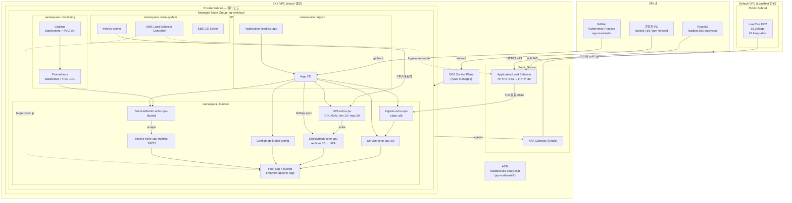
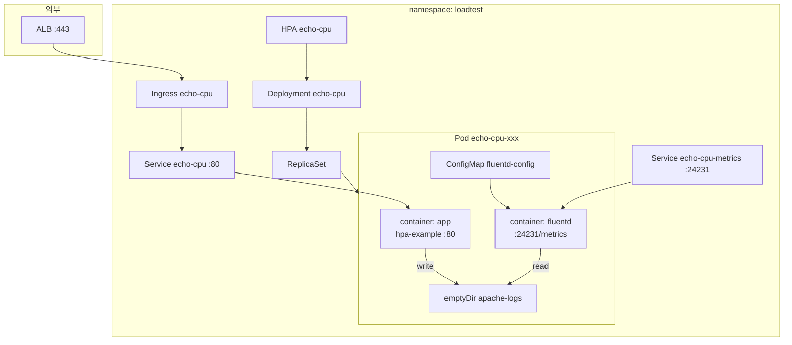
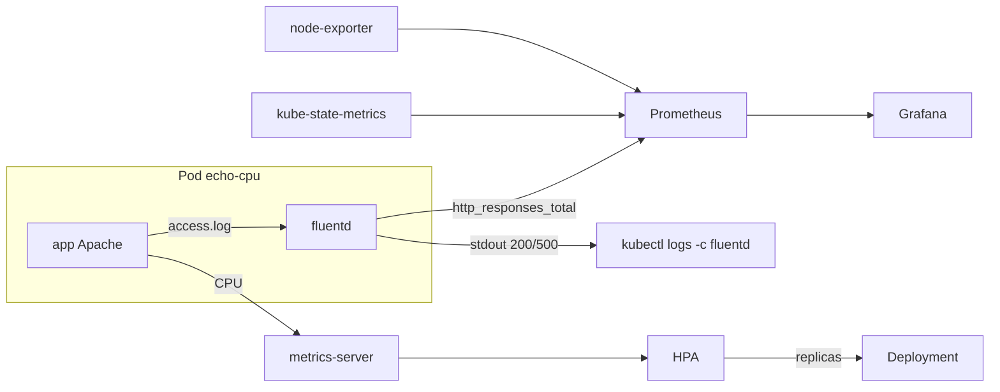
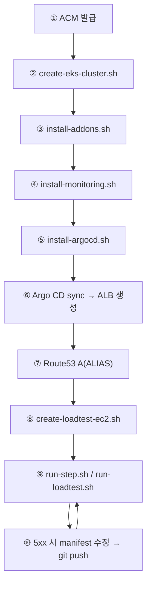

# LoadTestLab — Architecture

EKS 부하 테스트 / HPA / GitOps 실습 환경의 **현재 구조**를 정리한 문서입니다.

| 문서 | 용도 |
|------|------|
| [LAB-GUIDE.md](./LAB-GUIDE.md) | 최초 인프라 구축 (ACM → EKS → 애드온 → 모니터링 → Argo CD → Route53 → EC2) |
| [test-guide.md](./test-guide.md) | 구축 완료 후 **Grafana → Argo CD → 부하 테스트** 일일 실행 절차 |
| **architecture.md** (본 문서) | 전체 아키텍처·트래픽·컴포넌트·스펙 참조 |

---

## 1. 한눈에 보는 구조

LoadTestLab은 **두 AWS 네트워크 경계**로 나뉩니다.

```
┌──────────────────────────────────────────────────────────────────────┐
│  클러스터 밖                                                            │
│  · LoadTest EC2 (Default VPC, public) — k6 부하 생성                    │
│  · 운영자 PC (Mac / Windows) — kubectl, git, port-forward               │
└───────────────────────────────┬──────────────────────────────────────┘
                                │ HTTPS 443 (Route53 → ALB)
                                │ kubectl → Control Plane
┌───────────────────────────────▼──────────────────────────────────────┐
│  EKS VPC (eksctl 전용 VPC)                                              │
│  [public]  ALB (internet-facing), NAT Gateway (Single)                 │
│  [private] 워커 노드 ng-workload × 5 (c5.2xlarge)                       │
│    kube-system  → ALB Controller, metrics-server, EBS CSI               │
│    argocd       → Argo CD + Application loadtest-app                    │
│    monitoring   → Prometheus, Grafana (kube-prometheus-stack)           │
│    loadtest     → echo-cpu (app + fluentd), Ingress, HPA, ServiceMonitor │
└──────────────────────────────────────────────────────────────────────┘
```

**설계 목표:** LoadTest EC2에서 RPS를 **100 → 1k → 10k → 50k** 로 올리며, `app-manifests/`(Deployment/HPA)를 GitOps로 튜닝해 **HTTP 200 100%** 를 유지하는 실습.

---

## 2. 전체 구조도



---

## 3. 워커 노드 (5대)

`kubectl get nodes`에 보이는 **5개는 모두 동일한 워커 노드**입니다. Grafana 전용·Argo CD 전용 노드처럼 **역할이 고정 분리되어 있지 않습니다.**

| 항목 | 값 |
|------|-----|
| 노드 그룹 | `ng-workload` (Managed Node Group **1개**) |
| 인스턴스 | **c5.2xlarge × 5** (desired 5, min 4, max 6) |
| 라벨 | `role=workload` |
| 서브넷 | **private** (`privateNetworking: true`) |
| SSH | 비활성 (`ssh.allow: false`) |
| Control Plane | AWS 관리 — `get nodes`에 **포함되지 않음** |

Kubernetes 스케줄러가 아래 워크로드를 **5대에 분산** 배치합니다.

| namespace | 주요 Pod | 역할 |
|-----------|----------|------|
| `kube-system` | ALB Controller, metrics-server, EBS CSI, vpc-cni, kube-proxy | Ingress→ALB, HPA CPU 메트릭, gp3 PVC |
| `argocd` | argocd-server, repo-server, application-controller | GitOps |
| `monitoring` | Prometheus, Grafana, kube-state-metrics, node-exporter(DaemonSet) | 메트릭 수집·시각화 |
| `loadtest` | echo-cpu (app + fluentd) × N | 부하 수신, HPA 대상 |

**용량 참고** (`cluster-config.yaml` 주석, 실측 기준):

| 노드 스펙 | 대략적 처리 한계 |
|-----------|------------------|
| t3.medium × 3 | ~100 RPS (1k 부하 시 ~9% 처리) |
| **c5.2xlarge × 5** (현재) | **~1,000 RPS** 겨우 버티는 수준 |
| 10k / 50k RPS | manifest(replicas/resources/HPA) + 노드 스펙 추가 강화 필요 |

노드별 Pod 배치 확인:

```bash
kubectl get pods -A -o wide --sort-by=.spec.nodeName
kubectl describe node <노드이름>
```

---

## 4. 네트워크 · VPC · DNS

### 4.1 EKS VPC (eksctl)

`infra/create-eks-cluster.sh` + `infra/cluster-config.yaml`

| 항목 | 설정 |
|------|------|
| 클러스터 | `loadtest-lab`, K8s **1.33**, 리전 **ap-northeast-2** |
| VPC | eksctl **전용 VPC** (public + private subnet) |
| NAT | **Single** NAT Gateway — private 노드 아웃바운드 |
| OIDC | 활성 — IRSA (ALB Controller, EBS CSI) |

**Private 노드 아웃바운드 (NAT 경유):** 컨테이너 이미지 pull, Argo CD → GitHub fetch

**인바운드 (사용자 → 앱):** LoadTest EC2 / 브라우저 → **ALB(public)** → Ingress → Pod  
워커 노드에는 직접 인바운드 없음. ALB `target-type: ip`로 Pod IP 직접 등록.

### 4.2 Default VPC (LoadTest EC2)

`infra/create-loadtest-ec2.sh` — **EKS VPC와 별도** default VPC public subnet

| 항목 | 설정 |
|------|------|
| 인스턴스 | **c5.2xlarge** (기본), Name=`loadtest-ec2`, public IP |
| SG | `loadtest-sg`, SSH(22) |
| 소프트웨어 | k6 + TCP/fd 튜닝 (고RPS keep-alive) |

부하는 **공인 DNS** `loadtest.k8s-study.club` → Route53 → ALB 로 들어가므로 EC2가 다른 VPC에 있어도 동작합니다.

### 4.3 DNS · TLS

```
loadtest.k8s-study.club  ──Route53 A(ALIAS)──►  ALB DNS
                                                      │
                                              ACM 인증서 (HTTPS 443)
                                              TLS 종료 후 Pod :80 (HTTP)
```

| 작업 | 목적 | 시점 |
|------|------|------|
| **ACM DNS 검증 CNAME** | 도메인 소유 증명 → 인증서 발급 | 클러스터 구축 **전** |
| **Route53 A(ALIAS) → ALB** | 도메인을 ALB에 연결 | Ingress sync 후 ALB 생성 **후** |

- ACM: `loadtest.k8s-study.club`, **EKS와 동일 리전** (`ap-northeast-2`)
- Ingress: `ingressClassName: alb`, host `loadtest.k8s-study.club`
- ALB Controller가 host와 일치하는 ACM 인증서 **자동 탐색** (ARN 생략 가능)

---

## 5. 트래픽 경로

### 5.1 부하 테스트 (데이터 플레인)

```
k6 (LoadTest EC2)
  │  HTTPS :443  (keep-alive, APP_HOST=loadtest.k8s-study.club)
  ▼
Route53 → ALB (public, ACM TLS 종료)
  │  HTTP :80  (target-type: ip)
  ▼
Ingress echo-cpu → Service echo-cpu → Pod (container app)
  │
  ├─ Deployment echo-cpu ← HPA (replica 10~20)
  ├─ 200 OK + 요청당 CPU → metrics-server → HPA
  └─ emptyDir access.log → fluentd → http_responses_total{code=200|500}
```

| 구간 | 프로토콜 | 설명 |
|------|----------|------|
| EC2 → ALB | HTTPS 443 | TLS는 ALB에서 종료 |
| ALB → Pod | HTTP 80 | Pod는 평문 HTTP |
| Pod → EC2 | HTTP 응답 | ALB 역방향 전달 |

### 5.2 GitOps (제어 플레인)

```
운영자: app-manifests/*.yaml 수정 → git push (main)
  ▼
Argo CD Application loadtest-app (automated sync + prune + selfHeal)
  ▼
namespace: loadtest — Deployment / Service / Ingress / HPA / ServiceMonitor / ConfigMap
  ▼
AWS LB Controller → Ingress 변경 시 ALB 갱신
```

Git 소스: `https://github.com/SeongSuKim95/Kubernetes-Practice.git`  
경로: `AWS/LoadTestLab/app-manifests`

### 5.3 loadtest 네임스페이스 상세



| K8s 리소스 | 이름 | 역할 |
|------------|------|------|
| **Ingress** | `echo-cpu` | ALB 연동, HTTPS 진입 |
| **Service** | `echo-cpu` | Pod app `:80` |
| **Service** | `echo-cpu-metrics` | fluentd `:24231` Prometheus scrape |
| **Deployment** | `echo-cpu` | `app` + `fluentd` 2 containers |
| **HPA** | `echo-cpu` | CPU 기반 autoscale |
| **ConfigMap** | `fluentd-config` | 200/500 필터 + Prometheus counter |
| **ServiceMonitor** | `echo-cpu-fluentd` | Prometheus scrape 설정 |

**Pod 내부 동작:**

- **app** (`registry.k8s.io/hpa-example`): 요청당 CPU 소비 → RPS↑ → CPU↑ → HPA scale. Apache `CustomLog`를 emptyDir 파일로 리다이렉트.
- **fluentd** (`fluent/fluentd-aggregator:debian`): access.log tail → **200/500만** stdout + `http_responses_total{code}` 노출.

---

## 6. Kubernetes 컴포넌트

### 6.1 namespace: `kube-system`

`infra/install-addons.sh`

| 컴포넌트 | 역할 |
|----------|------|
| **AWS Load Balancer Controller** | Ingress → ALB/Listener/TargetGroup (IRSA) |
| **metrics-server** | `kubectl top`, **HPA CPU 메트릭** (eksctl EKS 애드온; 스크립트는 selector 점검) |
| **EBS CSI Driver** | gp3 PVC — Prometheus/Grafana 영속화 |

### 6.2 namespace: `argocd`

`argocd/install-argocd.sh` + `argocd/application.yaml`

| 컴포넌트 | 역할 |
|----------|------|
| **Argo CD** | GitOps 엔진 |
| **Application `loadtest-app`** | `app-manifests/` → `loadtest` NS sync |

접속: `kubectl -n argocd port-forward svc/argocd-server 8080:443` → https://localhost:8080

### 6.3 namespace: `monitoring`

`monitoring/install-monitoring.sh` — **kube-prometheus-stack** (Helm)

| 컴포넌트 | 역할 |
|----------|------|
| **Prometheus** | 메트릭 수집·저장 (gp3 10Gi, retention 6h) |
| **Grafana** | 대시보드 (`admin` / `loadtest-admin`) |
| **kube-state-metrics** | Deployment replica 등 |
| **node-exporter** | 노드 CPU/메모리 (DaemonSet, 노드당 1) |

접속: `kubectl -n monitoring port-forward svc/kube-prometheus-stack-grafana 3000:80`  
추천 대시보드: **LoadTest — HTTP 200/500** (`monitoring/grafana-dashboard-loadtest.yaml`)

### 6.4 namespace: `loadtest`

Argo CD가 Git에서 배포. **현재 manifest 기본값** (1k RPS 목표, c5.2xlarge×5 기준):

| 리소스 | 현재 값 |
|--------|---------|
| Deployment `replicas` | **10** |
| app CPU request / limit | **500m / 3500m** |
| HPA `minReplicas` / `maxReplicas` | **10 / 20** |
| HPA target CPU | **60%** |
| HPA scaleUp | stabilization 0s, +5 Pod 또는 +100% / 15s |
| HPA scaleDown | stabilization 300s, -10% / 60s |

실습 초기에는 manifest가 **의도적으로 빈약**하게 시작할 수 있으며, 5xx 발생 시 Git push → Argo CD sync로 강화합니다. ([LAB-GUIDE.md §4](./LAB-GUIDE.md))

---

## 7. Observability 데이터 흐름



| 메트릭 / 로그 | 소스 | 소비자 | 용도 |
|---------------|------|--------|------|
| `http_responses_total` | fluentd :24231 | Prometheus → Grafana | 200/500 RPS, 성공률 |
| Container CPU | metrics-server | HPA, `kubectl top` | autoscale |
| Pod/Deployment 상태 | kube-state-metrics | Grafana | replica 변화 |
| Node CPU/Mem | node-exporter | Grafana | 노드 여유 |
| Apache access (200/500) | fluentd stdout | `kubectl logs -c fluentd` | 디버깅 |
| k6 결과 | k6 (EC2) | 터미널, `run-step.sh` 리포트 | 200 비율 / 실패율 |

Prometheus 쿼리 예:

```promql
rate(http_responses_total{code="200",namespace="loadtest"}[1m])
rate(http_responses_total{code="500",namespace="loadtest"}[1m])
```

---

## 8. 부하 테스트 실행 구조

부하는 **클러스터 밖 LoadTest EC2**에서 k6로 실행합니다.

```
loadtest/
├── run-step.sh          # 단계별 RPS (권장): ./run-step.sh 100 10
├── run-loadtest.sh      # 전체 램프 또는 단일 RPS 고정
├── script.js            # 100 → 1k → 10k → 50k 램프
├── single-rate.js       # 단일 RPS 고정
└── lib/step-report.sh   # k6 실행 + reports/step-*-report.txt
```

| 실행 방식 | 명령 (EC2) | 용도 |
|-----------|------------|------|
| 단계별 (권장) | `APP_HOST=loadtest.k8s-study.club ./run-step.sh 100 10` | RPS·지속시간 지정, 리포트 생성 |
| 단일 RPS | `APP_HOST=... ./run-loadtest.sh 1000` | 한 단계 집중 |
| 전체 램프 | `APP_HOST=... ./run-loadtest.sh` | 100→1k→10k→50k |

### 테스트 중 터미널 배치 ([test-guide.md](./test-guide.md))

| 터미널 | 용도 |
|--------|------|
| 1 | Grafana port-forward (`3000`) |
| 2 | `kubectl -n loadtest get hpa echo-cpu -w` |
| 3 | LoadTest EC2 SSH → k6 |

### 운영자 환경

| OS | 준비 | 부하 실행 |
|----|------|-----------|
| Mac / Linux | `kubectl`, `aws`, `ssh`/`scp` | EC2 SSH |
| Windows | `setup-windows-loadtest.ps1` (PEM·kubeconfig·scp 검증) | Git Bash/PowerShell → EC2 SSH |

Grafana·Argo CD Pod가 이미 `Running`이면 **port-forward + sync 확인만** 하면 됩니다.

---

## 9. 구축 vs 운영 흐름

### 9.1 최초 구축 ([LAB-GUIDE.md](./LAB-GUIDE.md))



### 9.2 일일 부하 테스트 ([test-guide.md](./test-guide.md))

```
kubeconfig 확인 → Grafana port-forward(3000)
→ Argo CD port-forward(8080) + 앱 sync 확인
→ EC2 SSH → run-step.sh 100 → 1000
→ Grafana / HPA 동시 관찰
```

---

## 10. 스토리지

| 용도 | 종류 | 크기 / 비고 |
|------|------|-------------|
| Prometheus TSDB | gp3 PVC (EBS CSI) | 10Gi |
| Grafana | gp3 PVC | 5Gi |
| Apache access log | emptyDir `apache-logs` | Pod 로컬, fluentd tail |
| 앱 로그 PV | 없음 | sidecar + Prometheus 경로 의도 |

---

## 11. IAM · 보안 요약

| 주체 | 방식 | 권한 |
|------|------|------|
| ALB Controller SA | IRSA (OIDC) | ALB/ELB 생성·관리 |
| EBS CSI SA | IRSA | EBS attach/detach |
| 워커 노드 | Node IAM Role | CNI, ECR pull 등 |
| LoadTest EC2 | (기본 Instance Profile 없음) | SSH + k6 outbound |

- 워커 노드: **private**, SSH 비활성
- Argo CD / Grafana: **ClusterIP** — `kubectl port-forward`로만 UI 접근
- ALB: **internet-facing** — 실습 HTTPS 진입점

---

## 12. 현재 리소스 스펙 요약

| 영역 | 스펙 | 비고 |
|------|------|------|
| EKS 클러스터 | `loadtest-lab`, K8s 1.33, ap-northeast-2 | |
| EKS 노드 | c5.2xlarge × 5 (ng-workload) | ~1k RPS 실측 기준 |
| LoadTest EC2 | c5.2xlarge × 1 (default VPC) | 50k는 c5.4xlarge 권장 |
| 앱 Pod | cpu 500m req / 3500m limit | manifest에서 조정 |
| HPA | min 10, max 20, target CPU 60% | manifest에서 조정 |
| 부하 단계 | 100 → 1k → 10k → 50k RPS | keep-alive 필수 (~1k/s without) |
| APP_HOST | `loadtest.k8s-study.club` | Ingress host와 일치 |

---

## 13. 관련 파일

```
AWS/LoadTestLab/
├── LAB-GUIDE.md                     # 최초 구축 가이드
├── test-guide.md                    # Grafana/Argo CD/부하 테스트
├── architecture.md                  # 본 문서
├── setup-windows-loadtest.ps1       # Windows 부하 테스트 준비
├── infra/
│   ├── install-prerequisites.sh
│   ├── cluster-config.yaml          # EKS + ng-workload
│   ├── create-eks-cluster.sh
│   ├── install-addons.sh
│   └── create-loadtest-ec2.sh
├── monitoring/
│   ├── install-monitoring.sh
│   ├── values-kube-prometheus.yaml
│   └── grafana-dashboard-loadtest.yaml
├── argocd/
│   ├── install-argocd.sh
│   └── application.yaml
├── app-manifests/                   # Argo CD sync 대상
│   ├── deployment.yaml
│   ├── hpa.yaml
│   ├── ingress.yaml
│   ├── fluentd-config.yaml
│   ├── service.yaml
│   ├── metrics-service.yaml
│   └── servicemonitor.yaml
└── loadtest/
    ├── run-step.sh
    ├── run-loadtest.sh
    ├── script.js
    ├── single-rate.js
    └── lib/step-report.sh
```

---

## 14. 설계 메모

- **앱 CPU 사용 이유:** `hpa-example`은 요청당 연산 → RPS↑ → CPU↑ → HPA 동작. 순수 static 앱이면 HPA가 scale하지 않음.
- **TLS:** ALB에서 종료. Pod는 HTTP 80만 처리.
- **50k RPS:** k6 **keep-alive** 필수. 매 요청 새 커넥션이면 EC2 임시 포트 고갈로 ~1k/s 한계.
- **NAT 비용:** private 노드 → NAT 필수. 실습 후 `eksctl delete cluster --name loadtest-lab` 로 정리.
- **5xx 루프:** manifest 수정 → git push → Argo CD sync → 동일 RPS로 `run-step.sh` 재실행.

이 구조는 **private worker + ALB TLS 종료 + GitOps + Prometheus stack** 패턴을 실습 규모로 축소한 것이며, RPS 단계별 manifest·노드 스펙 튜닝으로 HPA·리소스 설계를 학습하는 것이 목표입니다.
