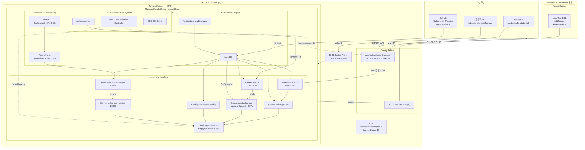
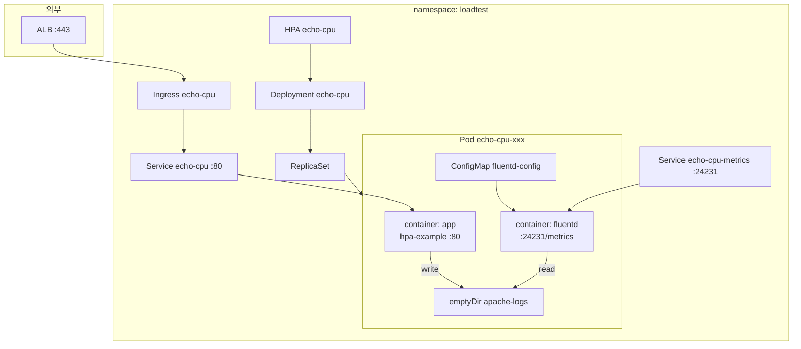
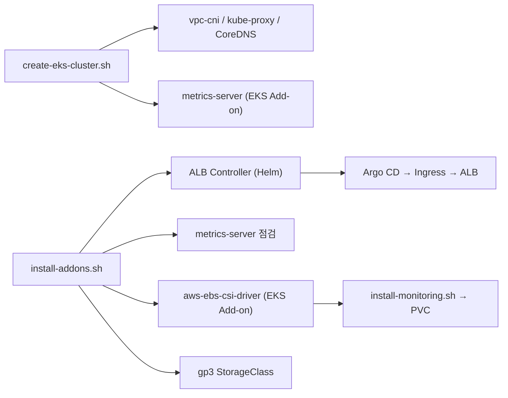
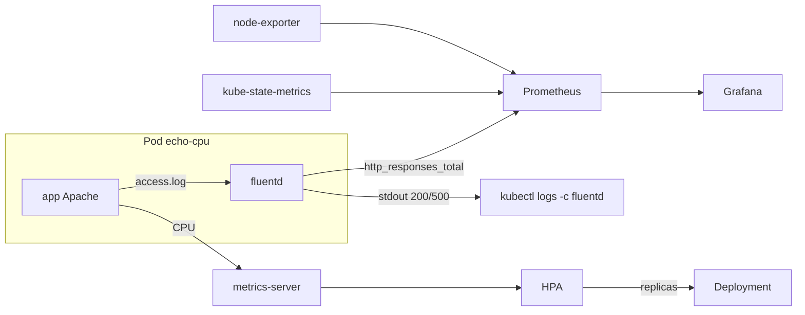
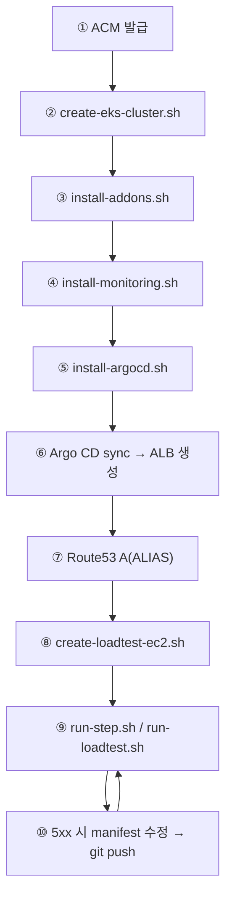

# LoadTestLab — Architecture

EKS 부하 테스트 / HPA / GitOps 실습 환경의 **현재 구조**를 정리한 문서입니다.

| 문서 | 용도 |
|------|------|
| [LAB-GUIDE.md](./LAB-GUIDE.md) | 최초 인프라 구축 (ACM → EKS → 애드온 → 모니터링 → Argo CD → Route53 → EC2) |
| [test-guide.md](./test-guide.md) | 구축 완료 후 **Grafana → Argo CD → 부하 테스트** 일일 실행 절차 |
| **architecture.md** (본 문서) | 전체 아키텍처·트래픽·컴포넌트·스펙 참조 |
| [Practice/Kubernetes](../../Practice/Kubernetes/) | StorageClass·Resource·Sidecar·Ingress·HPA 등 선행 개념 — [§14](#14-practice-kubernetes-개념--loadtest-manifest로-보기)에서 LoadTest와 매핑 |

---

## 1. 한눈에 보는 구조

LoadTestLab은 **두 AWS 네트워크 경계**로 나뉩니다.

```
┌──────────────────────────────────────────────────────────────────────┐
│  클러스터 밖                                                            │
│  · LoadTest EC2 (Default VPC, public) — k6 부하 생성                    │
│  · 운영자 PC (Mac / Windows) — kubectl, git, port-forward               │
└───────────────────────────────┬──────────────────────────────────────┘
                                │ HTTPS 443 (Route53 → ALB)
                                │ kubectl → Control Plane
┌───────────────────────────────▼──────────────────────────────────────┐
│  EKS VPC (eksctl 전용 VPC)                                              │
│  [public]  ALB (internet-facing), NAT Gateway (Single)                 │
│  [private] 워커 노드 ng-workload × 5 (c5.2xlarge)                       │
│    kube-system  → ALB Controller, metrics-server, EBS CSI               │
│    argocd       → Argo CD + Application loadtest-app                    │
│    monitoring   → Prometheus, Grafana (kube-prometheus-stack)           │
│    loadtest     → echo-cpu (app + fluentd), Ingress, HPA, ServiceMonitor │
└──────────────────────────────────────────────────────────────────────┘
```

**설계 목표:** LoadTest EC2에서 RPS를 **100 → 1k → 10k → 50k** 로 올리며, `app-manifests/`(Deployment/HPA)를 GitOps로 튜닝해 **HTTP 200 100%** 를 유지하는 실습.

---

## 2. 전체 구조도



---

## 3. 워커 노드 (5대)

`kubectl get nodes`에 보이는 **5개는 모두 동일한 워커 노드**입니다. Grafana 전용·Argo CD 전용 노드처럼 **역할이 고정 분리되어 있지 않습니다.**

| 항목 | 값 |
|------|-----|
| 노드 그룹 | `ng-workload` (Managed Node Group **1개**) |
| 인스턴스 | **c5.2xlarge × 5** (desired 5, min 4, max 6) |
| 라벨 | `role=workload` |
| 서브넷 | **private** (`privateNetworking: true`) |
| SSH | 비활성 (`ssh.allow: false`) |
| Control Plane | AWS 관리 — `get nodes`에 **포함되지 않음** |

Kubernetes 스케줄러가 아래 워크로드를 **5대에 분산** 배치합니다. `echo-cpu` 앱 Pod는 Deployment의 **topologySpreadConstraints**로 노드(hostname)별 수를 균등하게 맞춥니다 ([§6.4](#64-namespace-loadtest)).

| namespace | 주요 Pod | 역할 |
|-----------|----------|------|
| `kube-system` | ALB Controller, metrics-server, EBS CSI, vpc-cni, kube-proxy | Ingress→ALB, HPA CPU 메트릭, gp3 PVC — [§6.5 EKS Add-on](#65-eks-add-on과-loadtestlab-애드온) |
| `argocd` | argocd-server, repo-server, application-controller | GitOps |
| `monitoring` | Prometheus, Grafana, kube-state-metrics, node-exporter(DaemonSet) | 메트릭 수집·시각화 |
| `loadtest` | echo-cpu (app + fluentd) × N | 부하 수신, HPA 대상 — **노드 간 균등 분산** |

**용량 참고** (`cluster-config.yaml` 주석, 실측 기준):

| 노드 스펙 | 대략적 처리 한계 |
|-----------|------------------|
| t3.medium × 3 | ~100 RPS (1k 부하 시 ~9% 처리) |
| **c5.2xlarge × 5** (현재) | **~1,000 RPS** 겨우 버티는 수준 |
| 10k / 50k RPS | manifest(replicas/resources/HPA) + 노드 스펙 추가 강화 필요 |

노드별 Pod 배치 확인:

```bash
kubectl get pods -A -o wide --sort-by=.spec.nodeName
kubectl describe node <노드이름>

# echo-cpu 노드별 개수 (균등 분산 확인)
kubectl get pods -n loadtest -l app=echo-cpu -o wide \
  | awk 'NR>1 {print $7}' | sort | uniq -c
```

### 3.1 Pod 노드 균등 분산 (topologySpreadConstraints)

HPA로 replica가 늘어나도 **한 노드에 Pod가 몰리면** 해당 노드 vCPU만 포화되고 나머지 노드는 유휴 상태가 됩니다. `app-manifests/deployment.yaml`에 **topology spread**를 두어 **5대 워커의 vCPU를 고르게** 씁니다.

```yaml
# app-manifests/deployment.yaml (발췌)
spec:
  template:
    spec:
      topologySpreadConstraints:
        - maxSkew: 1
          topologyKey: kubernetes.io/hostname
          whenUnsatisfiable: DoNotSchedule
          labelSelector:
            matchLabels:
              app: echo-cpu
```

| 필드 | LoadTestLab에서의 의미 |
|------|------------------------|
| `topologyKey: kubernetes.io/hostname` | **노드(호스트) 단위**로 분산 |
| `maxSkew: 1` | 어떤 두 노드 간 Pod 수 차이도 최대 1 (예: 5노드·6 Pod → 2,1,1,1,1 또는 2,2,1,1,0 불가 — 2,1,1,1,1 형태) |
| `whenUnsatisfiable: DoNotSchedule` | 균등 배치가 불가능하면 **Pending** — 한 노드에 과밀 스케줄 방지 |
| `labelSelector` | 같은 `app: echo-cpu` Pod끼리만 skew 계산 |

```text
노드 A (8 vCPU)   노드 B        노드 C        노드 D        노드 E
[Pod][Pod]        [Pod][Pod]    [Pod][Pod]    [Pod][Pod]    [Pod][Pod]   ← replica 10, skew ≤ 1
     ↑ spread 없으면 [Pod]×10 이 한 노드에 몰릴 수 있음
```

반영·재분산:

```bash
# Argo CD sync 후 기존 Pod를 새 스케줄 규칙으로 재배치
kubectl -n loadtest rollout restart deploy/echo-cpu
```

---

## 4. 네트워크 · VPC · DNS

### 4.1 EKS VPC (eksctl)

`infra/create-eks-cluster.sh` + `infra/cluster-config.yaml`

| 항목 | 설정 |
|------|------|
| 클러스터 | `loadtest-lab`, K8s **1.33**, 리전 **ap-northeast-2** |
| VPC | eksctl **전용 VPC** (public + private subnet) |
| NAT | **Single** NAT Gateway — private 노드 아웃바운드 |
| OIDC | 활성 — IRSA (ALB Controller, EBS CSI) |

**Private 노드 아웃바운드 (NAT 경유):** 컨테이너 이미지 pull, Argo CD → GitHub fetch

**인바운드 (사용자 → 앱):** LoadTest EC2 / 브라우저 → **ALB(public)** → Ingress → Pod  
워커 노드에는 직접 인바운드 없음. ALB `target-type: ip`로 Pod IP 직접 등록.

### 4.2 Default VPC (LoadTest EC2)

`infra/create-loadtest-ec2.sh` — **EKS VPC와 별도** default VPC public subnet

| 항목 | 설정 |
|------|------|
| 인스턴스 | **c5.2xlarge** (기본), Name=`loadtest-ec2`, public IP |
| SG | `loadtest-sg`, SSH(22) |
| 소프트웨어 | k6 + TCP/fd 튜닝 (고RPS keep-alive) |

부하는 **공인 DNS** `loadtest.k8s-study.club` → Route53 → ALB 로 들어가므로 EC2가 다른 VPC에 있어도 동작합니다.

### 4.3 DNS · TLS

```
loadtest.k8s-study.club  ──Route53 A(ALIAS)──►  ALB DNS
                                                      │
                                              ACM 인증서 (HTTPS 443)
                                              TLS 종료 후 Pod :80 (HTTP)
```

| 작업 | 목적 | 시점 |
|------|------|------|
| **ACM DNS 검증 CNAME** | 도메인 소유 증명 → 인증서 발급 | 클러스터 구축 **전** |
| **Route53 A(ALIAS) → ALB** | 도메인을 ALB에 연결 | Ingress sync 후 ALB 생성 **후** |

- ACM: `loadtest.k8s-study.club`, **EKS와 동일 리전** (`ap-northeast-2`)
- Ingress: `ingressClassName: alb`, host `loadtest.k8s-study.club`
- ALB Controller가 host와 일치하는 ACM 인증서 **자동 탐색** (ARN 생략 가능)

---

## 5. 트래픽 경로

### 5.1 부하 테스트 (데이터 플레인)

```
k6 (LoadTest EC2)
  │  HTTPS :443  (keep-alive, APP_HOST=loadtest.k8s-study.club)
  ▼
Route53 → ALB (public, ACM TLS 종료)
  │  HTTP :80  (target-type: ip)
  ▼
Ingress echo-cpu → Service echo-cpu → Pod (container app)
  │
  ├─ Deployment echo-cpu ← HPA (replica 10~20)
  ├─ 200 OK + 요청당 CPU → metrics-server → HPA
  └─ emptyDir access.log → fluentd → http_responses_total{code=200|500}
```

| 구간 | 프로토콜 | 설명 |
|------|----------|------|
| EC2 → ALB | HTTPS 443 | TLS는 ALB에서 종료 |
| ALB → Pod | HTTP 80 | Pod는 평문 HTTP |
| Pod → EC2 | HTTP 응답 | ALB 역방향 전달 |

### 5.2 GitOps (제어 플레인)

```
운영자: app-manifests/*.yaml 수정 → git push (main)
  ▼
Argo CD Application loadtest-app (automated sync + prune + selfHeal)
  ▼
namespace: loadtest — Deployment / Service / Ingress / HPA / ServiceMonitor / ConfigMap
  ▼
AWS LB Controller → Ingress 변경 시 ALB 갱신
```

Git 소스: `https://github.com/SeongSuKim95/Kubernetes-Practice.git`  
경로: `AWS/LoadTestLab/app-manifests`

### 5.3 loadtest 네임스페이스 상세



| K8s 리소스 | 이름 | 역할 |
|------------|------|------|
| **Ingress** | `echo-cpu` | ALB 연동, HTTPS 진입 |
| **Service** | `echo-cpu` | Pod app `:80` |
| **Service** | `echo-cpu-metrics` | fluentd `:24231` Prometheus scrape |
| **Deployment** | `echo-cpu` | `app` + `fluentd` 2 containers |
| **HPA** | `echo-cpu` | CPU 기반 autoscale |
| **ConfigMap** | `fluentd-config` | 200/500 필터 + Prometheus counter |
| **ServiceMonitor** | `echo-cpu-fluentd` | Prometheus scrape 설정 |

**Pod 내부 동작:**

- **app** (`registry.k8s.io/hpa-example`): 요청당 CPU 소비 → RPS↑ → CPU↑ → HPA scale. Apache `CustomLog`를 emptyDir 파일로 리다이렉트.
- **fluentd** (`fluent/fluentd-aggregator:debian`): access.log tail → **200/500만** stdout + `http_responses_total{code}` 노출.

---

## 6. Kubernetes 컴포넌트

### 6.1 namespace: `kube-system`

`infra/install-addons.sh` — 상세 분류는 [§6.5 EKS Add-on](#65-eks-add-on과-loadtestlab-애드온).

| 컴포넌트 | 역할 |
|----------|------|
| **AWS Load Balancer Controller** | Ingress → ALB/Listener/TargetGroup (IRSA) — **EKS Add-on 아님**, Helm |
| **metrics-server** | `kubectl top`, **HPA CPU 메트릭** — **EKS 관리형 Add-on** (또는 manifest) |
| **EBS CSI Driver** | gp3 PVC — **EKS 관리형 Add-on** (`aws-ebs-csi-driver`) |
| **vpc-cni / kube-proxy / CoreDNS** | 클러스터 기본 — eksctl 생성 시 **자동** |

### 6.2 namespace: `argocd`

`argocd/install-argocd.sh` + `argocd/application.yaml`

| 컴포넌트 | 역할 |
|----------|------|
| **Argo CD** | GitOps 엔진 |
| **Application `loadtest-app`** | `app-manifests/` → `loadtest` NS sync |

접속: `kubectl -n argocd port-forward svc/argocd-server 8080:443` → https://localhost:8080

### 6.3 namespace: `monitoring`

`monitoring/install-monitoring.sh` — **kube-prometheus-stack** (Helm)

| 컴포넌트 | 역할 |
|----------|------|
| **Prometheus** | 메트릭 수집·저장 (gp3 10Gi, retention 6h) |
| **Grafana** | 대시보드 (`admin` / `loadtest-admin`) |
| **kube-state-metrics** | Deployment replica 등 |
| **node-exporter** | 노드 CPU/메모리 (DaemonSet, 노드당 1) |

접속: `kubectl -n monitoring port-forward svc/kube-prometheus-stack-grafana 3000:80`  
추천 대시보드: **LoadTest — HTTP 200/500** (`monitoring/grafana-dashboard-loadtest.yaml`) — 200 RPS·성공률·**p95 지연**

### 6.4 namespace: `loadtest`

Argo CD가 Git에서 배포. **현재 manifest** (`app-manifests/`):

| 리소스 | 현재 값 |
|--------|---------|
| Deployment `replicas` | **3** (HPA가 조정) |
| **topologySpreadConstraints** | `hostname`, `maxSkew: 1`, `DoNotSchedule` — [§3.1](#31-pod-노드-균등-분산-topologyspreadconstraints) |
| app CPU request / limit | **200m / 700m** |
| HPA `minReplicas` / `maxReplicas` | **1 / 3** |
| HPA target CPU | **60%** |

실습 중 RPS 단계에 맞춰 replicas·resources·HPA·spread를 함께 튜닝합니다. 5xx·처리량 부족 시 Git push → Argo CD sync ([LAB-GUIDE.md §4](./LAB-GUIDE.md)).

---

### 6.5 EKS Add-on과 LoadTestLab 애드온

**EKS Add-on**은 AWS가 **버전 호환·배포·업데이트**를 관리하는 클러스터 확장 컴포넌트입니다. `aws eks list-addons`로 확인하며, `eksctl create addon` 또는 콘솔/CLI로 설치합니다. LoadTestLab은 **EKS 관리형 Add-on**과 **별도 설치(Helm/manifest)** 를 구분해 씁니다.

```text
eksctl create cluster (loadtest-lab)
  │
  ├─ [EKS 기본 — 자동 설치]
  │     vpc-cni, kube-proxy, CoreDNS
  │
  ├─ [EKS 관리형 Add-on — 클러스터 생성 시 또는 install-addons.sh]
  │     metrics-server, aws-ebs-csi-driver
  │
  └─ [LoadTestLab install-addons.sh — Helm / IRSA]
        AWS Load Balancer Controller, gp3 StorageClass
```

#### EKS Add-on이란

| 구분 | EKS 관리형 Add-on | 자체 설치 (Helm / manifest) |
|------|-------------------|------------------------------|
| 설치 | `eksctl create addon` / AWS API | `helm install`, `kubectl apply` |
| 업데이트 | AWS·Kubernetes 버전에 맞춘 호환 목록 | 운영자가 chart/manifest 관리 |
| IAM | Add-on별 IRSA Role 연동 가능 | IRSA 직접 구성 (LoadTestLab 패턴) |
| LoadTestLab 예 | metrics-server, aws-ebs-csi-driver | AWS Load Balancer Controller |

#### LoadTestLab 애드온 전체 목록

| 컴포넌트 | 유형 | 설치 경로 | LoadTestLab에서 하는 일 |
|----------|------|-----------|-------------------------|
| **amazon-vpc-cni** | EKS 기본 (eksctl) | `create-eks-cluster.sh` | Pod에 VPC IP 할당, 노드·ENI 네트워킹 |
| **kube-proxy** | EKS 기본 | `create-eks-cluster.sh` | Service ClusterIP → Pod 라우팅 |
| **coredns** | EKS 기본 | `create-eks-cluster.sh` | 클러스터 내부 DNS (`*.svc.cluster.local`) |
| **metrics-server** | **EKS Add-on** | eksctl(자동) + `install-addons.sh` 점검 | `kubectl top`, **HPA CPU Utilization** |
| **aws-ebs-csi-driver** | **EKS Add-on** | `install-addons.sh` `eksctl create addon` | EBS 볼륨 동적 생성 → **gp3 PVC** |
| **AWS Load Balancer Controller** | Helm (Add-on **아님**) | `install-addons.sh` | `Ingress` → **ALB** 생성·연동 |
| **gp3 StorageClass** | Kubernetes CR | `install-addons.sh` | Prometheus/Grafana PVC의 **기본 StorageClass** |

`cluster-config.yaml` 주석:

```text
# vpc-cni / coredns / kube-proxy 는 EKS 기본 설치.
# aws-ebs-csi-driver 는 IRSA 가 필요하므로 install-addons.sh 에서 별도 설치합니다.
```

#### metrics-server (HPA 필수)

- **역할:** kubelet에서 Pod/노드 **리소스 사용량**을 모아 **Metrics API** (`metrics.k8s.io`) 제공.
- **LoadTestLab 연결:** HPA가 `cpu` Utilization을 보려면 metrics-server가 동작해야 함. `kubectl top pods -n loadtest`도 동일 소스.
- **설치:** eksctl이 클러스터 생성 시 **EKS Add-on**으로 올리는 경우가 많음. `install-addons.sh`는 이미 있으면 upstream manifest 재적용을 **건너뛰고**, Service **selector ↔ Pod 라벨** 불일치만 수정 ([LAB-GUIDE §3](./LAB-GUIDE.md)).

```bash
aws eks list-addons --cluster-name loadtest-lab --region ap-northeast-2
kubectl -n kube-system get deploy metrics-server
kubectl top nodes
kubectl get apiservice v1beta1.metrics.k8s.io
```

#### aws-ebs-csi-driver (영속 볼륨)

- **역할:** `PersistentVolumeClaim` 요청 시 **AWS EBS** 볼륨을 생성·attach.
- **LoadTestLab 연결:** `monitoring/values-kube-prometheus.yaml`의 Prometheus(10Gi)·Grafana(5Gi) PVC가 `storageClassName: gp3` → provisioner `ebs.csi.aws.com`.
- **설치:** `install-addons.sh`에서 IRSA Role 생성 후 `eksctl create addon --name aws-ebs-csi-driver`.

```bash
kubectl get csidriver ebs.csi.aws.com
kubectl -n kube-system get pods -l app.kubernetes.io/name=aws-ebs-csi-driver
kubectl get sc gp3
```

#### AWS Load Balancer Controller (Ingress → ALB)

- **역할:** `Ingress` ( `ingressClassName: alb` )를 읽고 **Application Load Balancer**, Listener, Target Group을 AWS에 생성.
- **EKS Add-on 아님:** 공식 Helm chart + **IRSA** (`AWSLoadBalancerControllerIAMPolicy`).
- **LoadTestLab 연결:** `app-manifests/ingress.yaml` → `loadtest.k8s-study.club` HTTPS 진입. ACM TLS 종료는 ALB에서.

```bash
kubectl -n kube-system get deploy aws-load-balancer-controller
kubectl -n loadtest get ingress echo-cpu
```

#### vpc-cni · kube-proxy · CoreDNS (기본)

| Add-on | 없으면 생기는 문제 |
|--------|-------------------|
| **vpc-cni** | Pod IP 할당 실패, 네트워크 단절 |
| **kube-proxy** | Service → Pod 트래픽 실패 |
| **CoreDNS** | 클러스터 DNS 실패 (`metrics-server` 등 이름 해석 불가) |

LoadTestLab은 eksctl로 클러스터를 만들 때 **별도 작업 없이** 포함됩니다.

#### 설치 순서 요약



---

## 7. Observability 데이터 흐름



| 메트릭 / 로그 | 소스 | 소비자 | 용도 |
|---------------|------|--------|------|
| `http_responses_total` | fluentd :24231 | Prometheus → Grafana | 200/500 RPS, 성공률 |
| Container CPU | metrics-server | HPA, `kubectl top` | autoscale |
| Pod/Deployment 상태 | kube-state-metrics | Grafana | replica 변화 |
| Node CPU/Mem | node-exporter | Grafana | 노드 여유 |
| Apache access (200/500) | fluentd stdout | `kubectl logs -c fluentd` | 디버깅 |
| k6 결과 | k6 (EC2) | 터미널, `run-step.sh` 리포트 | 200 비율 / 실패율 |

Prometheus 쿼리 예:

```promql
rate(http_responses_total{code="200",namespace="loadtest"}[1m])
rate(http_responses_total{code="500",namespace="loadtest"}[1m])
```

---

## 8. 부하 테스트 실행 구조

부하는 **클러스터 밖 LoadTest EC2**에서 k6로 실행합니다.

```
loadtest/
├── run-step.sh          # 단계별 RPS (권장): ./run-step.sh 100 10
├── run-loadtest.sh      # 전체 램프 또는 단일 RPS 고정
├── script.js            # 100 → 1k → 10k → 50k 램프
├── single-rate.js       # 단일 RPS 고정
└── lib/step-report.sh   # k6 실행 + reports/step-*-report.txt
```

| 실행 방식 | 명령 (EC2) | 용도 |
|-----------|------------|------|
| 단계별 (권장) | `APP_HOST=loadtest.k8s-study.club ./run-step.sh 100 10` | RPS·지속시간 지정, 리포트 생성 |
| 단일 RPS | `APP_HOST=... ./run-loadtest.sh 1000` | 한 단계 집중 |
| 전체 램프 | `APP_HOST=... ./run-loadtest.sh` | 100→1k→10k→50k |

### 테스트 중 터미널 배치 ([test-guide.md](./test-guide.md))

| 터미널 | 용도 |
|--------|------|
| 1 | Grafana port-forward (`3000`) |
| 2 | `kubectl -n loadtest get hpa echo-cpu -w` |
| 3 | LoadTest EC2 SSH → k6 |

### 운영자 환경

| OS | 준비 | 부하 실행 |
|----|------|-----------|
| Mac / Linux | `kubectl`, `aws`, `ssh`/`scp` | EC2 SSH |
| Windows | `setup-windows-loadtest.ps1` (PEM·kubeconfig·scp 검증) | Git Bash/PowerShell → EC2 SSH |

Grafana·Argo CD Pod가 이미 `Running`이면 **port-forward + sync 확인만** 하면 됩니다.

---

## 9. 구축 vs 운영 흐름

### 9.1 최초 구축 ([LAB-GUIDE.md](./LAB-GUIDE.md))



### 9.2 일일 부하 테스트 ([test-guide.md](./test-guide.md))

```
kubeconfig 확인 → Grafana port-forward(3000)
→ Argo CD port-forward(8080) + 앱 sync 확인
→ EC2 SSH → run-step.sh 100 → 1000
→ Grafana / HPA 동시 관찰
```

---

## 10. 스토리지

| 용도 | 종류 | 크기 / 비고 |
|------|------|-------------|
| Prometheus TSDB | gp3 PVC (EBS CSI) | 10Gi |
| Grafana | gp3 PVC | 5Gi |
| Apache access log | emptyDir `apache-logs` | Pod 로컬, fluentd tail |
| 앱 로그 PV | 없음 | sidecar + Prometheus 경로 의도 |

---

## 11. IAM · 보안 요약

| 주체 | 방식 | 권한 |
|------|------|------|
| ALB Controller SA | IRSA (OIDC) | ALB/ELB 생성·관리 |
| EBS CSI SA | IRSA | EBS attach/detach |
| 워커 노드 | Node IAM Role | CNI, ECR pull 등 |
| LoadTest EC2 | (기본 Instance Profile 없음) | SSH + k6 outbound |

- 워커 노드: **private**, SSH 비활성
- Argo CD / Grafana: **ClusterIP** — `kubectl port-forward`로만 UI 접근
- ALB: **internet-facing** — 실습 HTTPS 진입점

---

## 12. 현재 리소스 스펙 요약

| 영역 | 스펙 | 비고 |
|------|------|------|
| EKS 클러스터 | `loadtest-lab`, K8s 1.33, ap-northeast-2 | |
| EKS 노드 | c5.2xlarge × 5 (ng-workload) | ~1k RPS 실측 기준 |
| LoadTest EC2 | c5.2xlarge × 1 (default VPC) | 50k는 c5.4xlarge 권장 |
| 앱 Pod | cpu 200m req / 700m limit | manifest에서 조정 |
| Pod 스케줄링 | topologySpread `hostname`, maxSkew 1 | 5노드 vCPU 균등 사용 |
| HPA | min 1, max 3, target CPU 60% | manifest에서 조정 |
| EKS Add-on | metrics-server, aws-ebs-csi-driver | [§6.5](#65-eks-add-on과-loadtestlab-애드온) |
| 부하 단계 | 100 → 1k → 10k → 50k RPS | keep-alive 필수 (~1k/s without) |
| APP_HOST | `loadtest.k8s-study.club` | Ingress host와 일치 |

---

## 13. 관련 파일

```
AWS/LoadTestLab/
├── LAB-GUIDE.md                     # 최초 구축 가이드
├── test-guide.md                    # Grafana/Argo CD/부하 테스트
├── architecture.md                  # 본 문서
├── setup-windows-loadtest.ps1       # Windows 부하 테스트 준비
├── infra/
│   ├── install-prerequisites.sh
│   ├── cluster-config.yaml          # EKS + ng-workload
│   ├── create-eks-cluster.sh
│   ├── install-addons.sh
│   └── create-loadtest-ec2.sh
├── monitoring/
│   ├── install-monitoring.sh
│   ├── values-kube-prometheus.yaml
│   └── grafana-dashboard-loadtest.yaml
├── argocd/
│   ├── install-argocd.sh
│   └── application.yaml
├── app-manifests/                   # Argo CD sync 대상
│   ├── deployment.yaml
│   ├── hpa.yaml
│   ├── ingress.yaml
│   ├── fluentd-config.yaml
│   ├── service.yaml
│   ├── metrics-service.yaml
│   └── servicemonitor.yaml
└── loadtest/
    ├── run-step.sh
    ├── run-loadtest.sh
    ├── script.js
    ├── single-rate.js
    └── lib/step-report.sh
```

---

## 14. Practice Kubernetes 개념 — LoadTest manifest로 보기

LoadTestLab은 [Practice/Kubernetes](../../Practice/Kubernetes/)에서 다룬 개념들이 **실제 EKS·부하 테스트 환경**에서 어떻게 조합되는지 보여 줍니다. 아래는 챕터별 핵심과 **LoadTestLab manifest 예시**입니다.

| Practice 챕터 | LoadTestLab에서 쓰이는 곳 | manifest / 설정 파일 |
|---------------|---------------------------|----------------------|
| [2.Storage-Class](../../Practice/Kubernetes/2.Storage-Class/) | Prometheus·Grafana **영속 볼륨** (EBS CSI Add-on + gp3) | `infra/install-addons.sh`, `monitoring/values-kube-prometheus.yaml` |
| [3.Resource-Allocation](../../Practice/Kubernetes/3.Resource-Allocation/Preliminaries.md) | echo-cpu Pod **CPU/메모리** requests·limits | `app-manifests/deployment.yaml` |
| [4.Sidecar](../../Practice/Kubernetes/4.Sidecar/Preliminaries.md) | **fluentd** 사이드카 + emptyDir 로그 공유 | `app-manifests/deployment.yaml`, `fluentd-config.yaml` |
| [6.Ingress](../../Practice/Kubernetes/6.Ingress/) | **ALB** HTTPS 진입점 | `app-manifests/ingress.yaml`, `service.yaml` |
| [8.HPA](../../Practice/Kubernetes/8.HPA/) | 부하에 따른 **Pod 수 자동 조정** | `app-manifests/hpa.yaml`, `deployment.yaml` |

```text
[외부 k6] ──HTTPS──► Ingress ──► Service ──► Pod(app + fluentd sidecar)
                                              ▲
                                         HPA ← metrics-server(CPU)
Prometheus/Grafana PVC ◄── StorageClass gp3 (EBS CSI)
```

---

### 14.1 StorageClass — Prometheus·Grafana 영속 디스크

**Practice에서 배운 것:** StorageClass는 PVC가 요청할 때 **어떤 종류의 스토리지를 어떻게 프로비저닝할지** 정의합니다. `provisioner`가 동적 생성을 담당하고, Pod는 PVC를 통해 볼륨을 마운트합니다.

**LoadTestLab 적용:** `install-addons.sh`가 **EBS CSI Driver**와 **`gp3` StorageClass**를 클러스터 기본값으로 등록합니다. 이후 Helm으로 설치하는 Prometheus·Grafana가 이 StorageClass로 **EBS gp3 볼륨**을 붙입니다.

`infra/install-addons.sh` (발췌):

```yaml
apiVersion: storage.k8s.io/v1
kind: StorageClass
metadata:
  name: gp3
  annotations:
    storageclass.kubernetes.io/is-default-class: "true"
provisioner: ebs.csi.aws.com
volumeBindingMode: WaitForFirstConsumer
allowVolumeExpansion: true
parameters:
  type: gp3
```

`monitoring/values-kube-prometheus.yaml`:

```yaml
grafana:
  persistence:
    enabled: true
    storageClassName: gp3    # ← StorageClass 이름 지정
    size: 5Gi

prometheus:
  prometheusSpec:
    storageSpec:
      volumeClaimTemplate:
        spec:
          storageClassName: gp3
          accessModes: ["ReadWriteOnce"]
          resources:
            requests:
              storage: 10Gi
```

| 항목 | LoadTestLab에서의 의미 |
|------|------------------------|
| `provisioner: ebs.csi.aws.com` | **EKS Add-on** `aws-ebs-csi-driver` + IRSA로 EBS attach |
| `gp3` | 범용 SSD, Prometheus TSDB·Grafana DB에 적합 |
| `WaitForFirstConsumer` | Pod가 스케줄된 AZ에 맞춰 볼륨 생성 |
| 앱 `echo-cpu` | access 로그는 **emptyDir** — StorageClass/PVC **미사용** (Sidecar 절 참고) |

확인:

```bash
kubectl get sc
kubectl -n monitoring get pvc
```

---

### 14.2 Resource-Allocation — Pod CPU/메모리 requests·limits

**Practice에서 배운 것:** `resources.requests`는 스케줄러가 **노드에 자리를 예약**하는 값이고, `limits`는 컨테이너가 쓸 수 있는 **상한**입니다. HPA의 CPU Utilization(%)은 **requests 대비 실제 사용량**으로 계산됩니다.

**LoadTestLab 적용:** `app-manifests/deployment.yaml`의 `echo-cpu` Deployment에 **메인 app**과 **fluentd 사이드카** 각각 resources가 정의되어 있습니다. 부하 테스트 실습에서 **가장 자주 튜닝하는 파일**입니다.

```yaml
# app-manifests/deployment.yaml (발췌)
spec:
  template:
    spec:
      topologySpreadConstraints:
        - maxSkew: 1
          topologyKey: kubernetes.io/hostname
          whenUnsatisfiable: DoNotSchedule
          labelSelector:
            matchLabels:
              app: echo-cpu
      containers:
        - name: app
          resources:
            requests:
              cpu: "200m"        # HPA Utilization 분모
              memory: "128Mi"
            limits:
              cpu: "700m"        # Pod당 최대 CPU — RPS·지연에 직결
              memory: "256Mi"
        - name: fluentd
          resources:
            requests:
              cpu: "20m"
              memory: "64Mi"
            limits:
              cpu: "150m"
              memory: "128Mi"
```

| 튜닝 포인트 | 부하 테스트와의 관계 |
|-------------|----------------------|
| `app` CPU **requests** ↑ | HPA가 “덜 찬 것”으로 보여 scale-out이 늦어질 수 있음 |
| `app` CPU **limits** ↑ | 요청당 CPU 연산(`hpa-example`)이 빨리 끝나 **응답 지연↓** |
| **topologySpreadConstraints** | replica↑ 시 **5노드 vCPU 고르게** 사용 — 한 노드 포화 방지 ([§3.1](#31-pod-노드-균등-분산-topologyspreadconstraints)) |
| `fluentd` limits | 메트릭·로그 수집 overhead; app보다 작게 유지 |
| 노드당 Pod 수 | spread + requests/limits와 함께 고려 (c5.2xlarge ≈ 8 vCPU) |

확인:

```bash
kubectl -n loadtest top pods
kubectl describe pod -n loadtest -l app=echo-cpu | grep -A5 "Limits\|Requests"
```

5xx·처리량 부족 시: `deployment.yaml`의 requests/limits 조정 → `git push` → Argo CD sync ([LAB-GUIDE §4](./LAB-GUIDE.md)).

---

### 14.3 Sidecar — fluentd + emptyDir 로그 공유

**Practice에서 배운 것:** 한 Pod 안 **여러 컨테이너**는 기본적으로 파일시스템이 분리됩니다. **Sidecar**는 메인 컨테이너를 보조하며, `emptyDir` Volume을 **같은 `volumeMounts`로 공유**해 데이터를 주고받습니다.

**LoadTestLab 적용:** `hpa-example`(php-apache)은 기본적으로 access 로그를 **stdout**으로 보냅니다. fluentd가 파일을 tail하려면 emptyDir로 `/var/log/apache2`를 덮어 **실제 파일**로 기록하게 한 뒤, **fluentd 사이드카**가 같은 경로를 읽습니다.

```yaml
# app-manifests/deployment.yaml (발췌)
containers:
  - name: app
    args:
      - |
        echo 'LogFormat "%h %l %u %t \"%r\" %>s %b %D" loadtest_combined' >> /etc/apache2/apache2.conf
        sed -i 's|CustomLog /proc/self/fd/1 combined|CustomLog /var/log/apache2/access.log loadtest_combined|' ...
    volumeMounts:
      - name: apache-logs
        mountPath: /var/log/apache2   # emptyDir로 덮어 쓰기
  - name: fluentd                      # ← Sidecar
    volumeMounts:
      - name: apache-logs
        mountPath: /var/log/apache2
        readOnly: true
      - name: fluentd-config
        mountPath: /fluentd/etc
volumes:
  - name: apache-logs
    emptyDir: {}                        # Pod 수명 동안 app↔fluentd 공유
  - name: fluentd-config
    configMap:
      name: fluentd-config
```

```text
Pod echo-cpu-xxx
├── container app      ──write──► emptyDir /var/log/apache2/access.log
└── container fluentd  ──read───►  같은 emptyDir
         │
         ├── stdout: 200/500 로그
         └── :24231/metrics → Prometheus (http_responses_total, p95 histogram)
```

| Practice Sidecar 실습 | LoadTestLab 차이 |
|----------------------|------------------|
| busybox `tail -f` 로그 | fluentd가 tail + **Prometheus 메트릭** 변환 |
| emptyDir 휘발 | 동일 — Pod 재시작 시 로그 소실 (의도적, 메트릭은 Prometheus에 누적) |
| 단일 노드 실습 | ALB 경유 **실제 HTTP 부하** + Grafana 대시보드 |

확인:

```bash
kubectl -n loadtest logs <pod> -c fluentd
kubectl -n loadtest port-forward pod/<pod> 24231:24231
curl -s localhost:24231/metrics | grep http_
```

---

### 14.4 Ingress — ALB HTTPS 진입점

**Practice에서 배운 것:** Ingress는 **클러스터 외부 HTTP(S) 트래픽**을 Service로 라우팅하는 L7 규칙입니다. `ingressClassName`으로 **어떤 Ingress Controller**가 규칙을 구현할지 정합니다. (NodePort/LoadBalancer Service와 달리 **호스트·경로 기반** 라우팅)

**LoadTestLab 적용:** AWS Load Balancer Controller + `ingressClassName: alb`로 **internet-facing ALB**를 만들고, ACM 인증서로 **HTTPS 443**을 종료한 뒤 Pod **HTTP 80**으로 전달합니다.

`app-manifests/ingress.yaml`:

```yaml
metadata:
  annotations:
    alb.ingress.kubernetes.io/scheme: internet-facing
    alb.ingress.kubernetes.io/target-type: ip      # Pod IP 직접 등록
    alb.ingress.kubernetes.io/listen-ports: '[{"HTTPS":443}]'
    alb.ingress.kubernetes.io/ssl-redirect: "443"
spec:
  ingressClassName: alb
  rules:
    - host: loadtest.k8s-study.club
      http:
        paths:
          - path: /
            pathType: Prefix
            backend:
              service:
                name: echo-cpu
                port:
                  number: 80
```

`app-manifests/service.yaml` (Ingress backend):

```yaml
spec:
  type: ClusterIP          # 외부 노출은 Ingress(ALB)가 담당
  selector:
    app: echo-cpu
  ports:
    - port: 80
      targetPort: 80
```

| 구간 | Practice Ingress | LoadTestLab |
|------|------------------|-------------|
| Controller | nginx 등 (실습 환경) | **AWS Load Balancer Controller** → 실제 ALB |
| TLS | 실습에 따라 다름 | **ACM** + ALB에서 종료, Pod는 HTTP |
| 외부 URL | host 규칙 | `loadtest.k8s-study.club` → Route53 A(ALIAS) → ALB |
| 부하 경로 | — | LoadTest EC2(k6) → **HTTPS 443** → ALB → Ingress → Service → Pod |

확인:

```bash
kubectl -n loadtest get ingress echo-cpu
curl -sk -o /dev/null -w "HTTP %{http_code}\n" https://loadtest.k8s-study.club/
```

---

### 14.5 HPA — CPU 기반 Pod 자동 스케일

**Practice에서 배운 것:** HorizontalPodAutoscaler(HPA)는 Deployment(등)의 **replica 수**를 메트릭에 맞춰 자동 조정합니다. CPU Utilization 타깃을 쓰려면 **metrics-server**가 필요하고, 대상 워크로드는 **실제로 CPU를 소비**해야 메트릭이 움직입니다.

**LoadTestLab 적용:** `hpa-example` 앱은 요청마다 CPU를 씁니다 → RPS↑ → CPU↑ → HPA가 `echo-cpu` Deployment replica를 늘립니다. `hpa.yaml`과 `deployment.yaml`을 함께 튜닝합니다.

`app-manifests/hpa.yaml`:

```yaml
spec:
  scaleTargetRef:
    kind: Deployment
    name: echo-cpu
  minReplicas: 1
  maxReplicas: 3
  metrics:
    - type: Resource
      resource:
        name: cpu
        target:
          type: Utilization
          averageUtilization: 60    # 모든 Pod CPU 평균이 request의 60% 목표
  behavior:
    scaleUp:
      stabilizationWindowSeconds: 0
      policies:
        - type: Pods
          value: 5
          periodSeconds: 15
    scaleDown:
      stabilizationWindowSeconds: 300
```

```text
k6 부하 → Pod CPU↑ → metrics-server (EKS Add-on) → HPA
                              │
                              ▼
                    Deployment replicas 1 → … → maxReplicas
                              │
                              ▼
              topologySpread → 5노드에 균등 배치
                              │
                              ▼
              Ingress(ALB) → Service → Pod들로 분산
```

| 개념 | LoadTestLab 예시 |
|------|------------------|
| `scaleTargetRef` | `Deployment/echo-cpu` |
| CPU target 60% | `app` requests `200m` 기준 Utilization 계산 |
| `maxReplicas` | 노드 수(5)·spread·CPU limits와 함께 상한 조정 |
| `behavior.scaleUp` | 공격적 scale-out (15초마다 최대 +5 Pod) |
| **metrics-server** | **EKS Add-on** — [§6.5](#65-eks-add-on과-loadtestlab-애드온) |
| **topologySpread** | scale-out된 Pod가 **한 노드에 몰리지 않음** |
| 실습 루프 | 처리량 부족 → `hpa.yaml` + `deployment.yaml` 조정 → git push |

확인:

```bash
kubectl -n loadtest get hpa echo-cpu -w
kubectl -n loadtest get pods -o wide -w
kubectl top pods -n loadtest
```

**HPA + spread + Resource-Allocation 연계:** replica가 늘어나도 **한 노드에 몰리면** 해당 노드 vCPU만 포화됩니다. `topologySpreadConstraints`와 **Pod limits**, **HPA maxReplicas**를 함께 튜닝합니다 ([§3.1](#31-pod-노드-균등-분산-topologyspreadconstraints)).

---

### 14.6 개념 조합 — 부하 테스트 한 사이클

| 단계 | 동작 | 관련 Practice |
|------|------|---------------|
| 1 | k6가 `https://loadtest.k8s-study.club/` 로 요청 | **Ingress** → Service |
| 2 | `app` 컨테이너가 CPU 소비하며 200 응답 | **Resource-Allocation** (limits) |
| 3 | access.log → **fluentd Sidecar** → Prometheus/Grafana | **Sidecar** + emptyDir |
| 4 | CPU↑ → HPA가 replica 증가 | **HPA** (+ **metrics-server** EKS Add-on) |
| 5 | 새 Pod가 **5노드에 균등 분산** | **topologySpreadConstraints** ([§3.1](#31-pod-노드-균등-분산-topologyspreadconstraints)) |
| 6 | Grafana·Prometheus 메트릭·대시보드 유지 | **StorageClass** (gp3 PVC, **EBS CSI** Add-on) |
| 7 | 튜닝 후 `git push` → Argo CD sync | [14.ArgoCD Preliminaries](../../Practice/Kubernetes/14.ArgoCD/Preliminaries.md) |

---

## 15. 설계 메모

- **앱 CPU 사용 이유:** `hpa-example`은 요청당 연산 → RPS↑ → CPU↑ → HPA 동작. 순수 static 앱이면 HPA가 scale하지 않음.
- **Pod 노드 분산:** `topologySpreadConstraints`(hostname, maxSkew 1)로 HPA scale-out 시 **5노드 vCPU 균등 사용**. spread 없으면 한 노드 포화 가능.
- **EKS Add-on:** metrics-server(HPA)·aws-ebs-csi-driver(PVC)는 AWS 관리형 Add-on; ALB Controller는 Helm+IRSA — [§6.5](#65-eks-add-on과-loadtestlab-애드온).
- **TLS:** ALB에서 종료. Pod는 HTTP 80만 처리.
- **50k RPS:** k6 **keep-alive** 필수. 매 요청 새 커넥션이면 EC2 임시 포트 고갈로 ~1k/s 한계.
- **NAT 비용:** private 노드 → NAT 필수. 실습 후 `eksctl delete cluster --name loadtest-lab` 로 정리.
- **5xx 루프:** manifest 수정 → git push → Argo CD sync → 동일 RPS로 `run-step.sh` 재실행.

이 구조는 **private worker + ALB TLS 종료 + GitOps + Prometheus stack** 패턴을 실습 규모로 축소한 것이며, RPS 단계별 manifest·노드 스펙 튜닝으로 HPA·리소스 설계를 학습하는 것이 목표입니다.
