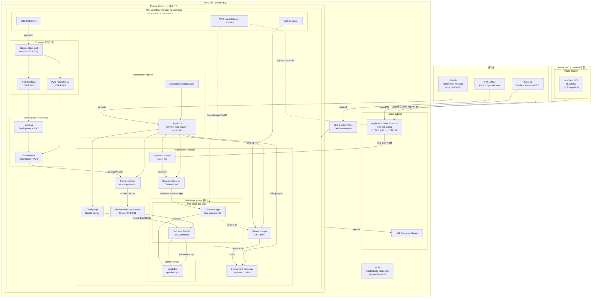
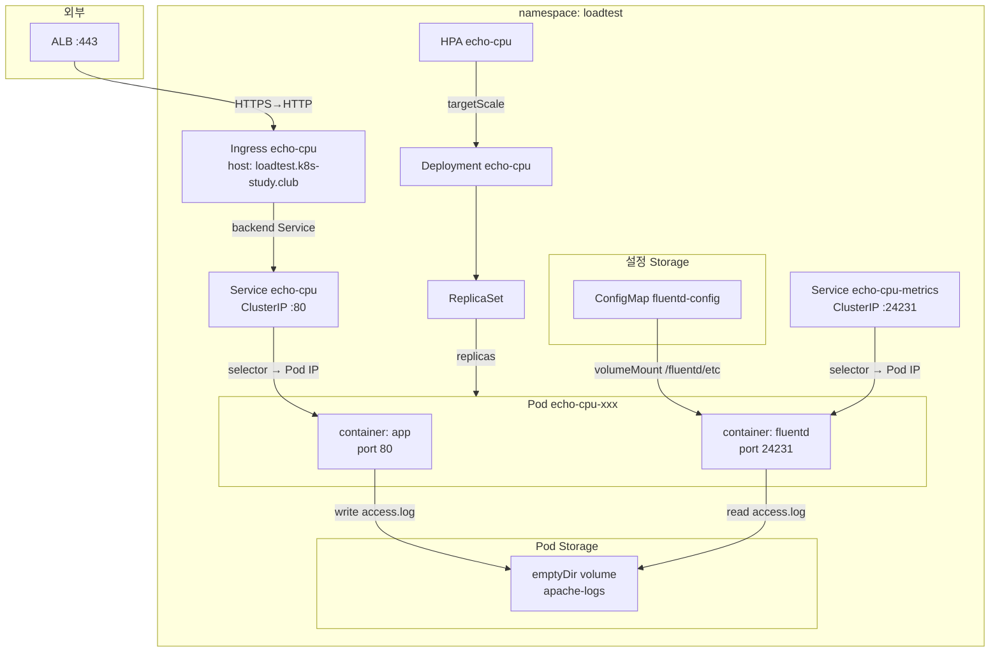
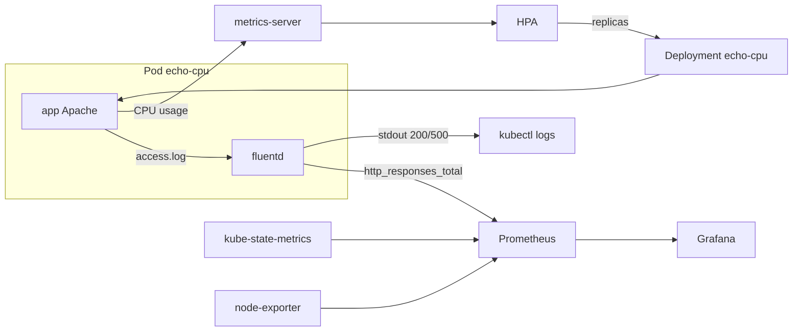

# LoadTestLab — Architecture

EKS 부하 테스트 / HPA / GitOps 실습 환경의 전체 구조입니다.  
구축·테스트 절차는 [LAB-GUIDE.md](./LAB-GUIDE.md), [test-guide.md](./test-guide.md)를 참고하세요.

---

## 1. 전체 구조도



### 1.1 loadtest 네임스페이스 — Ingress / Service / Deployment / Pod / Storage



| K8s 리소스 | 이름 | 역할 |
|------------|------|------|
| **Ingress** | `echo-cpu` | ALB 연동, 외부 HTTPS 진입 |
| **Service** | `echo-cpu` | Pod app `:80` 로 트래픽 전달 |
| **Service** | `echo-cpu-metrics` | fluentd `:24231` Prometheus scrape용 |
| **Deployment** | `echo-cpu` | Pod 템플릿·replica 관리 (HPA가 조정) |
| **Pod** | `echo-cpu-*` | `app` + `fluentd` 2 containers |
| **HPA** | `echo-cpu` | Deployment replica autoscale |

| Storage | 종류 | 용도 |
|---------|------|------|
| `emptyDir` `apache-logs` | Pod ephemeral | app↔fluentd access.log 공유 |
| `ConfigMap` `fluentd-config` | 설정 | fluentd `fluent.conf` 마운트 |
| `StorageClass` `gp3` | EBS (cluster) | Prometheus/Grafana PVC 프로비저닝 |
| `PVC` Prometheus 10Gi | 영속 | TSDB (`monitoring` NS) |
| `PVC` Grafana 5Gi | 영속 | 대시보드·설정 (`monitoring` NS) |

---

## 2. 설계 목적

| 목표 | 구현 |
|------|------|
| 증가하는 RPS에 버티기 | `hpa-example` 앱(CPU 부하) + HPA + 노드 스케일 |
| HTTPS 진입점 | ALB + ACM + Ingress (AWS LB Controller) |
| 200/500 관측 | fluentd 사이드카 → Prometheus → Grafana |
| CPU/replica 관측 | metrics-server + kube-prometheus-stack |
| manifest 실습 | Argo CD가 Git `app-manifests/` 자동 sync |
| 고RPS 부하 생성 | 클러스터 밖 LoadTest EC2 + k6 (keep-alive) |

---

## 3. 네트워크 · VPC

### 3.1 EKS VPC (eksctl)

`create-eks-cluster.sh` + `cluster-config.yaml`로 생성합니다.

| 항목 | 설정 |
|------|------|
| 클러스터 | `loadtest-lab`, K8s **1.33**, 리전 **ap-northeast-2** |
| VPC | eksctl이 **전용 VPC** 생성 (public + private subnet) |
| NAT | **Single** NAT Gateway — private 노드 아웃바운드 |
| 워커 노드 | **private subnet** (`privateNetworking: true`) |
| 노드그룹 | `ng-workload`, **c5.2xlarge × 5** (min 4 / max 6) |
| OIDC | 활성 — IRSA(ALB Controller, EBS CSI)용 |

**아웃바운드 (private 노드 → NAT → 인터넷)**

- 컨테이너 이미지 pull (`registry.k8s.io`, `fluent/*`, Helm charts 등)
- Argo CD → GitHub fetch
- (필요 시) 외부 API

**인바운드 (사용자 → 앱)**

- LoadTest EC2 또는 브라우저 → **ALB(public)** → Ingress → Pod  
- 워커 노드에는 **직접 인바운드 없음** (ALB target-type: `ip`로 Pod IP 직접 등록)

### 3.2 Default VPC (LoadTest EC2)

`create-loadtest-ec2.sh`는 **EKS VPC와 별도**인 **계정 기본 VPC** public subnet에 EC2 1대를 띄웁니다.

| 항목 | 설정 |
|------|------|
| 인스턴스 | **c5.2xlarge** (기본), public IP |
| SG | SSH(22) 허용 |
| 소프트웨어 | k6 + TCP/fd 튜닝 (고RPS keep-alive) |

부하 트래픽은 **공인 DNS** `loadtest.k8s-study.club` → Route53 → ALB로 들어가므로, LoadTest EC2가 EKS VPC와 다른 VPC에 있어도 동작합니다.

### 3.3 DNS · TLS

```
loadtest.k8s-study.club  ──Route53 A(ALIAS)──►  ALB DNS
                                                      │
                                              ACM 인증서 (HTTPS 443)
                                              TLS 종료 후 Pod :80 (HTTP)
```

- **ACM**: `loadtest.k8s-study.club`, EKS와 **동일 리전** (ALB용)
- **Ingress**: `ingressClassName: alb`, host `loadtest.k8s-study.club`
- ALB Controller가 Ingress를 보고 ALB·Target Group·Listener(443) 생성

---

## 4. 트래픽 경로

### 4.1 부하 테스트 (데이터 플레인)

```
k6 (LoadTest EC2)
  │  HTTPS :443  (keep-alive, APP_HOST=loadtest.k8s-study.club)
  ▼
Route53 → ALB (public subnet, ACM TLS 종료)
  │  HTTP :80  (VPC 내부, target-type: ip)
  ▼
Ingress echo-cpu → Service echo-cpu → Pod (container app)
  │
  ├─ Deployment echo-cpu ← HPA (replica 조정)
  │
  ├─ 200 OK + 요청당 CPU 소비 → metrics-server → HPA
  └─ emptyDir access.log → fluentd tail → 200/500 필터
```

| 구간 | 프로토콜 | 설명 |
|------|----------|------|
| EC2 → ALB | HTTPS 443 | TLS는 ALB에서 종료 |
| ALB → Pod | HTTP 80 | Pod는 평문 HTTP만 처리 |
| Pod → EC2 | HTTP 응답 | ALB가 역방향 전달 |

### 4.2 GitOps (제어 플레인)

```
운영자: app-manifests/*.yaml 수정 → git push (main)
  ▼
Argo CD (loadtest-app Application)
  │  automated sync + prune + selfHeal
  ▼
namespace: loadtest
  Deployment / Service / Ingress / HPA / ServiceMonitor / ConfigMap
  ▼
AWS LB Controller → Ingress 변경 시 ALB 갱신
```

---

## 5. Kubernetes 컴포넌트

### 5.1 namespace: `kube-system` (애드온)

`install-addons.sh`로 설치.

| 컴포넌트 | 역할 |
|----------|------|
| **AWS Load Balancer Controller** | Ingress → ALB/Listener/TargetGroup 생성 (IRSA) |
| **metrics-server** | `kubectl top`, **HPA CPU 메트릭** |
| **EBS CSI Driver** | gp3 PVC (Prometheus/Grafana 영속화) |

### 5.2 namespace: `argocd`

`install-argocd.sh` + `application.yaml`.

| 컴포넌트 | 역할 |
|----------|------|
| **Argo CD** | GitOps 엔진 |
| **Application `loadtest-app`** | `AWS/LoadTestLab/app-manifests` → `loadtest` NS sync |

접속: `kubectl port-forward svc/argocd-server 8080:443` (private 클러스터)

### 5.3 namespace: `monitoring`

`install-monitoring.sh` — **kube-prometheus-stack** (Helm).

| 컴포넌트 | 역할 |
|----------|------|
| **Prometheus** | 메트릭 수집·저장 (gp3 PVC, retention 6h) |
| **Grafana** | 대시보드 (`admin` / `loadtest-admin`) |
| **kube-state-metrics** | Deployment replica 수 등 |
| **node-exporter** | 노드 CPU/메모리 (노드당 DaemonSet) |

접속: `kubectl port-forward svc/kube-prometheus-stack-grafana 3000:80`

### 5.4 namespace: `loadtest` (실습 앱)

Argo CD가 Git에서 배포.

| 리소스 | 설명 |
|--------|------|
| **Deployment `echo-cpu`** | `registry.k8s.io/hpa-example` + **fluentd 사이드카** |
| **Service `echo-cpu`** | ClusterIP :80 → app |
| **Service `echo-cpu-metrics`** | ClusterIP :24231 → fluentd `/metrics` |
| **Ingress `echo-cpu`** | ALB 연동, host `loadtest.k8s-study.club` |
| **HPA `echo-cpu`** | CPU utilization 50% 기준 scale |
| **ConfigMap `fluentd-config`** | tail + grep(200\|500) + Prometheus counter |
| **ServiceMonitor `echo-cpu-fluentd`** | Prometheus scrape 설정 |

#### Deployment → Pod · Storage

```
HPA echo-cpu
  │ scale
  ▼
Deployment echo-cpu
  │ ReplicaSet
  ▼
Pod echo-cpu-xxx
  ┌─────────────────────────────────────────────┐
  │ volumes:                                     │
  │   emptyDir apache-logs  ◄── app writes log   │
  │   configMap fluentd-config → fluentd mount   │
  │ containers:                                  │
  │   app (hpa-example) :80  ──► Service :80    │
  │   fluentd :24231         ──► Service :24231  │
  └─────────────────────────────────────────────┘
         ▲
Ingress echo-cpu ──► Service echo-cpu
```

- **app**: RPS↑ → CPU↑ → HPA가 **Deployment** replica 조정
- **fluentd**: access.log에서 **200/500만** 필터 → `http_responses_total{code=...}` 노출 + stdout 로그

---

## 6. observability 데이터 흐름



| 메트릭 / 로그 | 소스 | 소비자 | 용도 |
|---------------|------|--------|------|
| `http_responses_total` | fluentd :24231 | Prometheus → Grafana | 200/500 RPS, 성공률 |
| Container CPU | metrics-server | HPA, `kubectl top` | autoscale, 실습 튜닝 |
| Pod/Deployment 상태 | kube-state-metrics | Prometheus → Grafana | replica 수 변화 |
| Node CPU/Mem | node-exporter | Grafana | 노드 여유 확인 |
| Apache access (200/500) | fluentd stdout | `kubectl logs -c fluentd` | 디버깅 |

Grafana 대시보드 **LoadTest — HTTP 200/500** (`grafana-dashboard-loadtest.yaml`)은 fluentd 메트릭을 시각화합니다.

---

## 7. 스토리지

| 용도 | StorageClass | 비고 |
|------|--------------|------|
| Prometheus TSDB | **gp3** (default) | EBS CSI, 10Gi |
| Grafana | **gp3** | 5Gi |
| Apache access log | **emptyDir** | Pod 로컬, fluentd가 tail |
| 앱 로그 PV | 없음 | 의도적으로 sidecar + Prometheus 경로 사용 |

---

## 8. IAM · 보안 요약

| 주체 | 방식 | 권한 |
|------|------|------|
| ALB Controller SA | IRSA (OIDC) | ALB/ELB 생성·관리 |
| EBS CSI SA | IRSA | EBS 볼륨 attach/detach |
| 워커 노드 | Node IAM Role | ECR pull, CNI 등 |
| LoadTest EC2 | EC2 Instance Profile (기본 없음) | SSH만, k6 outbound |

- 워커 노드: **private**, SSH 비활성 (`ssh.allow: false`)
- Argo CD / Grafana: **ClusterIP** — 운영자 `kubectl port-forward`로만 UI 접근
- ALB: **internet-facing** — 실습 진입점

---

## 9. 리소스 스펙 (현재 기본값)

| 영역 | 스펙 | 비고 |
|------|------|------|
| EKS 노드 | c5.2xlarge × 5 | ~1k RPS 겨우 버티는 수준 |
| LoadTest EC2 | c5.2xlarge × 1 | k6, keep-alive 고RPS |
| 앱 Pod | cpu req 400m / limit 1200m | HPA 기준 |
| HPA | min 1, max 5, target CPU 50% | manifest에서 조정 |
| 부하 단계 | 100 → 1k → 10k → 50k RPS | `run-step.sh`, `run-loadtest.sh` |

---

## 10. 관련 파일

| 경로 | 내용 |
|------|------|
| `infra/cluster-config.yaml` | EKS + VPC + nodegroup 정의 |
| `infra/create-eks-cluster.sh` | 클러스터 생성 |
| `infra/install-addons.sh` | ALB Controller, metrics-server, EBS CSI |
| `infra/create-loadtest-ec2.sh` | LoadTest EC2 |
| `monitoring/install-monitoring.sh` | Prometheus + Grafana |
| `argocd/install-argocd.sh` | Argo CD + Application |
| `app-manifests/` | 앱·Ingress·HPA·fluentd·ServiceMonitor |
| `loadtest/` | k6 스크립트 |

---

## 11. 한눈에 보는 경계

```
┌─────────────────────────────────────────────────────────────────┐
│  클러스터 밖                                                      │
│  LoadTest EC2 (Default VPC)  ──HTTPS──►  Route53 / ALB           │
│  운영자 Mac (kubectl, git)                                        │
└─────────────────────────────────────────────────────────────────┘
                              │
┌─────────────────────────────▼───────────────────────────────────┐
│  EKS VPC                                                          │
│  [public]  ALB, NAT Gateway                                       │
│  [private] 워커 노드                                               │
│    kube-system  → ALB Controller, metrics-server, EBS CSI         │
│    argocd       → GitOps                                          │
│    monitoring   → Prometheus, Grafana                             │
│    loadtest     → Ingress / Service / Deployment / Pod / HPA / Storage │
└─────────────────────────────────────────────────────────────────┘
```

이 구조는 **프로덕션 권장 패턴**(private worker, ALB TLS 종료, GitOps, Prometheus stack)을 실습 규모로 축소한 형태이며, RPS 단계별로 manifest와 노드 스펙을 조정하며 HPA·리소스 튜닝을 학습하는 것이 목표입니다.
