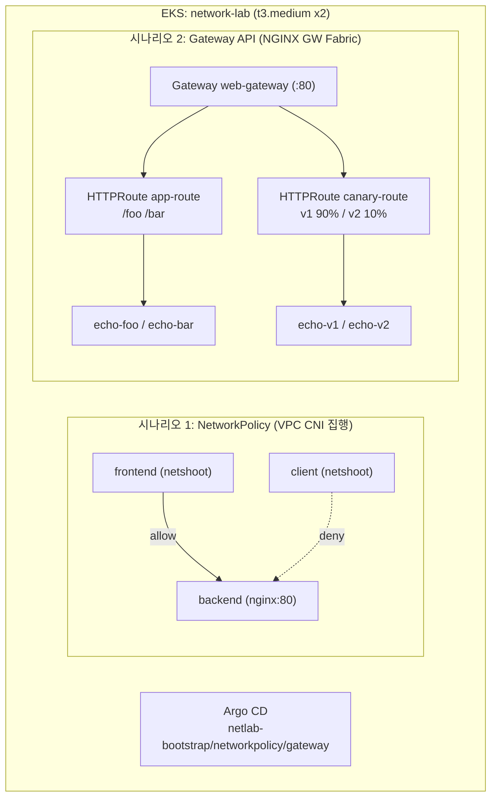

# NetworkLab — NetworkPolicy & Gateway API 실습 가이드

EKS 위에서 **ArgoCD(GitOps)** 로 배포하며 두 가지 네트워크 개념을 관측합니다.

| 시나리오 | 개념 | 관련 문서 |
|----------|------|-----------|
| **1** | **NetworkPolicy** (L3/L4 Pod 격리, 선언 ≠ 집행) | `Practice/Kubernetes/11.Network-Policy`, `12.CNI&NetworkPolicy` |
| **2** | **Gateway API** (L7 외부 진입, host/path/가중치 라우팅) | `Practice/Kubernetes/13.Gateway-API` |

핵심 전제:

- **NetworkPolicy 집행**은 Amazon VPC CNI 의 `enableNetworkPolicy=true` 로 켭니다(Calico 불필요).
- **Gateway API** 는 NGINX Gateway Fabric(GatewayClass `nginx`)이 집행합니다.

---

## 1. 아키텍처



| 네임스페이스 | 용도 |
|--------------|------|
| `frontend` | 허용될 클라이언트 (시나리오 1) |
| `client` | 허용되지 않은 출처 (시나리오 1, 차단 관측) |
| `backend` | 보호 대상 nginx (시나리오 1) |
| `gateway-demo` | Gateway/HTTPRoute/echo 앱 (시나리오 2) |

---

## 2. 구축 순서

```bash
# 0) 사전 도구 검증 (aws/eksctl/kubectl/helm/envsubst)
cd AWS/NetworkLab/infra
chmod +x *.sh
./install-prerequisites.sh

# 1) EKS 생성 (vpc-cni NetworkPolicy 집행 ON, 노드 t3.medium x2)
export AWS_REGION=ap-northeast-2
./create-eks-cluster.sh

# 2) Gateway API CRD + NGINX Gateway Fabric
./install-addons.sh
kubectl get gatewayclass      # nginx 존재 확인

# 3) Argo CD + Application 3개 등록
cd ../argocd
chmod +x *.sh
./install-argocd.sh
```

Argo CD UI:

```bash
kubectl -n argocd port-forward svc/argocd-server 8080:443
# https://localhost:8080  (admin / install-argocd.sh 출력 비밀번호)
```

배포 상태 확인:

```bash
kubectl get applications -n argocd
kubectl get pods -A -l 'app in (frontend,client,backend,echo-foo,echo-bar,echo-v1,echo-v2)' -o wide
```

---

## 3. 시나리오 1 — NetworkPolicy

**상황:** `backend`(nginx)는 오직 `frontend` 네임스페이스에서만 접근 가능해야 한다.
`client` 네임스페이스는 같은 호출을 해도 차단된다.

### 개념 정리 — "선택되면 default-deny" + 집행 주체

- NetworkPolicy 는 **L3/L4** 규칙을 **선언**할 뿐, 실제 차단은 **CNI 가 집행**합니다.
- EKS 는 VPC CNI 의 `enableNetworkPolicy=true` 로 집행을 켭니다. 꺼져 있으면 정책을 apply 해도 막히지 않습니다(선언 ≠ 집행, 12번 §6).
- 어떤 Pod 가 정책의 `podSelector` 에 **선택되는 순간** 해당 방향은 화이트리스트 모드가 되어, 허용 규칙에 없는 트래픽은 차단됩니다.

### 배포 리소스 (ArgoCD: `netlab-networkpolicy`)

- `frontend`(허용 클라이언트), `client`(비허용 출처), `backend`(보호 대상 nginx:80)
- `default-deny-ingress` — backend NS 전체 Ingress 차단
- `allow-frontend-to-backend` — frontend NS → backend:80 만 허용 (최소 권한)
- `frontend-egress` — frontend 는 backend:80 과 DNS(53) 로만 egress

### 테스트 준비

```bash
FE=$(kubectl -n frontend get pod -l app=frontend -o jsonpath='{.items[0].metadata.name}')
CL=$(kubectl -n client   get pod -l app=client   -o jsonpath='{.items[0].metadata.name}')
URL=http://backend-service.backend.svc.cluster.local
```

### 관측 A — 최소 권한 적용 상태 (ArgoCD 동기화 후, 즉시)

```bash
kubectl -n backend get networkpolicy
kubectl -n frontend exec -it "$FE" -- curl -s -m 5 -o /dev/null -w "frontend → %{http_code}\n" $URL   # 200 (허용)
kubectl -n client   exec -it "$CL" -- curl -s -m 5 -o /dev/null -w "client   → %{http_code}\n" $URL   # 타임아웃 (차단)
```

> **포인트:** 동일 호출이 **출처 NS**(frontend vs client)에 따라 허용/차단으로 갈린다.

### 관측 B — before/after 토글 (선택, 더 극적)

ArgoCD selfHeal 이 정책을 되돌리므로 자동 동기화를 잠시 끕니다.

```bash
# 1) 자동 동기화 정지
kubectl -n argocd patch application netlab-networkpolicy --type=merge \
  -p '{"spec":{"syncPolicy":{"automated":null}}}'

# 2) 정책 제거 → client 도 200 (flat network, 전체 허용)
kubectl -n backend delete networkpolicy default-deny-ingress allow-frontend-to-backend
kubectl -n client exec -it "$CL" -- curl -s -m 5 -o /dev/null -w "client → %{http_code}\n" $URL   # 200

# 3) 자동 동기화 복구 → 정책 재생성, client 다시 차단
kubectl -n argocd patch application netlab-networkpolicy --type=merge \
  -p '{"spec":{"syncPolicy":{"automated":{"prune":true,"selfHeal":true}}}}'
kubectl -n client exec -it "$CL" -- curl -s -m 5 -o /dev/null -w "client → %{http_code}\n" $URL   # 타임아웃
```

### 관측 C — Egress + DNS 함정

```bash
# frontend-egress 는 backend:80 과 DNS(53) 만 허용 → 외부 인터넷 차단
kubectl -n frontend exec -it "$FE" -- curl -s -m 5 -o /dev/null -w "google → %{http_code}\n" https://www.google.com   # 실패(타임아웃)
# DNS 는 허용되어 이름 해석은 성공
kubectl -n frontend exec -it "$FE" -- nslookup backend-service.backend
```

> Egress 를 막을 때 DNS(53)를 열지 않으면 Service 이름 해석부터 실패합니다(11번 §5.4-c).

> **참고:** 차단을 "타임아웃" 으로 관측합니다. NetworkPolicy 는 거부 패킷을 보내지 않고 조용히 drop 하므로 `-m 5`(timeout) 로 확인합니다.

---

## 4. 시나리오 2 — Gateway API

**상황:** 기존 Ingress 가 하던 host/path 라우팅을 Gateway API 로 표현하고,
Ingress 에 없던 **가중치 트래픽 분할**까지 표준 필드로 구성한다.

### 개념 정리 — 역할 분리 3리소스

| 리소스 | 역할 | 누가 |
|--------|------|------|
| **GatewayClass** (`nginx`) | 어떤 컨트롤러가 구현하는가 | 인프라(애드온 설치 시 생성) |
| **Gateway** (`web-gateway`) | 진입점: listener·포트·(TLS) | 플랫폼팀 |
| **HTTPRoute** (`app-route`/`canary-route`) | host/path → backend Service | 앱팀 |

### 배포 리소스 (ArgoCD: `netlab-gateway`)

- echo 앱 4개(`echo-foo/bar/v1/v2`) — 응답 본문으로 어느 백엔드인지 식별
- `Gateway` web-gateway (:80, class `nginx`)
- `HTTPRoute` app-route (host/path), canary-route (가중치 분할)

### 4-1. 리소스/연결 확인

```bash
kubectl -n gateway-demo get gateway,httproute
kubectl -n gateway-demo describe gateway web-gateway      # Listeners, Status(Programmed)
```

### 4-2. 진입점 서비스 포트포워드

NGINX Gateway Fabric 은 Gateway 마다 데이터플레인 Service 를 만듭니다. 이름을 찾아 포워드합니다.

```bash
kubectl -n gateway-demo get svc                                  # web-gateway 용 nginx Service 확인
GW_SVC=$(kubectl -n gateway-demo get svc -o name | grep -i nginx | head -1)
kubectl -n gateway-demo port-forward "$GW_SVC" 8080:80
# 새 터미널에서 아래 curl 실행
```

### 4-3. host/path 라우팅 (Ingress 동등)

```bash
curl -s -H "Host: app.example.com" http://localhost:8080/foo   # foo backend
curl -s -H "Host: app.example.com" http://localhost:8080/bar   # bar backend
```

### 4-4. 가중치 트래픽 분할 (Gateway API 강점)

```bash
for i in $(seq 1 20); do
  curl -s -H "Host: canary.example.com" http://localhost:8080/
done | sort | uniq -c
# version v1 다수, version v2 소수 (약 90:10)
```

> **포인트:** 진입점(Gateway)과 규칙(HTTPRoute)을 분리하고, Ingress 표준에 없던 **가중치 분할**을 `backendRefs[].weight` 로 선언한다.

### 4-5. (선택) TLS 종료 확장

13번 개념처럼 HTTPS listener 를 추가하려면 self-signed 인증서 Secret 을 만든 뒤 `gateway.yaml` 에 HTTPS listener 를 추가합니다. **개인키는 git 에 커밋하지 마세요.**

```bash
openssl req -x509 -nodes -days 365 -newkey rsa:2048 \
  -keyout tls.key -out tls.crt -subj "/CN=app.example.com/O=netlab"
kubectl -n gateway-demo create secret tls web-tls --cert=tls.crt --key=tls.key
rm -f tls.crt tls.key
```

그 다음 `gateway.yaml` 의 `listeners` 에 추가:

```yaml
    - name: https
      protocol: HTTPS
      port: 443
      tls:
        mode: Terminate
        certificateRefs:
          - kind: Secret
            name: web-tls
      allowedRoutes:
        namespaces:
          from: Same
```

---

## 5. 정리 (cleanup)

```bash
# (시나리오 1 토글을 했다면) ArgoCD 자동 동기화 원복 확인
kubectl -n argocd get application netlab-networkpolicy -o jsonpath='{.spec.syncPolicy}'; echo

# 클러스터 삭제
eksctl delete cluster --name network-lab --region ap-northeast-2
```

---

## 6. 디렉터리 구조

```text
AWS/NetworkLab/
├── LAB-GUIDE.md
├── infra/
│   ├── install-prerequisites.sh
│   ├── cluster-config.yaml          # vpc-cni enableNetworkPolicy=true
│   ├── create-eks-cluster.sh
│   └── install-addons.sh            # Gateway API CRD + NGINX Gateway Fabric
├── argocd/
│   ├── install-argocd.sh
│   └── applications.yaml            # Application 3개
└── app-manifests/
    ├── bootstrap/namespaces.yaml
    ├── scenario1-networkpolicy/     # frontend·client·backend + NetworkPolicy 3종
    └── scenario2-gateway/           # echo 앱 + Gateway + HTTPRoute 2종
```

---

## 7. 개념 ↔ 관측 한눈 요약

| 개념 | 차단/식별 신호 | 핵심 명령 |
|------|----------------|-----------|
| **NetworkPolicy 집행** | client → 타임아웃, frontend → 200 | `kubectl exec ... curl -m 5` |
| **선언 ≠ 집행** | 정책 제거 시 전체 허용 | ArgoCD automated 토글 |
| **Egress/DNS 함정** | 외부 차단, DNS 허용 | `curl` / `nslookup` |
| **Gateway host/path** | foo/bar 응답 분기 | `curl -H "Host: ..."` |
| **가중치 분할** | v1:v2 ≈ 90:10 | 반복 `curl` + `uniq -c` |

---

## 8. 설계 메모

- **왜 VPC CNI NetworkPolicy 인가:** EKS 기본 CNI(VPC CNI)가 v1.14+ 부터 NetworkPolicy 집행을 내장 지원합니다. 별도 Calico 설치 없이 `enableNetworkPolicy=true` 한 줄로 "선언 → 집행" 전체 경로를 재현할 수 있습니다. Calico 를 쓰고 싶다면 vpc-cni 옵션을 끄고 Calico add-on 을 설치해도 됩니다.
- **왜 NGINX Gateway Fabric 인가:** 개념 문서(13번)가 `nginx` 클래스를 전제로 하며, in-cluster 컨트롤러라 외부 LB/DNS 없이 포트포워드만으로 host/path·가중치 라우팅을 관측할 수 있습니다.
- **GitOps 경계:** 워크로드·정책·Gateway 리소스는 ArgoCD 가 동기화합니다. 노드 상태나 TLS 개인키처럼 git 에 두면 안 되는 것은 수동 단계로 분리했습니다(시나리오 1 토글, 4-5 TLS).
```
