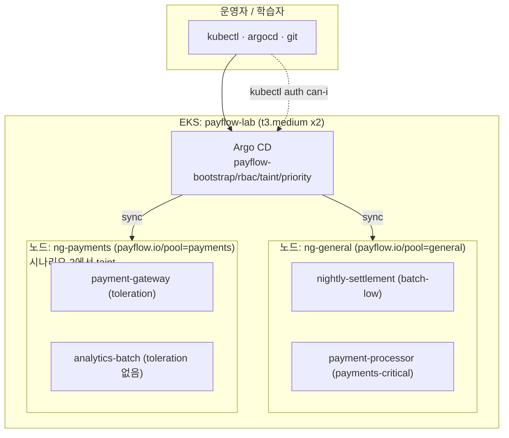

# RoleBindingLab — PayFlow 스케줄링·권한 실습 가이드

EKS 위에 가상의 핀테크 결제 플랫폼 **PayFlow** 를 올리고, **ArgoCD(GitOps)** 로 배포하면서
**Pod 스케줄링·권한**의 세 가지 핵심 개념을 관측합니다.

| 시나리오 | 실무 상황 | 개념 |
|----------|-----------|------|
| **1** | 결제팀 온콜 SRE만 `payments` API 조회 가능, 분석팀 인턴은 거부 | **RBAC RoleBinding** |
| **2** | PCI 규제 대상 결제 게이트웨이는 **전용 노드**에만 배치 | **Taint / Toleration** |
| **3** | 자원 부족 시 **결제 처리**가 **야간 정산 배치**보다 먼저 뜸 | **PriorityClass / preemption** |

---

## 1. 아키텍처



| 네임스페이스 | 용도 |
|--------------|------|
| `payments` | 결제 처리 (critical) |
| `analytics` | 정산·배치 (best-effort) |
| `platform` | 공용/운영 |

---

## 2. 구축 순서

```bash
# 0) 사전 도구 검증
cd AWS/RoleBindingLab/infra
./install-prerequisites.sh

# 1) EKS 생성 (노드그룹 2개: general 1 + payments 1)
export AWS_REGION=ap-northeast-2
./create-eks-cluster.sh
kubectl get nodes -L payflow.io/pool        # general / payments 라벨 확인

# 2) metrics-server (시나리오 3 kubectl top 용)
./install-addons.sh

# 3) Argo CD + Application 4개 등록
cd ../argocd
./install-argocd.sh

# 4) (필요 시) app-manifests 를 git push 하면 ArgoCD 가 자동 sync
```

Argo CD UI:

```bash
kubectl -n argocd port-forward svc/argocd-server 8080:443
# https://localhost:8080  (admin / install-argocd.sh 출력 비밀번호)
```

배포 상태 확인:

```bash
kubectl get applications -n argocd
kubectl get pods -A -l 'app in (payment-gateway,analytics-batch,nightly-settlement,payment-processor)' -o wide
```

---

## 3. 시나리오 1 — RBAC RoleBinding

**상황:** `payments-oncall`(온콜 SRE)에게만 `payments` 네임스페이스 Pod 조회 권한을 부여했다.
`analytics-intern`(인턴)은 바인딩이 없어 같은 호출이 거부된다.

### 개념 정리 — RBAC

**RBAC(Role-Based Access Control)** 는 Kubernetes API Server가 **“누가 어떤 API를 호출할 수 있는가”** 를 판단하는 **인가(Authorization)** 메커니즘입니다. 인증(Authentication) — “당신이 누구인가?” — 과는 별개이며, RBAC는 그 다음 단계에서 **허용/거부**를 결정합니다.

RBAC의 핵심 리소스는 네 가지입니다.

| 리소스 | 범위 | 역할 |
|--------|------|------|
| **Role** | 네임스페이스 | 특정 네임스페이스 안에서 허용할 API 동작(verbs) 정의 |
| **ClusterRole** | 클러스터 전체 | 클러스터 범위 API 동작 정의 |
| **RoleBinding** | 네임스페이스 | Role ↔ subject(사용자·그룹·SA) 연결 |
| **ClusterRoleBinding** | 클러스터 전체 | ClusterRole ↔ subject 연결 |

한 줄로 요약하면 **Role(권한 묶음) + RoleBinding(누구에게 줄지)** 입니다. Role만 만들어 두고 Binding이 없으면 아무도 그 권한을 쓸 수 없습니다.

이 LAB의 시나리오 1에서는 `payments` 네임스페이스 한정 **Role**(`payments-pod-reader`)과 **RoleBinding**(`payments-oncall-reader`)만 사용합니다. Taint·Priority와 달리 RBAC는 **스케줄러와 무관**하며, `kubectl get pods` 같은 API 호출 시점에 API Server가 판단합니다.

### 개념 정리 — ServiceAccount와 RoleBinding

**ServiceAccount(SA)** 는 Pod(또는 외부 클라이언트)가 Kubernetes API를 호출할 때 쓰는 **클러스터 내부 주체(identity)** 입니다. 사람 사용자(`system:admin`)와 달리, 워크로드·자동화·팀별 접근을 나눌 때 SA를 subject로 둡니다.

- `payments-oncall` — 온콜 SRE 역할 (권한 있음)
- `analytics-intern` — 분석팀 인턴 역할 (권한 없음)

SA의 Kubernetes 사용자 이름 형식:

```text
system:serviceaccount:<namespace>:<serviceaccount-name>
# 예: system:serviceaccount:payments:payments-oncall
```

**RoleBinding** 은 **“이 Role(또는 ClusterRole)을 이 subject에게 부여한다”** 는 선언입니다. Binding에 이름이 없으면, Role이 존재해도 해당 SA는 권한이 없습니다.

```text
Role (payments-pod-reader)
  └─ verbs: get, list, watch on pods
       ↑
RoleBinding (payments-oncall-reader) ──→ subject: payments-oncall  ✓
                                       ✗ analytics-intern (바인딩 없음)
```

이 LAB에서 `analytics-intern` SA는 **일부러 RoleBinding을 만들지 않았습니다.** 같은 Role 정의가 있어도 Binding이 없으면 API 호출은 `Forbidden`이 됩니다.

### 개념 정리 — 임퍼소네이션(Impersonation)이란?

**임퍼소네이션** 은 kubectl(또는 다른 클라이언트)이 API Server에 요청할 때 **“나 대신 이 사용자·SA인 것처럼 행동해 달라”** 고 알리는 기능입니다. `--as` 플래그로 subject를 지정합니다.

```bash
kubectl auth can-i list pods -n payments \
  --as=system:serviceaccount:payments:payments-oncall
```

동작 방식:

1. **당신(kubectl)** 은 클러스터 admin 등 **충분한 권한**으로 API Server에 접속합니다.
2. 요청에 `--as=...` 를 붙이면, API Server는 **인가 판단만** 해당 SA 기준으로 수행합니다.
3. 실제 SA 토큰을 발급·교환하지 않아도 **“이 SA라면 허용되나?”** 를 빠르게 확인할 수 있습니다.

실습·디버깅·`kubectl auth can-i` 에 적합합니다. **운영 Pod가 API를 호출하는 방식과는 다릅니다** — Pod는 보통 자신의 SA 토큰으로 직접 인증합니다.

### 개념 정리 — TOKEN을 쓰는 이유

`kubectl create token` 으로 발급한 **토큰**은 해당 ServiceAccount로 **실제 인증**된 API 요청을 만듭니다.

| 방식 | 인증 | 인가 판단 기준 | 용도 |
|------|------|----------------|------|
| `--as` (임퍼소네이션) | 본인(admin) | 지정한 SA | 빠른 권한 점검 |
| `--token` (SA 토큰) | SA 자체 | SA | **실제 호출 경로** 재현 |

TOKEN을 쓰는 이유:

1. **현실과 동일한 경로** — Pod·CI·외부 도구가 SA 토큰으로 API를 호출하는 방식과 같습니다.
2. **인증 + 인가 모두 검증** — 토큰 서명·만료·SA 존재 여부까지 포함됩니다.
3. **임퍼소네이션 권한 불필요** — admin이 아닌 사용자도 자신의 SA 토큰으로만 테스트할 수 있습니다.

이 LAB에서는 **관측 A(임퍼소네이션)** 로 빠르게 yes/no를 확인하고, **관측 B(토큰)** 로 `Forbidden` vs 목록 출력을 실제 API 호출로 재현합니다.

### 배포 리소스 (ArgoCD: `payflow-rbac`)
- `ServiceAccount` payments-oncall, analytics-intern
- `Role` payments-pod-reader (pods get/list/watch)
- `RoleBinding` payments-oncall-reader (oncall 에게만)

### 관측 A — 임퍼소네이션 (빠름)

```bash
# 허용: oncall → yes
kubectl auth can-i list pods -n payments \
  --as=system:serviceaccount:payments:payments-oncall

# 거부: intern → no
kubectl auth can-i list pods -n payments \
  --as=system:serviceaccount:payments:analytics-intern

# 실제 호출 비교
kubectl get pods -n payments --as=system:serviceaccount:payments:payments-oncall    # 목록 출력
kubectl get pods -n payments --as=system:serviceaccount:payments:analytics-intern   # Forbidden
```

### 관측 B — 실제 토큰 (현실감)

```bash
TOKEN_OK=$(kubectl create token payments-oncall -n payments)
kubectl --token="$TOKEN_OK" get pods -n payments            # OK

TOKEN_NG=$(kubectl create token analytics-intern -n payments)
kubectl --token="$TOKEN_NG" get pods -n payments            # Forbidden
```

### 추가 관측 — 범위 제한
```bash
# oncall 도 다른 네임스페이스(kube-system)는 못 봄 (Role 은 payments 한정)
kubectl get pods -n kube-system --as=system:serviceaccount:payments:payments-oncall   # Forbidden
# oncall 도 삭제는 불가 (verbs 에 delete 없음)
kubectl auth can-i delete pods -n payments --as=system:serviceaccount:payments:payments-oncall  # no
```

> **포인트:** 동일 API 호출이 subject(바인딩 유무)에 따라 `목록` vs `Forbidden` 으로 갈린다.

---

## 4. 시나리오 2 — Taint / Toleration

**상황:** 결제 게이트웨이(`payment-gateway`)는 PCI 전용 노드에만 둬야 한다.
정산 배치(`analytics-batch`)는 같은 노드를 노리지만(노드셀렉터) toleration 이 없어,
taint 가 걸리면 그 노드에 못 들어간다.

### 개념 정리 — Taint / Toleration

**Taint** 와 **Toleration** 은 **스케줄러**가 Pod를 어느 노드에 배치할지 결정할 때 쓰는 메커니즘입니다. RBAC과 달리 API Server가 아니라 **kube-scheduler** 영역입니다.

**Taint (노드 쪽)** — 노드에 “이 노드는 특별 조건이 있다”는 **스티커**를 붙입니다.

```bash
kubectl taint nodes -l payflow.io/pool=payments workload=payments:NoSchedule
# key=value:Effect  →  workload=payments:NoSchedule
```

**Effect** 종류 (시험·실무 공통):

| Effect | 의미 |
|--------|------|
| **NoSchedule** | toleration 없는 **새 Pod**는 스케줄 불가 (이미 떠 있는 Pod는 유지) |
| **PreferNoSchedule** | 가능하면 배치하지 않음 (soft) |
| **NoExecute** | toleration 없으면 스케줄 불가 + **이미 실행 중인 Pod도 퇴출** 가능 |

**Toleration (Pod 쪽)** — Pod spec에 “이 taint는 받아들일 수 있다”는 **면역**을 선언합니다.

```yaml
tolerations:
  - key: workload
    operator: Equal
    value: payments
    effect: NoSchedule
```

**nodeSelector / nodeAffinity vs taint/toleration**

- `nodeSelector` — “이 라벨 노드로 **가고 싶다**” (끌어당김)
- `taint` — “이 노드에는 **못 온다**” (밀어냄, toleration 있는 Pod만 예외)

이 LAB에서는 `payment-gateway`와 `analytics-batch` 모두 `nodeSelector: payflow.io/pool=payments` 로 **같은 노드를 노립니다.** taint가 없으면 둘 다 Running이고, taint를 걸면 **toleration 유무**만으로 Running vs Pending이 갈립니다.

```text
payments 노드 + taint(workload=payments:NoSchedule)
  ├─ payment-gateway   (toleration ✓) → Running
  └─ analytics-batch   (toleration ✗) → Pending (FailedScheduling)
```

> taint는 **노드 객체**에 붙는 상태이므로 이 LAB에서는 `kubectl taint`로 수동 적용합니다. ArgoCD(GitOps)로 Node를 관리하지 않습니다.

### 배포 리소스 (ArgoCD: `payflow-taint`)
- `payment-gateway` : nodeSelector=payments **+ toleration** → payments 노드 Running
- `analytics-batch` : nodeSelector=payments **+ toleration 없음** → taint 시 Pending

### taint 걸기 전 (기본)

```bash
kubectl get pods -n payments   -l app=payment-gateway -o wide   # payments 노드 Running
kubectl get pods -n analytics  -l app=analytics-batch  -o wide   # payments 노드 Running
```

### taint 걸기 (수동 — 노드 상태이므로 GitOps 아님)

```bash
kubectl taint nodes -l payflow.io/pool=payments \
  workload=payments:NoSchedule --overwrite
```

→ 잠시 후:

```bash
kubectl get pods -n payments  -l app=payment-gateway -o wide   # 여전히 Running (toleration)
kubectl get pods -n analytics -l app=analytics-batch  -o wide   # Pending!
kubectl describe pod -n analytics -l app=analytics-batch | grep -A3 Events
#   FailedScheduling ... node(s) had untolerated taint {workload: payments}
```

### taint 풀기 (토글)

```bash
kubectl taint nodes -l payflow.io/pool=payments \
  workload=payments:NoSchedule-
kubectl get pods -n analytics -l app=analytics-batch -o wide    # 다시 Running
```

> **포인트:** toleration 유무로 **같은 노드에 뜨고(Running) / 못 뜨고(Pending)** 가 갈린다.
> `payment-gateway` 는 toleration 이 있어 taint 와 무관하게 유지된다.

> **참고:** taint 가 걸린 동안 `analytics-batch` 가 Pending 이면 Argo CD 의 `payflow-taint` 가
> Progressing/Degraded 로 보일 수 있습니다 — 이는 **의도된 학습 상태**입니다.

---

## 5. 시나리오 3 — PriorityClass (preemption)

**상황:** general 노드 자원이 부족할 때, 결제 처리(`payment-processor`, 높은 우선순위)가
야간 정산 배치(`nightly-settlement`, 낮은 우선순위)를 밀어내고 먼저 뜬다.

### 개념 정리 — Preemption(선점)이란?

**Preemption(선점)** 은 노드 **CPU·메모리 등 allocatable 자원이 부족**할 때, 스케줄러가 **우선순위가 낮은 Pod를 퇴출(evict)** 하고 **우선순위가 높은 Pod를 먼저 배치**하는 동작입니다. RBAC·Taint와 마찬가지로 **스케줄러** 영역입니다.

**PriorityClass** — Pod에 부여하는 **우선순위 점수(priority value)** 를 정의하는 클러스터 리소스입니다.

| PriorityClass | value | 이 LAB에서의 역할 |
|---------------|-------|-------------------|
| `payments-critical` | 100000 | 결제 처리 — 자리가 없으면 **선점 주체** |
| `batch-low` | 100 | 야간 정산 — **선점 대상** |

Pod spec의 `priorityClassName`으로 연결합니다. value가 **클수록** 더 중요합니다.

**선점이 일어나는 흐름**

```text
1. general 노드 allocatable 메모리가 이미 batch-low Pod로 거의 찬 상태
2. payments-critical Pod(payment-processor) 스케줄 요청
3. 스케줄러: 같은 노드에 자리 없음 → preemption 시도
4. batch-low Pod 중 일부 Evicted → payment-processor Running
5. evict된 batch-low Pod는 재스케줄 시도 → 여전히 자리 없으면 Pending
```

관측 포인트:

- `kubectl get events ... | grep -i preempt` — 선점 이벤트
- Pod 상태 **Evicted** / **Pending** (`FailedScheduling`)
- `kubectl describe node` 의 Allocated resources — 노드가 얼마나 찼는지

**Preemption vs Taint (헷갈리기 쉬운 점)**

| | Taint / Toleration | Preemption |
|--|-------------------|------------|
| **원인** | 노드 taint vs Pod toleration 불일치 | 노드 **자원 부족** + priority 차이 |
| **실패 신호** | Pending (untolerated taint) | Evicted, preempt 이벤트, Pending |
| **해결** | toleration 추가 또는 taint 제거 | 자원 확보, replicas 조정, priority 변경 |

이 LAB은 t3.medium general 노드 1대에 `nightly-settlement`(4×600Mi)와 `payment-processor`(2×600Mi)를 **의도적으로 경쟁**시켜 선점을 재현합니다. `requests.memory`와 replicas는 `kubectl describe node`의 Allocatable을 보고 조정할 수 있습니다.

### 배포 리소스 (ArgoCD: `payflow-priority`)
- `PriorityClass` payments-critical(100000), batch-low(100)
- `nightly-settlement` : batch-low, general 노드, replicas 4
- `payment-processor`  : payments-critical, general 노드, replicas 2

### 관측 A — 최종 상태 (즉시, 권장)

ArgoCD 가 함께 배포한 결과만으로도 우선순위 효과가 보입니다.

```bash
kubectl get nodes -l payflow.io/pool=general
kubectl describe node -l payflow.io/pool=general | grep -A5 Allocated   # 메모리 거의 가득

kubectl get pods -n payments  -l app=payment-processor  -o wide   # Running (높은 우선순위 우선)
kubectl get pods -n analytics -l app=nightly-settlement -o wide   # 일부 Pending (자리 없음)

# 선점/스케줄 실패 이벤트
kubectl get events -n analytics --sort-by=.lastTimestamp | grep -iE 'preempt|FailedScheduling'
kubectl top nodes
```

### 관측 B — 선점 트랜지션 (선택, 더 극적)

실행 중인 low Pod 가 **쫓겨나는 순간**을 보려면, low 를 먼저 채운 뒤 high 를 올립니다.
ArgoCD selfHeal 이 되돌리지 않도록 **해당 앱의 자동 동기화를 잠시 끕니다.**

```bash
# 1) payflow-priority 자동 동기화 일시 정지
kubectl -n argocd patch application payflow-priority --type=merge \
  -p '{"spec":{"syncPolicy":{"automated":null}}}'

# 2) 결제 처리 잠시 0 → 정산 배치가 general 노드를 가득 채움
kubectl scale deploy/payment-processor -n payments --replicas=0
kubectl get pods -n analytics -l app=nightly-settlement -o wide   # 4개 Running

# 3) 결제 처리 올림 → 정산 배치 선점(Evicted/Pending) 관측
kubectl scale deploy/payment-processor -n payments --replicas=2
watch kubectl get pods -A -l 'app in (payment-processor,nightly-settlement)' -o wide
kubectl get events -n analytics --sort-by=.lastTimestamp | grep -i preempt

# 4) 자동 동기화 복구
kubectl -n argocd patch application payflow-priority --type=merge \
  -p '{"spec":{"syncPolicy":{"automated":{"prune":true,"selfHeal":true}}}}'
```

> **포인트:** 자원이 부족하면 스케줄러가 **낮은 우선순위 Pod 를 선점**해 높은 우선순위를 먼저 띄운다.
> `requests.memory` 값은 t3.medium 기준 시작점이며, `kubectl describe node` 의 Allocatable 을
> 보고 replicas/메모리를 조정하면 더 확실히 재현됩니다.

---

## 6. 정리 (cleanup)

```bash
# taint 원복 (시나리오 2를 했다면)
kubectl taint nodes -l payflow.io/pool=payments workload=payments:NoSchedule- 2>/dev/null || true

# 클러스터 삭제
eksctl delete cluster --name payflow-lab --region ap-northeast-2
```

---

## 7. 디렉터리 구조

```text
AWS/RoleBindingLab/
├── LAB-GUIDE.md
├── infra/
│   ├── install-prerequisites.sh
│   ├── cluster-config.yaml         # 노드그룹 2개 (general/payments)
│   ├── create-eks-cluster.sh
│   └── install-addons.sh           # metrics-server
├── argocd/
│   ├── install-argocd.sh
│   └── applications.yaml           # Application 4개
└── app-manifests/
    ├── bootstrap/namespaces.yaml
    ├── scenario1-rbac/             # SA · Role · RoleBinding
    ├── scenario2-taint/            # payment-gateway · analytics-batch
    └── scenario3-priority/         # priorityclasses · nightly-settlement · payment-processor
```

---

## 8. 개념 ↔ 관측 한눈 요약

| 개념 | 거부/실패 신호 | 핵심 명령 |
|------|----------------|-----------|
| **RBAC** | `Forbidden` | `kubectl auth can-i ... --as=...` |
| **Taint** | `Pending` (untolerated taint) | `kubectl taint` + `get pods -o wide` |
| **Priority** | `Pending`/`Evicted` + preempt 이벤트 | `get events | grep preempt`, `top nodes` |
