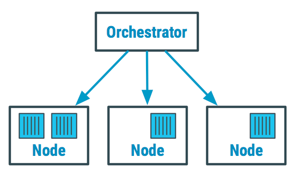
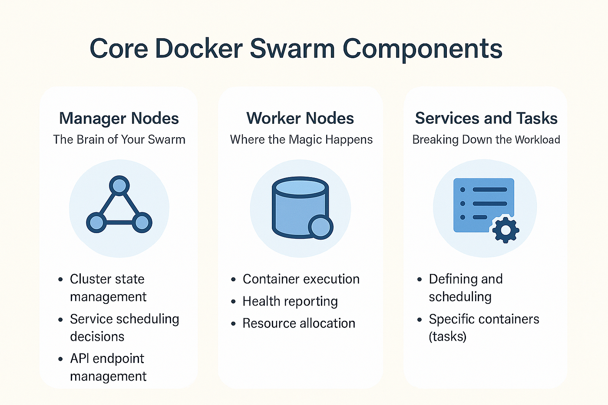
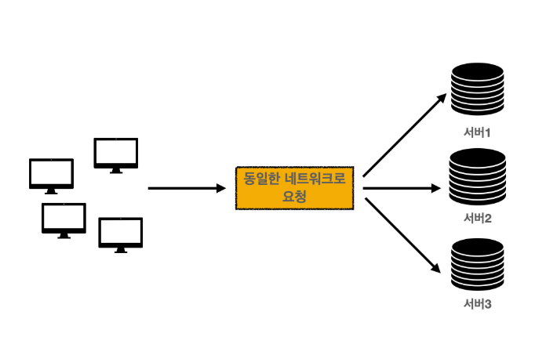
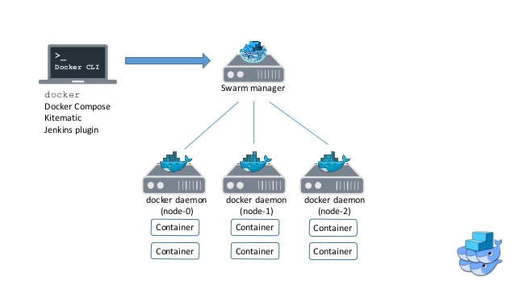
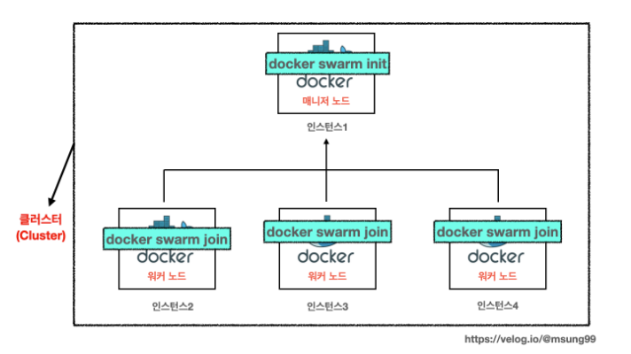
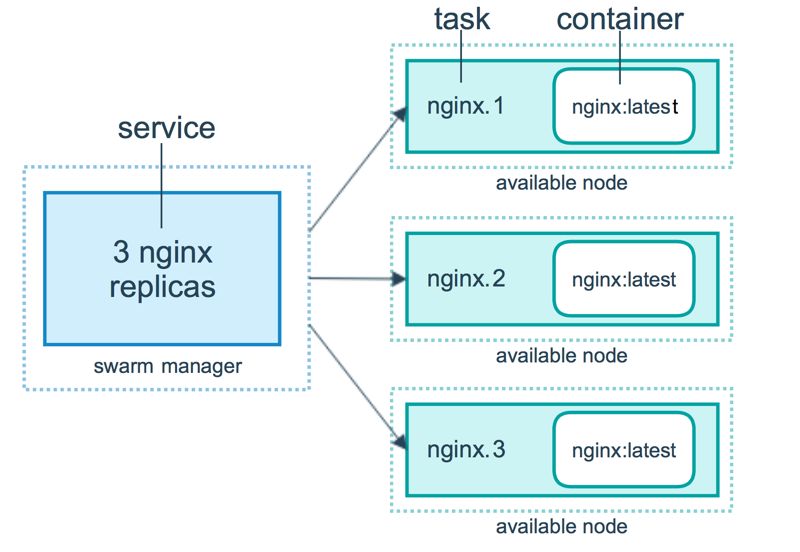
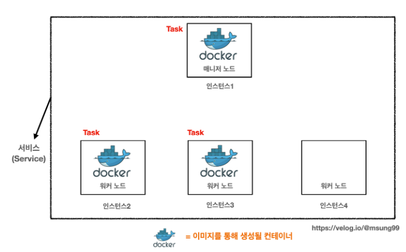
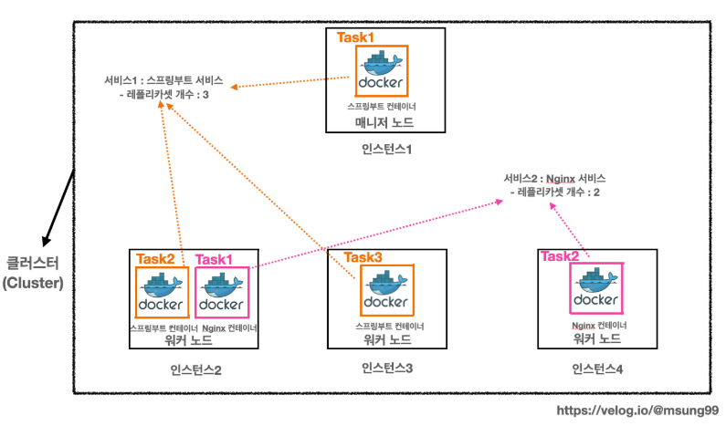
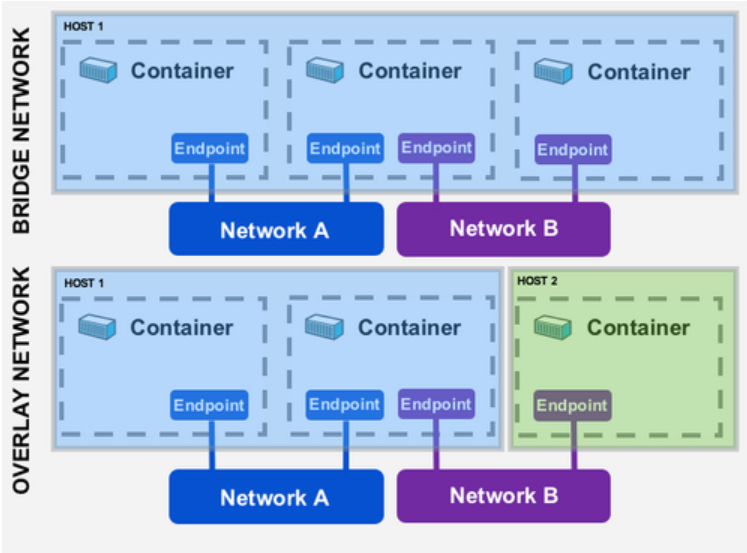

# Container Orchestration 이해하기 : Docker Swarm

## 목차

1. Docker Compose 등장 이후의 문제  
2. Container Orchestration의 등장  
3. Docker Swarm이란 무엇인가  
   - 3.1 Node와 Cluster  
   - 3.2 Service와 Task  
   - 3.3 Docker Swarm Scheduler  
   - 3.4 Docker Swarm 네트워크와 서비스 관리  
4. 정리  


# 1. Docker Compose 등장 이후의 문제

Docker Compose는 여러 컨테이너를 하나의 YAML 파일로 정의하고 동시에 실행할 수 있는 도구입니다.

예를 들어 다음과 같은 서비스 구성이 있을 수 있습니다.

- Web Server
- Application Server
- Database
- Cache
- Message Queue

이러한 구성은 `docker-compose.yml` 파일로 정의하고 다음 명령어로 실행할 수 있습니다.

```bash
docker compose up
```

하지만 Docker Compose에는 중요한 한계가 있습니다.

> Docker Compose는 **단일 서버 환경**에서만 동작합니다.

하지만 단일 호스트로 구성된 환경은 **확장성(Scalability)** 과 **가용성(Availabilty)**, **장애 허용성(Fault Tolerance)** 측면에서 많은 한계점을 가지기에 단일 호스트에서 운영을 하다 보면 문제가 발생할 수 있습니다.

이 문제를 해결하기 위해, 서버의 스팩을 더 높여 수직 확장을 하거나, 여러 개의 서버 또는 컨테이너를 사용하여 수평 확장하는 방법이 있습니다. 하지만 수평 확장했을 때 아래와 같은 고민을 하게 됩니다.

- 서로 다른 각각의 호스트들을 **어떻게 연결하고 관리**할 것인가?
- 어떤 컨테이너를 **어느 호스트에 배치**하여 구동시킬 것인가?
- 각기 다른 호스트에 배치된 컨테이너들의 **상호 통신을 어떻게 제어**할 것인가?

이때 필요한 것이 바로 **Container Orchestration** 입니다.

# 2. Container Orchestration의 등장

Container Orchestration은 여러 컨테이너를 자동으로 배포, 관리, 확장하기 위한 시스템입니다.

<p align="center">
  
</p>

Container Orchestration 시스템은 다음과 같은 기능을 제공합니다.

- **컨테이너 자동 배치 (Container Scheduling)**  
  > Orchestrator는 컨테이너를 실행할 노드를 자동으로 선택합니다. CPU, Memory 등의 자원 사용량을 고려하여 가장 적절한 Node에 컨테이너를 배치합니다.

- **서비스 확장 (Service Scaling)**  
  > 트래픽이 증가하면 컨테이너 수를 자동으로 늘리고, 트래픽이 감소하면 컨테이너 수를 줄입니다.

- **장애 복구 (Self-Healing)**  
  > 컨테이너가 종료되거나 노드에 장애가 발생하면 Orchestrator가 새로운 컨테이너를 자동으로 다시 실행합니다.

- **로드 밸런싱 (Load Balancing)**  
  > 사용자의 요청을 여러 컨테이너에 분산하여 처리합니다. 이를 통해 특정 컨테이너에 부하가 집중되지 않도록 합니다.

- **서비스 디스커버리 (Service Discovery)**  
  > 컨테이너의 IP 주소는 계속 변경될 수 있습니다. Service Discovery를 통해 서비스 이름을 기반으로 컨테이너 간 통신을 할 수 있습니다.

- **롤링 업데이트 (Rolling Update)**  
  > 서비스를 중단하지 않고 기존 컨테이너를 새로운 버전으로 점진적으로 교체합니다.

즉 컨테이너를 **하나씩 실행하는 것이 아니라 전체 시스템을 자동으로 관리하는 플랫폼**입니다.

대표적인 Container Orchestration 도구는 다음과 같습니다.

- Docker Swarm
- Kubernetes
- Apache Mesos

이 중 Docker에서 제공하는 오케스트레이션 시스템이 **Docker Swarm**입니다.


# 3. Docker Swarm이란 무엇인가

<p align="center">
  
</p>

> Docker Swarm은 여러 Docker Node를 하나의 Cluster로 묶고, Manager Node가 Worker Node에 컨테이너를 스케줄링하는 구조입니다.

Docker Swarm을 이해하기 위해서는 먼저 구성요소(**Node**와 **Cluster**)와 핵심 개념(**Service**와 **Task** 등)에 대해 이해해야 합니다.
## 3.1 Node 와 Cluster
### 3.1.1 Node

Node는 Docker Engine이 실행되는 하나의 서버를 의미합니다.보통 한 서버에 하나의 Docker Daemon을 실행하기 때문에 노드는 곧 서버라고 이해할 수 있습니다.

> 즉 Docker가 설치되어 컨테이너를 실행할 수 있는 하나의 컴퓨팅 자원을 Node라고 합니다.

### 3.1.2 Cluster

<p align="center">
  
</p>

Cluster는 여러 Node가 모여 하나의 시스템처럼 동작하는 구조입니다.

> 즉 여러 서버가 네트워크로 연결되어 하나의 논리적인 시스템을 구성하는 것을 **Cluster**라고 합니다.

Docker Swarm에서는 여러 Node가 모여 하나의 **Cluster**를 구성합니다.

> Server = Node , Multiple Nodes = Cluster

Docker Swarm 클러스터는 크게 두 가지 노드로 구성됩니다.

<p align="center">
  
  
</p>

- Manager Node : 클러스터의 **Control Plane** 역할을 수행
  - 클러스터 상태 관리 및 저장 : Raft 알고리즘 사용
    - 여러 node 중 일부에 장애가 생겨도 나머지 node가 정상적인 서비스를 할 수 있도록 일관된 상태를 유지 
  - 서비스 스케줄링 : 작업자 노드에게 컨테이너를 배포한다. 특정 노드에게만 배포하거나, 모든 노드에 하나씩 배포할 수도 있음

- Worker Node : 실제 컨테이너가 실행되는 서버
  - 매니저의 명령을 받아 컨테이너를 생성하고 상태를 체크
  - 모든 Worker node는 반드시 하나 이상의 Manager Node를 가져야함.

> Manager 노드는 기본적으로 Worker 노드의 역할을 포함하며, 운영환경에서 다중화하는 것이 좋습니다.

## 3.2 Service와 Task

Docker Swarm 환경에서는 컨테이너가 단순히 실행되는 것이 아니라  
**Service → Task → Container** 구조로 관리됩니다.

<p align="center">
  
</p>

### 3.2.1 Service

> Service는 Swarm에서 **애플리케이션을 배포하는 기본 제어 단위**이며, 같은 이미지로 생성되는 컨테이너의 집합 입니다.

Service는 다음과 같은 정보를 정의합니다.

- 사용할 Docker Image
- 실행할 컨테이너 수
- 네트워크 / 포트 설정

예시

```bash
docker service create --name web nginx
```

### 3.2.2 Task

<p align="center">
  
</p>

> Task는 Service가 생성한 **실행 작업 단위**입니다.

Service가 실행되면 Swarm은 여러 Task를 생성하며, 각 Task는 하나의 컨테이너를 실행합니다.

### 3.2.3 Replica

<p align="center">
  
</p>

> Replica는 동일한 컨테이너를 여러 개 실행하는 개념입니다.

```bash
docker service create --replicas 3 nginx
```

Replica를 늘리면 서비스 처리량을 확장할 수 있습니다.

### 3.2.4 Stack

> Stack은 하나 이상의 Service로 구성된 다중 컨테이너 애플리케이션을 묶는 개념입니다.

Stack은 Docker Compose와 유사한 YAML 파일 형식으로 정의되며, 여러 Service를 한 번에 배포하고 관리할 수 있습니다.

예를 들어, 웹 서버, 애플리케이션 서버, 데이터베이스를 하나의 Stack으로 묶어서 배포할 수 있습니다.

### Stack 배포

Stack은 `docker-compose.yml` 파일과 유사한 형식의 YAML 파일을 사용하여 배포합니다.

```bash
# compose 파일로 스택 배포
docker stack deploy -c <compose-file.yaml> <stack-name>
```

### Stack 관리

```bash
# 전체 스택 조회
docker stack ls
# 스택 내 서비스 조회
docker stack services <stack-name>
# 스택 내 Task 조회
docker stack ps <stack-name>
# 스택 제거
docker stack rm <stack-name>
```

> **Docker Compose와의 관계**  
> Docker Compose를 사용해 본 사람이라면 Docker Swarm의 Stack을 이용한 애플리케이션 운영에 곧바로 적응할 수 있습니다. Stack은 Docker Compose 파일 형식을 사용하지만, 여러 호스트에 걸쳐 서비스를 배포할 수 있다는 점에서 차이가 있습니다.

## 3.3 Docker Swarm Scheduler

> Scheduler는 어떤 Node에서 Task를 실행할지 결정하는 시스템입니다.

Scheduler는 **Manager Node에 내장**되어 있으며, 서비스 정의에 따라 Worker Node에 컨테이너를 할당하는 역할을 담당합니다. 새로운 서비스가 생성되거나 기존 서비스가 업데이트될 때 어떤 노드에 컨테이너를 배치할지 결정합니다.

### 3.3.1 스케줄링 기준

Scheduler는 다음과 같은 정보를 기반으로 컨테이너를 배치합니다.

- 노드의 CPU / Memory 사용량
- 현재 실행 중인 컨테이너 수
- 클러스터 상태
- Node Availability 상태
- Node Label 및 제약 조건

### 3.3.2 스케줄링 방식

스웜 스케줄러는 서비스 모드에 따라 두 가지 배포 방식을 지원합니다.

- **Replicated Mode** (기본값)
  - 지정된 수의 복제본(Replica)을 생성하여 클러스터 내 적절한 노드에 분산 배치
  - 예: `docker service create --replicas 3 nginx` → 3개의 컨테이너를 여러 노드에 분산 배치

- **Global Mode**
  - 클러스터의 모든 노드에 하나씩 컨테이너를 배치
  - 예: `docker service create --mode global nginx` → 각 노드마다 하나씩 배치

### 3.3.3 Node Availability와 스케줄링

스케줄러는 노드의 Availability 상태를 고려하여 컨테이너 할당을 결정합니다.

- **Active**: 새로운 컨테이너 할당 가능 (기본 상태)
- **Pause**: 새로운 컨테이너 할당 안 함, 실행 중인 컨테이너는 유지
- **Drain**: 해당 노드에 컨테이너 할당 불가, 실행 중인 컨테이너는 다른 노드로 이동

노드의 Availability 상태를 변경하면 스케줄러가 해당 노드에 새로운 컨테이너를 할당하지 않거나, 기존 컨테이너를 다른 노드로 재배치할 수 있습니다.

### 3.3.4 Node Label을 이용한 제약 조건

스케줄러는 노드에 설정된 Label(키-값 형태)을 기반으로 특정 노드에만 컨테이너를 할당할 수 있습니다.

```bash
# 노드에 Label 추가
docker node update --label-add <key>=<value> <node-id>

# 특정 Label을 가진 노드에만 서비스 배포
docker service create --constraint 'node.labels.<key>==<value>' <image>
```

이를 통해 특정 워크로드(예: 데이터베이스, GPU 작업 등)를 특정 노드에만 배치할 수 있습니다.

### 3.3.5 자동 장애 복구 및 재스케줄링

매니저 노드는 지정된 수의 복제본(Replica)을 항상 유지하도록 스케줄합니다.

#### 장애 감지 메커니즘

**1. 노드 상태 감지 (Heartbeat 메커니즘)**

- Manager 노드는 각 Worker 노드와 **주기적으로 통신(Heartbeat)**하여 상태를 모니터링합니다
- Manager 노드는 클러스터의 모든 노드와 컨테이너 정보를 포함하고 있으며, 정기적인 상태 확인을 통해 다운된 노드를 감지합니다
- 특정 노드로부터 일정 시간 동안 응답이 없으면 해당 노드를 **비활성(Unreachable)** 상태로 표시합니다

**2. 컨테이너 상태 감지**

- 각 Worker 노드는 자신이 실행 중인 컨테이너의 상태를 Manager에게 보고합니다
- 컨테이너가 비정상 종료되면 Worker 노드가 이를 감지하고 Manager에게 알립니다
- Manager는 서비스의 **Desired State(원하는 상태)**와 **Current State(현재 상태)**를 비교하여 차이를 발견합니다

#### 자동 복구 프로세스

**1. 노드 다운 시**

- 특정 노드가 다운되면 Manager는 해당 노드의 모든 컨테이너를 **Shutdown** 상태로 표시합니다
- Manager는 서비스 정의에 지정된 Replica 수를 확인하고, 현재 실행 중인 컨테이너 수가 부족하면 **즉시 다른 정상 노드에 새로운 컨테이너를 생성**합니다
- 예: Replica가 3개인 서비스에서 1개 노드가 다운되어 2개 컨테이너가 손실되면, Manager는 다른 노드에 2개의 새로운 컨테이너를 배포합니다

**2. 컨테이너 비정상 종료 시**

- 컨테이너가 비정상 종료되면 Worker 노드가 이를 감지하고 Manager에게 보고합니다
- Manager는 해당 서비스의 Replica 수가 부족하다는 것을 확인하고, **자동으로 새로운 컨테이너를 생성**합니다
- 이 과정은 서비스의 Desired State를 유지하기 위한 **Self-Healing** 메커니즘입니다

#### (보강) Manager Node는 왜 컨테이너 “단위”로 직접 헬스체크하지 않을까?

Swarm에서 Manager Node의 역할은 “컨테이너 내부를 들여다보는 감시자”라기보다,  
**클러스터의 Desired State(원하는 상태)를 유지하도록 스케줄링/조정하는 Control Plane**에 가깝습니다.

그래서 Manager는 보통 다음 방식으로 상태를 파악합니다.

1) **노드 단위(Worker) 건강 상태**
- Manager는 Worker 노드와 Heartbeat로 연결 상태를 확인합니다.
- 노드가 다운되었다고 판단되면, 그 노드의 Task들을 다른 노드로 재배치합니다.

2) **컨테이너(=Task) 상태는 ‘보고’ 기반**
- 실제 컨테이너 실행은 Worker 노드의 Docker Engine이 담당합니다.
- Worker는 자신이 실행 중인 Task/컨테이너 상태를 Manager에 보고합니다.
- Manager는 이를 바탕으로 replicas(원하는 개수)가 맞는지 확인하고, 부족하면 새 Task를 스케줄링합니다.

즉 책임이 이렇게 나뉩니다.

- Manager: 스케줄링/Desired State 유지(조정)
- Worker(Docker Engine): 실제 실행/프로세스 상태 감지

#### (보강) 책임 분리로 얻는 장점은 무엇인가?

Manager와 Worker가 역할을 나누면 다음 장점이 생깁니다.

1) **확장성(Scale)**
- Manager가 모든 컨테이너의 “세부 헬스체크”까지 직접 수행하면, 컨테이너 수가 늘어날수록 Manager의 감시 부담이 폭발적으로 커집니다.
- 실행/상태 감지는 각 Worker가 담당하고, Manager는 “Desired State가 맞는지”만 보고 조정하면 클러스터 규모가 커져도 구조가 훨씬 안정적으로 확장됩니다.

2) **장애 격리(Fault Isolation)**
- 컨테이너의 실제 상태는 해당 노드에서 가장 정확히 관찰됩니다.
- 상태 감지를 Worker에 두면, 특정 노드/컨테이너 문제로 인해 전체 Control Plane이 흔들릴 가능성이 줄어듭니다.

3) **단순한 판단 기준**
- Swarm은 기본적으로 “서비스의 Replica 수 유지”라는 목표에 집중합니다.
- Manager가 애플리케이션 내부 상태까지 판단하기 시작하면 정책이 복잡해지고, 오탐/미탐으로 인해 불필요한 재배치가 늘어 운영 안정성이 떨어질 수 있습니다.

4) **네트워크 비용 절감**
- 애플리케이션 레벨 헬스체크(HTTP/DB 체크 등)를 중앙에서 수행하면, 네트워크 호출과 상태 수집 비용이 커집니다.
- 노드 로컬에서 판단하면 네트워크 트래픽과 중앙 집계 부담이 줄어듭니다.

결과적으로 “실행/관찰은 분산(Worker)”, “결정/조정은 중앙(Manager)”로 분리하면,
클러스터가 커질수록 더 안정적으로 운영할 수 있는 구조가 됩니다.

**3. Raft 합의 알고리즘을 통한 상태 동기화**

- 여러 Manager 노드가 있는 경우, **Raft 합의 알고리즘**을 통해 클러스터 상태를 동기화합니다
- 일부 Manager가 장애를 겪어도 나머지 Manager가 클러스터 상태를 유지하고 복구 작업을 계속 수행할 수 있습니다
- 이를 통해 Manager 노드의 고가용성이 보장됩니다

> **참고: Raft 합의 알고리즘**  
> Raft는 분산 시스템에서 여러 노드 간 일관된 상태를 유지하기 위한 합의 알고리즘입니다. Docker Swarm에서는 Manager 노드들이 Raft를 사용하여 클러스터의 상태 정보(노드 목록, 서비스 정의, 스케줄링 정보 등)를 동기화합니다.  
> - Manager 노드는 **홀수 개**로 구성하는 것이 권장됩니다 (최대 7개)  
> - Manager 노드의 **절반 이상이 장애**를 일으키면 클러스터 운영이 중단됩니다  
> - 예: Manager 3개 중 2개 이상 장애 시 클러스터 중단, Manager 5개 중 3개 이상 장애 시 클러스터 중단  
> - 이를 통해 Manager 노드 간의 일관된 상태 유지와 고가용성이 보장됩니다
> - 출처 : https://velog.io/@junho100/Raft-%ED%95%A9%EC%9D%98-%EC%95%8C%EA%B3%A0%EB%A6%AC%EC%A6%98%EC%9D%B4%EB%9E%80
#### 재스케줄링의 한계

- **자동 재균형화 미지원**: 노드가 다운되어 다른 노드로 이동한 컨테이너는 해당 노드가 복구되어도 **자동으로 원래 위치로 돌아오지 않습니다**
- 이는 의도적인 설계로, 운영 중 불필요한 리소스 이동과 서비스 중단을 방지하기 위함입니다
- 노드 복구 후 컨테이너를 재배치하려면 수동으로 서비스를 업데이트하거나 스케일 조정을 수행해야 합니다

> **참고**: Docker Swarm의 장애 복구는 Kubernetes처럼 세밀한 리소스 예약이나 보장은 제공하지 않습니다. 대신 Service의 Replica 수 유지라는 선언적 상태(Desired State)만 보장하는 방식으로 작동합니다. 스케줄러는 리소스 사용량을 모니터링하여 부하가 적은 노드에 우선적으로 컨테이너를 배치하려고 시도하지만, 정확한 리소스 예약이나 보장은 제공하지 않습니다.

## 3.4 Docker Swarm 네트워크와 서비스 관리

Docker Swarm은 컨테이너 간 통신을 위해 **Overlay Network**를 사용합니다.

Overlay Network는 여러 서버에 분산된 컨테이너들이 하나의 네트워크처럼 통신할 수 있도록 합니다.
<p align="center">
  
</p>

이 네트워크를 통해 다음 기능이 제공됩니다.

- 서비스 간 통신
- 자동 로드 밸런싱
- 서비스 디스커버리

### 3.4.1 Multi-host Networking

Docker Swarm은 **Multi-host Networking**을 지원합니다.

- Swarm Manager가 컨테이너에 자동으로 주소를 할당합니다
- 오버레이 네트워크(Overlay Network)를 통해 서로 다른 호스트에 있는 컨테이너들이 통신할 수 있습니다
- 컨테이너는 서로 다른 노드에 배치되어 있어도 동일한 네트워크에 있는 것처럼 통신할 수 있습니다

### 3.4.2 Service Discovery

Docker Swarm은 **내장된 Service Discovery** 기능을 제공합니다.

#### 작동 원리

- **자체 DNS 서버 보유**
  > Swarm은 자체 DNS 서버를 가지고 있어 컨테이너의 실행 위치와 상태 정보를 제공합니다.

- **자동 도메인 등록**
  > 컨테이너가 생성될 때 서비스명과 동일한 도메인이 자동으로 등록됩니다.

- **도메인 자동 제거**
  > 컨테이너가 중단되면 해당 도메인이 자동으로 제거됩니다.

- **임베디드 DNS 서버**
  > Swarm의 임베디드 DNS 서버를 통해 컨테이너 간 통신이 가능합니다. 서비스 이름만으로 다른 서비스의 컨테이너에 접근할 수 있습니다.


같은 네트워크에 있는 컨테이너들은 **서비스 이름**을 사용하여 서로 통신할 수 있습니다.

```bash
# web 서비스의 컨테이너에서 db 서비스에 접근
curl http://db:5432
```

이때 `db`는 서비스 이름이며, Swarm의 DNS 서버가 이를 적절한 컨테이너 IP로 해석합니다.

### 3.4.3 Ingress 네트워크

Swarm이 자동으로 생성하는 Overlay 네트워크입니다.

- 외부에서 클러스터로 들어오는 트래픽을 처리합니다
- **Round-robin 방식**으로 로드 밸런싱을 수행합니다
- **모든 노드에서 동일한 포트로 서비스**에 접근할 수 있습니다

예를 들어, 3개의 노드가 있고 웹 서비스가 포트 80으로 노출되어 있다면, 어떤 노드의 IP로 접근하더라도 웹 서비스에 연결됩니다.

### 3.4.4 Docker-gwbridge

각 노드의 컨테이너가 외부 네트워크와 통신하기 위한 브리지입니다.

- VTEP (VXLAN Tunnel Endpoint) 역할을 수행합니다
- Overlay 네트워크와 호스트 네트워크 간의 연결을 담당합니다
- 컨테이너가 외부 인터넷에 접근할 수 있도록 합니다

# 4. 정리

- Docker Compose는 단일 서버 환경에서만 동작한다.
- 여러 서버에서 컨테이너를 운영하려면 Container Orchestration이 필요하다.
- Container Orchestration은 여러 컨테이너를 자동으로 배포, 관리, 확장하기 위한 시스템이다.
- Docker Swarm은 Docker에서 제공하는 Container Orchestration 시스템이다.
- Node는 Docker Engine이 실행되는 하나의 서버를 의미한다.
- Cluster는 여러 Node가 모여 하나의 시스템처럼 동작하는 구조이다.
- Manager Node는 클러스터의 Control Plane 역할을 수행하며 Raft 알고리즘을 사용하여 상태를 관리한다.
- Worker Node는 실제 컨테이너가 실행되는 서버이다.
- Docker Swarm 환경에서는 Service → Task → Container 구조로 관리된다.
- Service는 Swarm에서 애플리케이션을 배포하는 기본 제어 단위이며, 같은 이미지로 생성되는 컨테이너의 집합이다.
- Task는 Service가 생성한 실행 작업 단위이며, 각 Task는 하나의 컨테이너를 실행한다.
- Stack은 하나 이상의 Service로 구성된 다중 컨테이너 애플리케이션을 묶는 개념이다.
- Scheduler는 Manager Node에 내장되어 있으며, 어떤 Node에서 Task를 실행할지 결정한다.
- Docker Swarm은 Overlay Network를 사용하여 여러 서버에 분산된 컨테이너들이 하나의 네트워크처럼 통신할 수 있도록 한다.
- Docker Swarm은 내장된 Service Discovery 기능을 제공하며, 외부 서비스 디스커버리 도구가 필요 없다.
- Raft 합의 알고리즘을 통해 Manager 노드들이 클러스터 상태를 동기화한다.