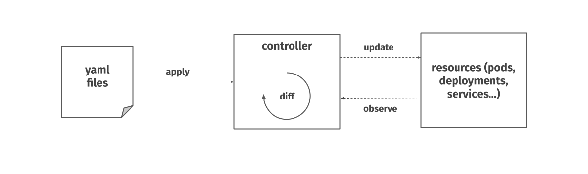
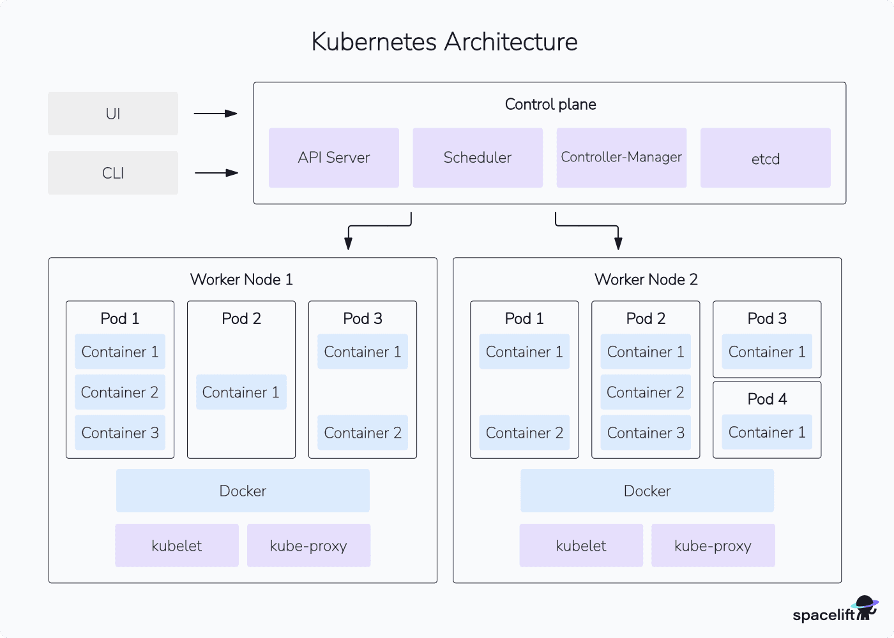
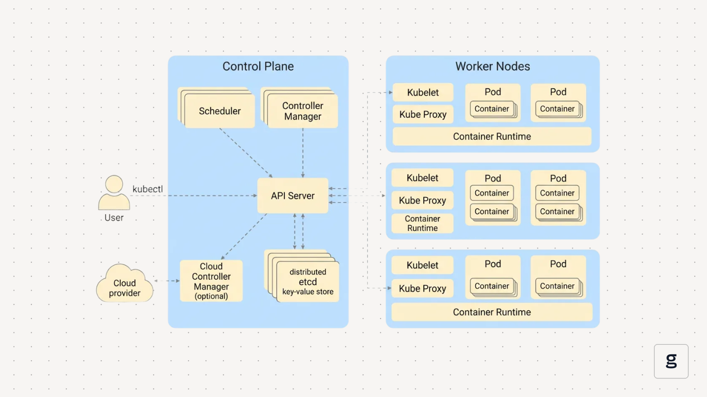

# Kubernetes 이해하기  
## 등장배경부터 설계 철학까지

## 1. 쿠버네티스는 왜 등장했는가?

### 1) 컨테이너 기술의 확산

컨테이너 기술은 Docker의 등장 이후 빠르게 보급되며 애플리케이션을 패키징하고 실행하는 표준 수단이 되었습니다. 하지만 단일 컨테이너를 실행하는 것은 가능했지만, 그 수많은 컨테이너를 자동으로 운영/관리해야 하는 문제는 남아 있었습니다.

### 컨테이너 오케스트레이션 개념

  

이 구조는 물리 인프라 위에서 여러 컨테이너가 동작하고, 상위 계층에서 이를 전체적으로 관리하는 형태를 보여줍니다.

이처럼 다수의 컨테이너를 자동으로 관리하기 위해 등장한 개념이 컨테이너 오케스트레이션이며, 이를 구현한 대표적인 플랫폼이 Kubernetes입니다.

---

### 2) 오케스트레이션의 필요성

컨테이너 오케스트레이션은 다음을 자동화합니다:

- 컨테이너 배포 및 스케줄링
- 자동 확장 및 축소
- 장애 감지 및 재시작
- 로드 밸런싱
- 서비스 디스커버리

---

### 3) 구글의 경험과 오픈소스화

쿠버네티스(Kubernetes, K8s)는 구글의 내부 시스템인 Borg에서 시작되었습니다. 2014년 오픈소스로 공개되면서 컨테이너 오케스트레이션의 표준 플랫폼으로 자리 잡게 되었습니다.

---

## 2. 쿠버네티스의 4가지 설계 원칙

**Kubernetes는 단순한 배포 도구가 아니라, 상태 기반 자동화 플랫폼입니다.**

### 1) 선언적 API (Declarative API)

쿠버네티스는 명령 중심(Imperative)이 아니라 상태 중심(Declarative) 접근 방식을 사용합니다.

사용자는 원하는 상태(Desired State)를 정의하고, Kubernetes는 현재 상태(Current State)를 지속적으로 비교하여 이를 일치시키는 작업을 자동으로 수행합니다.

### Control Loop 구조

이 그림은 Desired State와 Current State를 비교하고, 차이가 발생하면 자동으로 보정하는 Control Loop 구조를 보여줍니다.

---

### 2) 컨트롤 플레인의 투명성

쿠버네티스의 각 컴포넌트는 중앙 명령을 기다리는 것이 아니라, 공유된 API 상태를 감시(watch)하며 독립적으로 동작합니다.

### Kubernetes 아키텍처 개요

이 구조는 Control Plane과 Worker Node의 역할이 분리되어 있음을 보여줍니다.

- Control Plane: API Server, Scheduler, Controller Manager, etcd
- Worker Node: kubelet, container runtime, kube-proxy

---

### 3) 사용자 친화성 (Meet the user where they are)

쿠버네티스는 다양한 애플리케이션 요구사항을 수용할 수 있도록 설계되었습니다.

- ConfigMap
- Secret
- 다양한 워크로드 타입

이를 통해 레거시 시스템과도 점진적으로 통합이 가능합니다.

---

### 4) 워크로드 이식성 (Workload Portability)

쿠버네티스 리소스는 추상화된 API 객체로 정의됩니다.

Deployment, Service, Config 등의 리소스 정의는 온프레미스와 클라우드 환경 모두에서 동일하게 작동합니다.

---

## 3. 쿠버네티스의 구성요소

쿠버네티스 클러스터는 **Control Plane**과 **Worker Node**로 구성되며, 각각이 맡는 역할이 다릅니다.

  

### 3.1 Control Plane 구성요소

- **API Server**
  - 모든 요청의 입구(프론트 도어) 역할을 하는 HTTP API 엔드포인트입니다.
  - `kubectl` 이 보내는 명령과 Control Plane/Node 컴포넌트의 요청을 수신하고, etcd와 연동해 클러스터 상태를 저장/조회합니다.
- **Scheduler**
  - 새로 생성된 Pod가 어느 Worker Node에 배치될지 결정합니다.
  - 노드의 자원 사용량, 어피니티/안티-어피니티, 톨러레이션 등의 조건을 고려해 최적의 노드를 선택합니다.
- **Controller Manager**
  - ReplicaSet, Deployment, Node 등 다양한 리소스의 실제 상태가 원하는 상태와 일치하도록 반복적으로 조정하는 컨트롤러들의 집합입니다.
  - 예를 들어, Pod가 죽으면 새로운 Pod를 다시 생성하는 작업을 담당합니다.
- **Cloud Controller Manager (선택적)**
  - 클라우드 프로바이더(API)와 연동되어 Load Balancer 생성, 노드 등록/삭제 등 인프라 의존 기능을 처리합니다.
- **etcd (분산 Key-Value 저장소)**
  - 클러스터의 모든 상태(리소스 정의, 메타데이터 등)를 저장하는 분산 Key-Value 저장소입니다.
  - Control Plane의 “단일 진실 소스(Single Source of Truth)” 역할을 합니다.

### 3.2 Worker Node 구성요소

- **Kubelet**
  - 각 노드에서 실행되며, API Server와 통신해 “이 노드에 어떤 Pod가 있어야 하는지”를 확인합니다.
  - 실제 컨테이너 런타임을 호출해 컨테이너를 생성/삭제하고, 상태를 주기적으로 보고합니다.
- **Kube Proxy**
  - Kubernetes Service를 위해 iptables 등 네트워크 규칙을 설정하여, 클러스터 내부 트래픽이 올바른 Pod로 라우팅되도록 합니다.
  - 간단한 로드밸런싱 역할도 수행합니다.
- **Container Runtime**
  - 실제 컨테이너를 생성하고 실행하는 엔진(Docker, containerd 등)입니다.
  - Kubelet의 요청을 받아 컨테이너를 시작/중지하고, 이미지 풀(Pull)을 수행합니다.
- **Pod**
  - 쿠버네티스에서 스케줄링되는 최소 단위로, 하나 이상의 컨테이너와 공유 볼륨, 네트워크 네임스페이스를 포함합니다.
  - 같은 Pod 안의 컨테이너는 항상 같은 노드에서 함께 배치되고, localhost 네트워크를 공유합니다.
- **Container**
  - 실제 애플리케이션이 실행되는 단위입니다.
  - 동일한 Pod 안에서도 역할에 따라 여러 개의 컨테이너(예: 메인 앱 + 사이드카)를 포함할 수 있습니다.

### 3.3 외부와의 인터페이스

- **User / kubectl**
  - 사용자는 `kubectl` 또는 CI/CD 시스템을 통해 API Server에 요청을 보냅니다.
  - 이 요청은 YAML로 정의된 Desired State(원하는 상태)를 클러스터에 적용하는 과정입니다.
- **Cloud Provider**
  - 퍼블릭 클라우드(예: AWS, GCP, Azure)나 프라이빗 클라우드 인프라와 연동되어, 노드 프로비저닝, Load Balancer, 스토리지 볼륨 등 인프라 리소스를 제공합니다.

