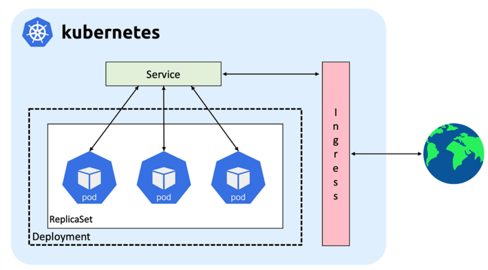
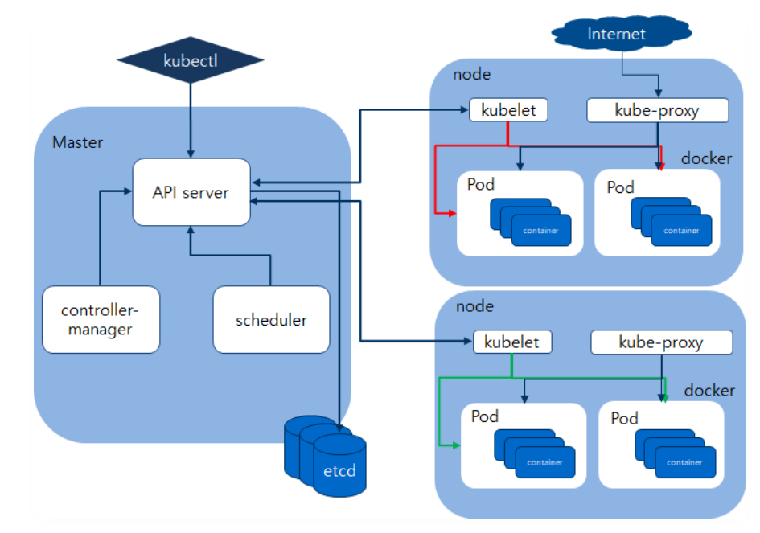
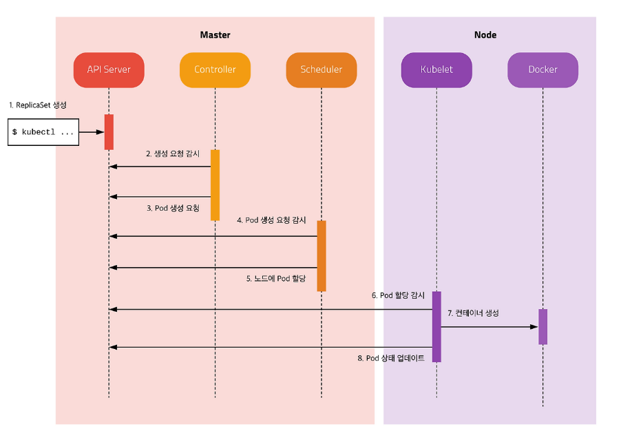

# Kubernetes 이해하기  
## 등장배경부터 설계 철학까지

## 1. 쿠버네티스는 왜 등장했는가?

### 1) 컨테이너 기술의 확산과 그 이후의 문제

Docker의 등장 이후 컨테이너는 애플리케이션 실행 환경을 표준화하는 핵심 기술로 자리 잡았습니다. 개발자는 Dockerfile을 통해 실행 환경을 코드로 정의할 수 있었고, 동일한 이미지를 어디서든 실행할 수 있게 되었습니다. 이는 개발 환경과 운영 환경 간의 차이로 인해 발생하던 문제를 크게 줄여주었습니다.

예를 들어 개발자는 다음과 같이 이미지를 만들고 실행할 수 있습니다.

```bash
docker build -t my-app:1.0 .
docker run -p 8080:80 my-app:1.0
```

이 이미지 하나로 로컬, 테스트, 운영 환경을 동일하게 맞출 수 있게 되었고, 실행 환경의 불일치 문제는 사실상 해결되었습니다.

이후 Docker Compose를 통해 여러 컨테이너를 하나의 애플리케이션처럼 구성할 수 있게 되었고, Docker Swarm을 통해 여러 서버에 걸쳐 컨테이너를 분산 배포하는 것도 가능해졌습니다.
이 지점에서 자연스럽게 다음과 같은 질문을 하게 됩니다.

“Docker Compose나 Docker Swarm으로도 충분히 운영할 수 있는 것 아닌가? Kubernetes는 왜 필요한가?”

이 질문은 매우 본질적인 질문이며, Kubernetes를 이해하기 위한 출발점이 됩니다.

> Docker는 “컨테이너를 실행하는 도구”이고, Kubernetes는 “컨테이너가 실행되는 전체 시스템을 관리하는 플랫폼”입니다. 비유하자면 Docker는 집을 짓는 도구이고, Kubernetes는 도시 전체를 설계하고 운영하는 시스템에 가깝습니다.

단일 서버 환경에서는 Docker Compose만으로도 충분합니다. 여러 서버 환경에서는 Docker Swarm으로도 일정 수준의 운영이 가능합니다. 하지만 서비스 규모가 커지고 요구사항이 복잡해질수록, 단순히 컨테이너를 실행하고 복제하는 수준을 넘어 더 정교한 관리가 필요해집니다.

#### (보강) 그렇다면 Docker Swarm은 왜 실무에서 덜 쓰이게 되었나?

Docker Swarm은 “Docker 사용 경험을 가진 팀이 빠르게 멀티 호스트 배포를 시작하기”에 좋은 선택지였습니다.  
하지만 서비스 규모가 커지고 운영 요구사항이 복잡해질수록, 다음 한계가 자주 드러납니다.

1) **운영 기능의 깊이 차이**
- Kubernetes는 리소스 요청/제한, 오토스케일링, 네트워크 정책, 스토리지 추상화, RBAC 등 “운영에서 필요한 정책 도구”가 풍부합니다.
- Swarm도 기본적인 배포/스케일/롤링 업데이트는 가능하지만, 세밀한 정책/확장 생태계는 상대적으로 제한적입니다.

2) **생태계와 표준의 중심이 Kubernetes로 이동**
- CNCF 생태계(Helm, ArgoCD, Prometheus, Service Mesh, Operator 등)가 Kubernetes를 기준으로 확장되면서,
  운영 도구/레퍼런스/인력 풀이 Kubernetes 쪽으로 빠르게 쏠렸습니다.

3) **제품/커뮤니티 모멘텀의 차이**
- Swarm은 “한동안 안정적이지만 큰 변화가 적은” 방향으로 흘렀고,
  업계에서는 사실상 Kubernetes가 오케스트레이션 표준으로 자리 잡았습니다.

운영 요구가 커질수록 Kubernetes가 제공하는 표준화된 기능과 생태계가 더 강한 선택지가 되는 경우가 많아진 것입니다.

### 2) 실제 운영 환경에서의 한계

컨테이너를 여러 개 실행하는 것은 어렵지 않습니다. 하지만 실제 서비스 환경에서는 다음과 같은 상황이 발생합니다.

예를 들어 트래픽이 급격히 증가하는 상황을 생각해보면, Docker Swarm에서는 관리자가 직접 다음과 같은 명령을 실행해야 합니다.

```bash
docker service scale web=10
```

즉, 확장은 수동으로 이루어집니다.  
여기서 중요한 점은 “기능이 없어서가 아니라, **판단을 사람이 해야 한다는 것**”입니다.

- 언제 확장해야 하는가?
- 몇 개까지 늘려야 하는가?
- 언제 다시 줄여야 하는가?

이 모든 판단이 사람에게 의존합니다.

반면 Kubernetes에서는 CPU 사용률과 같은 조건을 기반으로 자동으로 워크로드 인스턴스 수를 조절할 수 있습니다. 사용자는 단지 “이 조건에서 몇 개까지 확장되길 원한다”는 상태만 정의하면 됩니다.

```yaml
targetCPUUtilizationPercentage: 70
```

이 한 줄은 “70%를 넘으면 자동으로 늘려라”라는 정책이 되며, 이후의 판단과 실행은 Kubernetes가 수행합니다.

또 다른 차이는 장애 상황에서 더욱 명확하게 드러납니다.

예를 들어 새벽 3시에 서비스 컨테이너 3개 중 1개가 죽었다고 가정해보겠습니다.

Docker 환경에서는:

```bash
docker ps
docker logs web3
docker restart web3
```

이 과정을 사람이 직접 수행해야 합니다.

반면 Kubernetes에서는 다음과 같은 일이 자동으로 발생합니다.

- 제어 루프가 실행 중인 인스턴스 수가 줄어든 것을 감지
- 원하는 개수(예: 3개)와 실제 개수(예: 2개)의 차이를 인식
- 부족한 만큼 새 인스턴스 생성을 요청
- 스케줄러가 적절한 노드를 선택
- 노드 에이전트가 컨테이너를 실행

즉, 사람이 개입하지 않아도 몇 초 내에 복구가 이루어집니다.

또한 배포 전략에서도 차이가 발생합니다. Docker Swarm은 기본적인 롤링 업데이트를 제공하지만, Kubernetes는 Blue-Green, Canary와 같은 전략을 통해 **트래픽 일부만 새로운 버전에 보내는 방식**도 가능합니다.

이는 단순한 기능 차이가 아니라, “운영 리스크를 제어할 수 있는 수준”의 차이입니다.

결국 Kubernetes는 단순한 컨테이너 실행 도구가 아니라, 엔터프라이즈 수준의 운영 환경을 제공하는 플랫폼입니다.

여기서 “엔터프라이즈 수준”이라는 말이 추상적으로 들릴 수 있습니다.  
실제로 운영에서 Kubernetes가 강한 이유는, 단순히 컨테이너를 많이 띄우는 것 이상으로 **운영에 필요한 규칙과 정책을 시스템 차원에서 다룰 수 있기 때문**입니다.

- **리소스 관리(요청/제한)**: 각 애플리케이션 인스턴스마다 CPU/메모리를 “얼마나 필요로 하는지(요청)”와 “최대 얼마까지 쓸 수 있는지(제한)”를 선언해, 과부하 상황에서 서비스가 함께 무너지는 일을 줄입니다.
- **네트워크 정책**: 인스턴스 간 통신을 “기본 허용”이 아니라 “필요한 것만 허용”으로 좁힐 수 있어, 내부망에서도 보안을 강화할 수 있습니다.
- **스토리지 관리**: 로컬/네트워크/클라우드 스토리지를 Kubernetes 리소스로 추상화해, 애플리케이션은 동일한 방식으로 스토리지를 사용할 수 있습니다.
- **보안(RBAC)**: 누가 어떤 리소스에 접근/수정할 수 있는지 권한을 세밀하게 나눌 수 있어, 운영 실수와 권한 오남용을 줄입니다.

### 3) 컨테이너 오케스트레이션의 본질

컨테이너 오케스트레이션은 단순히 컨테이너를 실행하는 것이 아니라, 다음과 같은 작업을 자동화하는 시스템입니다.

- 어떤 노드에 배치할 것인가  
- 몇 개를 유지할 것인가  
- 장애 시 어떻게 복구할 것인가  
- 트래픽을 어떻게 분산할 것인가  

즉, “컨테이너 하나”가 아니라 “전체 시스템”을 관리하는 개념입니다.

Kubernetes는 이러한 문제를 해결하기 위해 등장했습니다.


이제 **Pod·Deployment·Service·Ingress·Namespace**가 무엇인지 먼저 정리한 뒤, 그다음 장에서 클러스터를 이루는 **물리·프로세스 구성요소**(Control Plane, 노드, Kubelet 등)를 살펴봅니다.


## 2. Kubernetes 핵심 리소스와 운영 경계

Kubernetes를 처음 접할 때는 아키텍처 그림(Control Plane/Worker Node)부터 보게 됩니다.  
하지만 실무 관점에서 개발자가 “매일 손으로 만지는 대상”은 인프라 구성요소 그 자체가 아니라, **서비스를 배포하기 위한 리소스 객체**들입니다.

그래서 이제부터는 시선을 한 단계 더 아래로 내려, 개발자 관점에서 가장 자주 만나게 되는 핵심 리소스와 운영 경계인 **Pod / Deployment / Service / Ingress / Namespace**를 중심으로 Kubernetes를 이해해보겠습니다.

실무에서 “쿠버네티스에 배포한다”는 말은 보통 다음 **5가지 리소스/경계**를 조합해 서비스를 운영하는 것을 의미합니다.

- **Deployment**: 애플리케이션 배포를 위한 상위 리소스로, 롤링 업데이트와 롤백 같은 배포 전략을 관리합니다. (내부적으로 ReplicaSet을 생성·관리합니다.)
- **Pod**: 애플리케이션 컨테이너가 실제로 실행되는 최소 단위입니다.
- **Service**: 여러 Pod를 하나의 논리적 서비스로 묶고, **고정된 서비스 IP(ClusterIP 등)** 와 로드밸런싱을 제공해 Pod IP가 바뀌어도 안정적으로 접근할 수 있게 합니다.
- **Ingress**: 애플리케이션 단의 네트워크 진입점으로, 도메인 기반 라우팅과 TLS 종료(HTTPS 인증서 처리) 등을 담당하여 외부 요청을 적절한 Service로 연결합니다.
- **Namespace**: 리소스를 팀/서비스/환경 단위로 구분하는 운영 경계입니다.

### 2.1 워크로드 실행 단위: Pod와 Deployment

#### Pod: 왜 컨테이너가 아닌 Pod인가

Docker에서는 컨테이너가 실행 단위입니다. 하지만 Kubernetes에서는 Pod가 최소 단위입니다.

많은 학습자가 “왜 컨테이너를 직접 실행하지 않는가?”라는 의문을 가집니다.

그 이유는 실제 서비스에서는 컨테이너가 단독으로 동작하지 않기 때문입니다.

예를 들어 하나의 API 서버는 다음과 같이 구성될 수 있습니다.

- 메인 애플리케이션  
- 로그 수집기 (sidecar)  
- 보안 모듈  

이 컨테이너들은 반드시 함께 실행되어야 하며, 네트워크와 스토리지를 공유해야 합니다.

그래서 Kubernetes는 “컨테이너 하나”가 아니라, “함께 살아야 하는 컨테이너 묶음”을 최소 단위로 다루기 위해 Pod를 사용합니다.

예를 들어 아래처럼 한 Pod 안에 메인 컨테이너와 사이드카를 함께 넣는 것이 전형적인 패턴입니다.

```yaml
apiVersion: v1
kind: Pod
metadata:
  name: api-server
spec:
  containers:
  - name: api
    image: my-api:latest
  - name: log-agent
    image: fluentd:latest
```

Pod가 중요한 이유는 “함께 배치/함께 생명주기”뿐 아니라, **네트워크/볼륨 공유**가 자연스럽게 된다는 점입니다.

```yaml
apiVersion: v1
kind: Pod
metadata:
  name: web-app
spec:
  containers:
  - name: web
    image: nginx:latest
    volumeMounts:
    - name: shared
      mountPath: /usr/share/nginx/html
  - name: app
    image: node:18
    volumeMounts:
    - name: shared
      mountPath: /app/public
  volumes:
  - name: shared
    emptyDir: {}
```

간단히 비교하면 다음 감각으로 잡으면 됩니다.

| 항목 | Docker Container | Kubernetes Pod |
|------|------------------|----------------|
| 최소 단위 | 컨테이너 1개 | 컨테이너 1개 이상 |
| 네트워크 | 컨테이너마다 독립 | Pod 내 컨테이너 공유 |
| 볼륨 | 개별 구성 | Pod 단위로 공유 가능 |
| 생명주기 | 독립 | 함께 시작/종료 |

Pod는 이러한 요구를 해결하기 위해 등장한 개념이며, 다음과 같은 특징을 가집니다.

- 동일 노드 배치  
- localhost 통신  
- 볼륨 공유  
- 동일 생명주기  

즉 Kubernetes는 컨테이너를 직접 다루지 않고, 컨테이너를 그룹화한 단위(Pod)를 관리합니다.

#### Deployment: 상태 유지와 자동 복구

Deployment는 Pod를 직접 실행하는 것이 아니라, **원하는 상태를 정의해 “항상 그 상태가 유지되게 만드는”** 역할을 합니다.

예를 들어 아래 한 줄은 단순한 숫자가 아니라, 운영 정책에 가깝습니다.

```yaml
replicas: 3
```

이 선언 하나로 Kubernetes는 “언제나 3개의 Pod가 떠 있어야 한다”는 목표(Desired State)를 가지게 되고, 현재 상태(Current State)가 그보다 적어지면 자동으로 보정합니다.

Pod가 하나 죽으면:

- Controller가 감지  
- 새로운 Pod 생성  
- 상태 복구  

이 과정은 사람이 개입하지 않아도 자동으로 이루어집니다.

또한 이미지 버전을 변경하면 Kubernetes는 자동으로 롤링 업데이트를 수행합니다.

#### (보강) Self-Healing의 디테일: Liveness / Readiness Probe

“자동 복구”를 조금 더 현실적으로 보면, Kubernetes는 단순히 Pod 개수만 맞추는 게 아니라 “정상 상태”를 기준으로 조치합니다.  
이때 자주 쓰이는 장치가 **Probe(헬스체크)**입니다.

- **Liveness Probe**: 컨테이너가 “살아 있는가?” (실패하면 재시작)
- **Readiness Probe**: 컨테이너가 “요청을 받을 준비가 되었는가?” (실패하면 트래픽에서 제외)

```yaml
livenessProbe:
  httpGet:
    path: /health
    port: 8080
  initialDelaySeconds: 10
  periodSeconds: 10

readinessProbe:
  httpGet:
    path: /ready
    port: 8080
  initialDelaySeconds: 5
  periodSeconds: 5
```

장애가 반복될 때는 “왜 계속 죽는지”를 이벤트로 확인할 수도 있습니다.

```bash
kubectl get events
```

### 2.2 서비스 연결 단위: Service

<p align="center">
  
</p>

> Service는 계속 변하는 Pod 집합 앞단에 안정적인 진입점(고정 가상 IP/이름)을 제공하는 리소스입니다. 

- 레이블 셀렉터로 대상 Pod들을 동적으로 묶고 kube‑proxy(IPTables/IPVS)가 생성한 규칙을 통해 트래픽을 해당 Pod들로 로드밸런싱합니다. 
- 클러스터 내부에서는 DNS(`my-svc.my-namespace.svc.cluster.local`)로 서비스 디스커버리가 이루어지며, Pod의 생성·삭제로 IP가 바뀌어도 클라이언트는 항상 동일한 Service 이름/ClusterIP로 접근할 수 있습니다. 
- 용도에 따라 ClusterIP(기본, 내부 전용), NodePort(각 노드의 고정 포트로 노출), LoadBalancer(클라우드 LB와 연동해 외부에 공개), Headless(`clusterIP: None`, 개별 Pod 직접 해석) 형태로 동작하며, 필요 시 세션 어피니티(ClientIP 기반 고정), 여러 포트 정의, 헤드리스 + StatefulSet 조합으로 직접 엔드포인트 접근 같은 고급 패턴을 구성할 수 있습니다.

예시(Service: ClusterIP)

```yaml
apiVersion: v1
kind: Service
metadata:
  name: web
  namespace: default
spec:
  type: ClusterIP
  selector:
    app: web
  ports:
    - name: http
      port: 80        # 클라이언트가 접근하는 서비스 포트
      targetPort: 8080 # Pod 컨테이너가 실제로 리스닝하는 포트
      protocol: TCP
```

요약: `selector`가 Pod 집합을 정하고, `port`→`targetPort`로 트래픽이 전달되며, `type`으로 노출 범위를 결정합니다.

### 2.3 외부 진입 단위: Ingress

Service는 클러스터 내부에서 Pod로 안정적으로 연결되는 “고정된 접근점”을 만들어주지만, 외부(인터넷)에서 들어오는 요청까지의 경로는 별도 구성이 필요합니다. 이때 Ingress는 “어떤 도메인/경로로 들어온 요청을 어떤 Service로 보낼지”를 정의하는 라우팅 계층이며, **도메인 기반 라우팅**과 **TLS 종료(HTTPS 인증서 처리)** 같은 기능을 담당합니다.

> Ingress 리소스만 만든다고 바로 동작하는 것은 아니고, 실제 트래픽을 받아 처리하는 Ingress Controller(NGINX Ingress, Traefik 등)가 클러스터에 함께 배포되어 있어야 합니다.

여기서 Ingress와 Ingress Controller는 역할과 “위치”가 다릅니다.

- **Ingress**: Kubernetes API에 저장되는 **라우팅 규칙(설정) 리소스**입니다. 즉 “어떤 도메인/경로를 어떤 Service로 보낼지” 같은 선언(Desired State) 자체이며, Control Plane(etcd)에 객체로 기록됩니다.
- **Ingress Controller**: 위 Ingress 규칙을 Watch 하다가 실제 L7 프록시/로드밸런서 설정으로 변환해 적용하는 **실행 컴포넌트(프로그램)** 입니다. 보통 Worker Node에 Pod(Deployment/DaemonSet)로 떠서 외부 트래픽을 직접 받고, 규칙에 따라 Service로 전달합니다.

정리하면, **Ingress는 설정(리소스)** 이고 **Ingress Controller는 그 설정을 실제 트래픽 처리로 구현하는 실행체**입니다.

### 2.4 운영 경계 단위: Namespace

지금까지 본 Pod, Deployment, Service, Ingress는 모두 Kubernetes API 객체입니다.  
Namespace는 이 객체들을 클러스터 안에서 팀/서비스/환경 단위로 구분하기 위한 **논리적 경계**입니다.

핵심은 “클러스터를 물리적으로 나누지 않고도 운영 경계를 만들 수 있다”는 점입니다.

- 같은 이름의 리소스도 Namespace가 다르면 공존할 수 있습니다.
- 권한(RBAC), 쿼터(ResourceQuota), 기본 제한(LimitRange) 같은 운영 정책을 Namespace 단위로 나눌 수 있습니다.
- `Service` 디스커버리도 Namespace를 포함해 동작합니다.  
  예: `web.default.svc.cluster.local`, `web.prod.svc.cluster.local`

즉 리소스 식별은 사실상 `namespace/name` 조합으로 이해하는 것이 안전합니다.

- `default/web` (default 네임스페이스의 web)
- `prod/web` (prod 네임스페이스의 web)

실무에서는 같은 클러스터 안에서도 보통 `dev`, `staging`, `prod` 같은 Namespace를 분리해 사용합니다.  
이렇게 하면 이름 충돌을 피하고, 권한과 정책을 환경별로 분리할 수 있습니다.

kubectl 관점에서는 다음 감각만 잡아도 초반 운영 실수를 크게 줄일 수 있습니다.

```bash
# 특정 네임스페이스 조회
kubectl get pods -n prod

# 리소스 적용 시 네임스페이스 지정
kubectl apply -f deploy.yaml -n staging

# 현재 컨텍스트의 기본 네임스페이스 변경
kubectl config set-context --current --namespace=dev
```

정리하면, Namespace는 “클러스터를 나누는 최소 운영 단위”이며,  
Kubernetes 객체를 실제 운영 환경에서 안전하게 구분하고 관리하기 위한 기본 장치입니다.

### 2.5 리소스 간 연결 관계(요청 흐름과 관리 흐름)

처음에는 Pod, Deployment, Service, Ingress가 각각 별개의 개념처럼 보이지만, 실제 운영에서는 서로 다른 책임을 맡아 하나의 요청 경로를 완성합니다.

- **Pod**: 애플리케이션 컨테이너가 실제로 실행되는 최소 단위입니다.
- **Deployment**: 원하는 개수/업데이트 전략을 기준으로 Pod 집합을 관리합니다.
- **Service**: Pod 집합 앞단에 안정적인 접근점(고정 이름/IP)과 내부 로드밸런싱을 제공합니다.
- **Ingress**: 외부 요청(도메인/경로/TLS)을 어떤 Service로 보낼지 라우팅 규칙을 정의합니다.

요청 흐름을 실제 트래픽 관점에서 다시 보면 다음과 같습니다.

1) 사용자의 요청이 클러스터로 들어오면 **Ingress Controller**가 Ingress 규칙을 확인합니다.  
2) 규칙에 매칭된 대상 **Service**로 요청을 전달합니다.  
3) Service는 selector로 연결된 Pod 집합 중 하나를 선택해 로드밸런싱합니다.  
4) 선택된 **Pod**가 요청을 처리하고 응답을 반환합니다.  
5) Pod 집합의 개수와 업데이트 상태는 **Deployment(내부적으로 ReplicaSet)** 가 계속 유지합니다.

즉, 트래픽 경로는 보통 **Ingress → Service → Pod**이고, Deployment는 그 경로 뒤에서 “처리 주체(Pod 집합)”를 안정적으로 유지하는 역할을 맡습니다.

> **Namespace** 관점을 함께 보면, 위 관계는 네임스페이스 경계 안에서 먼저 성립합니다. 즉 Service는 기본적으로 같은 Namespace의 Pod를 selector로 찾으므로 동일한 `web` 이름이라도 `default/web`와 `prod/web`는 서로 다른 대상이며, 운영·권한·트래픽 경계를 분리하는 효과를 얻습니다.

실제로 이 관계를 이해할 때는, 먼저 Deployment와 Service의 “최소 형태”를 보는 것이 가장 빠릅니다.

**1) Deployment 최소 예시 (Pod를 어떤 라벨로 만들지 선언)**

```yaml
apiVersion: apps/v1
kind: Deployment
metadata:
  name: web
spec:
  replicas: 3
  selector:
    matchLabels:
      app: web
  template:
    metadata:
      labels:
        app: web
    spec:
      containers:
      - name: nginx
        image: nginx:latest
```

**2) Service 최소 예시 (어떤 Pod 집합으로 보낼지 선언)**

```yaml
apiVersion: v1
kind: Service
metadata:
  name: web-service
spec:
  selector:
    app: web
  ports:
  - port: 80
    targetPort: 80
  type: ClusterIP
```

이제 핵심을 보면, **Deployment와 Service가 직접 연결되는 것이 아니라 “Pod의 label”을 기준으로 간접 연결**됩니다.  
Deployment는 Pod 템플릿(`spec.template.metadata.labels`)에 `app: web` 라벨을 붙여 Pod를 만들고, Service는 `spec.selector`로 같은 라벨(`app: web`)을 가진 Pod 집합을 찾아 트래픽을 전달합니다.

즉 매칭 규칙은 다음처럼 이해하면 됩니다.

- Deployment가 만드는 Pod 라벨: `app: web`
- Service selector: `app: web`
- 결과: Service가 Deployment가 생성한 Pod들을 자동으로 엔드포인트로 묶음

이 구조 덕분에 Pod가 교체되어 IP가 바뀌어도, 라벨만 일치하면 Service가 자동으로 새로운 Pod를 찾아 연결합니다.

또 하나 많이 헷갈리는 포인트가 `selector.matchLabels`와 `metadata.labels`의 차이입니다.

- `spec.selector.matchLabels` (Deployment): **“내가 관리할 Pod 집합을 고르는 기준”**입니다.  
  Deployment/ReplicaSet이 어떤 Pod를 자신의 대상으로 볼지 결정하는 셀렉터입니다.
- `spec.template.metadata.labels` (Deployment): **“앞으로 생성될 Pod에 실제로 붙일 라벨 값”**입니다.  
  보통 `matchLabels`와 동일하게 맞춰야, Deployment가 자신이 만든 Pod를 정상적으로 관리합니다.
- `metadata.labels` (리소스 최상단): 해당 리소스(Deployment/Service 객체 자체)에 붙는 메타 라벨입니다.  
  이 라벨은 리소스 검색/분류에 유용하지만, Pod 매칭은 보통 `spec.selector`와 `spec.template.metadata.labels`의 조합으로 일어납니다.

이 조합이 익숙해지면, Kubernetes에서 “배포한다”는 말은 결국 **Deployment와 Service를 정의하고 적용하는 것**으로 체감되기 시작합니다.

## 3. Kubernetes의 구성요소

앞 장에서 **Pod·Deployment·Service·Ingress·Namespace**가 무엇인지(핵심 리소스와 운영 경계) 살펴봤으니, 이번에는 그 객체들이 **어느 프로세스·노드에 의해** 실현되는지를 등장인물처럼 짚어보겠습니다.  
API Server, Controller, Scheduler, Kubelet은 설계 철학(§5)에서도 반복되므로, 여기서 역할을 정리해 두면 이후 흐름이 한결 분명해집니다.

<p align="center">
  
</p>

### 3.1 Control Plane

Control Plane은 클러스터의 **두뇌**에 해당하며, Desired State를 해석·유지하고 Pod가 어느 노드에 갈지 결정하는 등의 판단을 담당합니다. 대표 구성요소는 API Server, Scheduler, Controller Manager, etcd입니다.

> **API Server**는 Kubernetes의 **중앙 관문(Entry Point)** 입니다. 

- 사용자의 `kubectl` 호출, 컨트롤러·스케줄러·Kubelet이 보내는 요청이 모두 API Server를 거쳐야만 클러스터 상태를 조회하거나 바꿀 수 있습니다. RESTful API를 제공하고, 인증·인가와 스키마에 맞는지에 대한 유효성 검사를 수행한 뒤 변경 내용을 etcd에 반영합니다. 예를 들어 `kubectl apply`로 리소스를 제출하면 API Server가 이를 검증·저장하고, 그 결과를 다른 컴포넌트들이 Watch 하며 감지할 수 있게 됩니다.

> **Scheduler**는 각 노드의 자원·제약 조건을 고려하여 pod를 어떤 노드에 배치할지 결정합니다.

**Scheduler**는 API Server를 통해 **아직 노드가 정해지지 않은(unscheduled) Pod**를 알아채고, 각 Worker 노드의 CPU·메모리 여유, taint/toleration, node affinity/anti-affinity, 노드 셀렉터 등을 고려해 **어느 노드에 둘지**만 결정합니다. Scheduler는 컨테이너를 직접 실행하지 않으며, “이 Pod는 이 노드에 할당한다”는 결정을 API Server(및 etcd)에 기록합니다. 이후 해당 노드의 Kubelet이 그 Pod를 받아 실제 컨테이너를 띄웁니다.

> **Controller Manager**는 클러스터 상태가 사용자가 선언한 원하는 상태와 계속 일치하도록 자동으로 감시·조정하는 역할을 합니다.

- Controller Manager **는 Deployment Controller, ReplicaSet Controller, Node Controller 등 여러 컨트롤러를 한 프로세스에서 묶어 실행**합니다. 각 컨트롤러는 API Server의 리소스를 Watch 하면서, 사용자가 선언한 Desired State와 실제 상태(Current State)를 비교하고 다르면 Pod 생성·삭제·노드 상태 반영 등 **보정(Reconcile)** 을 수행합니다. 장애로 Pod가 사라지면 ReplicaSet 쪽 컨트롤러가 개수를 맞추기 위해 새 Pod를 만들도록 API Server에 요청하는 식입니다. 컨트롤러는 노드에 직접 접속하지 않고, **API Server에 리소스 변경을 남기는 방식**으로만 조치를 요청합니다.

> **etcd**는 Kubernetes 클러스터의 상태를 저장하는 **분산 Key-Value 데이터베이스**입니다. 

- Pod, Deployment, Service 같은 리소스 정의(YAML로 제출된 Desired State)와 그 리소스의 현재 상태(Current State)가 최종적으로 etcd에 기록됩니다. 여러 Control Plane 인스턴스가 동시에 접근해도 **강한 일관성(Strong Consistency)** 을 제공해 상태가 어긋나지 않도록 하며, 클러스터 관점에서는 **단일 진실 소스(Single Source of Truth)** 로 취급됩니다. 따라서 장애 복구·업그레이드 시 **etcd 백업 전략**이 매우 중요합니다.
  - etcd는 “클러스터의 기억 장치”이고, API Server는 그 기억 장치에 읽고/쓰는 창구입니다.
  - API Server는 리소스 변경 요청을 받으면 etcd에 저장합니다.
  - Controller/Scheduler/Kubelet 같은 컴포넌트들은 API Server를 통해 상태를 읽고(또는 Watch 하고), 필요한 경우 다시 상태 변경을 요청합니다. etcd가 불안정해지면 **클러스터의 상태를 저장/갱신하는 관리 기능이 크게 제한**될 수 있습니다.

**모든 컴포넌트는 직접 통신하지 않고 API Server를 통해 상태를 공유합니다.**

### 3.2 Worker Node

Worker Node는 실제 워크로드가 돌아가는 머신이며, **Kubelet**, **Kube Proxy**, **Container Runtime**이 함께 동작합니다.

> **Kubelet**은 각 노드에서 돌아가는 **에이전트**입니다. 

- API Server로부터 “이 노드에서 실행해야 할 Pod” 스펙을 받아오고, **Container Runtime**을 호출해 컨테이너를 만들고 시작·중지합니다. Pod와 노드의 상태(리소스 사용, 프로브 결과 등)를 주기적으로 API Server에 보고해, Control Plane이 전체 클러스터 상태를 파악할 수 있게 합니다.

> **Kube Proxy**는 **Service**라는 추상 개념을 실제 네트워크 규칙으로 구현합니다. 

- API Server로부터 Service와 Endpoints 정보를 받아, iptables나 IPVS 등으로 **Service IP → 실제 Pod IP** 로 트래픽이 전달되도록 설정합니다. Pod가 늘거나 줄거나 다른 노드로 옮겨져도, 클라이언트는 동일한 Service 이름·ClusterIP로 안정적으로 통신할 수 있습니다.

> **Container Runtime**은 이미지를 내려받고, 컨테이너의 파일 시스템·네트워크를 준비한 뒤 **프로세스를 실제로 실행·종료**하는 소프트웨어입니다. 

- Docker, containerd, CRI-O 등이 여기에 해당하며, Kubelet은 **CRI(Container Runtime Interface)** 라는 표준으로 런타임과 통신합니다.

Kubernetes는 Docker를 직접 사용하지 않고 containerd를 사용합니다. 이는 불필요한 계층을 제거하고 성능을 높이기 위한 설계입니다.

#### **(보강)** Kubernetes는 왜 containerd를 사용하는가?

“어? Kubernetes는 컨테이너를 돌리는 시스템이라며? 그럼 Docker로 실행해야 하는 거 아닌가요?”

결론부터 말하면, **Kubernetes가 버린 것은 ‘Docker 이미지’가 아니라 ‘Docker Daemon을 거치는 실행 경로(dockershim)’**입니다.

과거(v1.23 이전)에는 보통 이런 구조였습니다.

```
Kubelet → Docker Daemon → containerd → 컨테이너 실행
```

문제는 Docker가 “실행(Runtime)”만 하는 프로그램이 아니라는 점입니다.  
이미지 빌드, 네트워크/볼륨 관리, 오케스트레이션(Swarm)까지 포함한 큰 프로그램이고, Kubernetes 입장에서는 **실행에 불필요한 중간 계층**이었습니다.

그래서 Kubernetes는 컨테이너 런타임과 통신하기 위한 표준 인터페이스를 만들었습니다.

- **CRI(Container Runtime Interface)**: “Kubernetes가 런타임과 대화하는 표준 규격”

현재(v1.24 이후)에는 구조가 이렇게 단순해집니다.

```
Kubelet → CRI → containerd/CRI-O → 컨테이너 실행
```
> 즉, Kubernetes는 **Docker에서 Kubernetes에게 필요한 ‘순수 실행 엔진’만 남긴 것**에 가깝습니다.

Docker를 통해 만든 컨테이너 이미지는 OCI(Open Container Initiative)라는 국제 표준을 따릅니다.  

```bash
# 개발 단계: Docker로 이미지 만들고 테스트
docker build -t my-app:1.0 .
docker run -p 8080:80 my-app:1.0

# 운영 단계: (예) 레지스트리에 올린 뒤 Kubernetes에서 사용
# kubectl run my-app --image=my-app:1.0
```

따라서,Kubernetes 환경에서 Docker의 역할은 이렇게 이해하면 됩니다.

- **Docker**: 개발 단계에서 이미지를 만들고 로컬에서 검증하기 좋다
- **Kubernetes**: 운영 단계에서 그 이미지를 “정책/자동화/복구/확장”과 함께 관리한다

## 4. Kubernetes의 동작 방식

이제 “구성요소(등장 인물)”와 “리소스 객체(개발자가 만지는 대상)”를 알았으니, 실제로 그 둘이 어떻게 맞물려 동작하는지 한 번에 연결해보겠습니다.
<p align="center">
  
</p>

Pod 생성 흐름:

```text
1. Master Node의 kube-apiserver에 Pod 생성을 요청 
2. kube-apiserver는 etcd에 새로운 상태를 저장
3. kube-apiserver가 etcd의 상태 변경을 확인하여, kube-controller-manager에게 새로운 Pod 생성을 요청
4. kube-controller-manager는 새로운 Pod를 생성(no assign)을 kube-apiserver에 전달하고, 이를 전달받은 kube-apiserver는 etcd에 저장 
5. kube-scheduler는 kube-apiserver에 의해 Pod(no assign)가 확인되면, 조건에 맞는 Worker Node를 찾고 해당 Pod를 할당하기 위해 우선, kube-apiserver는 etcd에 업데이트
6. 모든 Worker Node의 kubelet은 자신의 Node에 할당되었지만, 생성되지 않은 Pod가 있는지 체크하고 있다면 Pod를 생성
7. 해당 Worker Node의 kubelet은 Pod의 상태를 주기적으로 API Server에 전달
```


> “ControlPlane에서 `kubectl` 명령어를 치면, 요청은 정확히 어디로 날아가는가?”

`kubectl`은 단순한 명령 모음이 아니라 **REST API 클라이언트**입니다.  
즉, `kubectl get pods` 같은 명령은 내부적으로 API Server로 향하는 HTTPS 요청으로 바뀝니다.

그리고 이때 연결의 열쇠가 바로 **kubeconfig**입니다. kubectl은 kubeconfig를 읽어서
- 어느 클러스터로 갈지 (API Server 주소: 운영 환경에서는 보통 로드 밸런서 주소)
- 어떤 사용자/인증 정보로 접근할지
- 어떤 컨텍스트를 사용할지
를 결정합니다.

#### kubeconfig는 실제로 어떻게 생겼나?

`kubeconfig`에는 크게 “클러스터 주소”, “사용자 인증 정보”, “컨텍스트(조합)”이 들어 있습니다.

```yaml
apiVersion: v1
kind: Config
clusters:
- name: my-cluster
  cluster:
    server: https://api.my-cluster.com:6443
users:
- name: my-user
  user:
    token: <token or cert>
contexts:
- name: my-context
  context:
    cluster: my-cluster
    user: my-user
current-context: my-context
```

#### kubectl은 어떤 REST API를 호출하나?

`kubectl` 명령은 내부적으로 API Server의 REST 엔드포인트 호출로 바뀝니다.

| kubectl 명령 | 내부 REST API 예시 |
|---|---|
| `kubectl get pods` | `GET /api/v1/namespaces/default/pods` |
| `kubectl create -f pod.yaml` | `POST /api/v1/namespaces/default/pods` |
| `kubectl delete pod web-pod` | `DELETE /api/v1/namespaces/default/pods/web-pod` |

요청이 실제로 어디로 날아가는지 보고 싶다면, verbose 모드로 확인할 수도 있습니다.

```bash
kubectl get pods -v=8
```

## 5. Kubernetes의 설계 철학

이제 설계 철학을 보면, 앞에서 다룬 구성요소와 동작 흐름이 “왜 그렇게 생겼는지”가 훨씬 선명하게 보입니다.  
Kubernetes의 철학은 결국 **선언형(Declarative) + Control Loop + 이벤트 기반(Watch)**으로 요약됩니다.

또 한 가지 중요한 포인트는, 이 철학이 “설명으로 그럴듯한 것”에 그치지 않고,  
실제로 운영에서 버전 관리/재현성/롤백 같은 방식으로 이어진다는 점입니다. (IaC, GitOps)

### 5.1 선언형 API (Declarative)

#### 명령형(Docker) vs 선언형(Kubernetes)

Docker에서는 다음과 같이 명령을 실행합니다.

```bash
docker run -d nginx
```

이 방식은 “어떻게 실행할 것인가”를 명령하는 방식입니다. 하지만 실행 이후 상태를 유지하지 않습니다.

Kubernetes는 완전히 다른 접근을 사용합니다.

```yaml
replicas: 3
```

#### 선언형의 핵심: Desired State와 Current State

이 선언은 “3개를 실행하라”는 명령이 아니라,  
“항상 3개가 유지되어야 한다”는 상태를 정의하는 것입니다.

이 차이는 장애 상황에서 결정적인 차이를 만듭니다.

예를 들어 컨테이너 하나가 죽었을 때:

- Docker → 아무 일도 일어나지 않음  
- Kubernetes → 자동으로 새 Pod 생성  

이것이 가능한 이유는 Kubernetes 내부에 **Control Loop(제어 루프)**가 존재하기 때문입니다.

#### Control Loop란 무엇인가? (Reconcile)

Control Loop를 한 문장으로 정의하면 이렇습니다.  
**“클러스터가 지금 어떤 상태인지 계속 관찰하고, 사용자가 선언한 원하는 상태(Desired State)와 다르면 자동으로 맞춰 가는 반복 메커니즘”**입니다.

여기서 중요한 포인트는 두 가지입니다.

첫째, Kubernetes는 “명령을 실행하고 끝나는 시스템”이 아니라 **상태를 유지하는 시스템**입니다.  
`replicas: 3`은 “지금 당장 3개 띄워라”로 끝나는 명령이 아니라, **“앞으로도 계속 3개가 유지되어야 한다”**는 목표입니다.

둘째, Control Loop는 특정 기능 하나가 아니라 Kubernetes 전체의 작동 방식입니다.  
Deployment/ReplicaSet/Node 같은 여러 리소스에 대해 컨트롤러들이 존재하고, 각 컨트롤러는 대체로 비슷한 루프를 반복합니다.

1) **원하는 상태 읽기(Desired State)**  
   - 사용자가 올린 YAML(또는 API 요청)에서 목표를 읽습니다.
2) **현재 상태 확인(Current State)**  
   - 지금 클러스터에 실제로 무엇이 떠 있는지 확인합니다.
3) **차이 계산(Diff)**  
   - Desired와 Current 사이의 차이를 계산합니다.
4) **보정 시도(Reconcile)**  
   - 차이를 줄이기 위한 조치를 ‘요청’합니다. (직접 실행이 아니라 API 상태를 바꾸는 방식)
5) **다시 관찰(Repeat)**  
   - 한 번으로 끝나지 않고 계속 반복해서, 목표 상태가 유지되게 만듭니다.

#### 예시 시나리오: Desired 3 → Current 2 → 다시 3 (Self-Healing)

아래처럼 선언되어 있다고 해보겠습니다.

```yaml
spec:
  replicas: 3
```

이 상태에서 새벽 3시에 Pod 하나가 예기치 않게 종료되면, Kubernetes 내부에서는 대략 이런 일이 벌어집니다.

```
Desired State: Pod 3개 유지
Current State: Pod 2개 실행 중 (1개 종료)
Diff: 1개 부족
Reconcile: 새 Pod 생성 요청 → 스케줄링 → 실행
Result: 다시 Pod 3개 (Desired와 일치)
```

그래서 Kubernetes의 장애 복구(Self-Healing)는 “특수 기능”이 아니라,  
**원하는 상태를 유지하려는 Control Loop의 자연스러운 결과**가 됩니다.

#### Control Loop는 누가 실행하는가? (`kube-controller-manager`)

> “그럼 이 Control Loop는 도대체 **누가** 실행하는거지?”

정답은 Kubernetes의 **Control Plane에 실제로 떠 있는 컨트롤러 프로세스(또는 Pod)**입니다.

- 우리가 흔히 “Controller”라고 부르는 것들은 보통 `kube-controller-manager` 안에 들어 있습니다.  
  Deployment Controller, ReplicaSet Controller처럼 이름이 붙은 컨트롤러들이 이 안에서 각각 Control Loop를 돌리며, API Server의 상태를 Watch 하다가 필요하면 “보정(Reconcile)”을 수행합니다.
- 중요한 점은 컨트롤러가 노드에 직접 명령을 내려 컨테이너를 실행시키는 방식이 아니라, **API Server에 리소스 상태를 업데이트하는 방식으로 조치를 ‘요청’**한다는 것입니다.  
  그리고 실제 컨테이너 실행은 해당 노드의 Kubelet이 맡습니다.

운영 환경에서 Control Plane을 여러 대로 구성하면 `kube-controller-manager`도 여러 대에 떠 있을 수 있는데, 이때는 **Leader Election(리더 선출)**을 통해 동시에 하나만 활성화되어 중복 조정(충돌)을 방지합니다.

#### Controller와 Kubelet의 ‘책임 분리’로 얻는 운영상의 이점

Kubernetes가 “컨트롤러가 조정하고(kube-controller-manager), 실제 실행은 노드의 Kubelet이 한다”로 역할을 나누는 이유는  
단지 설계 취향이 아니라, 운영에서 얻는 이점이 큽니다.

1) **수평 확장성**
- 컨트롤 플레인은 “상태 조정(Reconcile)”에 집중하고,
- 실제 프로세스/컨테이너 관찰과 실행은 각 노드로 분산되기 때문에,
  노드/Pod 수가 늘어도 중앙이 모든 디테일을 직접 처리하지 않아 확장에 유리합니다.

2) **신뢰 가능한 관찰 지점**
- 컨테이너의 생존/리소스/프로세스 상태는 해당 노드(Kubelet)가 가장 정확히 관찰할 수 있습니다.
- 중앙에서 추측하는 것보다 로컬 관찰을 기반으로 보고받는 구조가 운영에서 안정적입니다.

3) **장애 격리**
- 특정 노드의 문제(네트워크/디스크/런타임 이슈)가 있어도,
  전체 Control Plane은 동일한 방식으로 ‘상태 조정’ 루프를 계속 돌릴 수 있습니다.
- 반대로 Control Plane이 순간적으로 흔들려도, 이미 떠 있는 워크로드는 노드에서 계속 실행됩니다.

4) **표준화된 정책 확장**
- 중앙은 “원하는 상태를 유지한다”는 단순한 원칙에 집중하고,
- 애플리케이션 수준의 건강 상태는 Probe(Liveness/Readiness)처럼 표준화된 인터페이스로 노드에서 수행되게 만들면,
  서비스별로 제각각인 로직을 중앙에 넣지 않아도 됩니다.

#### 선언형은 결국 IaC/GitOps로 이어진다

선언형의 강점은 “자동 복구”만이 아닙니다.  
운영 설정 자체가 YAML로 남기 때문에, 인프라/배포를 코드처럼 다룰 수 있습니다.

- **버전 관리**: 변경 사항을 Git 커밋으로 남긴다
- **재현 가능**: 파일만 있으면 같은 상태를 언제든 다시 만들 수 있다
- **코드 리뷰**: 운영 변경도 리뷰 대상으로 만든다
- **롤백**: 이전 커밋으로 되돌리고 다시 apply 하면 된다

```bash
git add deployment.yaml
git commit -m "scale web to 3 replicas"
git checkout <previous>
kubectl apply -f deployment.yaml
```

### 5.2 이벤트 기반 구조와 API Server 중심 통신

Kubernetes는 컴포넌트 간 직접 명령을 사용하지 않습니다.

모든 컴포넌트는 API Server를 중심으로 상태를 공유하고, 변경 사항을 구독(Watch)합니다.

예를 들어 Pod가 생성되는 과정은 다음과 같습니다.

- 사용자가 kubectl apply 실행  
- API Server에 상태 저장  
- Controller가 이를 감지하고 Pod 생성 요청  
- Scheduler가 노드 선택  
- 해당 노드의 Kubelet이 실행  

여기서 중요한 점은:

- Scheduler는 실행하지 않습니다  
- Controller는 생성하지 않습니다  
- Kubelet만 실행합니다  

이 구조는 시스템을 느슨하게 결합시키며, 장애가 발생해도 전체 시스템에 영향을 주지 않도록 설계되어 있습니다.

여기서 가장 많이 생기는 오해는 이런 그림입니다.

> “사용자가 `kubectl`로 명령을 내리면 Kubernetes가 즉시 어딘가에 ‘직접 명령’을 내려서 Pod를 실행시킨다.”

하지만 실제 Kubernetes는 **직접 제어**가 아니라, **상태 저장과 상태 구독(Watch)**을 기반으로 움직입니다.

- 사용자는 `kubectl apply`로 “원하는 상태”를 제출합니다.
- API Server는 그 상태를 etcd에 저장합니다.
- Controller Manager는 상태를 구독하다가 “원하는 상태와 다른 부분”을 발견하면 보정 요청을 남깁니다.
- Scheduler는 “어느 노드에 둘지(배치)”만 결정해 Pod 객체에 노드 정보를 기록합니다.
- Kubelet은 자신에게 할당된 Pod를 감지하면, 컨테이너 런타임을 호출해 실제로 실행합니다.

즉 역할이 이렇게 분해됩니다.

- Scheduler: **배치만 한다**
- Controller: **개수/상태 유지만 한다**
- Kubelet: **실행만 한다**

이 구조를 흐름으로 보면 다음과 같습니다.

```
[사용자]
kubectl apply -f deployment.yaml
    ↓
[API Server]
상태 저장 (etcd)
    ↓
[Controller Manager] (Watch)
Desired vs Current 비교 → Pod 생성 요청
    ↓
[API Server]
Pod 생성 (Pending)
    ↓
[Scheduler] (Watch)
Pending Pod 감지 → 노드 선택 → Pod 업데이트
    ↓
[Kubelet] (Watch)
할당된 Pod 감지 → 컨테이너 실행
    ↓
[API Server]
Pod 상태 갱신 (Running)
```

### (보강) Control Plane의 고가용성

Control Plane이 여러 대로 구성되면(API Server 다중화), 하나의 서버가 죽더라도 전체 시스템은 계속 동작할 수 있습니다.

그래서 운영 환경의 Kubernetes는 보통 Control Plane을 여러 대로 구성해 **고가용성(HA)**을 확보합니다.

핵심은 3가지입니다.

1) **API Server 다중화 + 로드 밸런서**  
사용자는 “마스터 여러 대”를 직접 알 필요가 없습니다. 로드 밸런서 주소 하나로 API Server 요청이 분산됩니다.

2) **etcd 클러스터(쿼럼) 구성**  
클러스터의 상태는 etcd에 저장되므로, etcd도 보통 3개 이상(홀수)로 구성합니다. 과반(쿼럼)이 유지되어야 읽기/쓰기가 가능합니다.

####  Docker Swarm에도 “클러스터 단위 이중화(HA)”가 있나?

있습니다. Swarm의 HA는 주로 **Manager 노드 다중화 + Raft 합의(쿼럼)**로 구현됩니다.

- Swarm의 Manager는 클러스터 상태(노드/서비스/스케줄링 정보)를 Raft로 동기화합니다.
- 그래서 Manager는 보통 **홀수 개(3/5/7)**로 구성하고, **과반(쿼럼)**이 살아 있어야 클러스터 관리(스케줄링/상태 변경)가 정상 동작합니다.

즉 둘 다 “클러스터 관리 계층(Control Plane)을 다중화하고, 상태 저장소는 쿼럼 기반으로 운영한다”는 큰 방향은 같습니다.  
차이는 Kubernetes가 Control Plane 구성요소/API/생태계를 중심으로 더 폭넓은 운영 기능(정책/확장/도구)을 표준화해 제공한다는 점에서 나타납니다.


현실의 운영 환경은 보통 다음 그림에 가깝습니다.

```
[Load Balancer]
    ↓
API Server (CP1) / API Server (CP2) / API Server (CP3)
    ↓
etcd (3개 이상, 쿼럼 기반)
    ↓
Worker Nodes (여러 대)
```

- etcd 3개 중 1개 장애 → 과반(2개) 유지 → 정상 동작
- etcd 3개 중 2개 장애 → 과반 붕괴 → 읽기/쓰기 불가(클러스터 관리 기능 중단)

그래서 운영에서는 보통 홀수 개(3/5/7)로 구성하고, 장애 허용치를 계산해 설계합니다.

## 6. 정리

- Kubernetes는 여러 서버(Node)에서 Pod를 자동으로 배포, 복구, 확장하는 컨테이너 오케스트레이션 플랫폼이다.
- 실무에서 핵심은 인프라 구성요소 자체보다 `Pod`/`Deployment`/`Service`/`Ingress`/`Namespace` 같은 리소스를 조합해 서비스를 운영하는 것이다.
- 트래픽 경로는 보통 **Ingress → Service → Pod**이며, `Deployment`는 그 뒤에서 Pod 개수/업데이트 상태를 원하는 상태로 유지한다.
- `Deployment`와 `Service`는 직접 연결되지 않고 Pod 라벨로 간접 연결된다. 즉 `spec.template.metadata.labels`와 `Service.spec.selector`가 일치할 때 트래픽이 정상 전달된다.
- `spec.selector.matchLabels`(관리 대상 선택), `spec.template.metadata.labels`(생성될 Pod 라벨), `metadata.labels`(리소스 메타 라벨)의 역할을 구분해 이해해야 운영 실수를 줄일 수 있다.
- `Namespace`는 클러스터 안의 운영 경계 단위이며, 동일 이름 리소스 공존, 권한(RBAC)/쿼터/정책 분리, DNS 스코프(`service.namespace.svc.cluster.local`) 구분의 기준이 된다.
- Control Plane은 `API Server`를 중심으로 상태를 공유하며, `etcd`에 클러스터 상태를 저장하고 `Scheduler`/`Controller Manager`가 Watch 기반으로 Desired State를 유지한다.
- Worker Node는 `Kubelet`(실행 담당), `kube-proxy`(Service 네트워크 규칙), `Container Runtime`(컨테이너 실행)이 협력해 실제 Pod/컨테이너를 동작시킨다.
- Controller/Control Loop는 Current State와 Desired State의 차이를 Reconcile(보정)하며, 이것이 Self-Healing과 자동 복구의 핵심 메커니즘이다.
- `Liveness`/`Readiness Probe`는 “정상” 기준을 정의해 재시작/트래픽 제외를 자동화하고, 장애 시 `kubectl get events` 같은 관찰 명령으로 원인을 추적할 수 있다.
- 선언형(Declarative) 운영의 핵심은 `kubectl apply`로 원하는 상태를 선언하고 `get/describe/logs/rollout/events`로 현재 상태를 검증·조정하는 반복 루프를 만드는 것이다.
- 결론적으로 Kubernetes의 본질은 “리소스를 선언하고, 시스템이 상태를 수렴시키도록(Reconcile) 설계된 운영 플랫폼”이라는 점이다.