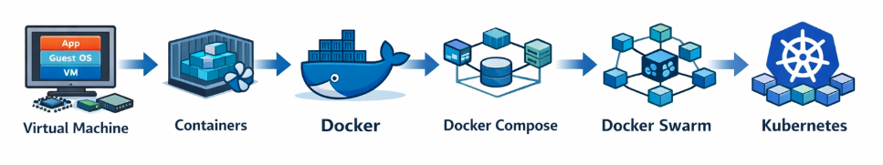

# 들어가며 : 컨테이너 기술의 발전 흐름

  

현대의 애플리케이션 운영 환경은 지속적으로 발전해 왔습니다. 초기에는 하나의 물리 서버에 하나의 애플리케이션을 설치하는 방식이 일반적이었지만, 서버 자원을 효율적으로 활용하기 위해 **Virtual Machine**과 같은 가상화 기술이 등장했습니다. 이후 애플리케이션 실행 환경을 더욱 가볍고 효율적으로 관리하기 위해 Container 기술이 발전하였고, **Docker**는 이러한 컨테이너 기술을 표준화하고 대중화하는 역할을 하였습니다. Docker를 통해 개발자는 애플리케이션과 실행 환경을 하나의 이미지로 패키징하여 어디서든 동일하게 실행할 수 있게 되었습니다.

하지만 애플리케이션이 점점 복잡해지고 컨테이너의 수가 증가하면서, 단일 컨테이너 실행을 넘어 여러 컨테이너를 함께 관리하고 여러 서버에 걸쳐 운영할 수 있는 기술이 필요하게 되었습니다. 이러한 흐름 속에서 **Docker Compose, Docker Swarm, 그리고 Kubernetes**와 같은 컨테이너 관리 및 오케스트레이션 기술들이 등장하게 됩니다. 

다음 문서인 **AboutDocker.md**에서는 이러한 흐름 중 Docker와 컨테이너 기술의 핵심 개념을 이해하기 위해 Virtual Machine부터 Container, 그리고 Docker의 구조와 동작 방식까지를 살펴봅니다.