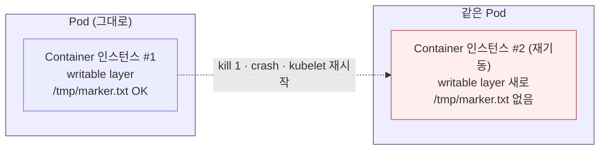
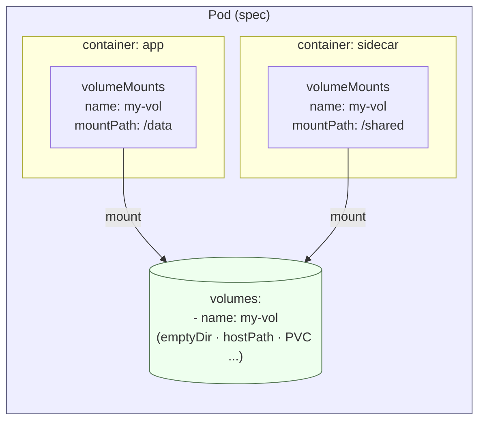
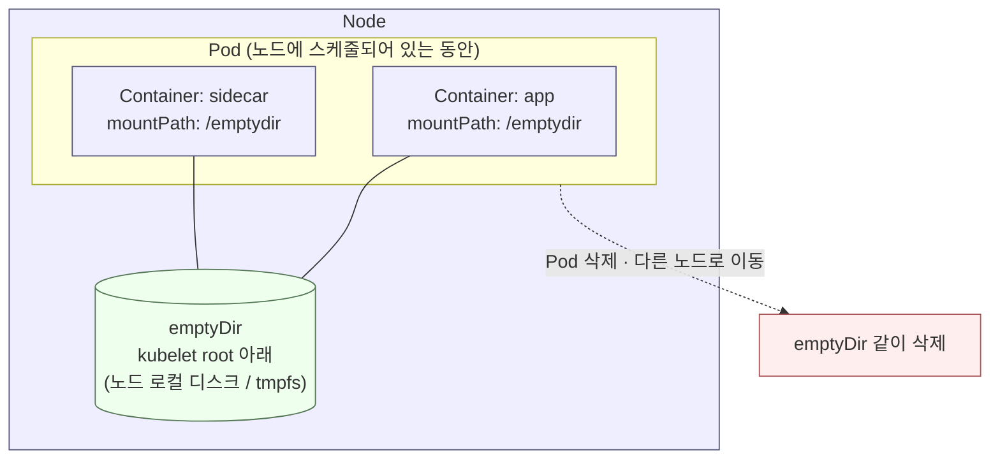
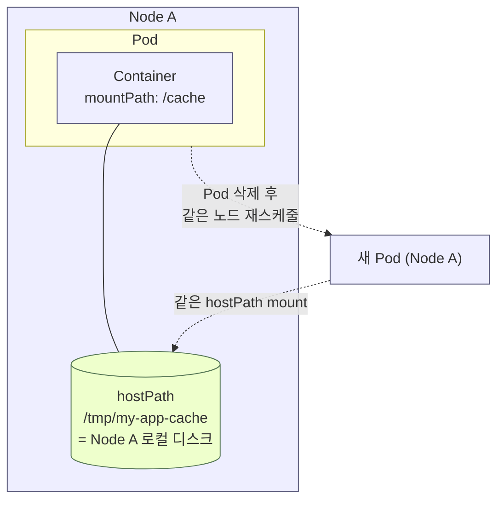
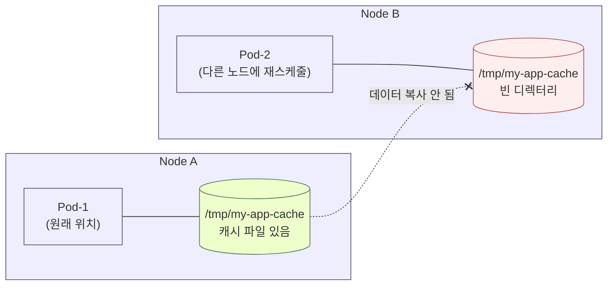
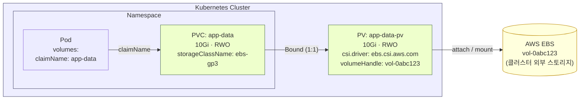

# Volume · Sidecar · PV · StorageClass
---

## 목차

1. [스토리지가 필요한 이유](#1-스토리지가-필요한-이유)
2. [컨테이너의 writable layer](#2-컨테이너의-writable-layer)
3. [Pod에 Volume 붙이기](#3-pod에-volume-붙이기)
4. [emptyDir](#4-emptydir)
5. [컨테이너 간 Volume 공유 — Sidecar 패턴](#5-컨테이너-간-volume-공유--sidecar-패턴)
6. [hostPath, PV/PVC, StorageClass](#6-hostpath-pvpvc-storageclass)
   - [6.1 hostPath — 노드 디스크에 붙이기](#61-hostpath--노드-디스크에-붙이기)
   - [6.2 외부 스토리지와 PV / PVC](#62-외부-스토리지와-pv--pvc)
   - [6.3 동적 프로비저닝](#63-동적-프로비저닝)
   - [6.4 스토리지 선택 가이드](#64-스토리지-선택-가이드)

---

## 1. 스토리지가 필요한 이유

실제 서비스에는 **상태(state)** 가 필요합니다. 로그 파일, 업로드 파일, **DB 데이터 디렉터리** 등은 Pod나 컨테이너가 재시작·이동해도 **남아 있어야** 합니다.

---

## 2. 컨테이너의 writable layer

### 컨테이너 안에 쓴 파일은 어디에 있나

컨테이너 이미지는 **읽기 전용 레이어**로 쌓이고, 실행 중 쓰기는 **writable layer(쓰기 계층)** 에 일어납니다.  
`/tmp/marker.txt`처럼 **Volume 마운트 없이** 컨테이너 경로에만 쓰면, 데이터는 **그 컨테이너 인스턴스**에 묶입니다. Pod는 그대로여도 **컨테이너만 교체**되면 파일이 없어질 수 있습니다.



컨테이너 **이미지 레이어**는 읽기 전용이고, 실행 중 만든 변경분은 **그 인스턴스의 writable layer**에만 쌓입니다. 인스턴스가 새로 만들어지면 그 변경분은 사라집니다.

### 예시 Deployment: `writable-demo`

Sidecar 실습에서 쓰는 이미지 계열(`busybox:stable`)로, **Volume 없이** 단일 컨테이너만 둡니다.

```yaml
# writable-demo.yaml — 데모용 (apply 후 실험 끝나면 delete 해도 됨)
apiVersion: apps/v1
kind: Deployment
metadata:
  name: writable-demo
  namespace: default
  labels:
    app: writable-demo
spec:
  replicas: 1
  selector:
    matchLabels:
      app: writable-demo
  template:
    metadata:
      labels:
        app: writable-demo
    spec:
      containers:
        - name: app
          image: busybox:stable
          command: ["sleep", "infinity"]
```

| 항목 | 의도 |
| --- | --- |
| `busybox:stable` | 이후 `4.Sidecar` Sidecar 이미지와 같은 계열 |
| Volume 없음 | writable layer만 쓰는 상태를 분리해서 보기 위함 |
| `sleep infinity` | Pod를 유지한 채 `kubectl exec`로 실험 |

### hands-on: 파일 쓰기 → 컨테이너 재시작 → 파일 소실

```bash
kubectl apply -f writable-demo.yaml

# 1) writable layer에 마커 파일 생성
kubectl exec deploy/writable-demo -- sh -c \
  'echo "storage-lab-writable" > /tmp/marker.txt && cat /tmp/marker.txt'

# 2) 재시작 전 container ID 기록
kubectl get pod -l app=writable-demo \
  -o jsonpath='before={.items[0].status.containerStatuses[0].containerID}{"\n"}'

# 3) 메인 프로세스(PID 1) 종료 → kubelet이 같은 Pod 안에서 컨테이너만 재시작
kubectl exec deploy/writable-demo -- sh -c 'kill 1'
sleep 3
kubectl wait --for=condition=Ready pod -l app=writable-demo --timeout=60s

# 4) 재시작 후 container ID 비교 (값이 바뀌어야 함)
kubectl get pod -l app=writable-demo \
  -o jsonpath='after={.items[0].status.containerStatuses[0].containerID}{"\n"}'

# 5) 마커 파일 확인 — 없거나 읽기 실패면 writable layer가 초기화된 것
kubectl exec deploy/writable-demo -- cat /tmp/marker.txt
# cat: can't open '/tmp/marker.txt': No such file or directory
```

### 왜 Volume이 필요한가

DB 데이터(`/var/lib/mysql`), 공유 로그, 캐시처럼 **컨테이너 재시작·교체 후에도** 남겨야 하는 내용은 writable layer가 아니라 Pod `spec.volumes` + `volumeMounts`로 붙입니다. [3절](#3-pod에-volume-붙이기)부터 그 방법을 봅니다.

---

## 3. Pod에 Volume 붙이기

### Volume은 Pod 스펙의 일부

Volume은 **Pod `spec.volumes`** 에 선언하고, 각 컨테이너의 `**volumeMounts**` 로 연결합니다. Deployment를 쓰더라도 실제 마운트 정의는 **Pod 템플릿** 안에 들어갑니다.



Volume은 **Pod 단위로 한 번 선언**되고, 각 컨테이너는 같은 `name`을 골라 **자기 경로**에 붙입니다. 같은 `name`을 쓰면 **같은 디렉터리**를 공유합니다.

```yaml
# 개념 구조
spec:
  containers:
    - name: app
      volumeMounts:
        - name: my-vol
          mountPath: /data
  volumes:
    - name: my-vol
      # emptyDir, hostPath, persistentVolumeClaim 등
```

| 필드 | 의미 |
| --- | --- |
| `volumes[].name` | Pod 안에서 부르는 **별칭** |
| `volumeMounts[].name` | 위 별칭과 **짝** |
| `volumeMounts[].mountPath` | 컨테이너 **안** 경로 |

컨테이너 런타임이 아니라 **Pod 스펙**이 “어떤 저장소를 쓸지”를 선언합니다.

```text
[1] 쿠버네티스 (API 서버 + 스케줄러 + 노드의 kubelet)
      → Pod YAML의 volumes, volumeMounts를 읽음
      → 스토리지를 준비·마운트한 뒤 컨테이너를 띄우라고 지시

[2] 컨테이너 런타임 (containerd)
      → 이미지로 컨테이너 프로세스 시작
      → “이 컨테이너에는 이런 마운트가 있다”는 상태를 전달받아 실행
```

### 많이 쓰이는 3가지 volumes

| Pod `spec.volumes` 타입 | 실제 데이터가 저장되는 곳 | 수명(언제까지 유지?) | 대표 용도 | 핵심 제약 |
| --- | --- | --- | --- | --- |
| `**emptyDir**` | **노드(Node)** 의 로컬 저장소(디스크 또는 tmpfs) | **Pod가 노드에 붙어 있는 동안**. Pod 삭제/이동 시 제거 | Pod 내부 컨테이너 간 공유, 임시 파일/캐시, sidecar 로그 공유 | Pod 단위 휘발. 영구 데이터(DB) 부적합 |
| `**hostPath**` | **노드(Node)** 의 지정한 파일/디렉터리 경로 | 노드의 경로가 살아 있는 동안(= Pod 삭제 후에도 남을 수 있음) | 노드 로그/특정 파일 접근, 로컬 캐시(실습/단일 노드) | **특정 노드에 종속**, **보안 취약성**(과도한 마운트), 멀티 노드에 부적합 |
| `**persistentVolumeClaim**` | **Pod 밖**의 영구 스토리지(PV가 가리키는 백엔드: NFS/EBS/hostPath/… ) | PVC/PV 정책에 따라. 보통 Pod 교체 후에도 유지 | DB/업로드/상태 저장(영구 데이터) | PV/PVC 바인딩 조건(용량/모드/SC), 프로비저너/정책에 영향 |

---

## 4. emptyDir

### emptyDir이란

**emptyDir**는 Pod가 노드에 **스케줄될 때** 생성되는 **빈 디렉터리**입니다. 같은 Pod의 **여러 컨테이너가 공유**할 수 있습니다. Pod가 노드에서 **제거되면** emptyDir도 **삭제**됩니다.



- **컨테이너만 재시작**되면 같은 Pod이므로 emptyDir은 **유지** (writable layer와 차이)
- **Pod 자체**가 노드에서 제거되면 emptyDir 디렉터리도 함께 **삭제**

### 예시 Deployment: `emptydir-demo`

```yaml
# emptydir-demo.yaml — 데모용 (apply 후 실험 끝나면 delete 해도 됨)
apiVersion: apps/v1
kind: Deployment
metadata:
  name: emptydir-demo
  namespace: default
  labels:
    app: emptydir-demo
spec:
  replicas: 1
  selector:
    matchLabels:
      app: emptydir-demo
  template:
    metadata:
      labels:
        app: emptydir-demo
    spec:
      containers:
        - name: app
          image: busybox:stable
          command: ["sleep", "infinity"]
          volumeMounts:
            - name: emptydir-vol
              mountPath: /emptydir
      volumes:
        - name: emptydir-vol
          emptyDir: {}
```

| 항목 | 의도 |
| --- | --- |
| `busybox:stable` | [2절](#2-컨테이너의-writable-layer) `writable-demo`와 동일 이미지 계열 |
| `emptydir-vol` + `/emptydir` | Sidecar 실습의 `data` + `/data`와 구분 |
| `emptyDir: {}` | Pod가 노드에 붙어 있는 동안만 유지되는 공유 디렉터리 |
| `emptyDir.medium: Memory` | (선택) tmpfs(RAM) — [6절](#6-hostpath-pvpvc-storageclass)에서 언급 |

### emptyDir의 “실제 경로” 예시

- 컨테이너 안에서는 `volumeMounts.mountPath`로 보임 → 위 예시에선 `/emptydir`
- 노드(호스트)에서는 kubelet 데이터 디렉터리 아래에 생성됨(기본값 기준):

```text
/var/lib/kubelet/pods/<pod-uid>/volumes/kubernetes.io~empty-dir/<volume-name>/
```

위 예시 YAML 기준으로는 `<volume-name>` = `emptydir-vol` 입니다. (환경에 따라 kubelet root dir는 다를 수 있음)

### hands-on: `emptydir-demo` — 마커 쓰기 → 컨테이너 재시작 → 유지 + 노드 경로 확인

```bash
kubectl apply -f emptydir-demo.yaml

# 1) emptyDir(/emptydir)에 마커 파일 생성
kubectl exec deploy/emptydir-demo -- sh -c \
  'echo "storage-lab-emptydir" > /emptydir/marker.txt && cat /emptydir/marker.txt'

# 2) 재시작 전 container ID 기록
kubectl get pod -l app=emptydir-demo \
  -o jsonpath='before={.items[0].status.containerStatuses[0].containerID}{"\n"}'

# 3) 메인 프로세스(PID 1) 종료 → kubelet이 같은 Pod 안에서 컨테이너만 재시작
kubectl exec deploy/emptydir-demo -- sh -c 'kill 1'
sleep 3
kubectl wait --for=condition=Ready pod -l app=emptydir-demo --timeout=60s

# 4) 재시작 후 container ID 비교 (값이 바뀌어야 함)
kubectl get pod -l app=emptydir-demo \
  -o jsonpath='after={.items[0].status.containerStatuses[0].containerID}{"\n"}'

# 5) 컨테이너 안: emptyDir의 marker.txt 는 유지 (writable layer와 대비)
kubectl exec deploy/emptydir-demo -- cat /emptydir/marker.txt

# 6) 노드(호스트): kubelet 아래 emptyDir 실제 경로에서도 동일 내용 확인
POD=$(kubectl get pod -l app=emptydir-demo -o jsonpath='{.items[0].metadata.name}')
NODE=$(kubectl get pod "$POD" -o jsonpath='{.spec.nodeName}')
UID=$(kubectl get pod "$POD" -o jsonpath='{.metadata.uid}')
HOSTPATH="/var/lib/kubelet/pods/${UID}/volumes/kubernetes.io~empty-dir/emptydir-vol"
echo "POD=${POD} NODE=${NODE}"
echo "HOSTPATH=${HOSTPATH}"

# 노드 SSH 가능할 때
ssh "$NODE" "sudo ls -l ${HOSTPATH}/ && sudo cat ${HOSTPATH}/marker.txt"

# SSH 없을 때 (노드 디버그; 클러스터 권한 필요)
kubectl debug "node/${NODE}" -it --image=busybox --profile=general -- \
  chroot /host sh -c "ls -l ${HOSTPATH}/ && cat ${HOSTPATH}/marker.txt"

# 7) (선택) 실험 종료 후 정리
kubectl delete -f emptydir-demo.yaml
```

**정리**

| 구분 | writable layer (`/tmp/marker.txt`) | emptyDir (`/emptydir/marker.txt`) |
| --- | --- | --- |
| 컨테이너 재시작 | 사라짐 | **유지** (같은 Pod) |
| Pod 삭제·재생성 | — | **삭제** |

emptyDir는 **스크래치 공간**, **체크포인트**, **사이드카와 메인 컨테이너 간 공유**에 적합합니다. **Pod가 사라지면 같이 사라지므로 DB 본 데이터 저장소로는 부적합**합니다. → 다음 [5절·Sidecar 실습](#5-컨테이너-간-volume-공유--sidecar-패턴)에서 공유 패턴을 직접 구성합니다.

---

## 5. 컨테이너 간 Volume 공유 — Sidecar 패턴

**한 Pod·두 컨테이너**가 **emptyDir**로 디렉터리를 공유하는 Sidecar 패턴을 다룹니다.

**WordPress + busybox** 실습(LabSetUp, 과제, 해답, 확인 명령)은 아래 문서에 정리했습니다.

→ `[4.Sidecar/Preliminaries.md](../4.Sidecar/Preliminaries.md)`

---

## 6. hostPath, PV/PVC, StorageClass

**emptyDir**는 Pod 안 공유·임시 캐시에는 적합하지만, **Pod 삭제·재생성 후에도** 데이터를 남기려면 부족합니다. **Pod가 삭제돼도 남는** 저장소가 필요하면 **hostPath → 영구 볼륨 → 동적 프로비저닝** 순으로 살펴봅니다.

---

### 6.1 hostPath — 노드 디스크에 붙이기

#### Pod에서 노드 경로 마운트

`hostPath`는 **특정 노드의 로컬 경로**를 Pod에 붙입니다. emptyDir과 달리 데이터는 **노드 디스크**에 남습니다.



```yaml
volumeMounts:
  - name: cache-volume
    mountPath: /cache
volumes:
  - name: cache-volume
    hostPath:
      path: /tmp/my-app-cache
      type: DirectoryOrCreate   # 없으면 디렉터리 생성
```

| `hostPath.type` | 동작 |
| --- | --- |
| `DirectoryOrCreate` | 경로 없으면 빈 디렉터리 생성 |
| `Directory` | 이미 있어야 함 |

**hostPath의 의미**

- 데이터는 **노드의 실제 경로**(`/tmp/my-app-cache` 등)에 저장됨
- Pod가 **같은 노드**에 다시 스케줄되면 파일·캐시 **유지** 가능
- Pod가 **다른 노드**로 가면, 그 노드의 같은 경로를 봄 → 내용이 **다르거나 비어 있음** → **노드 종속**

#### Pod가 죽고 다른 노드에 Replica가 뜨면?

hostPath는 **노드마다 디스크가 따로**이므로, 스케줄러가 Pod를 **어느 노드에 올리느냐**에 따라 보이는 데이터가 달라집니다.



| Case | 결과 |
| --- | --- |
| Pod 재생성 → **같은 Node A** 로 스케줄 | `/tmp/my-app-cache` 캐시 **유지** |
| Pod 재생성 → **다른 Node B** 로 스케줄 | Node B의 빈 디렉터리만 보임 → 이전 캐시 안 보임 |

| 상황 | hostPath 데이터 |
| --- | --- |
| 같은 노드에 Pod 재생성 | 이전 노드 경로의 파일 **그대로** |
| **다른 노드**에 Replica/Pod 생성 | 그 노드 로컬 경로만 보임 → **이전 캐시 없음** |
| Deployment `replicas: 2` (노드 2개에 분산) | 노드마다 **서로 다른** hostPath → 공유 캐시 아님 |

쿠버네티스는 hostPath 데이터를 **노드 간에 복사·이동하지 않습니다.**  
멀티 노드에서 “Pod가 어디로 가든 같은 데이터”가 필요하면 hostPath가 아니라 **NFS·EBS 등 + PV/PVC**(또는 공유 파일시스템)를 씁니다.

> 단일 노드 실습(Killercoda 등)에서는 노드가 하나라 “다른 노드로 이동”이 잘 안 보이지만, 프로덕션·멀티 노드 클러스터에서는 위 한계가 바로 드러납니다.

#### hostPath의 보안 취약성 — 노드 전체 노출

hostPath는 **편리하지만 보안 취약성**이 큽니다. 마운트 범위를 넓히면 Pod(또는 침해된 컨테이너)가 **노드 호스트 파일시스템**에 가까이 접근할 수 있습니다.

아래는 **극단적 예**입니다. Deployment 이름만 `hostpath-insecure-demo`로 둔 요지입니다.

```yaml
# hostpath-insecure-demo.yaml — 보안 취약성 설명용 (프로덕션 금지)
apiVersion: apps/v1
kind: Deployment
metadata:
  name: hostpath-insecure-demo
spec:
  replicas: 1
  selector:
    matchLabels:
      app: hostpath-insecure-demo
  template:
    metadata:
      labels:
        app: hostpath-insecure-demo
    spec:
      containers:
        - name: app
          image: busybox:stable
          command: ["sleep", "infinity"]
          volumeMounts:
            - name: node-root
              mountPath: /node-root
      volumes:
        - name: node-root
          hostPath:
            path: /
            type: Directory
```

```bash
kubectl exec deploy/hostpath-insecure-demo -- ls -l /node-root/var/log
kubectl exec deploy/hostpath-insecure-demo -- whoami
# root — 노드 루트(/) 마운트 시 보안 취약성 극대화
```

**보안 취약성 요약**

| 설정 | 취약점 |
| --- | --- |
| `hostPath.path: /` | 노드의 거의 모든 파일·설정·자격 증명 경로 노출 가능 |
| 컨테이너 `root` + 쓰기 가능 마운트 | 호스트 파일 **변조·삭제** 가능 |
| 멀티 테넌트 클러스터 | 한 Pod 침해 → **같은 노드**의 hostPath·호스트 데이터 위협 |

**교훈**: hostPath는 **필요한 디렉터리만**, 가능하면 **readOnly**로 제한. 프로덕션·멀티 테넌트에서는 **보안 취약성** 때문에 기본적으로 비권장(Pod Security·정책으로 제한하는 경우가 많음).

#### hands-on: emptyDir vs hostPath 캐시 비교

→ `[cache-demo.md](cache-demo.md)` (실행: `[cache-demo.bash](cache-demo.bash)`)

---

### 6.2 외부 스토리지와 PV / PVC

지금까지 **emptyDir**(Pod 수명) → **hostPath**(노드 로컬 디스크)로 “Pod 밖에 데이터를 두는” 방법을 봤습니다.  
그러나 **hostPath로는 아래 문제를 근본적으로 해결할 수 없습니다.**

| hostPath로 해결되지 않는 요구 | 이유 |
| --- | --- |
| Pod가 **다른 노드**로 옮겨져도 같은 데이터 | 데이터는 **특정 노드 디스크**에만 있음 |
| **여러 노드**의 Pod가 **같은** DB·파일 공유 | 노드마다 hostPath가 **분리**됨 |
| 노드 장애·교체 후에도 **클러스터 차원**에서 데이터 유지 | hostPath는 **그 노드에 묶임** |
| 프로덕션에서 안전한 **멀티 테넌트** 스토리지 | **보안 취약성**, 정책상 제한 |

그래서 쿠버네티스는 **클러스터 밖(또는 클러스터가 관리하는) 외부 스토리지**—EBS, NFS, Azure Disk 등—를 쓰고,  
앱과 인프라 사이에 **PV / PVC** 추상화를 둡니다. **Pod가 어느 노드에 가든(또는 재생성돼도)** 필요한 용량·접근 모드로 스토리지를 붙이기 위함입니다.

```text
emptyDir  →  Pod와 함께 사라짐
hostPath  →  한 노드에 묶임, 멀티 노드·이동·공유에 한계
PV / PVC  →  Pod 밖 스토리지 풀, 스케줄·바인딩으로 “요청”과 “실제 볼륨” 분리
```

#### 클라우드·온프레미스 백엔드

| 환경 | 예시 백엔드 |
| --- | --- |
| AWS EKS | EBS |
| Azure AKS | Azure Disk, Azure Files |
| 온프레미스 | **NFS**, GlusterFS 등 |

Pod마다 EBS/NFS 세부사항을 Pod YAML에 직접 넣기 어렵기 때문에, 쿠버네티스는 **PV(공급)** 와 **PVC(요청)** 로 나눕니다.



- **Pod**는 `claimName`만 알고, PV·EBS ID·CSI 드라이버는 모름
- **PVC**는 "용량·accessMode·StorageClass" 같은 **요구**만 명시
- **PV**가 실제 백엔드(EBS·NFS·CSI)에 연결되어 Pod에 attach·mount

#### PersistentVolume (PV) — 스토리지 **공급**

**PersistentVolume**은 **클러스터 스코프** 리소스입니다. “이 클러스터에서 쓸 수 있는 저장소 **한 덩어리**”를 **관리자·인프라**가 미리 등록합니다.  
아래는 **AWS EBS 볼륨을 미리 만든 뒤** PV로 등록하는 **수동(정적)** 예입니다. Pod YAML에는 EBS ID·리전·CSI 드라이버를 적지 않습니다.

```yaml
# app-data-pv.yaml — EBS 수동(정적) PV (관리자가 미리 등록)
apiVersion: v1
kind: PersistentVolume
metadata:
  name: app-data-pv
  labels:
    app: app-data
spec:
  capacity:
    storage: 10Gi
  accessModes:
    - ReadWriteOnce          # EBS는 RWO (한 노드·한 Pod에 attach)
  persistentVolumeReclaimPolicy: Retain
  storageClassName: ebs-gp3   # PVC storageClassName과 맞춰야 바인딩
  csi:
    driver: ebs.csi.aws.com
    volumeHandle: vol-0abc123def456   # AWS에 이미 존재하는 EBS volume ID
    fsType: ext4
```

| 항목 | 설명 |
| --- | --- |
| 수명 | Pod와 **분리**. Pod가 삭제돼도 PV(및 Retain 시 EBS 데이터)는 남을 수 있음 |
| 백엔드 | **EBS** — `csi.volumeHandle`이 가리키는 AWS 디스크 |
| 스펙 | `capacity`, `accessModes`, `storageClassName`, `persistentVolumeReclaimPolicy` |
| 생성 방식 | **수동(정적)**: EBS 생성 후 PV YAML 등록 / **동적**: PVC만 만들면 Provisioner가 EBS·PV 생성 |

| 필드 | 의미 |
| --- | --- |
| `capacity.storage` | PV가 제공하는 용량 (EBS 크기 이하) |
| `accessModes` | EBS 블록 볼륨은 보통 **ReadWriteOnce** |
| `persistentVolumeReclaimPolicy` | PVC 삭제 시 **Retain**(EBS 유지) vs **Delete**(EBS 삭제) |
| `storageClassName` | PVC와 **같은 이름**이면 바인딩 후보 |
| `csi.driver` | EBS CSI 드라이버 (`ebs.csi.aws.com`) |
| `csi.volumeHandle` | 실제 **EBS volume ID** |

#### PersistentVolumeClaim (PVC) — 스토리지 **요청**

**PersistentVolumeClaim**은 **네임스페이스 스코프** 리소스입니다. 워크로드(개발자)가 “**이만큼**, **이 accessMode**로, (선택) **이 StorageClass**로” 스토리지를 **달라**고 요청합니다.

```yaml
# app-data-pvc.yaml — EBS PVC 예 (개발자·워크로드가 요청)
apiVersion: v1
kind: PersistentVolumeClaim
metadata:
  name: app-data
  namespace: default
spec:
  accessModes:
    - ReadWriteOnce
  storageClassName: ebs-gp3     # 동적: SC가 EBS 생성 / 정적: PV와 이름 일치
  resources:
    requests:
      storage: 10Gi             # PV capacity 이하로 요청
```

Pod는 PVC 이름만 참조합니다.

```yaml
# Deployment 일부 — Pod가 PVC를 쓰는 방법
spec:
  template:
    spec:
      containers:
        - name: app
          volumeMounts:
            - name: data-storage
              mountPath: /data
      volumes:
        - name: data-storage
          persistentVolumeClaim:
            claimName: app-data    # PVC metadata.name (PV·EBS ID 아님)
```

| 항목 | 설명 |
| --- | --- |
| 수명 | 보통 이 PVC를 쓰는 Pod·Deployment와 함께 관리 |
| 스펙 | `resources.requests.storage`, `accessModes`, `storageClassName` |
| 바인딩 | 조건이 맞는 PV 하나와 **1:1로 Bound** → EBS가 Pod에 attach |

| 필드 | 의미 |
| --- | --- |
| `resources.requests.storage` | 요청 용량 (EBS/PV capacity 이하) |
| `accessModes` | **ReadWriteOnce** — EBS 블록 볼륨과 맞춤 |
| `storageClassName` | **ebs-gp3** 등 — 어떤 EBS 정책으로 볼륨을 받을지 |

Pod는 `volumes.persistentVolumeClaim.claimName`으로 **PVC 이름만** 참조합니다. **PV 이름·EBS volume ID는 Pod에 적지 않습니다.**

```text
[관리자]  EBS 생성 → PV 등록 (용량·volumeHandle·정책)
[개발자]  PVC 생성 (요청)
            ↓  바인딩 (용량·accessMode·StorageClass 일치)
[Pod]     claimName → PVC → PV → EBS (vol-xxxx)
```

#### StorageClass — “볼륨을 어떻게 만들지” 규칙

**StorageClass**는 “PVC 요청이 들어오면, **EBS CSI Provisioner**가 **어떤 정책**으로 EBS·PV를 **자동 생성(동적 프로비저닝)** 할지”를 정의하는 리소스입니다.

```yaml
# storageclass-ebs-gp3.yaml — EBS 동적 프로비저닝 규칙
apiVersion: storage.k8s.io/v1
kind: StorageClass
metadata:
  name: ebs-gp3
  annotations:
    storageclass.kubernetes.io/is-default-class: "true"
provisioner: ebs.csi.aws.com
parameters:
  type: gp3
  encrypted: "true"
reclaimPolicy: Delete
volumeBindingMode: WaitForFirstConsumer   # Pod가 올 노드(AZ)에 맞춰 EBS attach
allowVolumeExpansion: true
```

| 구분 | 의미 |
| --- | --- |
| StorageClass | EBS 볼륨 생성 **정책/클래스** (`type`, `reclaimPolicy`, `volumeBindingMode` 등) |
| Provisioner | **ebs.csi.aws.com** — PVC 요청 시 EBS를 만들고 PV를 자동 생성 |

| 필드 | 의미 |
| --- | --- |
| `metadata.name` | PVC `storageClassName`에 적는 값 (예: `ebs-gp3`) |
| `provisioner` | **EBS CSI** — AWS API로 EBS 볼륨 생성 |
| `parameters.type` | EBS 타입 (**gp3**, gp2, io2 등) |
| `reclaimPolicy` | PVC 삭제 시 EBS·PV **Delete** / **Retain** |
| `volumeBindingMode` | **WaitForFirstConsumer**: Pod 스케줄 후 해당 AZ에 EBS 생성·attach |
| `is-default-class` annotation | `"true"`인 SC 하나 — PVC에 SC 생략 시 **ebs-gp3** 적용 |

중요한 점은, **PV/PVC는 StorageClass 없이도(수동 EBS PV) 동작**한다는 것입니다.  
다만 운영에서는 EBS를 매번 수동으로 만들기 어렵기 때문에, 보통 **StorageClass + EBS CSI**로 자동 생성합니다([6.3](#63-동적-프로비저닝)에서 자세히).

---

### 6.3 동적 프로비저닝

수동으로 PV YAML을 올리지 않고, **PVC만** 만들면 컨트롤러가 PV를 생성합니다.

여기서 **StorageClass는 “동적으로 만들 PV(그리고 실제 스토리지)를 어떤 드라이버로, 어떤 정책으로 만들지”를 결정하는 규칙**입니다.

- **PVC는 “무엇이 필요하다(용량/접근 모드/선택: StorageClass)”**만 말합니다.
- **StorageClass는 “어떻게 만들 것인가(어떤 provisioner + 어떤 파라미터/정책)”**를 말합니다.
- **Provisioner(CSI 등)** 는 그 규칙대로 실제 백엔드 볼륨을 만들고, 대응되는 PV를 자동 생성해 PVC에 바인딩합니다.

```text
[PVC 생성]  storageClassName 지정(또는 기본 SC 적용)
      ↓
[StorageClass 선택]  provisioner + parameters + 정책(reclaimPolicy 등)
      ↓
[Provisioner]  실제 볼륨 생성 + PV 자동 생성
      ↓
[PVC Bound]  Pod는 claimName으로 PVC만 참조
```

```yaml
# postgres-persistentVolumeClaim-dynamic.yaml
metadata:
  name: postgres-pvc-dynamic
spec:
  accessModes:
    - ReadWriteOnce
  resources:
    requests:
      storage: 100Mi
  # storageClassName 생략 → 기본 StorageClass 사용
```

```bash
kubectl apply -f todo-list/postgres-persistentVolumeClaim-dynamic.yaml
kubectl get pvc
kubectl get pv
# NAME: pvc-<uuid>  STORAGECLASS: hostpath  등

kubectl delete pvc postgres-pvc-dynamic
kubectl get pv
# ReclaimPolicy: Delete 이면 PV도 사라짐
```

**주요 필드**

| 필드 | 설명 |
| --- | --- |
| `provisioner` | 볼륨을 실제로 만드는 플러그인 |
| `reclaimPolicy` | PVC 삭제 시 PV·데이터 **Retain** vs **Delete** |
| `volumeBindingMode` | **Immediate** vs **WaitForFirstConsumer** |
| `storageclass.kubernetes.io/is-default-class` | PVC에 SC 미지정 시 기본값 |

**volumeBindingMode**

| 값 | 동작 |
| --- | --- |
| `Immediate` | PVC 생성 직후 PV 할당 (Pod 스케줄 전) |
| `WaitForFirstConsumer` | **Pod가 배치될 노드가 정해진 뒤** 해당 노드에 맞게 바인딩 |

로컬 디스크·local-path 프로비저너는 후자가 흔합니다.

#### 기본 StorageClass

PVC에서 `storageClassName`을 생략하면 **annotation이 `"true"`인 SC 하나**가 적용됩니다. 여러 개가 default이면 안 됩니다.

---

### 6.4 스토리지 선택 가이드

운영에서 “어떤 스토리지를 쓸까?”는 결국 **워크로드 요구사항을 먼저 정리**하고, 그 요구를 만족하는 **백엔드 + StorageClass 정책**을 고르는 문제입니다.

#### 1) 선택에 고민해야할 사항들

- **데이터가 반드시 남아야 하나?**
  - 아니면 `emptyDir`도 충분 (캐시/임시파일)
  - 남아야 하면 PV/PVC(+ 백엔드 스토리지)로
- **Pod가 다른 노드로 이동해도 같은 데이터를 봐야 하나?**
  - 필요하면 `hostPath/local`은 부적합(노드 종속) → 네트워크/클라우드 볼륨 고려
- **동시에 여러 Pod/노드에서 같은 볼륨을 써야 하나?**
  - 필요하면 보통 **RWX** 지원이 필요(NFS/파일 스토리지 계열)
  - 단일 노드/단일 Pod 중심 DB는 보통 **RWO**(블록 스토리지 계열)로 충분
- **성능이 중요한가, 가용성이 중요한가?**
  - “빠른 로컬”은 대체로 노드 종속(장애에 취약)
  - “복제/분산”은 대체로 네트워크 비용이 있지만 장애에 강함

#### 2) 흔한 선택 패턴

| 요구 | 흔한 선택(개념) | 비고 |
| --- | --- | --- |
| 캐시/임시, Pod와 함께 삭제 OK | `emptyDir` | 가장 단순, 상태 보존 목적 아님 |
| 학습/데모, “노드에 남기기”만 필요 | `hostPath` / `local` | **노드 종속**이라 운영에는 제한적 |
| 일반적인 단일 DB(1 Pod) 영속 데이터 | RWO 블록 볼륨 + PVC | EBS/Azure Disk/CSI 블록 계열 |
| 여러 Pod에서 파일 공유(업로드/공유 디렉터리) | RWX 파일 볼륨 + PVC | NFS/파일 스토리지 계열 |
| 노드 장애에도 복구를 강하게 | 복제/분산 스토리지 계열 | 스토리지 시스템 설계가 핵심 |

---
