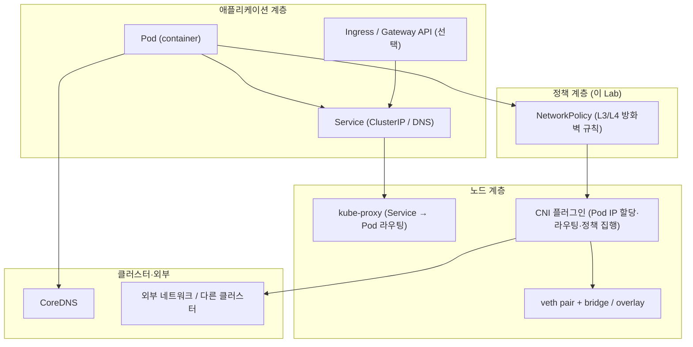

# Network Policy: Preliminaries

`Questions.bash` / `SolutionNotes.bash` 를 풀 때 필요한 개념을 정리합니다.
이 문서는 **(1) Kubernetes 네트워크 기본 구조 → (2) NetworkPolicy 개념·문법 → (3) 이 Lab 풀이** 순서로 읽으면 됩니다.

| 파일 | 역할 |
| --- | --- |
| `LabSetUp.bash` | `frontend` / `backend` NS, Deployment·Service, 후보 NetworkPolicy 3개 생성 |
| `Questions.bash` | `/root/network-policies` 중 **최소 권한** 정책 선택·배포 |
| `SolutionNotes.bash` | policy-1/2/3 비교, 정답은 `network-policy-3.yaml` |

---

## 1. Kubernetes 네트워크 기본 구조

### 1.1 Kubernetes 네트워킹 4대 규칙 (네트워크 모델)

Kubernetes는 네트워크에 대해 **단 4가지 규칙**만 정해 두고, 구현은 CNI에 맡깁니다. 이 규칙을 알면 "왜 Pod끼리 그냥 통신이 되지?"가 이해됩니다.

| # | 규칙 | 의미 |
|---|------|------|
| 1 | **Pod ↔ Pod** | 모든 Pod는 **NAT 없이** 서로의 IP로 직접 통신할 수 있다 |
| 2 | **Node ↔ Pod** | 노드(데몬, kubelet 등)는 그 노드의 모든 Pod와 통신할 수 있다 |
| 3 | **Pod가 보는 자기 IP = 남이 보는 그 Pod의 IP** | Pod 내부에서 본 IP와 외부에서 본 IP가 같다 (NAT로 가려지지 않음) |
| 4 | **격리는 별도 선언** | 위 "전부 연결" 상태에서, 막고 싶으면 **NetworkPolicy로 따로 선언** |

> 즉 Kubernetes의 기본값은 **"모두 평평하게 연결(flat network)"** 입니다. 방화벽(격리)은 기본이 아니라 **opt-in** 입니다. 이 Lab은 바로 그 4번 규칙(격리 선언)을 다룹니다.

### 1.2 IP가 부여되는 단위 — Pod

| 단위 | IP | 비고 |
|------|-----|------|
| **Pod** | 1개 (Pod 내 모든 컨테이너가 **공유**) | 같은 Pod의 컨테이너는 `localhost` 로 통신 |
| **컨테이너** | 별도 IP 없음 | Pod IP + 포트로 구분 |
| **Service** | 가상 IP(ClusterIP) | 실체 없는 VIP, kube-proxy가 Pod로 전달 |
| **Node** | 노드 자체 IP | Pod 네트워크와는 별개 대역 |

```text
Pod (10.244.1.5)
 ├─ container A  ┐
 └─ container B  ┘  →  같은 netns, localhost:port 로 서로 호출, IP 공유
```

### 1.3 패킷이 지나는 계층 (큰 그림)



| 계층 | 담당 | 한 줄 설명 |
|------|------|------------------|
| **Pod IP / 라우팅** | CNI | Pod마다 고유 IP 부여, 노드 간 경로 제공 (12번 Lab) |
| **Service / DNS** | kube-proxy + CoreDNS | 안정적인 이름·VIP 제공 → 최종은 Pod IP로 전달 |
| **NetworkPolicy** | CNI가 **지원·집행** | 이 Lab의 핵심 — **누가 누구에게** 트래픽 허용할지 |
| **Ingress / Gateway** | Ingress Controller | 외부→클러스터 L7 라우팅 (이 Lab 범위 밖) |

> **핵심:** NetworkPolicy는 API에 **규칙을 선언**할 뿐이고, 실제 패킷을 막는 것은 **CNI(데이터플레인)** 입니다. CNI가 정책 집행을 지원하지 않으면 `kubectl apply` 해도 트래픽은 그대로 통과합니다. (→ 12번 Lab에서 Calico를 설치하는 이유)

### 1.4 클러스터 DNS 이름 규칙

NetworkPolicy를 이해하려면 Service 이름 해석을 알아야 합니다.

```text
<service>.<namespace>.svc.cluster.local
예) backend-service.backend.svc.cluster.local
    └ 같은 NS면 backend-service 만으로도 접근
    └ 다른 NS면 backend-service.backend 까지 필요
```

```bash
# frontend NS의 Pod 에서 backend NS의 Service 호출
kubectl exec -n frontend deploy/frontend-deployment -- \
  curl -s http://backend-service.backend
```

---

## 2. Pod 간 통신 — 정책이 없을 때 (기본값)

CNI가 설치되어 있고 NetworkPolicy가 **없거나**, 대상 Pod를 **선택(select)하지 않으면**:

```text
기본: 클러스터 내 모든 Pod ↔ 모든 Pod 통신 허용 (All-to-All)
```

같은 노드·다른 노드 모두 Pod IP로 직접 통신합니다(1.1의 규칙 1).

```bash
# frontend Pod 안에서 backend Service 호출 (LabSetUp 이후)
kubectl exec -n frontend deploy/frontend-deployment -- \
  curl -s -o /dev/null -w "%{http_code}\n" http://backend-service.backend
# 200 (정책 적용 전 — 기본 전체 허용)
```

---

## 3. NetworkPolicy란

**NetworkPolicy** 는 Pod(또는 Pod 그룹)에 대한 **L3/L4 방화벽 규칙**을 선언하는 Kubernetes 리소스입니다.

- **Ingress** — Pod로 **들어오는** 트래픽 허용 규칙
- **Egress** — Pod에서 **나가는** 트래픽 허용 규칙
- OSI 7계층 중 **L3(IP)·L4(포트/프로토콜)** 수준 (HTTP path·Host 헤더 같은 L7은 다루지 않음 → 그건 Ingress/Gateway/서비스메시 영역)

```text
NetworkPolicy (선언)  →  CNI/데이터플레인 (집행)  →  iptables / eBPF 등
```

### 3.1 가장 중요한 동작 원리 — "선택되면 default-deny"

이 한 가지가 NetworkPolicy 전체를 좌우합니다.

```text
어떤 Pod가 정책의 podSelector에 의해 "선택(select)" 되는 순간,
  → 그 Pod의 해당 방향(Ingress/Egress)은 "화이트리스트 모드"로 전환된다.
  → 즉, 규칙에 명시적으로 허용한 트래픽만 통과, 나머지는 모두 차단.

어떤 정책에도 선택되지 않은 Pod
  → 기존처럼 전체 허용 (영향 없음)
```

| 상태 | Ingress 결과 |
|------|--------------|
| 어떤 정책에도 안 잡힘 | 전체 허용 |
| 정책에 잡힘 + 허용 규칙에 매칭 | 허용 |
| 정책에 잡힘 + 허용 규칙에 매칭 안 됨 | **차단** |

> 정책은 **누적(additive)** 입니다. 여러 정책이 같은 Pod를 선택하면 **허용 규칙들의 합집합(OR)** 이 됩니다. "거부 규칙"은 없습니다 — 허용을 안 하면 자동으로 거부입니다.

### 3.2 "최소 권한(Least Permissive)" 이란

요구사항(frontend→backend 통신)을 만족하면서 **허용 범위가 가장 좁은** 정책을 고르는 것. 이 Lab 과제의 채점 기준입니다.

| 후보 | 허용 범위 | 평가 |
|------|-----------|------|
| policy-1 | backend NS 전체 Pod에 모든 인그레스 | 너무 넓음 ✗ |
| policy-2 | frontend NS + `172.16.0.0/16` 전체 IP | 불필요한 IP 허용 ✗ |
| **policy-3** | frontend NS의 frontend Pod → backend Pod:80 | **최소 권한** ✓ |

---

## 4. NetworkPolicy 문법

### 4.1 전체 구조

```yaml
apiVersion: networking.k8s.io/v1
kind: NetworkPolicy
metadata:
  name: example
  namespace: backend          # ← 이 NS 안의 Pod에만 적용
spec:
  podSelector:                # ← 정책 대상 Pod (이 NS 안에서 라벨로 선택)
    matchLabels:
      app: backend
  policyTypes:                # ← 어느 방향을 "화이트리스트 모드"로 둘지
  - Ingress
  ingress:                    # ← 허용할 인그레스 규칙 목록
  - from:                     #    누구로부터 (source)
    - namespaceSelector:
        matchLabels:
          kubernetes.io/metadata.name: frontend
    - podSelector:
        matchLabels:
          app: frontend
    ports:                    #    어떤 포트로
    - protocol: TCP
      port: 80
```

### 4.2 주요 필드

| 필드 | 설명 |
|------|------|
| `metadata.namespace` | 정책이 적용되는 **네임스페이스** (정책은 NS 범위 리소스) |
| `spec.podSelector` | 이 NS 안에서 규칙을 받을 Pod. `{}` 이면 **NS 내 모든 Pod** |
| `spec.policyTypes` | `Ingress` / `Egress` 중 화이트리스트로 전환할 방향 |
| `ingress[].from` | 허용 **출처(source)** 목록 |
| `ingress[].ports` | 허용 **프로토콜·포트** (생략 시 모든 포트) |
| `egress[].to` | 허용 **목적지(destination)** 목록 |
| `namespaceSelector` | NS **라벨**로 출처/목적지 NS 제한 |
| `podSelector` (from/to 안) | 출처/목적지 Pod 라벨 제한 |
| `ipBlock` | CIDR 블록으로 출처/목적지 IP 제한 (외부 IP 등) |

> **NS 라벨 팁:** 최신 Kubernetes는 모든 NS에 자동으로 `kubernetes.io/metadata.name: <NS이름>` 라벨을 붙입니다. 따라서 `namespaceSelector` 에 이 라벨을 쓰면 별도 labeling 없이 NS를 특정할 수 있습니다. (이 Lab의 후보 YAML은 `name: frontend` 라벨을 가정하므로, 없다면 `kubectl label ns frontend name=frontend` 필요 — 4.5 참고)

### 4.3 selector 조합 규칙 — OR vs AND (가장 헷갈리는 부분)

`from`(또는 `to`) 아래 **리스트 항목(`-`)이 여러 개**면 → **OR** (하나만 맞아도 허용):

```yaml
ingress:
- from:
  - namespaceSelector: { matchLabels: { kubernetes.io/metadata.name: frontend } }   # 이거나
  - podSelector:       { matchLabels: { app: frontend } }                            # 저거나 (OR)
```

→ "frontend NS의 **모든** Pod" **또는** "(이 backend NS 안의) app=frontend Pod" 둘 다 허용 → 의도보다 넓어짐.

**AND** ("frontend NS **이면서** app=frontend Pod")는 **한 `-` 항목 안에** 두 selector를 함께 둡니다:

```yaml
ingress:
- from:
  - namespaceSelector:               # 한 항목 안에 둘 다 → AND
      matchLabels:
        kubernetes.io/metadata.name: frontend
    podSelector:
      matchLabels:
        app: frontend
```

→ "frontend NS에 있고 동시에 app=frontend 인 Pod" 만 허용. **이 Lab의 policy-3이 이 형태**이고, 그래서 최소 권한입니다.

```text
[-] 가 새로 시작 = OR (출처 후보 추가)
한 [-] 안에 나란히 = AND (조건 교집합)
```

### 4.4 자주 쓰는 패턴 모음

**(a) Default Deny — NS의 모든 Ingress 차단 (기준선)**

```yaml
spec:
  podSelector: {}          # NS 내 모든 Pod
  policyTypes:
  - Ingress                # ingress 규칙 없음 → 전부 차단
```

**(b) Default Deny — Ingress + Egress 모두 차단**

```yaml
spec:
  podSelector: {}
  policyTypes:
  - Ingress
  - Egress
```

**(c) Egress 허용 + DNS 예외 (실무 필수 함정)**

Egress를 막으면 **CoreDNS(53번 포트) 질의도 막혀** Service 이름 해석이 실패합니다. DNS는 거의 항상 열어줘야 합니다.

```yaml
spec:
  podSelector: { matchLabels: { app: frontend } }
  policyTypes:
  - Egress
  egress:
  - to:                                  # backend 로의 통신 허용
    - podSelector: { matchLabels: { app: backend } }
    ports:
    - { protocol: TCP, port: 80 }
  - to:                                  # kube-system CoreDNS 로의 DNS 허용
    - namespaceSelector: {}
    ports:
    - { protocol: UDP, port: 53 }
    - { protocol: TCP, port: 53 }
```

### 4.5 NS 라벨 확인/부여

```bash
kubectl get ns --show-labels
# frontend NS에 name=frontend 또는 kubernetes.io/metadata.name=frontend 가 있는지 확인
kubectl label namespace frontend name=frontend --overwrite   # 후보 YAML이 name 라벨을 쓸 때
```

---

## 5. 이 Lab의 세 후보 비교

`LabSetUp.bash` 가 `/root/network-policies/` 에 만드는 파일입니다.

### policy-1 (`network-policy-1.yaml`) — 너무 개방적

```yaml
spec:
  podSelector: {}      # backend NS 모든 Pod 선택
  ingress:
  - {}                 # from/ports 비어 있음 → 모든 소스·모든 포트 허용
  policyTypes:
  - Ingress
```

→ frontend뿐 아니라 **클러스터 어디서든** backend로 들어올 수 있음. 요구는 만족하지만 **최소 권한 아님.**

### policy-2 (`network-policy-2.yaml`) — 불필요한 IP 대역

```yaml
  ingress:
  - from:
    - namespaceSelector: { matchLabels: { name: frontend } }
    - ipBlock: { cidr: 172.16.0.0/16 }    # ← 요구사항에 없는 추가 허용
    ports:
    - { protocol: TCP, port: 80 }
```

→ frontend 외 **172.16.0.0/16 전체 IP**도 허용. **최소 권한 아님.**

### policy-3 (`network-policy-3.yaml`) — 정답 ✓

```yaml
spec:
  podSelector: { matchLabels: { app: backend } }   # backend Pod만
  ingress:
  - from:
    - namespaceSelector: { matchLabels: { name: frontend } }   # AND
      podSelector:       { matchLabels: { app: frontend } }
    ports:
    - { protocol: TCP, port: 80 }
  policyTypes:
  - Ingress
```

→ **frontend NS의 app=frontend Pod** → **backend Pod TCP 80** 만 허용. 정확히 요구한 만큼만 → **최소 권한.**

> ⚠️ `network-policy-2.yaml` 와 `network-policy-3.yaml` 의 차이는 한 줄(`ipBlock` vs `podSelector`)입니다. **`-` 위치(OR/AND)** 와 **추가 허용 유무**를 꼭 확인하세요.

---

## 6. 검증 명령

```bash
# 후보 YAML 확인
ls /root/network-policies/
cat /root/network-policies/network-policy-3.yaml

# (필요 시) NS 라벨 확인·부여
kubectl get ns --show-labels
kubectl label ns frontend name=frontend --overwrite

# 정책 적용
kubectl apply -f /root/network-policies/network-policy-3.yaml

# NetworkPolicy 목록·상세
kubectl get networkpolicy -n backend
kubectl describe networkpolicy -n backend

# 프론트 → 백 통신 (허용되어야 함: 200)
kubectl exec -n frontend deploy/frontend-deployment -- \
  curl -s -o /dev/null -w "%{http_code}\n" --max-time 5 http://backend-service.backend

# 라벨 재확인
kubectl get pods -n frontend --show-labels
kubectl get pods -n backend --show-labels
```

> **음성 테스트(차단 확인)** 가 가능하면 더 좋습니다. 라벨이 다른 임시 Pod를 frontend NS 밖(예: default)에서 띄워 curl 하면, policy-3 적용 시 **타임아웃**이 나야 정책이 잘 동작하는 것입니다. 단, **CNI가 정책 집행을 지원**해야 차단이 실제로 일어납니다(→ 12번 Lab).

---

## 7. 자주 헷갈리는 점

| 질문 | 답 |
|------|-----|
| 정책 apply 했는데 안 막혀요 | **CNI가 정책 집행을 지원**해야 함 (Killercoda 기본 CNI/12번 Lab의 Calico) |
| Service 이름으로 `from` 지정 가능? | **아니오.** `podSelector` / `namespaceSelector` / `ipBlock` 만 가능 |
| `ingress: - {}` 의 의미? | 해당 규칙에서 **모든 소스 허용** (매우 개방적) |
| 정책이 없는 Pod는? | 어떤 정책에도 안 잡히면 **전체 허용** (기본값) |
| Ingress만 막으면 응답(return)도 막히나? | **아니오.** 상태 추적(stateful)이라 허용된 연결의 응답은 자동 통과. 방향은 **연결 시작 기준** |
| Egress 막았더니 DNS가 안 돼요 | CoreDNS(53/UDP·TCP)를 egress에 **명시적 허용** 필요 (4.4-c) |
| AWS Security Group과 차이? | SG는 **노드(ENI)** 경계, NetworkPolicy는 **Pod** 경계 |
| L7(HTTP path)도 막나? | **아니오.** L3/L4까지만. L7은 Ingress/Gateway/서비스메시 |

---

## 8. 과제와의 대응

| 과제 | 할 일 |
|------|--------|
| 후보 비교 | policy-1(전체 허용), policy-2(불필요 IP), policy-3(최소 권한) |
| 정답 선택·배포 | `kubectl apply -f /root/network-policies/network-policy-3.yaml` |
| 확인 | `kubectl get networkpolicy -n backend` + frontend에서 curl 200 |

한 줄 요약:

```text
기본값 = 모든 Pod 전체 연결(flat). 격리는 NetworkPolicy로 opt-in 선언.
정책에 "선택"된 Pod는 그 방향이 화이트리스트(default-deny)로 전환.
이 Lab 정답 = frontend NS의 frontend Pod → backend Pod:80 만 허용 (policy-3)
```

> 다음(12번): 이렇게 **선언한 정책을 실제로 집행**하려면 정책 지원 CNI(Calico)가 필요합니다.
