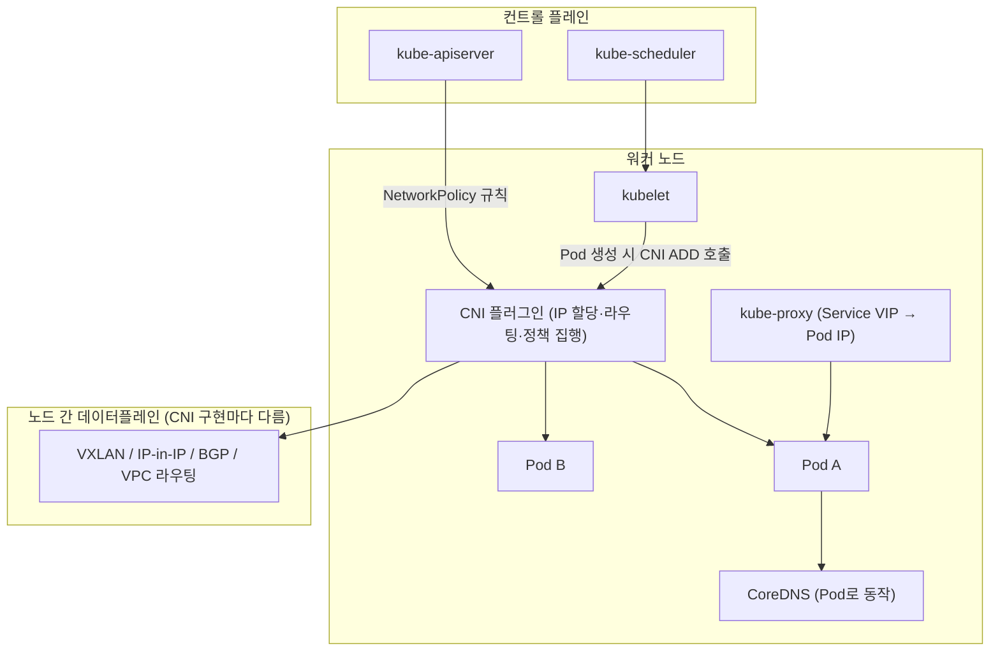

# CNI & NetworkPolicy: Preliminaries

`Questions.bash` / `SolutionNotes.bash` 를 풀 때 필요한 개념을 정리합니다.
이 문서는 **(1) CNI 개념·동작 → (2) CNI 선택·설치 → (3) NetworkPolicy 집행 연계** 순서로 읽으면 됩니다.


| 파일                   | 역할                                                             |
| -------------------- | -------------------------------------------------------------- |
| `LabSetUp.bash`      | Killercoda 플레이그라운드 그대로 사용 (추가 설정 없음)                           |
| `Questions.bash`     | Flannel **또는** Calico 중 하나를 manifest로 설치 (NetworkPolicy 지원 필수) |
| `SolutionNotes.bash` | Calico `tigera-operator.yaml` 설치 예시                            |


> 11번(NetworkPolicy 문법·선택)을 먼저 보고 오면 "선언(11) → 집행(12)" 흐름이 자연스럽습니다. Kubernetes 네트워크 기본(4문제, 4대 규칙, IP 부여 단위)은 **[11.Network-Policy/Preliminaries.md](../11.Network-Policy/Preliminaries.md) §1** 참고.

---

## 1. CNI가 위치하는 곳




| 구성요소              | 역할                           | CNI인가?           |
| ----------------- | ---------------------------- | ---------------- |
| **kubelet**       | Pod 생성/삭제 시 CNI 호출           | 아니오 (호출자)        |
| **CNI 플러그인**      | Pod IP 할당, 라우팅, (지원 시) NP 집행 | **예**            |
| **kube-proxy**    | Service VIP → Pod IP 전달      | 아니오 (Service 담당) |
| **CoreDNS**       | 이름 → IP 해석                   | 아니오 (DNS 담당)     |
| **NetworkPolicy** | 허용 규칙 선언                     | 아니오 (집행은 CNI)    |


```text
Pod 네트워크 뼈대  = CNI
Service 추상화      = kube-proxy + CoreDNS
Pod 방화벽 선언     = NetworkPolicy (집행은 CNI 책임)
```

---

## 2. CNI(Container Network Interface)란

**CNI** 는 컨테이너(=Pod)에 **네트워크 인터페이스·IP·라우트를 붙였다 떼는** 표준 규격이자, 그 규격을 구현한 **플러그인 바이너리**입니다. CNCF 표준이라 Kubernetes·기타 런타임이 공통으로 씁니다.

### 2.1 CNI 호출 생명주기

kubelet은 Pod를 만들 때 `/etc/cni/net.d/` 의 설정을 읽고, `/opt/cni/bin/` 의 플러그인 바이너리를 **ADD / DEL** 명령으로 호출합니다.

```text
Pod 생성
  → kubelet → CNI ADD
      · Pod 전용 network namespace 생성
      · veth pair 생성 (한쪽은 Pod netns, 한쪽은 노드 bridge/overlay)
      · IPAM이 Pod IP 1개 할당
      · 라우트 설정 → Pod status에 IP 기록

Pod 삭제
  → kubelet → CNI DEL
      · veth·IP·라우트 회수
```

### 2.2 노드 안에서 일어나는 일

```text
[ Pod A netns ]──veth──┐
                       ├──[ 노드 bridge / 라우팅 / overlay ]──> 다른 Pod / 다른 노드
[ Pod B netns ]──veth──┘
```

- 각 Pod = 독립된 **네트워크 네임스페이스(netns)**
- CNI가 Pod마다 **고유 IP**(예: `10.244.x.x`) 부여 (IPAM)
- 다른 노드 Pod와 통신하려면 CNI가 **노드 간 경로**를 만든다 (아래 2.4)

### 2.3 CNI 설정 파일 예 (`/etc/cni/net.d/10-xxx.conflist`)

```json
{
  "cniVersion": "1.0.0",
  "name": "k8s-pod-network",
  "plugins": [
    { "type": "calico",   "ipam": { "type": "calico-ipam" } },
    { "type": "portmap",  "capabilities": { "portMappings": true } }
  ]
}
```

`type` 이 실제 플러그인(calico, flannel, bridge, aws-cni 등)을 가리킵니다. `plugins` 가 여러 개면 **체이닝**(순차 적용)됩니다.

### 2.4 노드 간 통신 방식 (CNI 구현별)


| 방식                           | 설명                                                 | 대표                           |
| ---------------------------- | -------------------------------------------------- | ---------------------------- |
| **Overlay (VXLAN/IP-in-IP)** | Pod 패킷을 노드 IP 패킷으로 **캡슐화**해 전달. 인프라 무관·간단, 약간 오버헤드 | Flannel(VXLAN), Calico(IPIP) |
| **BGP 라우팅**                  | 노드끼리 Pod 대역 경로를 BGP로 광고. 캡슐화 없음, 빠름                | Calico(BGP)                  |
| **클라우드 VPC 라우팅**             | 클라우드 라우트 테이블/ENI 사용, Pod가 VPC IP를 직접 가짐            | AWS VPC CNI                  |
| **eBPF**                     | 커널 eBPF로 라우팅·정책을 고속 처리                             | Cilium, Calico(eBPF 모드)      |


---

## 3. Pod ↔ Pod / Pod ↔ Service 통신 경로

### 3.1 같은 노드 (Pod → Pod)

```text
frontend Pod (10.244.1.5)
  → 자신의 라우팅 테이블
  → veth → 노드 bridge
  → backend Pod (10.244.1.8)
```

### 3.2 다른 노드 (Pod → Pod)

```text
frontend Pod (node01, 10.244.1.5)
  → 노드 bridge
  → CNI 데이터플레인 (VXLAN 캡슐화 / BGP 경로 / VPC 라우트)
  → node02 도착, 디캡슐화
  → backend Pod (node02, 10.244.2.7)
```

### 3.3 Service 경유 (11번 Lab의 frontend→backend)

```text
curl http://backend-service.backend
  ① CoreDNS: backend-service.backend.svc.cluster.local → ClusterIP(10.96.x.x)
  ② kube-proxy: ClusterIP → Endpoint(backend Pod IP) 로 DNAT
  ③ CNI 라우팅: 해당 Pod IP로 패킷 전달
  ④ (NetworkPolicy 있으면) CNI가 허용 여부 판정
```

> NetworkPolicy는 최종적으로 **Pod IP / selector** 기준으로 트래픽을 필터링합니다. Service 이름 자체는 정책의 `from`/`to` 에 쓸 수 없습니다(11번 참고).

---

## 4. CNI 선택 — 이 Lab의 요구사항

### 4.1 과제 요구사항

`Questions.bash` 의 조건:

```text
1. Pod 간 통신 가능
2. NetworkPolicy 집행(enforcement) 지원
3. manifest 로 설치
선택지: Flannel(v0.26.1) 또는 Calico(v3.28.2)
```

### 4.2 후보 비교


|                      | **Flannel**                  | **Calico**         | (참고) **Cilium** |
| -------------------- | ---------------------------- | ------------------ | --------------- |
| 주 용도                 | 단순 Pod 네트워킹                  | 네트워킹 + **정책·보안**   | eBPF 네트워킹·정책·관측 |
| 노드 간                 | VXLAN(overlay)               | BGP / IPIP / VXLAN | eBPF            |
| Pod 간 통신             | ✓                            | ✓                  | ✓               |
| **NetworkPolicy 집행** | **✗** (단독 불가, Canal 등 조합 필요) | **✓** (기본 포함)      | ✓               |
| manifest 설치          | ✓                            | ✓                  | ✓               |
| 이 Lab 적합성            | ✗ (요구 2 미충족)                 | **✓ 정답**           | (선택지 아님)        |


### 4.3 결론

```text
요구 2(NetworkPolicy 집행) 때문에 → Calico 선택
Flannel은 Pod 통신은 잘 되지만, NetworkPolicy를 "선언해도 집행"하지 못함.
```

> **왜 Flannel은 안 되나?** Flannel은 순수 데이터플레인(연결)만 제공하고 정책 엔진이 없습니다. NetworkPolicy를 집행하려면 Flannel(네트워킹) + Calico 정책(`Canal`) 조합이 필요한데, 이 Lab은 단일 manifest 설치를 요구하므로 **Calico 단독**이 정답입니다.

---

## 5. Calico 설치 (SolutionNotes)

### 5.1 Operator 방식 설치

```bash
# Lab에서 제시한 manifest (tigera-operator)
kubectl create -f https://raw.githubusercontent.com/projectcalico/calico/v3.28.2/manifests/tigera-operator.yaml

# operator 기동 확인
kubectl get all -n tigera-operator
```

> `kubectl create` 를 권장합니다. tigera CRD가 매우 커서 `kubectl apply`(client-side) 시 annotation 256KB 한도를 넘을 수 있습니다. (`apply` 가 필요하면 `--server-side`)

### 5.2 설치 후 동작 흐름

```text
tigera-operator (NS: tigera-operator)
  → Installation 커스텀 리소스(CR) 조정(reconcile)
  → calico-system NS 에 다음을 배포:
       · calico-node (DaemonSet, 노드마다 1개 — 데이터플레인·정책 집행)
       · calico-kube-controllers (Deployment)
       · calico CNI 바이너리/설정을 각 노드에 설치
  → 노드 Ready, Pod 네트워크 + NetworkPolicy 집행 활성화
```

### 5.3 설치 확인

```bash
kubectl get tigerastatus                      # calico 컴포넌트 상태(Available=True)
kubectl get pods -n calico-system             # calico-node / kube-controllers Running
kubectl get pods -n tigera-operator
kubectl get nodes                             # 모든 노드 Ready
kubectl get pods -A -o wide | grep -E 'calico|tigera'
```

### 5.4 (참고) Flannel 설치 — 선택지이지만 NP 미충족

```bash
kubectl apply -f https://github.com/flannel-io/flannel/releases/download/v0.26.1/kube-flannel.yml
kubectl get pods -n kube-flannel
```

---

## 6. CNI ↔ NetworkPolicy 연계 (11번 ↔ 12번 핵심)

```text
11번: NetworkPolicy YAML 작성·선택   (API / 선언 / What)
12번: 집행 가능한 CNI 설치            (데이터플레인 / 집행 / How)
```

### 6.1 단계별 상태


| 상태                            | 결과                                                   |
| ----------------------------- | ---------------------------------------------------- |
| CNI 없음                        | Pod에 IP 없음 → `ContainerCreating` / Pending / 네트워크 오류 |
| CNI 있음, NP 없음                 | 클러스터 내 **전체 허용**(flat)                               |
| CNI 있음, NP 있음, **집행 미지원 CNI** | `kubectl get netpol` 은 보이지만 **트래픽은 안 막힘**            |
| **집행 지원 CNI + NP**            | 선언한 규칙대로 **실제 차단** ← 목표                              |


### 6.2 통합 검증 (11번 정책 + 12번 CNI)

```bash
# 1) CNI 정상 (Calico)
kubectl get tigerastatus
kubectl get pods -n calico-system

# 2) (11번 워크로드가 있다면) 정책 적용 전 통신 OK
kubectl exec -n frontend deploy/frontend-deployment -- \
  curl -s -o /dev/null -w "%{http_code}\n" --max-time 5 http://backend-service.backend   # 200

# 3) 11번 최소권한 정책 적용
kubectl apply -f /root/network-policies/network-policy-3.yaml

# 4) 허용 경로는 통과 (200), 비허용 경로는 차단(타임아웃) 되어야 정상
kubectl describe networkpolicy -n backend
```

> **핵심 체감 포인트:** 같은 NetworkPolicy라도 **집행 CNI가 없으면 안 막히고**, Calico가 있으면 막힙니다. "선언 ≠ 집행"을 직접 확인하는 것이 이 두 Lab의 학습 목표입니다.

---

## 7. AWS EKS와의 관계 (참고)

EKS 기본 CNI는 **AWS VPC CNI**(`aws-node` DaemonSet)이며, Pod가 **VPC IP를 직접** 받습니다(overlay 없음).


|                  | Killercoda / 이 Lab       | EKS                                                      |
| ---------------- | ------------------------ | -------------------------------------------------------- |
| CNI              | Flannel/Calico **직접 설치** | VPC CNI 기본 제공                                            |
| Pod IP           | overlay 사설 대역            | **VPC 서브넷 IP** (ENI에 부착)                                 |
| NetworkPolicy 집행 | Calico 등 필요              | VPC CNI **네트워크 정책 기능** 또는 Calico 애드온                     |
| 추가 경계            | Pod policy               | Pod policy + **Security Group**(노드/ENI), **SG for Pods** |


> EKS에서도 **"정책 선언 ≠ 자동 집행"** 원칙은 같습니다. 정책 기능을 켜거나 정책 지원 애드온을 설치해야 NetworkPolicy가 실제로 동작합니다.

---

## 8. 자주 헷갈리는 점


| 질문                             | 답                                                                      |
| ------------------------------ | ---------------------------------------------------------------------- |
| CNI와 NetworkPolicy 차이?         | CNI = **연결·IP·라우팅**(및 집행), NP = **허용 규칙 선언**                           |
| Flannel 쓰면 안 되나?               | Pod 통신만 필요하면 OK. **이 Lab 요구(NP 집행)** 엔 Calico                          |
| kube-proxy가 CNI인가?             | **아니오.** Service 로드밸런싱 담당, CNI와 별개                                     |
| CoreDNS가 CNI인가?                | **아니오.** 이름 해석 담당. CNI는 IP 레이어                                         |
| overlay와 BGP 차이?               | overlay=패킷 캡슐화(간단), BGP=경로 광고(캡슐화 없음, 빠름)                              |
| `kubectl create` 후 끝?          | calico-node Pod **Running**, 노드 **Ready**, `tigerastatus` Available 확인 |
| Pod가 `ContainerCreating` 에서 멈춤 | CNI 미설치/오류 가능성 — CNI Pod 로그 확인                                         |


---

## 9. 과제와의 대응


| 과제          | 할 일                                                                       |
| ----------- | ------------------------------------------------------------------------- |
| CNI 선택      | **Calico** (NetworkPolicy 집행 지원)                                          |
| manifest 설치 | `tigera-operator.yaml` (v3.28.2)                                          |
| 확인          | `kubectl get tigerastatus`, `kubectl get pods -n calico-system`, 노드 Ready |
| (연계) 11번    | NetworkPolicy 적용 후 frontend→backend 통신/차단 검증                              |


한 줄 요약:

```text
CNI = Pod에 IP·경로를 붙이는 플러그인 (kubelet이 ADD/DEL 호출, 네트워크 4문제 중 Pod↔Pod 담당)
NetworkPolicy 집행은 CNI 책임 → 이 Lab은 정책 지원 CNI인 Calico 를 설치하는 것이 정답
```

