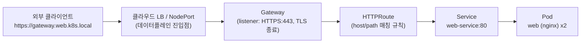
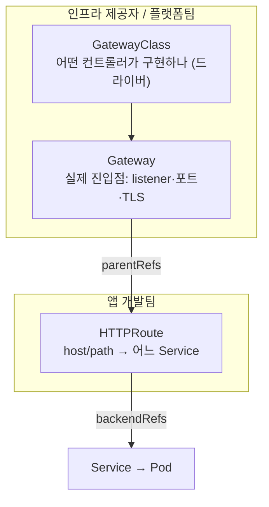

# Gateway API: Preliminaries

`Questions.bash` / `SolutionNotes.bash` 를 풀 때 필요한 개념을 정리합니다.
이 문서는 **(1) 네트워크 계층에서 Gateway의 위치 → (2) Ingress의 한계 → (3) Gateway API 리소스 모델 → (4) Ingress→Gateway 매핑 → (5) 이 Lab 풀이** 순서로 읽으면 됩니다.

> **실습 확장:** EKS에서 host/path·**가중치 라우팅**까지 직접 curl 로 검증하려면 **[AWS/NetworkLab/LAB-GUIDE.md](../../AWS/NetworkLab/LAB-GUIDE.md)** 시나리오 2를 참고하세요.


| 파일                   | 역할                                                                                    |
| -------------------- | ------------------------------------------------------------------------------------- |
| `LabSetUp.bash`      | Gateway API CRD 설치, nginx 앱·Service·TLS Secret·기존 **Ingress** `web`·`GatewayClass` 생성 |
| `Questions.bash`     | 기존 Ingress `web` 을 **Gateway + HTTPRoute** 로 마이그레이션 (HTTPS 유지)                        |
| `SolutionNotes.bash` | `Gateway`(web-gateway) + `HTTPRoute`(web-route) YAML 예시                               |


> 11번(NetworkPolicy)·12번(CNI)에서 **클러스터 내부** 네트워크(L3/L4, Pod↔Pod)를 봤다면, 이 Lab은 **외부 → 클러스터** 진입(L7, HTTP/HTTPS 라우팅)을 다룹니다.

---

## 1. 네트워크 계층에서 Gateway의 위치

### 1.1 Kubernetes 네트워킹 4문제 복습 (11·12번 연결)

12번에서 정리한 네트워킹 4문제 중, **이 Lab은 4번(외부 → Service)** 입니다.


| #   | 문제                   | 누가 해결                                           | 다룬 Lab         |
| --- | -------------------- | ----------------------------------------------- | -------------- |
| 1   | 컨테이너 ↔ 컨테이너 (같은 Pod) | `localhost`                                     | —              |
| 2   | Pod ↔ Pod            | CNI                                             | **12번**        |
| 3   | Pod ↔ Service        | kube-proxy + CoreDNS                            | 11번(통신 경로)     |
| 4   | **외부 ↔ Service**     | NodePort / LoadBalancer / **Ingress / Gateway** | **이 Lab(13번)** |


### 1.2 계층(OSI)으로 본 위치


| 계층          | 리소스                             | 다루는 것                            | 관련 Lab      |
| ----------- | ------------------------------- | -------------------------------- | ----------- |
| **L3 / L4** | NetworkPolicy                   | IP·포트 허용/차단 (Pod 방화벽)            | 11·12번      |
| L4          | Service (ClusterIP/NodePort/LB) | IP·포트 기반 로드밸런싱                   | 5번          |
| **L7**      | **Ingress / Gateway API**       | **HTTP host·path·헤더·TLS** 기반 라우팅 | 6·7·**13번** |


> NetworkPolicy(L3/L4)는 "이 IP가 이 포트로 와도 되나?"를 보고, Gateway(L7)는 "이 **호스트/경로**의 HTTP 요청을 어느 Service로 보낼까?"를 봅니다. 층이 다릅니다.

### 1.3 외부 요청이 Pod까지 가는 전체 경로




```text
DNS(gateway.web.k8s.local) → LB/NodePort → Gateway(TLS 종료) → HTTPRoute(host/path) → Service → Pod
                                            └ L7 라우팅 영역(이 Lab)            └ L4(kube-proxy) └ CNI(12번)
```

- **TLS 종료(Terminate):** Gateway에서 HTTPS를 풀어 내부는 평문 HTTP로 Service에 전달 (이 Lab 방식)
- Service → Pod 구간은 11·12번에서 본 그대로 (kube-proxy + CNI)

---

## 2. Ingress의 한계 → Gateway API가 나온 이유

기존 **Ingress**(6·7번 Lab)는 단일 리소스에 모든 것을 욱여넣어 한계가 있었습니다.


| 한계                   | 설명                                                                              |
| -------------------- | ------------------------------------------------------------------------------- |
| **표현력 부족**           | host/path 라우팅 위주. 헤더·메서드·트래픽 분할(가중치) 등은 표준에 없음                                  |
| **벤더 annotation 난립** | `nginx.ingress.kubernetes.io/...` 처럼 컨트롤러마다 **비표준 annotation** 으로 기능 확장 → 이식성 ✗ |
| **역할 분리 안 됨**        | 인프라(LB·TLS·포트)와 앱(라우팅 규칙)이 **한 리소스**에 섞임. 플랫폼팀과 앱팀 권한 분리 어려움                    |
| **확장성**              | 프로토콜(TCP/gRPC 등) 확장이 어려움                                                        |


**Gateway API** 는 이를 **역할 기반(role-oriented)** 으로 3개 리소스로 쪼개고, 기능을 **표준 필드**로 정의해 해결합니다.

### 2.1 이 Lab의 Ingress 예시 (마이그레이션 전)

`LabSetUp.bash` 가 만드는 기존 Ingress `web` 입니다. **TLS·호스트·라우팅이 한 리소스**에 들어 있습니다.

```yaml
apiVersion: networking.k8s.io/v1
kind: Ingress
metadata:
  name: web
  annotations:
    nginx.ingress.kubernetes.io/rewrite-target: /   # nginx 전용 — 표준 필드 아님
spec:
  tls:
  - hosts:
    - gateway.web.k8s.local
    secretName: web-tls                            # TLS 인증서 Secret
  rules:
  - host: gateway.web.k8s.local                     # 호스트 매칭
    http:
      paths:
      - path: /
        pathType: Prefix
        backend:
          service:
            name: web-service                       # 백엔드 Service
            port:
              number: 80
```

### 2.2 동일 동작 — Gateway + HTTPRoute (마이그레이션 후)

위 Ingress를 **진입점(Gateway)** 과 **라우팅(HTTPRoute)** 으로 나눈 것입니다. 이 Lab의 정답 구조와 같습니다.

**Gateway** — Ingress의 `tls` + listener(호스트·포트) + `ingressClassName` 역할:

```yaml
apiVersion: gateway.networking.k8s.io/v1
kind: Gateway
metadata:
  name: web-gateway
spec:
  gatewayClassName: nginx-class                      # Ingress의 ingressClassName 대응
  listeners:
  - name: https
    protocol: HTTPS
    port: 443
    hostname: gateway.web.k8s.local                  # spec.tls.hosts / rules.host
    tls:
      mode: Terminate
      certificateRefs:
      - kind: Secret
        name: web-tls                                # spec.tls.secretName
```

**HTTPRoute** — Ingress의 `rules`(host·path·backend) 역할:

```yaml
apiVersion: gateway.networking.k8s.io/v1
kind: HTTPRoute
metadata:
  name: web-route
spec:
  parentRefs:                                        # 어느 Gateway에 붙을지
  - name: web-gateway
  hostnames:
  - "gateway.web.k8s.local"                         # rules.host
  rules:
  - matches:
    - path:
        type: PathPrefix
        value: /                                     # rules.http.paths.path
    backendRefs:
    - name: web-service                              # backend.service.name
      port: 80                                       # backend.service.port.number
```

### 2.3 한눈에 대응

| Ingress `web` | → | Gateway API |
| --- | --- | --- |
| `spec.tls` + `secretName: web-tls` | → | **Gateway** `listeners[].tls` + `certificateRefs` |
| `rules[].host` + HTTPS(443) | → | **Gateway** `listeners[].hostname` + `port: 443` |
| (암묵적) nginx 컨트롤러 | → | **Gateway** `gatewayClassName: nginx-class` |
| `rules[].http.paths` | → | **HTTPRoute** `rules[].matches[].path` |
| `backend.service` | → | **HTTPRoute** `rules[].backendRefs` |
| `nginx.ingress.kubernetes.io/rewrite-target` | → | 이 Lab은 path `/` Prefix라 **별도 rewrite 불필요** |

```text
[Ingress web — 1개 YAML]
  tls + host + path + backend + annotation
        │
        ├─► Gateway web-gateway     (진입점·TLS·listener)
        └─► HTTPRoute web-route     (host·path → web-service:80)
```

---

## 3. Gateway API 리소스 모델

### 3.1 3대 리소스와 "역할 분리"




| 리소스              | 범위     | 누가 관리    | 역할                                                     | Ingress 대응            |
| ---------------- | ------ | -------- | ------------------------------------------------------ | --------------------- |
| **GatewayClass** | 클러스터   | 인프라 제공자  | "어떤 **컨트롤러**가 Gateway를 구현하는가" (스토리지의 StorageClass와 유사) | `ingressClassName`    |
| **Gateway**      | 네임스페이스 | 플랫폼/인프라팀 | **진입점**: listener(프로토콜·포트·hostname·TLS) 선언             | Ingress의 `tls`·리스너 부분 |
| **HTTPRoute**    | 네임스페이스 | 앱 개발팀    | **라우팅 규칙**: host·path 매칭 → backend Service             | Ingress의 `rules` 부분   |


> 핵심 아이디어: **"진입점(Gateway)"과 "라우팅 규칙(HTTPRoute)"을 분리**. 한 Gateway를 여러 팀의 HTTPRoute가 공유할 수 있고, 권한도 나눌 수 있습니다.

### 3.2 GatewayClass

어떤 구현체(컨트롤러)가 Gateway를 실제로 처리할지 지정합니다. (이 Lab은 `nginx-class` 가 미리 설치됨)

```yaml
apiVersion: gateway.networking.k8s.io/v1
kind: GatewayClass
metadata:
  name: nginx-class
spec:
  controllerName: example.net/nginx-gateway-controller   # 이 컨트롤러가 구현
```

### 3.3 Gateway — 진입점·리스너·TLS

```yaml
apiVersion: gateway.networking.k8s.io/v1
kind: Gateway
metadata:
  name: web-gateway
spec:
  gatewayClassName: nginx-class        # 어떤 GatewayClass 사용
  listeners:
  - name: https
    protocol: HTTPS                     # HTTP / HTTPS / TLS / TCP ...
    port: 443
    hostname: gateway.web.k8s.local     # 이 listener가 받을 호스트
    tls:
      mode: Terminate                   # Gateway에서 TLS 종료 (내부는 평문)
      certificateRefs:
      - kind: Secret
        name: web-tls                   # TLS 인증서 Secret (LabSetUp이 생성)
```


| 필드                     | 의미                                                    |
| ---------------------- | ----------------------------------------------------- |
| `gatewayClassName`     | 사용할 GatewayClass                                      |
| `listeners[].protocol` | `HTTP`/`HTTPS`/`TLS`/`TCP`                            |
| `listeners[].port`     | 수신 포트 (HTTPS=443)                                     |
| `listeners[].hostname` | 이 listener가 처리할 호스트                                   |
| `tls.mode`             | `Terminate`(Gateway가 복호화) / `Passthrough`(그대로 백엔드 전달) |
| `tls.certificateRefs`  | 인증서가 담긴 `Secret`(kind: Secret)                        |


### 3.4 HTTPRoute — 라우팅 규칙

```yaml
apiVersion: gateway.networking.k8s.io/v1
kind: HTTPRoute
metadata:
  name: web-route
spec:
  parentRefs:                          # 어느 Gateway에 붙을지 (부모)
  - name: web-gateway
  hostnames:
  - "gateway.web.k8s.local"            # 이 호스트로 온 요청 처리
  rules:
  - matches:                           # 조건
    - path:
        type: PathPrefix
        value: /
    backendRefs:                       # 목적지 Service
    - name: web-service
      port: 80
```


| 필드                    | 의미                                               |
| --------------------- | ------------------------------------------------ |
| `parentRefs`          | 이 Route를 **붙일 Gateway**(부모). Gateway↔Route 연결 핵심 |
| `hostnames`           | 처리할 호스트 (Gateway listener hostname과 일치/포함)       |
| `rules[].matches`     | path/header/method 등 매칭 조건                       |
| `rules[].backendRefs` | 매칭 시 보낼 **Service + port** (Ingress의 backend)    |
| `backendRefs[].weight` | (선택) **가중치** — 같은 rule 안 여러 backend 비율 분배 (§3.5) |


> **연결 관계:** `Gateway` 가 진입점을 열고, `HTTPRoute.parentRefs` 가 그 Gateway에 자신을 붙입니다. `backendRefs` 로 최종 Service를 가리킵니다.

### 3.5 HTTPRoute — 가중치 트래픽 분할 (weight routing)

§2에서 본 Ingress 한계 중 **"트래픽 분할(가중치)은 표준에 없음"** 을 Gateway API는 **`backendRefs[].weight`** 표준 필드로 해결합니다. path 가 다르면 rule 을 나누고(§3.4), **같은 host·같은 path** 로 여러 버전에 비율만 나누고 싶을 때 weight 를 씁니다.

**용도:** 카나리/블루그린 배포 — 안정 버전 90% + 신규 버전 10%처럼 점진 롤아웃.

**NetworkLab 예시** (`AWS/NetworkLab/app-manifests/scenario2-gateway/httproute-canary.yaml`):

```yaml
apiVersion: gateway.networking.k8s.io/v1
kind: HTTPRoute
metadata:
  name: canary-route
  namespace: gateway-demo
spec:
  parentRefs:
    - name: web-gateway
  hostnames:
    - "canary.example.com"
  rules:
    - backendRefs:              # matches 없음 = host 일치 시 이 rule 적용
        - name: echo-v1
          port: 80
          weight: 90            # 90% → echo-v1
        - name: echo-v2
          port: 80
          weight: 10            # 10% → echo-v2
```

| 패턴 | HTTPRoute 구조 | NetworkLab 예 |
| --- | --- | --- |
| **host + path 분기** | `rules` 여러 개, 각각 `matches.path` | `app-route`: `/foo`→echo-foo, `/bar`→echo-bar |
| **가중치 분할** | `rules` 하나, `backendRefs` 여러 개 + `weight` | `canary-route`: v1 90 / v2 10 |

```text
[Ingress]  카나리 10% → nginx.ingress.kubernetes.io/canary-weight 등 annotation (컨트롤러 종속)
[Gateway]  카나리 10% → backendRefs[].weight: 10 (표준 필드)
```

**NetworkLab에서 검증 (EKS + NGINX Gateway Fabric):**

Gateway 가 `PROGRAMMED` 되면 진입점 DNS(ELB)가 `.status.addresses` 에 붙습니다.

```bash
GW_HOST=$(kubectl -n gateway-demo get gateway web-gateway \
  -o jsonpath='{.status.addresses[0].value}')

# 20회 요청 → 응답 본문(version v1 / v2) 비율 확인
for i in $(seq 1 20); do
  curl -s -H "Host: canary.example.com" "http://${GW_HOST}/"
done | sort | uniq -c
# version v1 다수, version v2 소수 (약 90:10)
```

> path 분기(4-3)는 **Ingress 와 동등**, weight 분할(4-4)은 **Gateway API 가 Ingress 대비 갖는 추가 표현력**입니다. 자세한 절차는 [NetworkLab LAB-GUIDE §4](../../AWS/NetworkLab/LAB-GUIDE.md#4-시나리오-2--gateway-api) 참고.

```text
GatewayClass ──(gatewayClassName)── Gateway ──(parentRefs)── HTTPRoute ──(backendRefs)── Service ── Pod
```

---

## 4. Ingress → Gateway API 매핑 (이 Lab의 마이그레이션)

`LabSetUp.bash` 가 만든 기존 Ingress `web` 을 둘로 쪼개는 것이 과제입니다.


| 기존 Ingress `web`                          | →   | Gateway API                                 | 들어갈 곳         |
| ----------------------------------------- | --- | ------------------------------------------- | ------------- |
| `spec.tls[].hosts`, `secretName: web-tls` | →   | **Gateway** listener `tls`                  | `web-gateway` |
| host `gateway.web.k8s.local`, port 443    | →   | **Gateway** listener `hostname`/`port`      | `web-gateway` |
| `ingressClassName` (nginx)                | →   | **Gateway** `gatewayClassName: nginx-class` | `web-gateway` |
| `spec.rules[].host`                       | →   | **HTTPRoute** `hostnames`                   | `web-route`   |
| `spec.rules[].http.paths[].path`          | →   | **HTTPRoute** `rules[].matches[].path`      | `web-route`   |
| `backend.service.name/port`               | →   | **HTTPRoute** `rules[].backendRefs`         | `web-route`   |


```text
[Ingress web]                       [Gateway API]
  tls + host + class       ─────►      Gateway (web-gateway)   ← 진입점·TLS
  rules(host/path→service) ─────►      HTTPRoute (web-route)   ← 라우팅
```

> annotation `nginx.ingress.kubernetes.io/rewrite-target: /` 같은 비표준 설정이 Gateway API에서는 **표준 필터**(`URLRewrite` 등)로 대체됩니다. 단, 이 과제의 경로가 `/` Prefix라 별도 rewrite 없이 그대로 매핑하면 됩니다.

---

## 5. 이 Lab 풀이 흐름

```text
1. 기존 자산 확인 → verify: ingress web 의 host/secret/backend 파악
2. Gateway 생성   → verify: kubectl get gateway 에 web-gateway, PROGRAMMED 확인
3. HTTPRoute 생성 → verify: kubectl get httproute, parentRefs/backendRefs 연결
4. 전체 확인      → verify: gatewayclass,gateway,httproute 모두 존재
```

### 5.1 기존 자산 확인

```bash
kubectl describe ingress web        # host, tls secret, backend service/port
kubectl describe secret web-tls     # TLS Secret 존재 확인
kubectl get gatewayclass            # nginx-class 가 이미 있는지
```

### 5.2 Gateway 생성 (Ingress의 host + TLS 미러링)

```bash
kubectl apply -f - <<'EOF'
apiVersion: gateway.networking.k8s.io/v1
kind: Gateway
metadata:
  name: web-gateway
spec:
  gatewayClassName: nginx-class
  listeners:
  - name: https
    protocol: HTTPS
    port: 443
    hostname: gateway.web.k8s.local
    tls:
      mode: Terminate
      certificateRefs:
      - kind: Secret
        name: web-tls
EOF
kubectl get gateway
```

### 5.3 HTTPRoute 생성 (Ingress rules 미러링)

```bash
kubectl apply -f - <<'EOF'
apiVersion: gateway.networking.k8s.io/v1
kind: HTTPRoute
metadata:
  name: web-route
spec:
  parentRefs:
  - name: web-gateway
  hostnames:
  - "gateway.web.k8s.local"
  rules:
  - matches:
    - path:
        type: PathPrefix
        value: /
    backendRefs:
    - name: web-service
      port: 80
EOF
```

---

## 6. 검증

```bash
# 리소스 존재 확인 (과제 verify 명령)
kubectl get gatewayclass,gateway,httproute -A

# 상세 상태
kubectl describe gateway web-gateway      # Listeners, TLS, Status 조건
kubectl describe httproute web-route      # ParentRefs, Rules, Backend

# 연결 관계 빠른 확인
kubectl get gateway web-gateway -o jsonpath='{.spec.listeners[*].hostname}{"\n"}'
kubectl get httproute web-route -o jsonpath='{.spec.parentRefs[*].name}{"\n"}'
```

> **상태(Status) 주의:** 이 Lab의 `nginx-class` 는 **mock 컨트롤러**(`example.net/nginx-gateway-controller`)입니다. 실제로 트래픽을 처리하는 데이터플레인이 없을 수 있어, `PROGRAMMED=True` 나 실제 curl 응답까지는 보장되지 않을 수 있습니다. 과제 채점은 **리소스가 올바르게 선언·연결되었는지**(Gateway listener/TLS, HTTPRoute parentRefs/backendRefs)가 핵심입니다.

---

## 7. 자주 헷갈리는 점


| 질문                                 | 답                                                                                    |
| ---------------------------------- | ------------------------------------------------------------------------------------ |
| Gateway와 NetworkPolicy 차이?         | Gateway=**L7 외부 진입 라우팅**, NetworkPolicy=**L3/L4 Pod 격리**. 층·목적이 다름                   |
| GatewayClass vs Gateway?           | Class=구현체(드라이버) 정의(클러스터), Gateway=실제 진입점 인스턴스(NS)                                    |
| Gateway와 HTTPRoute 연결 고리?          | **HTTPRoute.parentRefs** 가 Gateway를 가리킴                                              |
| TLS는 어디에?                          | **Gateway** listener의 `tls`(Ingress와 달리 진입점 쪽에 선언)                                   |
| `mode: Terminate` vs `Passthrough` | Terminate=Gateway가 복호화(내부 평문), Passthrough=암호문 그대로 백엔드                               |
| `certificateRefs` 에 뭘?             | `kind: Secret` 의 **TLS Secret**(LabSetUp의 `web-tls`)                                 |
| Ingress와 동시에 둬도 되나?                | 가능. 보통 마이그레이션 중 병행 후 Ingress 제거                                                      |
| HTTPRoute는 Gateway와 같은 NS여야?       | 다른 NS도 가능(`parentRefs` 에 namespace 지정 + Gateway가 ReferenceGrant/allowedRoutes로 허용 시) |
| Ingress 에 카나리(가중치) 배포 가능?          | 컨트롤러 **annotation** 에 의존(비표준). Gateway API 는 `backendRefs[].weight` **표준 필드** (§3.5, NetworkLab 4-4) |


---

## 8. 과제와의 대응


| 과제            | 할 일                                                                  |
| ------------- | -------------------------------------------------------------------- |
| 기존 Ingress 분석 | `kubectl describe ingress web` 으로 host/TLS/backend 파악                |
| Gateway 생성    | `web-gateway`: nginx-class, HTTPS:443, hostname, TLS(web-tls)        |
| HTTPRoute 생성  | `web-route`: parentRefs=web-gateway, host, path `/` → web-service:80 |
| 확인            | `kubectl get gatewayclass,gateway,httproute -A`                      |


한 줄 요약:

```text
Gateway API = Ingress(L7 진입)를 역할별 3리소스로 분리:
  GatewayClass(구현체) → Gateway(진입점·TLS) → HTTPRoute(host/path→Service)
이 Lab = 기존 Ingress web 을 web-gateway(TLS) + web-route(라우팅) 로 마이그레이션
```

> 전체 그림: 외부 요청은 **Gateway(L7, 13번)** 로 들어와 Service를 거쳐, **CNI(12번)** 가 만든 Pod 네트워크 위에서 Pod에 닿고, 그 사이 **NetworkPolicy(11번)** 가 L3/L4 격리를 적용합니다.

