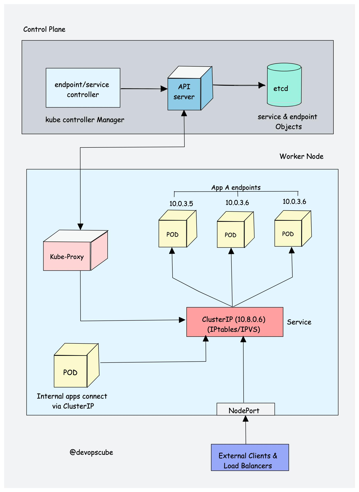
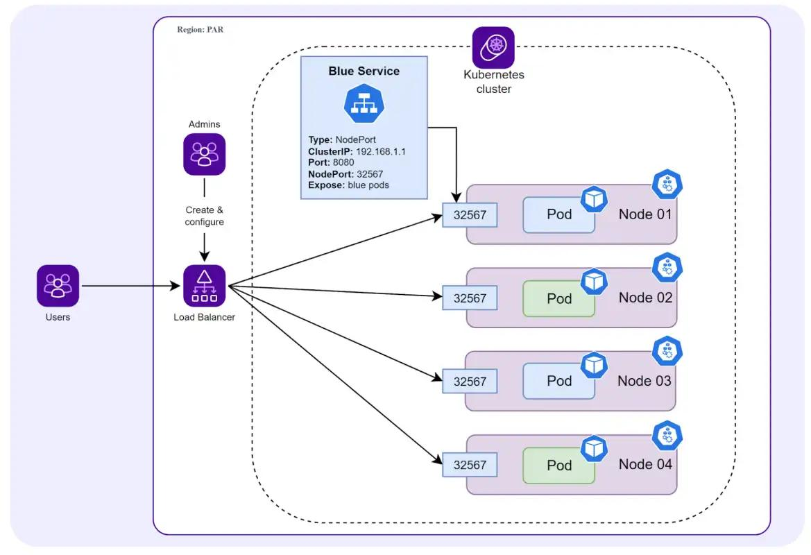
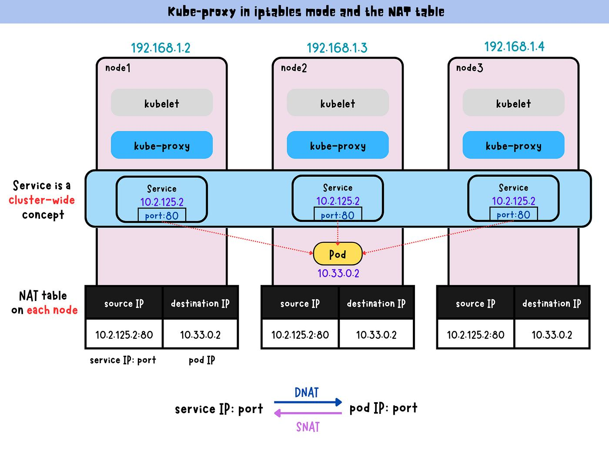

## FAQ: Service Type 과 Kube Proxy

### 용어
- **Node**: Pod가 실제로 실행되는 서버/VM(워커 노드)
- **Pod IP**: Pod에 할당되는 클러스터 내부 IP
- **Service**: “Pod 집합”을 안정적으로 가리키는 가상 엔드포인트(로드밸런싱/서비스 디스커버리)
- **NodePort**: 모든 노드에 동일 포트를 노출해 `NodeIP:NodePort`로 접근
- **EndpointSlice/Endpoints**: Service 뒤에 붙은 “실제 Pod IP:Port 목록”
- **kube-proxy**: Service/EndpointSlice 변경을 watch 해 노드에 iptables/IPVS 규칙을 구성
- **DNAT**: 목적지 주소/포트를 바꾸는 NAT (예: `NodeIP:30080` → `PodIP:8080`)
- **SNAT(MASQUERADE)**: 출발지 주소를 바꾸는 NAT(상황에 따라 적용)
- **conntrack**: NAT/연결 상태를 커널이 기억해 응답을 되돌려주는 기능
- **CNI**: 노드 간 Pod IP 라우팅/오버레이 네트워킹을 제공
- **externalTrafficPolicy**
  - `Cluster`: 노드에 Pod가 없어도 다른 노드 Pod로 포워딩 가능(기본)
  - `Local`: 로컬 엔드포인트로만 보내려는 성격(소스 IP 보존 등). 로컬 Pod 없으면 실패 가능

> - **Control Plane**: Endpoint/Service controller가 Service와 Endpoint(백엔드 Pod 목록) 객체를 관리하고, API Server를 통해 etcd에 상태를 저장합니다.  
> - **Worker Node**: kube-proxy가 Service/Endpoint 변경을 watch 하며, 노드에 **iptables/IPVS 규칙**을 구성해 **ClusterIP(가상 IP)** 로 들어온 트래픽이 실제 **Pod IP(Endpoints)** 중 하나로 로드밸런싱되게 만듭니다.  
> - **NodePort**: 외부(클러스터 밖)에서 `NodeIP:NodePort`로 들어오는 요청도 결국 같은 Service(ClusterIP) 흐름으로 합류해 Pod로 전달됩니다.

---

### 1) NodePort vs LoadBalancer
- **핵심 차이**: Kubernetes가 외부 Load Balancer를 **자동으로 프로비저닝/연동**해주느냐

- **Service `type: LoadBalancer`**
  - (클라우드 통합 환경에서) Service 생성 시 외부 LB를 자동 생성/연동합니다.
  - 외부 접근 엔드포인트(공인 IP/DNS)가 **서비스 단위**로 생깁니다.

- **Service `type: NodePort`**
  - 외부 LB를 자동으로 만들지 않습니다.
  - 모든 노드에 특정 포트를 열어(`NodeIP:NodePort`) 외부 LB가 있다면 그 LB가 각 노드의 NodePort로 분산하도록 **별도 설정**이 필요합니다.

---

### 2) “NodePort면 VM(노드)이 만들어지나요?” 
- NodePort는 VM(노드)을 “생성”하지 않습니다.
- NodePort Service가 생성되면, 클러스터의 **모든 노드**에서 해당 포트가 열리도록(프록시/룰 설정) 동작합니다.
- **케이스 A (해당 노드에 Pod 있음)**: `NodeIP:NodePort`로 들어온 트래픽이 그 노드에 있는 Pod로 전달될 수도 있습니다.
- **케이스 B (해당 노드에 Pod 없음)**: `NodeIP:NodePort`로 들어온 트래픽이 다른 노드에 있는 Pod으로 포워딩될 수도 있습니다.
- 클러스터 전체에 엔드포인트(Pod)가 없으면 요청은 실패합니다(타임아웃/리셋 등).

---

### 3) Pod 없는 노드의 NodePort로 들어온 요청은 “어떻게” 다른 Pod으로 가나?

#### 3-1. 결론: “요청 때마다 API Server 조회”하지 않는다
- kube-proxy는 평소에 API Server를 watch 해서 **Service / EndpointSlice(또는 Endpoints)** 변경을 구독합니다.
- 그 결과로 **노드 로컬에 포워딩 규칙(iptables 또는 IPVS)** 을 미리 구성합니다.
- 그래서 실제 데이터 플로우는 “컨트롤 플레인 조회”가 아니라 **노드 커널 레벨 NAT/로드밸런싱 규칙**으로 진행됩니다.

#### 3-2. 데이터 플로우(대표: kube-proxy iptables 모드, externalTrafficPolicy=Cluster)
1) 클라이언트가 `NodeIP:NodePort`로 접속합니다.
2) 노드의 iptables 규칙이 NodePort 트래픽을 Service 체인으로 점프합니다. (`KUBE-NODEPORTS` → `KUBE-SVC-xxxx`)
3) Service 체인이 엔드포인트(Pod IP:Port) 중 하나를 선택합니다.
4) 선택된 엔드포인트 체인이 목적지를 Pod IP:PodPort로 **DNAT** 합니다.
5) 목적지가 다른 노드의 Pod IP라면, CNI 라우팅/오버레이로 해당 노드로 전달됩니다.
6) 응답은 conntrack/NAT 상태에 의해 원래 연결로 되돌아옵니다.

> 핵심: kube-proxy는 “요청을 프록시로 받아 중계”하기보다, (모드에 따라) **커널 규칙을 미리 깔아두는 방식**으로 데이터 플레인을 만든다고 이해하면 흐름이 가장 덜 헷갈립니다.

---

### 4) 비용/운영: “서비스마다 LoadBalancer면 비싼데 외부 LB 하나로 개선 가능?”
- 클라우드 구현체 기준으로 LoadBalancer는 보통 “노드마다”가 아니라 **“서비스마다”** 만들어집니다.
- 비용/운영 측면에서 서비스마다 LB 생성을 피하려면 다음 패턴이 흔합니다.
  - 외부 LB 1개(또는 최소) → Ingress Controller → 여러 Service 라우팅(Host/Path 기반)
- 결론: 가능하고, 실무에서도 Ingress로 진입점을 통합하는 방식이 흔합니다.

---

### 5) NodePort는 언제 써야하는가?
Ingress + ClusterIP(애플리케이션은 내부 Service로), 또는 `type: LoadBalancer`(클라우드 자동 LB)로 대부분의 케이스가 해결되지만, 아래 상황에서는 **NodePort가 “필수 접점”** 이 되는 경우가 있습니다.

#### 5-1. 온프레미스/로컬에서 `type: LoadBalancer`를 쓸 수 없을 때
- 클라우드처럼 외부 LB를 자동으로 만들어줄 구현(예: cloud provider integration)이 없으면 `LoadBalancer` Service의 `EXTERNAL-IP`가 `<pending>`으로 남을 수 있습니다.
- MetalLB 같은 구현이 없고 “외부에서 들어올 진입점”이 필요하면, 가장 단순한 해법이 `NodePort`입니다.

#### 5-2. 외부(하드웨어/조직 운영) Load Balancer가 있고 타겟이 `NodeIP:Port`로 고정되어야 할 때
- F5/ADC/외부 HAProxy 등 “Kubernetes가 자동 생성하지 않는” 외부 LB를 조직이 운영하는 경우가 흔합니다.
- 이런 LB는 보통 백엔드를 `NodeIP:NodePort`로 잡는 구성이 자연스럽고, 이때 NodePort가 표준적인 접점이 됩니다.
- Ingress를 쓰더라도, **Ingress Controller 자체를 외부 LB 뒤로 붙일 때** `NodePort`로 노출하는 패턴이 나옵니다.

#### 5-3. HTTP가 아닌 TCP/UDP(L4) 서비스를 노출해야 할 때
- Ingress는 기본적으로 HTTP/HTTPS(L7) 라우팅 중심입니다.
- TCP/UDP 서비스(특정 프로토콜, 게임 서버 등)는 `Service` 레벨에서 노출하는 게 자연스럽고,
  - 클라우드면 `LoadBalancer`
  - 그게 불가능하면 `NodePort`
  로 해결하는 경우가 많습니다.

#### 5-4. 네트워크/보안 정책상 “노드의 특정 포트만” 열 수 있는 환경
- 방화벽/라우팅/정책 제약으로 “노드 몇 대의 특정 포트만 허용” 같은 조건이 있으면,
- L7 Ingress 진입(별도 LB/프록시 계층)을 추가하기 어려워 NodePort가 사실상 유일한 선택지가 될 수 있습니다.

#### 결론
- **Ingress + ClusterIP**: “HTTP 진입점 통합 + 내부 서비스 연결”의 표준 패턴
- **LoadBalancer**: 클라우드 통합 환경에서 외부 노출을 간단히 해결
- **NodePort**: 위 둘이 안 되거나(온프렘), 외부 LB 연동/특수 L4 요구가 있을 때 쓰는 **노드 레벨 진입점**
