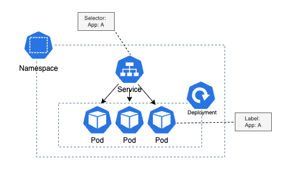
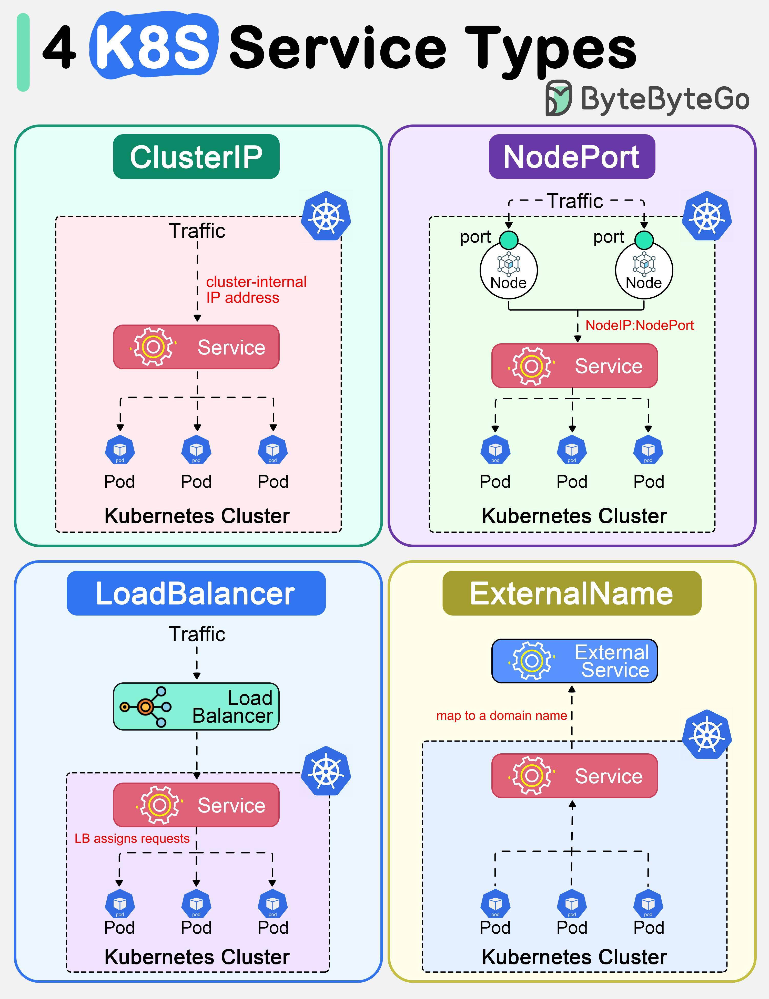
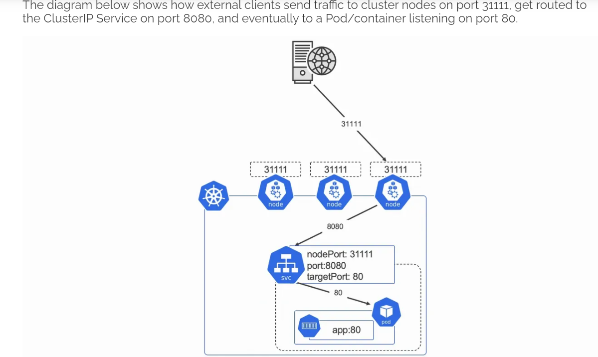
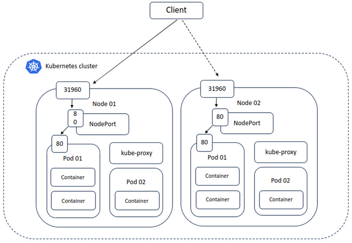
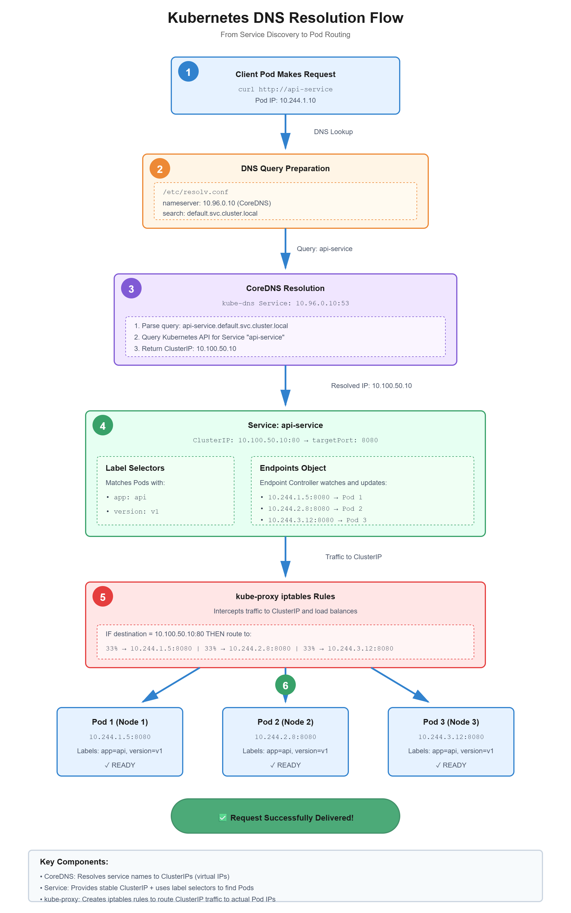
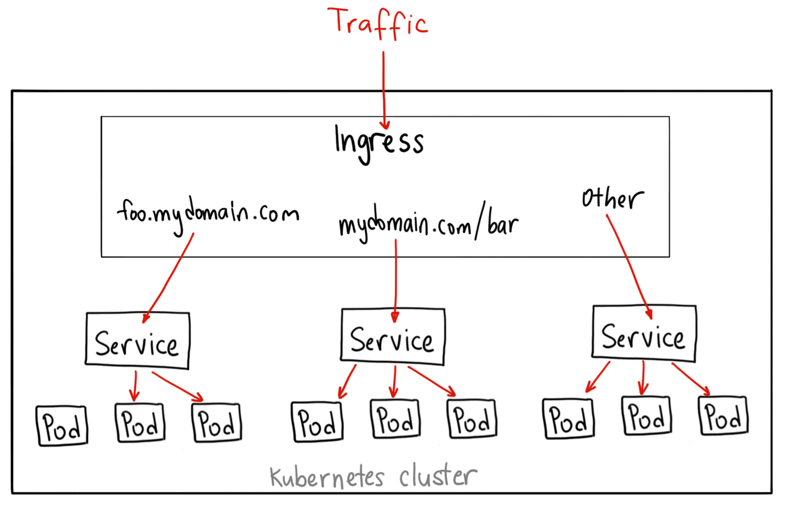

# NodePort: Preliminaries

이 실습은 **`relative` 네임스페이스**의 **Deployment `nodeport-deployment`**(nginx)에 **`containerPort`** 를 선언하고, **`type: NodePort`** 인 Service로 **`노드 IP + 고정 포트`** 에서도 접근할 수 있게 만드는 과정을 다룹니다. 아래는 **요청이 실제로 지나가는 순서**에 맞춰 개념을 이어서 설명합니다.

---

## Service란


**Service**는 **역할이 같은 Pod 여러 개**를 하나의 **안정적인 접근점**으로 묶는 쿠버네티스 API 객체입니다. Pod IP는 재시작·이동 때마다 바뀔 수 있지만, 클라이언트는 **고정된 Service 이름**이나 Service에 붙은 **가상 IP**로 계속 요청을 보낼 수 있습니다. Service는 **selector(라벨)** 로 “어떤 Pod가 내 백엔드인지” 정하고, 들어온 트래픽을 그 Pod들 사이로 나눕니다. 실제로 패킷을 어떻게 넘길지는 노드의 **kube-proxy**가 Service·Endpoints(또는 EndpointSlice) 정보를 보고 iptables/IPVS 등으로 맞춥니다.

> Pod만 있고 Service가 없으면, 클러스터 안에서 “이름으로 불리는 공통 진입점”이 없어 다른 워크로드와 맞추기 어렵습니다.

---

## Service Type


아래 3가지는 모두 **Service의 `spec.type`** 에 넣는 값입니다. Service라는 **한 종류의 API 객체** 안에서 “어떻게 노출할지(접근 경로)”를 고르는 옵션이지, ClusterIP/NodePort/LoadBalancer 각각이 별도 리소스 종류인 것은 아닙니다. `type`을 생략하면 기본값은 **`ClusterIP`** 입니다.

- **ClusterIP**


  - **클러스터 내부 전용** 가상 IP(ClusterIP)로 Service를 노출합니다.
  - 클러스터 안의 클라이언트는 **DNS 이름** 또는 **`ClusterIP:port`** 로 접근하고, kube-proxy가 **Pod의 `targetPort`** 로 전달합니다.

- **NodePort**


  - Service는 유지한 채, **모든 노드에 동일한 포트(`nodePort`)** 를 열어 **`노드IP:nodePort`** 로도 접근 가능하게 합니다.
  - 내부적으로는 **ClusterIP 흐름으로 합쳐져** 동일한 백엔드 Pod들로 전달됩니다.

- **LoadBalancer**
  - **외부 로드밸런서(External LB)** 를 Service 앞에 붙여, 보통 **`EXTERNAL-IP`** 로 접근 가능한 진입점을 제공합니다(클라우드 환경에서 주로 사용).
  - 내부적으로는 **ClusterIP를 유지**하고, 구현에 따라 **NodePort 경유**로 노드/Pod로 트래픽이 전달됩니다.

  - **`type: LoadBalancer`** 는 **클러스터 밖(인터넷/VPC 등)** 에서 접근 가능한 **외부 로드밸런서(External LB)** 를 “Service 앞단”에 붙이는 방식입니다.  
  
  - 클라우드(AWS/GCP/Azure 등)에서는 Service를 만들면 **클라우드 로드밸런서가 자동 프로비저닝**되고, Service에 **`EXTERNAL-IP`** 가 할당됩니다(온프렘/로컬 클러스터는 구현/애드온에 따라 동작이 다를 수 있음).

  - **LoadBalancer는 보통 NodePort를 함께 만듭니다.**
    - 내부적으로 **ClusterIP는 항상 유지**되고,
    - 외부 LB가 노드들로 트래픽을 전달하기 위해 **NodePort 경로를 사용**하는 경우가 많습니다(구현체에 따라 다를 수 있지만 “LB → (노드) → Service → Pod”의 큰 틀은 동일).

  - **트래픽 흐름(전형적인 그림):**
    ```text
    클라이언트  →  외부 LB(EXTERNAL-IP):80/443  →  노드IP:nodePort  →  (kube-proxy)  →  Service ClusterIP:port  →  Pod IP:targetPort
    ```

## Traffic Flow

**클러스터 밖**에서 노드로 직접 붙는 경우(NodePort):

```text
클라이언트  →  노드IP:nodePort  →  (kube-proxy)  →  Service ClusterIP:port  →  Pod IP:targetPort(= containerPort)
```

**클러스터 안**의 Pod가 같은 Service로만 붙는 경우(`type: ClusterIP` 만 있어도 됨):

```text
클라이언트 Pod  →  DNS 이름 또는 ClusterIP:port  →  (kube-proxy)  →  Pod IP:targetPort(= containerPort)
```
> **내부 통신에는 NodePort가 필수가 아닙니다.**

---

## 1단계 : Service로 트래픽 받기

`type: NodePort`와 `nodePort`

클러스터 **밖**(또는 노드 네트워크 기준)에서 **노드의 실제 IP와 포트**로 들어오게 하려면 Service의 **`spec.type`** 을 **`NodePort`** 로 두고, **`spec.ports[].nodePort`** 로 노드 쪽 포트를 지정합니다(과제 예: **30080**). 들어온 트래픽은 kube-proxy가 **같은 Service의 ClusterIP:port 쪽**으로 이어 준 뒤, 뒤에서 설명하는 **`port` / `targetPort` / selector** 규칙을 그대로 탑니다.

> **`nodePort`** 는 **Service 매니페스트에만** 있습니다. Deployment·Pod·Ingress에는 이 필드가 없습니다. 별도 “NodePort” 리소스 종류도 없습니다.

#### (보강) `nodePort`를 정의하지 않으면?

- **정의하지 않으면:** Control plane이 **30000–32767** 등 허용 범위에서 **자동 할당**합니다. 문서·방화벽·`curl`에 **고정값**을 쓰기위해 명시하는 경우가 많습니다.


#### `ClusterIP` / `NodePort` / `LoadBalancer` 

| | **`type: ClusterIP`** | **`type: NodePort`** | **`type: LoadBalancer`** |
|---|---|---|---|
| **클러스터 내부 접근** | 가능(DNS/ClusterIP) | 가능(DNS/ClusterIP) | 가능(DNS/ClusterIP) |
| **외부(클러스터 밖)에서 직접 접근** | 기본적으로 불가 | 가능(`노드IP:nodePort`) | 가능(`EXTERNAL-IP`/DNS) |
| **노출 단위** | Service(가상 IP) | 모든 노드에 동일 포트 오픈 | 외부 LB + Service |
| **운영 관점 특징** | 가장 단순/기본값 | 방화벽/포트 관리 필요, 노드 IP 의존 | 클라우드에선 가장 “표준적” 외부 노출(비용/프로비저닝 동반) |
| **관계(내부적으로)** | ClusterIP만 생성 | ClusterIP + NodePort | ClusterIP + (대개) NodePort + 외부 LB |

---

## 2단계: 받은 트래픽을 Pod로 넘기기 — ClusterIP, `port`, `targetPort`, selector

**Service**는 라벨 **selector**로 고른 Pod들을 **하나의 안정적인 진입점**으로 묶습니다. Service를 만들면 **가상 IP(ClusterIP)** 가 붙습니다. **물리 NIC 주소가 아니라** 클러스터 안에서만 쓰는 **가상 주소**이며, kube-proxy가 **ClusterIP:`port` → 선택된 Pod IP:`targetPort`** 로 패킷을 넘깁니다(iptables/IPVS 등).

- **`spec.ports[].port`** — 클러스터 **내부**에서 이 Service로 붙을 때 쓰는 포트(서비스 “앞면”).
- **`spec.ports[].targetPort`** — 실제로 백엔드 Pod의 **어느 포트**로 보낼지. 보통 **컨테이너의 `containerPort`와 같은 숫자**이거나, 컨테이너 `ports[].name`(예: `http`)과 맞춥니다.

#### Deployment ↔ Service 매니페스트 연결

**(1) Deployment(또는 Pod 템플릿) 쪽 핵심**

```yaml
spec:
  selector:
    matchLabels:
      app: web
  template:
    metadata:
      labels:
        app: web
    spec:
      containers:
        - name: nginx
          ports:
            - name: http
              containerPort: 8080
```

**(2) Service 쪽 핵심**

```yaml
spec:
  type: NodePort
  selector:
    app: web
  ports:
    - name: http
      port: 80
      targetPort: http
      nodePort: 30080
```

- **selector 매칭**: Service의 `spec.selector.app: web` ↔ Pod 라벨 `metadata.labels.app: web` 이 **일치**해야 Endpoints가 생깁니다.
- **포트 연결(내부)**: `port: 80`은 **Service에 붙는 포트**, `targetPort: http`는 컨테이너의 `ports[].name: http`(= `containerPort: 8080`)로 **연결**됩니다.
- **포트 연결(외부 진입)**: `type: NodePort` + `nodePort: 30080`은 **모든 노드에 30080 포트를 열어** `노드IP:30080`으로 들어온 요청도 **같은 Service로 합류**시킵니다(결국 `ClusterIP:port` → `targetPort`로 전달).

Pod IP는 자주 바뀌어도, 클라이언트는 **ClusterIP 또는 DNS 이름**으로 같은 Service를 계속 호출할 수 있습니다.

#### (보강)  “individual pods를 NodePort로 노출” 한다는 의미는?

Service가 selector로 고른 Pod들이 **엔드포인트**로 잡히고, NodePort(또는 ClusterIP:port)로 들어온 트래픽이 **그 Pod들**로 나뉘어 간다는 의미에 가깝습니다. Pod마다 **서로 다른** 노드 포트를 주는 것은 아닙니다.

#### (보강) kube-proxy가 하는 일(왜 Service가 “가상 IP”인데도 동작하나?)



Service의 **ClusterIP**는 Pod처럼 “그 IP를 가진 엔드포인트”가 실제로 떠 있는 주소가 아니라, 클러스터 내부에서만 의미를 가지는 **가상 IP**입니다.  
이 가상 IP(또는 `노드IP:nodePort`)로 들어온 트래픽이 실제 Pod로 전달될 수 있는 이유는, 각 노드의 **kube-proxy**가 Service/Endpoints(또는 EndpointSlice) 정보를 감시하면서 **노드 수준의 라우팅/NAT 규칙**을 맞추기 때문입니다.

- **핵심 역할**: `ClusterIP:port`(또는 `노드IP:nodePort`) → **선택된 Pod IP:`targetPort`** 로 트래픽이 가도록 만든다.
- **동작 방식(개념)**: kube-proxy가 **iptables 또는 IPVS 규칙**을 구성해 “이 Service로 들어온 트래픽은 현재 살아있는 Endpoint(Pod)들 중 하나로 보내라”를 처리한다.
- **결과**: Pod IP가 바뀌어도 클라이언트는 **Service(이름/ClusterIP)** 만 호출하면 되고, 실제 전달은 kube-proxy 규칙을 통해 동적으로 Pod로 분산된다.

---

## 3단계: 트래픽이 도착하는 곳 — Pod와 `containerPort`

컨테이너 프로세스는 Pod 네트워크 안에서 **특정 포트**로 리슨합니다. Deployment 매니페스트에서는 **`containers[].ports[].containerPort`**(와 선택적 **`name`**, **`protocol`**)로 그것을 **선언**합니다. 포트를 대신 열어 주는 것은 아니고, **앱이 실제로 그 포트에 바인드**해야 합니다.

과제에서 **`name: http`**, **80**, **TCP** 를 맞추면, Service의 **`targetPort: http`** 처럼 **이름으로 연결**하기 쉽습니다(솔루션은 `targetPort: 80`을 사용).

`kubectl patch`로 템플릿을 바꾸면 **롤링 업데이트**가 일어날 수 있습니다.

#### (보강) `containerPort` vs `nodePort`

| | **`containerPort`** (Deployment/Pod) | **`nodePort`** (Service, NodePort 타입) |
|---|--------------------------------------|----------------------------------------|
| **의미** | Pod **안**에서 앱이 리슨하는 포트 | **노드**에서 이 Service로 넘기기 위한 포트 |
| **외부 노출** | 이 필드만으로는 노출되지 않음 | 클러스터 밖에서 `노드IP:nodePort` 진입에 사용 |
---

## 매니페스트 필드 요약(한 표)

| 객체 | 필드 | 트래픽 흐름에서의 역할 |
|------|------|------------------------|
| Deployment | `containers[].ports[].containerPort` | **최종 수신** 포트(Pod 내부) |
| Deployment | `containers[].ports[].name` | `targetPort`에서 이름으로 참조 가능 |
| Service | `spec.selector` | 백엔드 Pod 고르기 |
| Service | `spec.ports[].port` | ClusterIP·내부 DNS·Ingress가 붙는 **서비스 포트** |
| Service | `spec.ports[].targetPort` | Pod 쪽 포트(숫자 또는 위 이름) |
| Service | `spec.type` / `spec.ports[].nodePort` | **NodePort:** 노드 진입 |
| Ingress | `backend.service` | **Service 이름 + Service `port`** 만 지정(Pod 직접 아님) |

---

## 통합 예시 YAML

실습은 **nginx:80** 기준이고, 아래는 **containerPort를 8080**으로 둔 **교육용** 예입니다(구조는 동일).

```yaml
apiVersion: apps/v1
kind: Deployment
metadata:
  name: web
spec:
  replicas: 2
  selector:
    matchLabels:
      app: web
  template:
    metadata:
      labels:
        app: web
    spec:
      containers:
        - name: nginx
          image: nginx:1.25
          ports:
            - name: http
              containerPort: 8080
              protocol: TCP
---
apiVersion: v1
kind: Service
metadata:
  name: web-svc
spec:
  type: NodePort
  selector:
    app: web
  ports:
    - name: http
      port: 80
      targetPort: http
      protocol: TCP
      nodePort: 30080
```

**이 예의 흐름:** `노드IP:30080` → kube-proxy → `ClusterIP:80` → Pod의 **8080**(`targetPort`가 이름 `http`로 연결).

실습용 Service만 따로 보면 다음과 같습니다(`relative`, `nodeport-deployment`).

```yaml
apiVersion: v1
kind: Service
metadata:
  name: nodeport-service
  namespace: relative
spec:
  type: NodePort
  selector:
    app: nodeport-deployment
  ports:
    - name: http
      port: 80
      targetPort: 80
      protocol: TCP
      nodePort: 30080
```

`selector`가 Pod 라벨과 맞지 않으면 Endpoints가 비어 **접속이 안 됩니다.**

#### (보강) Ingress — 또 다른 진입 경로

Ingress는 **Pod·`containerPort`를 직접 가리키지 않고**, **Service 이름 + Service의 `port`**(`spec.ports[].port`)만 지정합니다.



```yaml
apiVersion: networking.k8s.io/v1
kind: Ingress
metadata:
  name: web-ing
spec:
  rules:
    - host: example.com
      http:
        paths:
          - path: /
            pathType: Prefix
            backend:
              service:
                name: web-svc
                port:
                  number: 80
```

인터넷 → Ingress Controller → **Service `web-svc:80`** → `targetPort` → **containerPort**. 사용자는 보통 Ingress **80/443** 만 쓰고, 뒤의 Service·NodePort는 숨겨집니다.

---

## 과제와 솔루션 흐름 정리

1. **Deployment 패치** — 컨테이너 이름이 **`nginx`** 인지 확인. `ports`에 `name: http`, `containerPort: 80`, `protocol: TCP`.
2. **Service 적용** — `type: NodePort`, `nodePort: 30080`, `port` / `targetPort` / `protocol` / `selector` 정합.
3. **검증** — `kubectl get svc`, `kubectl get endpoints` 후 **`curl http://<노드IP>:30080`** (환경별 노드 IP는 안내에 따름).

---

## 관련 kubectl 명령어

- **`kubectl get deployment,pods,svc -n relative`**
- **`kubectl patch deployment ... -n relative -p '...'`** — 이후 **`kubectl rollout status deployment/nodeport-deployment -n relative`**
- **`kubectl apply -f svc.yaml`**
- **`kubectl get svc nodeport-service -n relative -o wide`**
- **`kubectl get endpoints nodeport-service -n relative`**
