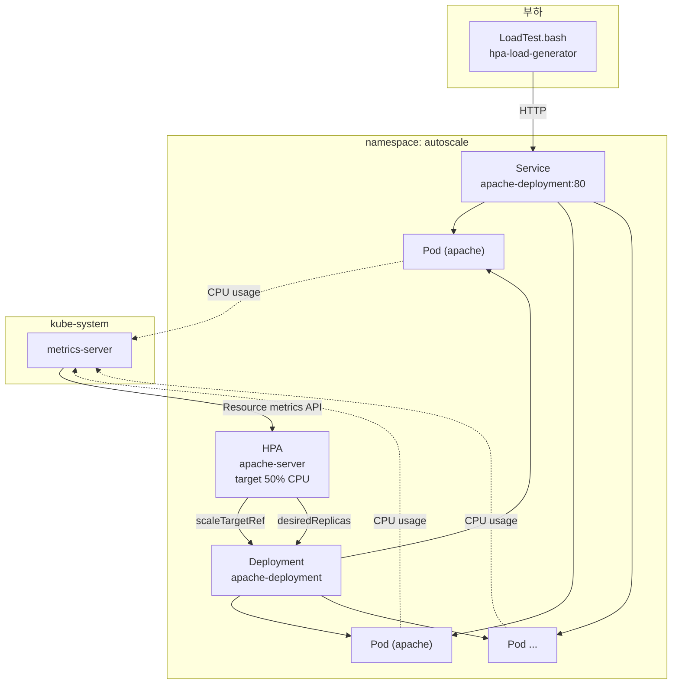
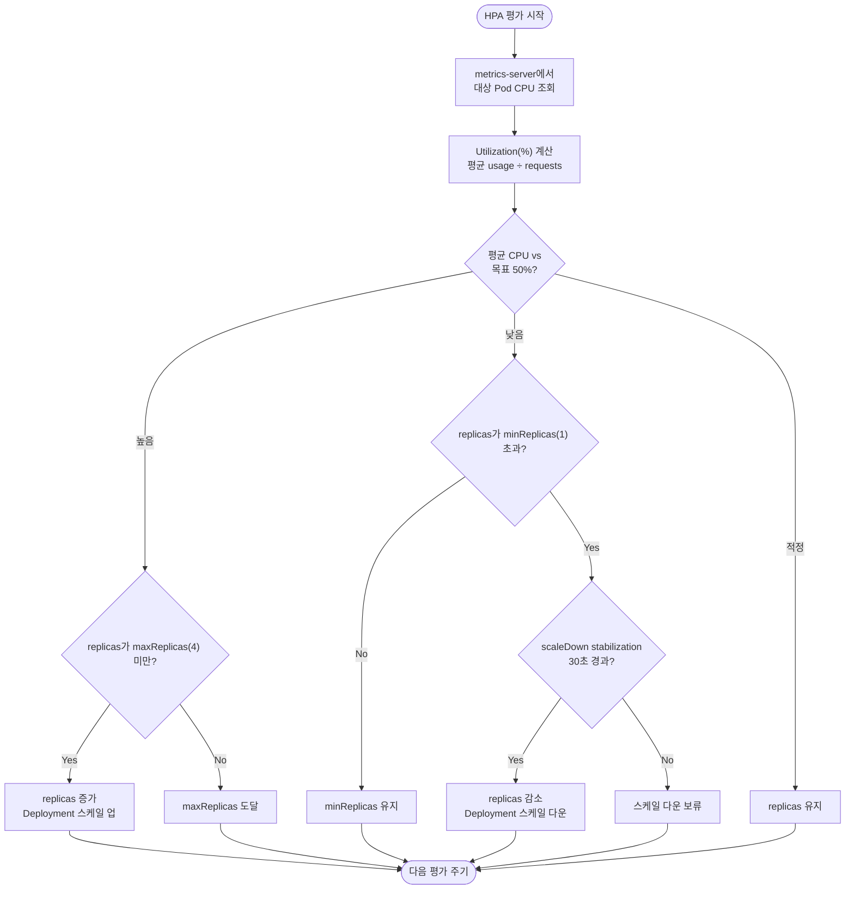

# 8. HPA (Horizontal Pod Autoscaler) 실습

## 학습 목표

- HPA가 **무엇을**, **어떤 조건으로** Pod 수를 조절하는지 설명할 수 있다.
- **metrics-server**가 HPA에 왜 필요한지 이해한다.
- Deployment에 **CPU requests**를 설정하고, HPA v2 매니페스트를 작성한다.
- CPU **평균 사용률(%)**, **min/max replicas**, **scaleDown stabilization window**를 설정한다.

---

## HPA란?

**Horizontal Pod Autoscaler(HPA)**는 워크로드(주로 `Deployment`)의 **Pod 개수**를 자동으로 늘리거나 줄이는 리소스입니다. “Horizontal”은 Pod 하나의 CPU/메모리를 키우는 것(Vertical)이 아니라, **복제본 수(replicas)**를 조절한다는 뜻입니다.

```
트래픽/부하 증가 → CPU 사용률 상승 → HPA가 replicas 증가
부하 감소       → CPU 사용률 하락 → HPA가 replicas 감소 (정책·안정화 윈도우 적용)
```

### 구성 다이어그램

이 실습(`autoscale` 네임스페이스)에서 HPA가 동작할 때의 관계입니다.



| 화살표 | 의미 |
|--------|------|
| LoadTest → Service | 부하가 Apache Pod로 요청을 보냄 |
| Pod → metrics-server | kubelet이 수집한 CPU 사용량이 집계됨 |
| HPA → Deployment | 목표 CPU(50%)에 맞게 `replicas`를 조정 |

### 스케일링 플로우차트

HPA 컨트롤러는 주기적으로(대략 15초 간격) 메트릭을 읽고 replicas를 계산합니다.



### 동작에 필요한 것

| 구성 요소 | 역할 |
|-----------|------|
| **metrics-server** | 각 Pod/노드의 **실제 CPU·메모리 사용량**을 수집 (`kubectl top`) |
| **Deployment + resources.requests** | HPA가 “50% CPU” 같은 **Utilization** 목표를 계산할 기준 |
| **HorizontalPodAutoscaler** | 대상 워크로드, 목표 메트릭, min/max, scale 동작 정의 |

> HPA는 **사용량(usage) ÷ requests**로 Utilization(%)을 계산합니다.  
> `requests`가 없으면 CPU 기준 HPA를 만들 수 없거나, 스케일링이 기대대로 동작하지 않습니다.

---

## 실습 순서

1. `LabSetUp.bash` — 네임스페이스, metrics-server, Apache Deployment/Service 준비
2. `Questions.bash` — HPA 과제 조건 확인
3. `SolutionNotes.bash` 참고 또는 직접 HPA 작성·적용
4. `LoadTest.bash start` — 부하 생성 후 스케일 업 관찰
5. `LoadTest.bash stop` — 부하 중단 후 스케일 다운 관찰

---

## 실습 환경 구성 (`LabSetUp.bash`)

스크립트는 다음 순서로 환경을 준비합니다.

### 1. 네임스페이스

- `autoscale` 네임스페이스 생성

### 2. metrics-server 설치·패치

```bash
kubectl apply -f https://github.com/kubernetes-sigs/metrics-server/releases/latest/download/components.yaml
```

Killercoda 등 **자체 서명 TLS** 환경에서는 kubelet 메트릭 수집을 위해 `--kubelet-insecure-tls` 패치가 추가됩니다.

metrics-server가 Ready여야 `kubectl top pods`와 HPA의 CPU 메트릭이 동작합니다.

### 3. Apache Deployment

| 항목 | 값 |
|------|-----|
| 네임스페이스 | `autoscale` |
| 이름 | `apache-deployment` |
| 이미지 | `httpd` |
| 초기 replicas | `1` |
| CPU requests | `100m` |
| CPU limits | `200m` |

### 4. Service

- `apache-deployment`를 클러스터 내부에서 `port 80`으로 노출 (부하 테스트·접근용)

---

## 실습 과제 (`Questions.bash`)

`autoscale` 네임스페이스에 **HorizontalPodAutoscaler** `apache-server`를 만듭니다.

| 요구사항 | 값 |
|----------|-----|
| 대상 | `Deployment/apache-deployment` |
| CPU 목표 | Pod당 **평균 50%** Utilization |
| replicas | **min 1**, **max 4** |
| scaleDown | **stabilization window 30초** |

### 핵심 필드 설명

- **`scaleTargetRef`**: 스케일할 워크로드(Deployment 이름·kind)
- **`metrics[].resource.target.averageUtilization`**: CPU 평균 사용률 목표(%)
- **`minReplicas` / `maxReplicas`**: Pod 수 하한·상한
- **`behavior.scaleDown.stabilizationWindowSeconds`**: 스케일 **다운** 전에 메트릭을 관찰하는 시간. 짧은 부하 감소로 Pod가 바로 줄어드는 것을 완화합니다.

---

## 참고 솔루션 (`SolutionNotes.bash`)

```yaml
apiVersion: autoscaling/v2
kind: HorizontalPodAutoscaler
metadata:
  name: apache-server
  namespace: autoscale
spec:
  scaleTargetRef:
    apiVersion: apps/v1
    kind: Deployment
    name: apache-deployment
  minReplicas: 1
  maxReplicas: 4
  metrics:
  - type: Resource
    resource:
      name: cpu
      target:
        type: Utilization
        averageUtilization: 50
  behavior:
    scaleDown:
      stabilizationWindowSeconds: 30
```

적용:

```bash
kubectl apply -f hpa.yaml
kubectl get hpa -n autoscale
```

---

## 부하 테스트 (`LoadTest.bash`)

HPA가 CPU 목표를 넘을 때 Pod가 늘어나는지 확인하려면 부하를 걸어야 합니다.

```bash
# 터미널 1: HPA·Pod 관찰
kubectl get hpa,pods -n autoscale -w

# 터미널 2: 부하 시작
./LoadTest.bash start

# 관찰 후 부하 중단
./LoadTest.bash stop
```

| 명령 | 설명 |
|------|------|
| `./LoadTest.bash start` | `hpa-load-generator` Deployment 생성, Apache Service에 반복 HTTP 요청 |
| `./LoadTest.bash stop` | 부하 Deployment 삭제 |
| `./LoadTest.bash status` | HPA, Deployment replicas, 부하 Pod 상태 출력 |

부하가 충분히 쌓이면 `kubectl get hpa -n autoscale`의 `TARGETS`가 `50%`를 넘고, `REPLICAS`가 1에서 최대 4까지 증가합니다. 부하를 멈춘 뒤에는 stabilization window(30초) 이후 replicas가 줄어듭니다.

부하가 약하면 환경 변수로 강도를 높일 수 있습니다.

```bash
LOAD_REPLICAS=3 PARALLEL_WORKERS=40 ./LoadTest.bash start
```

---

## 검증 방법

### 1. metrics-server / 메트릭 확인

```bash
kubectl top pods -n autoscale
kubectl get hpa -n autoscale
```

`TARGETS` 열에 `cpu: xx%/50%` 형태가 보이면 메트릭 연동이 된 것입니다.

### 2. 스케일 업

`LoadTest.bash start` 실행 후 HPA·Pod 수 변화를 관찰합니다.

### 3. 스케일 다운

`LoadTest.bash stop` 실행 후, stabilization window 이후 replicas 감소를 확인합니다.

---

## 자주 하는 실수

| 증상 | 원인 |
|------|------|
| HPA `TARGETS`가 `<unknown>` | metrics-server 미설치·미Ready, 또는 requests 미설정 |
| Pod 수가 안 늘어남 | 부하 부족, `maxReplicas` 도달, 스케줄링 실패(리소스 부족) |
| `averageUtilization` 오타 | v2 API는 `averageUtilization` (v1의 `targetCPUUtilizationPercentage`와 필드명 다름) |
| scaleDown이 즉시 안 됨 | `stabilizationWindowSeconds`·기본 behavior 정책 때문 (의도된 동작) |

---

## 파일 구성

| 파일 | 용도 |
|------|------|
| `LabSetUp.bash` | 네임스페이스, metrics-server, Apache Deployment/Service 준비 |
| `Questions.bash` | HPA 생성 과제 조건 |
| `SolutionNotes.bash` | HPA 매니페스트 예시 및 적용 명령 |
| `LoadTest.bash` | Apache에 HTTP 부하를 걸어 HPA 스케일 업/다운 검증 |
| `README.md` | HPA 개념 및 실습 가이드 (본 문서) |

---

## 선수 학습

- `3.Resource-Allocation`: Pod의 **requests/limits** 개념
- Deployment의 **replicas**와 `kubectl scale`의 차이 (HPA가 replicas를 덮어씀)

---

## 시험·실무 팁

- CPU HPA 문제는 거의 항상 **(1) metrics-server (2) container.resources.requests (3) scaleTargetRef 이름/네임스페이스**를 먼저 확인합니다.
- API는 **`autoscaling/v2`**를 사용하고, CPU 목표는 `metrics` → `resource` → `target.averageUtilization` 형태가 일반적입니다.
- `kubectl explain hpa.spec --api-version=autoscaling/v2`로 필드명을 현장에서 확인할 수 있습니다.
