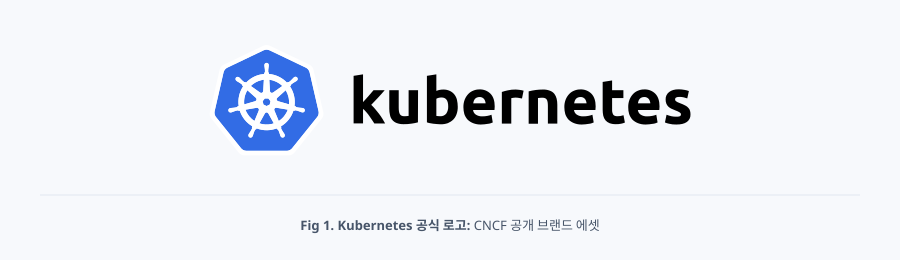
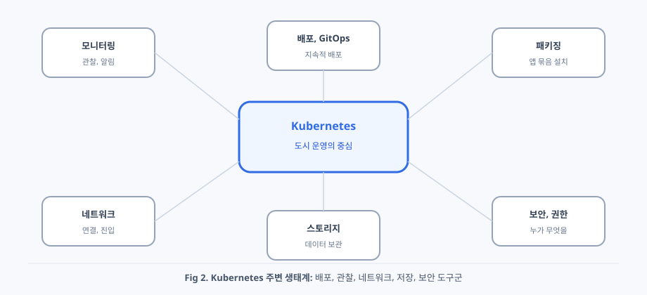
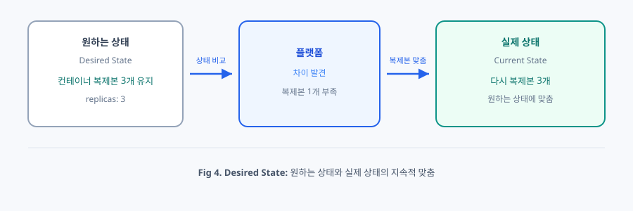
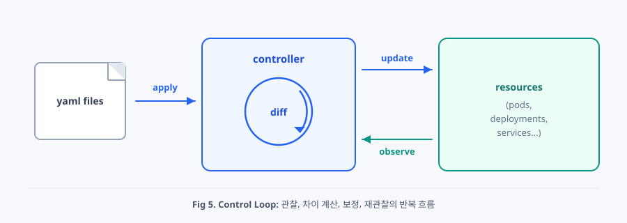
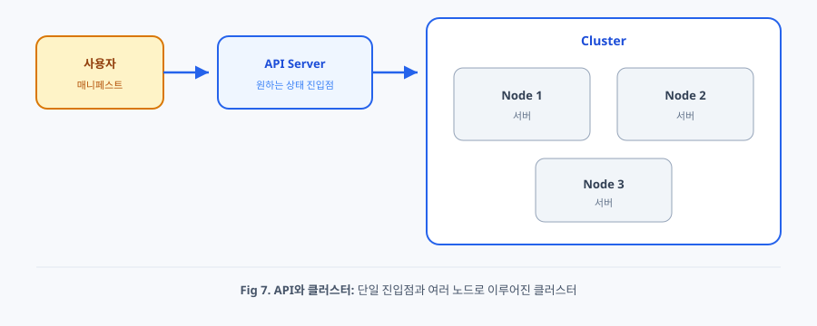
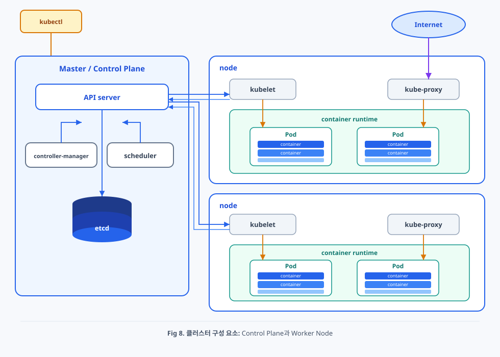
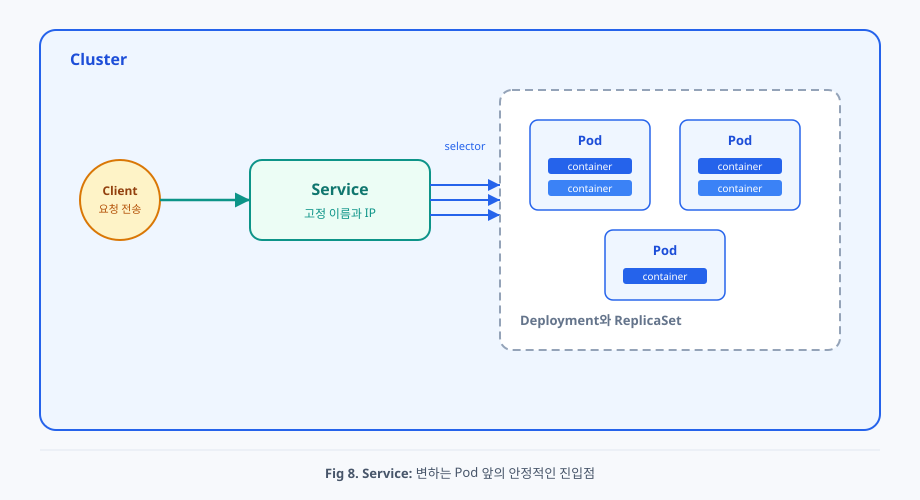
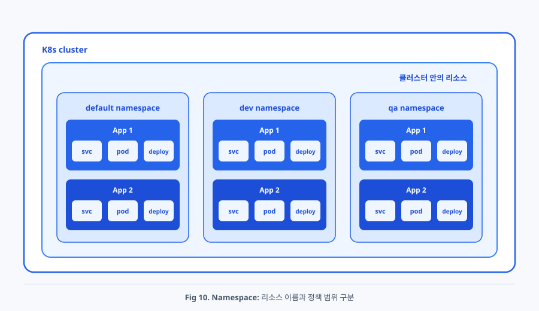
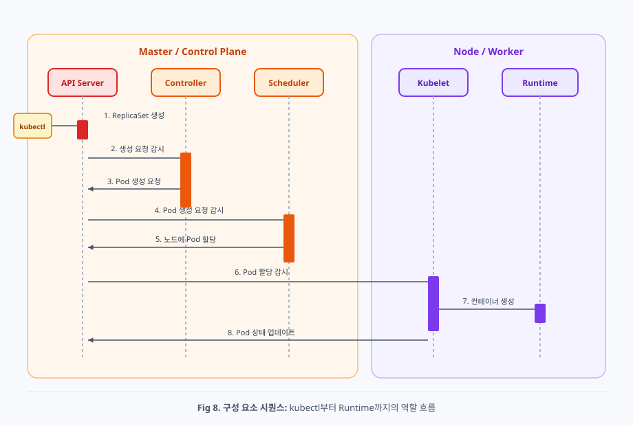

# 2주차. Kubernetes 이해하기 — 등장 배경부터 설계 철학까지

> **이전 글**에서 물리 서버 → VM → Container/Docker → Compose/Swarm으로 이어진 배경을 따라왔고, Docker만으로 운용할 때 손이 가는 한계를 시나리오로 겪어 보셨을 거예요. 이번 글은 그 빈칸 위에서, Kubernetes가 왜 등장했는지·무엇을 약속하는지·실무에서 만지는 대상과 클러스터가 어떻게 맞물리는지를 개략적으로 정리해 볼게요.

---

## Kubernetes의 위치와 인기


<div align="center">



</div>

Kubernetes는 컨테이너를 여러 서버에 걸쳐 운영하기 위한 오픈소스 플랫폼이에요. 2014년 공개된 뒤 전 세계 기여자가 코드를 쌓아 왔고, 주요 클라우드는 관리형으로 제공하며 같은 모델을 노트북에서도 돌릴 수 있습니다. 어디에서 실행하든 비슷한 운영 방식을 공유한다는 점이, 사실상의 표준처럼 받아들여진 이유 중 하나라고 할 수 있겠어요.


<div align="center">



</div>

인기의 배경에는 이식성도 있습니다. Kubernetes를 전제로 만든 애플리케이션은 환경이 바뀌어도 같은 선언 방식으로 배포를 시도할 수 있다는 약속에 가깝죠. 동시에 배포·모니터링·네트워크·스토리지·보안을 돕는 도구들이 Kubernetes 주변에 모여, “도시 운영”을 혼자 다 만들지 않아도 되게 받쳐 줍니다. 예를 들어 패키지처럼 배포 구성을 묶어 주는 도구, 배포 파이프라인을 자동화하는 도구, 지표를 모으는 모니터링 도구 등이 그 생태계를 이뤄요.

그렇다고 배우기 쉽다는 뜻은 아니에요. 처음에는 이름과 설정 파일이 많아 “왜 이렇게 복잡하지?”가 먼저 나오기 쉽습니다. 조금 익숙해지면 “이런 것까지 되는구나” 쪽으로 질문이 바뀌는 경우가 많죠. 이 글은 그 순서에 맞춰, 곧바로 모든 이름을 외우기보다 **필요성 → 설계 철학 → 큰 그림 → 구성 요소 → 리소스 → 동작 → 명령어로 살펴보기**를 따라가 볼게요.

---


## Docker만으로 부족한 이유

이전 글에서 이미 느꼈듯, 컨테이너를 여러 개 실행하는 것 자체는 어렵지 않습니다. 어려운 쪽은 운영 판단이에요. Docker의 등장 이후 컨테이너는 실행 환경을 표준화하는 핵심이 되었고, Dockerfile로 환경을 코드처럼 남길 수 있게 되었습니다.

```bash
docker build -t my-app:1.0 .
docker run -p 8080:80 my-app:1.0
```

같은 이미지로 로컬·테스트·운영을 맞출 수 있게 되면서 환경 불일치 문제는 크게 줄었죠. Docker Compose로 여러 컨테이너를 한 애플리케이션처럼 묶을 수 있고, Docker Swarm으로 여러 서버에 분산하는 것도 가능해졌습니다. 그래서 자연스럽게 이런 질문이 나와요.

“Docker Compose나 Docker Swarm으로도 충분하지 않은가? Kubernetes는 왜 필요한가?”

이 질문은 Kubernetes를 이해하기 위한 좋은 출발점입니다.

> Docker는 “컨테이너를 실행하는 도구”이고, Kubernetes는 “컨테이너가 실행되는 전체 시스템을 관리하는 플랫폼”이에요. 비유하자면 Docker는 집을 짓는 공구에, Kubernetes는 도시를 설계·운영하는 체계에 가깝습니다.

단일 서버에서는 Docker Compose만으로도 충분한 경우가 많고, 여러 서버에서는 Docker Swarm으로도 일정 수준의 운영이 가능합니다. 다만 규모와 요구가 커질수록, 실행·복제를 넘어 **더 정교한 관리**가 필요해져요.

### Docker Swarm의 한계

Docker Swarm은 Docker에 익숙한 팀이 여러 서버 배포를 빠르게 시작하기에 좋은 선택지였어요. 그런데 서비스가 커질수록 한계가 자주 드러납니다. Kubernetes는 애플리케이션마다 CPU·메모리 사용 범위를 적어 두는 일, 부하에 따라 개수를 자동으로 맞추는 일, 통신을 필요한 범위로 좁히는 일, 저장소를 같은 방식으로 요청하는 일, 누가 무엇을 조작할 수 있는지 권한을 나누는 일처럼 **운영 정책을 시스템으로 남기는 도구**가 더 풍부합니다. Swarm도 배포·스케일·롤링 업데이트는 되지만, 세밀한 정책과 확장 생태계는 상대적으로 얇은 편이죠. 업계에서는 Kubernetes가 오케스트레이션의 사실상 표준으로 자리 잡았다고 볼 수 있어요.

### 운영 판단의 차이

트래픽이 급증할 때 Docker Swarm에서는 관리자가 직접 복제본 수를 늘는 식의 개입이 흔합니다.

```bash
docker service scale web=10
```

확장은 가능하지만, **언제·몇 개까지·언제 줄일지**의 판단은 사람에게 남아요. Kubernetes에서는 CPU 사용률 같은 조건을 정책으로 남겨 두고, 그 이후의 판단과 실행을 플랫폼에 맡기는 쪽으로 문제를 바꿉니다. 예를 들어 “CPU 사용률 70%를 넘으면 자동으로 늘려라”는 식의 목표만 정의해 두면 됩니다.

장애도 마찬가지예요. 새벽 세 시에 컨테이너 하나가 죽었을 때 Docker만 있다면 `docker ps` → 로그 → `docker restart`를 사람이 수행합니다. Kubernetes에서는 **원하는 개수와 실제 개수의 차이**를 플랫폼이 계속 맞춰 가려는 흐름이 있고, 어느 서버에 올릴지를 고른 뒤 그 서버에서 다시 기동하는 쪽으로 이어질 수 있어요. 사람이 개입하지 않아도 복구가 시작된다는 점이, “집을 짓는 공구”와 “도시를 운영하는 시스템”의 차이를 실감하게 해 줍니다. (이 “차이를 맞추는 흐름”과 “어느 서버에 둘지”는 뒤에서 설계 철학·구성 요소로 이름을 붙여 볼게요.)

배포에서도 결이 갈려요. Docker Swarm은 기본적인 롤링 업데이트—새 버전을 조금씩 갈아 끼우는 방식—를 제공합니다. Kubernetes는 여기에 더해, 트래픽 전부 대신 **일부만 새 버전으로 보내는** 식의 배포도 운영에서 자주 다룹니다. 예를 들어 옛 버전과 새 버전을 나란히 두고 전환하거나(블루·그린), 소수 사용자에게만 새 버전을 먼저 노출하는(카나리) 식이죠. 단순한 기능 목록의 차이가 아니라, **운영 리스크를 제어할 수 있는 수준**의 차이에 가깝다고 할 수 있겠어요.

결국 Kubernetes는 컨테이너를 많이 띄우는 도구를 넘어, 규모 있는 운영 환경을 제공하는 플랫폼으로 받아들여집니다. 컨테이너를 늘리는 일을 넘어 **운영 규칙과 정책을 시스템 차원에서 다룰 수 있기** 때문이에요.

### 컨테이너 오케스트레이션

**컨테이너 오케스트레이션(Container Orchestration)** 은 컨테이너를 실행하는 일에 그치지 않아요. 어떤 서버에 둘지, 몇 개를 유지할지, 장애 시 어떻게 복구할지, 트래픽을 어떻게 나눌지를 자동화하는 시스템에 가깝습니다. 오케스트라 지휘자가 악기(상자)의 배치·박자·교체를 조율하듯, 여러 서버에 걸친 상자의 배치·확장·복구·연결을 조율한다고 보시면 됩니다. 즉 “컨테이너 하나”가 아니라 **전체 시스템**을 관리하는 개념이고, Kubernetes는 이 문제를 풀기 위해 등장했습니다.

비유를 한 번 더 쓰면 이렇습니다. Docker는 잘 포장된 상자를 만들고 여는 일에 강하고, Docker Compose는 한 집 안의 상자들을 한 도면으로 정리하며, Docker Swarm은 작은 단지 규모의 분산을 돕고, Kubernetes는 규모가 커질 때 필요한 정책과 자동화를 표준에 가깝게 묶어 둔 플랫폼이에요. 그 자동화가 어떤 약속 위에서 돌아가는지, 바로 아래 **Kubernetes의 대표 설계 철학**에서 잡아 볼게요.

---


## Kubernetes의 대표 설계 철학

오케스트레이션을 “누가 무엇을 자동으로 하느냐”로만 보면 이름이 많아 보입니다. 먼저 Kubernetes가 지키려는 약속을 세 가지로 묶어 두면, 뒤의 창구·구성 요소·리소스가 같은 줄기로 읽혀요. 아래에서는 각 철학을 한 문장으로 먼저 짚고, 이어서 풀어 볼게요.

### 1. 선언형과 원하는 상태 : 원하는 모습을 선언으로 남기고, 그 유지 책임은 시스템에 맡긴다.

Docker에서는 흔히 이렇게 실행합니다.

```bash
docker run -d nginx
```

이 방식은 “어떻게 실행할 것인가”를 **명령**하는 쪽에 가깝고, 실행 이후 상태를 시스템이 계속 책임지지는 않아요. 이런 방식을 **명령형(Imperative)** 이라고 부릅니다.

Kubernetes는 다른 접근을 씁니다. 일상적으로는 **YAML**—들여쓰기로 구조를 표현하는 설정 파일 형식—로 목표를 적어 둡니다. 이렇게 적어 둔 내용을 **매니페스트(manifest, 애플리케이션·운영 설정을 담은 명세서)** 또는 **리소스(resource, 운영 시스템에 제출하는 객체)** 라고 불러요. 뒤에서 자세히 볼 Deployment 매니페스트에서도, “복제본 세 개를 유지해 달라”는 목표는 `replicas: 3` 한 줄로 남길 수 있습니다.

```yaml
apiVersion: apps/v1
kind: Deployment
metadata:
  name: web
spec:
  replicas: 3   # 원하는 복제본 수
```
<div align="center">



</div>

이 선언의 핵심은 **원하는 상태(Desired State)** 예요. “지금은 무엇이 몇 개 떠 있는가”가 아니라 **“이렇게 되어 있기를 바란다”** 를 적어 둔 목표입니다. Docker Compose의 YAML이 한 집의 도면이었다면, Kubernetes에서도 비슷한 형태로 목표를 적고 넘기게 됩니다. 차이는 도면을 넘긴 뒤의 책임에 있어요.

Docker만 있을 때 상자가 죽으면 사람이 `docker start`를 눌러 현장을 도면에 맞췄죠. Kubernetes에서는 플랫폼이 **원하는 상태**와 **현장에 실제로 있는 상태(Current State)** 를 비교하고, 어긋나면 상자를 더 띄우거나 줄이거나 다른 노드로 옮기며 차이를 줄입니다. 단지 관리사무소가 “이 서비스 상자를 세 개 유지해 달라”는 도면을 받아 두고, 하나가 빠지면 다시 채우는 일과 같아요. “지금 당장 3개를 띄워라”로 끝나는 명령이 아니라 **“앞으로도 계속 3개가 유지되어야 한다”** 는 목표를 남기는 방식을 **선언형(Declarative)** 이라고 합니다. 이런 자동 맞춤을 **셀프 힐링(self-healing, 자기 치유)** 이라고 부르기도 해요.

선언형의 강점은 자동 복구만이 아닙니다. 운영 설정이 YAML 매니페스트로 남기 때문에 인프라·배포를 코드처럼 다룰 수 있어요. 변경을 Git 커밋으로 남기고, 파일만 있으면 같은 상태를 다시 만들며, 운영 변경도 리뷰하고, 이전 커밋으로 되돌려 다시 적용할 수 있습니다. 이런 감각을 **IaC(Infrastructure as Code, 인프라를 코드로 관리)** , 더 나아가 Git 저장소를 진실의 원천으로 삼는 **GitOps**로 이어 가기도 해요.

### 2. 제어 루프 : 원하는 상태와 실제 상태의 차이를 계속 관찰하고, 어긋나면 자동으로 보정한다.

<div align="center">



</div>

**제어 루프(Control Loop)** 를 한 문장으로 정의하면, **클러스터가 지금 어떤 상태인지 계속 관찰하고, 사용자가 선언한 원하는 상태와 다르면 자동으로 맞춰 가는 반복 메커니즘**입니다. 온도 조절기가 목표 온도와 현재 온도를 비교해 난방을 켜고 끄는 일과 비슷해요. 차이를 줄이는 한 번의 맞춤 동작을 **보정(Reconcile)** 이라고 부릅니다.

중요한 포인트는 두 가지입니다. 첫째, Kubernetes는 “명령을 실행하고 끝나는 시스템”이 아니라 **상태를 유지하는 시스템**이에요. 둘째, 제어 루프는 특정 버튼 하나가 아니라 Kubernetes 전체의 작동 방식에 가깝습니다. 원하는 상태를 읽고, 현재 상태를 확인하고, 차이를 계산하고, 차이를 줄이도록 보정을 **요청**한 뒤, 다시 관찰합니다. 한 번으로 끝나지 않는 것이 핵심이에요.

예를 들어 “복제본 3개”가 목표인 상태에서 새벽 세 시에 실행 단위가 하나 줄면, Desired는 3·Current는 2·Diff는 1이 되고, 새로 만들고 → 어디에 둘지 정하고 → 실행하는 흐름으로 다시 3에 맞추려 합니다. 그래서 셀프 힐링은 특수 기능이라기보다, **원하는 상태를 유지하려는 제어 루프의 자연스러운 결과**라고 할 수 있겠어요.

이 루프를 누가 돌리는지, 실제로 누가 컨테이너를 띄우는지는 뒤에서 **구성 요소**로 이름을 붙입니다. 지금은 “중앙은 상태를 맞추라고 요청하고, 실제 실행은 각 노드가 맡는다”는 책임 분리만 기억해 두시면 충분해요.

### 3. 이벤트 기반 통신 : 구성 요소는 직접 명령하지 않고, 상태 변화를 구독하며 각자 맡은 일만 수행한다.

Kubernetes는 구성 요소끼리 “직접 전화”로 명령을 주고기보다, 중앙에 저장된 상태 변화를 **구독(Watch)** 하며 움직입니다. 상태가 바뀌면 관심 있는 구성 요소가 그 사실을 알아채고, 각자 맡은 일—개수 맞추기, 배치 결정, 실행—만 수행해요. 뒤에서 볼 생성 흐름이 바로 이 설계의 결과입니다. 느슨한 결합이 장애 전파를 줄이려는 설계라고 이해하시면 됩니다.

설계 철학을 잡았으니, 이제 그 약속이 실제로 오가는 자리—**API와 클러스터**—를 짧게 보고, 이어서 구성 요소로 들어가 볼게요.

---


## 클러스터와 API

앞에서 Docker는 상자를 다루는 공구에, Docker Compose는 한 집의 도면에, Docker Swarm은 단지 관리사무소에 비유했습니다. Kubernetes는 그 연장선에서, **여러 건물에 흩어진 상자를 도시 규모로 운영하는 체계**로 이해하시면 됩니다.


<div align="center">



</div>

Kubernetes를 한 문장으로 압축하면, 컨테이너로 만든 애플리케이션을 **선언하고, 그 선언이 실제로 유지되도록 돕는 오케스트레이션 플랫폼**이라고 할 수 있어요. 여기서 두 축만 먼저 기억해 두시면 충분합니다.

첫째는 **API**예요. API는 사용자가 도시 운영에 “원하는 모습”을 전달하는 **창구**입니다. 시청 민원 창구에 서류를 내듯, “웹 상자를 세 개 유지해 달라”, “이 이미지로 돌려 달라” 같은 요청을 API로 보내게 되죠. 창구가 하나라는 점이 중요합니다. 건물(서버)마다 따로 전화하지 않아도, 같은 창구로 도시의 운영을 말할 수 있어요.

둘째는 **클러스터(Cluster)** 입니다. 클러스터는 여러 컴퓨터를 **하나의 논리 단위**로 묶어, 그 요청이 실제로 실행되는 **도시 전체**예요. 도시를 이루는 개별 건물이 **노드(Node, 클러스터에 참여하는 서버)** 입니다. Docker Swarm에서 본 “여러 서버를 하나의 단지로”와 같은 층위이고, Kubernetes에서는 그 단지를 더 큰 운영 규칙과 함께 다룬다고 보시면 됩니다. 노드가 늘거나 줄어도, 사용자는 보통 “어느 건물 몇 호실”보다 도시 전체에 “이런 상태로 유지해 달라”고 맡기는 경우가 많아요. 클라우드에서는 이런 클러스터를 직접 만들지 않고, 관리형 서비스로 받아 쓰는 경우도 흔합니다.

도면(매니페스트)을 창구에 제출하면, 플랫폼이 그 도면을 읽고 어느 노드에 올릴지 정하며, 앞에서 본 제어 루프가 현장과의 차이를 줄이려 합니다. 애플리케이션이 Node.js든 Go든, Kubernetes 입장에서는 컨테이너 이미지와 매니페스트가 중요합니다. 언어가 달라도 같은 창구·같은 도면 방식으로 운영을 말할 수 있다는 점이, 팀 규모가 커질 때 특히 힘이 돼요.

---


## 클러스터 구성 요소

설계 철학이 “상태를 선언하고 시스템이 맞춘다”라면, 구성 요소는 “누가 그 일을 수행하는가”예요. 앞에서 본 선언형·제어 루프·Watch가 실제로 어떤 프로세스에 얹히는지를 등장인물처럼 짚어 볼게요. 리소스 이름은 바로 다음 절에서 자세히 만집니다.

클러스터는 크게 **Control Plane(컨트롤 플레인, 두뇌)** 과 **Worker Node(워커 노드, 실제 건물이 서는 자리)** 로 나뉩니다.


<div align="center">



</div>

### Control Plane

Control Plane은 클러스터의 **두뇌**에 해당하며, Desired State를 해석·유지하고 워크로드가 어느 노드에 갈지 결정하는 등의 판단을 담당합니다. 대표 구성 요소는 API Server, Scheduler, Controller Manager, etcd예요. 여기서부터는 편의상 Kubernetes의 최소 실행 단위를 **Pod(파드)** 라고 부를게요. 정의와 예시는 바로 다음 절에서 잡습니다.

**API Server**는 Kubernetes의 **중앙 관문**입니다. 사용자의 `kubectl` 호출과 다른 구성 요소의 요청이 모두 이곳을 거쳐야 클러스터 상태를 조회하거나 바꿀 수 있어요. 인증·인가와 형식 검사를 수행한 뒤 변경 내용을 etcd에 반영합니다.

**Scheduler(스케줄러)** 는 아직 노드가 정해지지 않은 Pod를 알아채고, 각 Worker 노드의 자원 여유와 배치 제약을 고려해 **어느 노드에 둘지**만 결정합니다. 컨테이너를 직접 실행하지는 않아요. “이 Pod는 이 노드에 할당한다”는 결정을 API Server에 기록하면, 이후 해당 노드의 Kubelet이 실제 컨테이너를 띄웁니다.

**Controller Manager**는 여러 **컨트롤러(controller)** —원하는 상태를 유지하려고 제어 루프를 도는 장치—를 한 프로세스에서 묶어 실행합니다. Deployment·ReplicaSet·Node처럼 대상마다 컨트롤러가 있고, API Server의 리소스를 Watch 하면서 Desired와 Current가 다르면 보정(Reconcile)을 **요청**합니다. 노드에 직접 접속하지 않고 API에 상태 변경을 남기는 방식이에요.

**etcd**는 클러스터 상태를 저장하는 **분산 Key-Value 데이터베이스**예요. 도시의 “공문서 보관소”에 비유할 수 있습니다. 리소스 정의와 현재 상태가 최종적으로 여기에 기록되고, 클러스터 관점에서는 **단일 진실 소스(Single Source of Truth)** 로 취급됩니다. etcd는 기억 장치이고, API Server는 그 기억 장치에 읽고 쓰는 창구입니다.

**모든 구성 요소는 직접 통신하지 않고 API Server를 통해 상태를 공유합니다.**

### Worker Node

Worker Node는 실제 워크로드가 돌아가는 머신이며, **Kubelet**, **kube-proxy**, **Container Runtime**이 함께 동작합니다.

**Kubelet**은 각 노드에서 돌아가는 **에이전트**예요. 건물 관리인이 시청(창구)에서 내려온 작업 지시서를 받아 현장을 움직이는 일과 비슷합니다. API Server로부터 “이 노드에서 실행해야 할 Pod”를 받아오고, Container Runtime을 호출해 컨테이너를 만들고 시작·중지합니다. Pod와 노드 상태를 주기적으로 API Server에 보고해요.

**kube-proxy**는 뒤에서 볼 **Service**—변하는 Pod 집합 앞의 안정적인 진입점—를 실제 네트워크 규칙으로 구현합니다. Service와 연결된 Pod 주소 정보를 받아, Service IP로 들어온 요청이 실제 Pod IP로 전달되도록 설정해요.

**Container Runtime**은 이미지를 내려받고 컨테이너 프로세스를 **실제로 실행·종료**하는 소프트웨어입니다. containerd, CRI-O 등이 여기에 해당하며, Kubelet은 **CRI(Container Runtime Interface)** —런타임과 대화하는 표준 규격—로 런타임과 이야기합니다.

### containerd와 Docker의 역할 분담

“Kubernetes가 컨테이너를 돌린다며, 그럼 Docker로 실행해야 하는 거 아닌가요?”라는 질문이 자연스럽습니다. 결론부터 말하면, **Kubernetes가 버린 것은 ‘Docker 이미지’가 아니라 ‘Docker Daemon을 거치는 실행 경로’** 에 가깝아요.

과거에는 `Kubelet → Docker Daemon → containerd → 컨테이너 실행`처럼 중간 계층이 더 있었습니다. Docker는 실행뿐 아니라 빌드·네트워크·볼륨·Swarm까지 포함한 큰 프로그램이라, Kubernetes 입장에서는 실행에 불필요한 중간 계층이었어요. 지금은 `Kubelet → CRI → containerd / CRI-O → 컨테이너 실행`처럼 단순해지는 경우가 많습니다.

개발 단계에서는 Docker로 이미지를 만들고 검증하고, 운영 단계에서는 그 이미지를 Kubernetes가 정책·자동화·복구·확장과 함께 관리한다고 나누어 이해하시면 됩니다. Docker로 만든 이미지는 공통 표준(OCI)을 따르므로 Kubernetes에서도 그대로 쓸 수 있어요.

```bash
docker build -t my-app:1.0 .
docker run -p 8080:80 my-app:1.0
# 레지스트리에 올린 뒤 Kubernetes 매니페스트의 image로 사용
```


### Control Plane의 고가용성

운영 환경에서는 Control Plane을 여러 대로 두어 **고가용성(HA, High Availability)** —일부가 죽어도 전체가 멈추지 않게 하는 구성—을 확보하는 경우가 많아요. API Server를 여러 대 두고 앞단에 로드 밸런서를 두면, 사용자는 주소 하나로 요청을 보낼 수 있습니다. etcd도 보통 3개 이상(홀수)로 구성하고, **쿼럼(quorum, 과반)** 이 유지되어야 읽기·쓰기가 가능합니다.

```text
[Load Balancer]
    ↓
API Server (CP1) / API Server (CP2) / API Server (CP3)
    ↓
etcd (3개 이상, 쿼럼 기반)
    ↓
Worker Nodes (여러 대)
```

etcd 3개 중 1개가 장애여도 과반이 유지되면 정상 동작에 가깝고, 2개가 동시에 장애면 관리 기능이 크게 제한될 수 있습니다.

---


## 핵심 리소스

구성 요소가 “누가 움직이는가”라면, 리소스는 “무엇을 선언하는가”예요. 실무에서 개발자가 **매일 손으로 만지는 대상**은 인프라 내부 프로세스보다, 서비스를 배포하기 위한 **리소스 객체**들입니다. 가장 자주 만나는 다섯 가지—**Pod**, **Deployment**, **Service**, **Ingress**, **Namespace**—를 개념으로만 잡아 볼게요. 매니페스트 예시는 Pod 하나만 두고, 나머지는 말로 이해하시면 충분합니다.

실무에서 “쿠버네티스에 배포한다”는 말은 보통 이 다섯 가지를 조합해 서비스를 운영한다는 뜻에 가깝습니다.

### Pod

Docker에서는 컨테이너가 실행 단위입니다. Kubernetes에서는 **Pod(파드)** 가 최소 단위예요. Pod는 하나 이상의 컨테이너를 **함께 배치하고 함께 살게** 묶은 실행 단위라고 정의할 수 있습니다. 기숙사에서 같은 방을 쓰는 룸메이트처럼, 한 Pod 안의 컨테이너는 같은 노드에 살고, 네트워크와 볼륨을 자연스럽게 공유하죠.

“왜 컨테이너를 직접 실행하지 않나요?”라는 질문에 대한 답은, 실제 서비스에서 컨테이너가 단독으로만 동작하지 않는 경우가 많기 때문입니다. 예를 들어 하나의 API 서버는 메인 애플리케이션, 로그 수집기(**사이드카(sidecar)**, 옆에 붙여 돕는 컨테이너), 보안 모듈처럼 **함께 실행되고 네트워크·스토리지를 공유해야 하는** 컨테이너로 구성될 수 있어요. Kubernetes는 “컨테이너 하나”가 아니라 “함께 살아야 하는 컨테이너 묶음”을 최소 단위로 다루기 위해 Pod를 사용합니다.

```yaml
apiVersion: v1
kind: Pod
metadata:
  name: api-server
spec:
  containers:
  - name: api
    image: my-api:latest
  - name: log-agent
    image: fluentd:latest
```

한 Pod 안의 컨테이너는 같은 네트워크 공간을 나눕니다. 그래서 서로 **localhost**로 이야기할 수 있어요. 바깥에서 보면 Pod마다 클러스터 안 주소(Pod IP)가 하나씩 붙는 감각에 가깝고, 그 Pod가 떠 있는 노드에도 따로 노드 IP가 있습니다. 같은 Pod 안에서는 볼륨도 나누어 쓸 수 있어요. “함께 배치·함께 생명주기·네트워크·볼륨 공유”가 Pod를 이해하는 네 키워드입니다.

감각만 짧게 비교하면, Docker Container는 보통 컨테이너 하나가 독립적으로 네트워크·생명주기를 갖는 반면, Pod는 컨테이너를 하나 이상 묶어 같은 네트워크·볼륨·생명주기를 나눕니다. 즉 Kubernetes는 컨테이너를 직접 다루기보다, 컨테이너를 그룹화한 단위(Pod)를 관리한다고 보시면 됩니다.

다만 Pod를 하나 직접 올리는 것만으로는 “항상 몇 개를 유지”하기가 어렵습니다. 그래서 보통은 바로 아래 Deployment로 목표 개수를 선언합니다.

### Deployment

**Deployment(디플로이먼트)** 는 Pod를 직접 한 번 실행하는 객체가 아니라, **원하는 상태를 정의해 “항상 그 상태가 유지되게 만드는”** 상위 리소스예요. 단지 관리사무소가 “이 서비스 상자를 세 개 유지해 달라”는 규칙을 받아 두고 계속 맞추는 일과 비슷합니다. `replicas: 3`은 단순한 숫자가 아니라 운영 정책에 가깝죠. Kubernetes는 “언제나 3개의 Pod가 떠 있어야 한다”는 Desired State를 가지고, Current State가 그보다 적어지면 제어 루프가 자동으로 보정합니다.

Pod가 하나 죽으면 이를 감지하고 새 Pod를 만들어 상태를 복구하려는 흐름이 이어질 수 있어요. 사람이 개입하지 않아도 자동으로 이루어지는 경우가 많습니다. 이미지 버전을 바꾸면 롤링 업데이트로 이어지는 경우도 흔합니다. 내부적으로는 **ReplicaSet(레플리카셋)** —“이 라벨의 Pod를 몇 개 유지한다”는 복제 집합—을 만들어 Pod 집합을 관리합니다. 이름은 이후 실습에서 더 자세히 만져 볼게요.

자동 복구를 현실적으로 보면, Kubernetes는 Pod 개수만 맞추는 것이 아니라 “정상 상태”를 기준으로 조치합니다. 자주 쓰이는 장치가 **Probe(프로브, 헬스체크)** 예요. Probe는 “이 상자가 건강한지”를 주기적으로 확인하는 검사라고 보시면 됩니다. 병원에 정기 검진이 있듯, 컨테이너에도 살아 있는지·손님을 받을 준비가 됐는지를 묻는 검사가 있는 셈이죠.

**Liveness Probe**는 컨테이너가 “살아 있는가?”를 묻고, 실패하면 재시작으로 이어질 수 있습니다. **Readiness Probe**는 “요청을 받을 준비가 되었는가?”를 묻고, 실패하면 트래픽에서 제외되는 쪽에 가깝습니다. 자세한 설정 키는 이후 실습에서 만져 볼게요.

장애가 반복될 때는 이벤트로 원인을 추적해 볼 수 있어요. `kubectl get events`처럼, kubectl로 클러스터에 “요즘 무슨 일이 있었는지”를 물어볼 수 있습니다.

### Service


<div align="center">



</div>

Pod는 새로 만들어질 때마다 주소가 바뀔 수 있어요. 그래서 클라이언트에게 Pod IP를 직접 외우게 하기는 어렵습니다. **Service(서비스)** 는 계속 변하는 Pod 집합 앞단에 **안정적인 진입점(고정 가상 IP·이름)** 을 제공하는 리소스예요. 매장 직원이 자주 바뀌어도 “결제 창구”라는 간판은 그대로 두는 일과 비슷합니다.

어떤 Pod를 창구 뒤로 묶을지는 **레이블(label)** 로 고릅니다. 레이블은 리소스에 붙이는 키·값 형태의 간단한 표식이에요. 예를 들어 `app: web`이라고 붙여 두면, Service는 “`app=web`인 Pod들”을 찾아 트래픽을 나눕니다. 이 “표식으로 대상을 고르는 규칙”을 **셀렉터(selector)** 라고 부릅니다.

클러스터 안에서는 DNS(`my-svc.my-namespace.svc.cluster.local` 같은 형태)로 이름을 찾을 수 있고, Pod가 새로 생겨 IP가 바뀌어도 클라이언트는 같은 Service 이름·ClusterIP로 접근할 수 있어요. 각 노드에서는 앞에서 본 **kube-proxy**가 Service 규칙을 실제 네트워크 경로로 구현합니다.

용도에 따라 ClusterIP(기본, 내부 전용), NodePort(각 노드의 고정 포트로 노출), LoadBalancer(클라우드 로드 밸런서와 연동해 외부에 공개), Headless(`clusterIP: None`, 개별 Pod를 직접 해석)처럼 노출 범위가 달라집니다. 핵심만 기억하면, **셀렉터로 Pod 집합을 정하고**, 서비스 포트에서 컨테이너 포트로 요청을 넘기며, **타입으로 노출 범위**를 정한다는 점이에요.

### Ingress

Service는 클러스터 안에서 Pod로 안정적으로 연결되는 “고정된 접근점”을 만들어 주지만, 외부(인터넷)에서 들어오는 요청까지의 경로는 별도 구성이 필요해요. **Ingress(인그레스)** 는 “어떤 도메인·경로로 들어온 요청을 어떤 Service로 보낼지”를 정의하는 라우팅 계층입니다. 건물 로비의 안내판처럼, 손님을 어느 창구(Service)로 안내할지 적어 둔 규칙이라고 보시면 됩니다. 도메인 기반 라우팅과 **TLS 종료**—HTTPS 암호화를 앞단에서 풀어 주는 처리—같은 일을 담당합니다.

> Ingress 리소스만 만든다고 바로 동작하는 것은 아니고, 실제 트래픽을 받아 처리하는 **Ingress Controller**(NGINX Ingress, Traefik 등)가 클러스터에 함께 배포되어 있어야 합니다.

Ingress와 Ingress Controller는 역할이 달라요. Ingress는 API에 저장되는 **라우팅 규칙(설정) 리소스**이고, Ingress Controller는 그 규칙을 Watch 하다가 실제 L7(애플리케이션 계층) 프록시·로드 밸런서 설정으로 바꿔 적용하는 **실행 컴포넌트**예요. 정리하면 **Ingress는 설정**, **Ingress Controller는 그 설정을 트래픽 처리로 구현하는 실행체**입니다.

### Namespace


<div align="center">



</div>

지금까지의 Pod, Deployment, Service, Ingress는 모두 Kubernetes API 객체입니다. **Namespace(네임스페이스)** 는 이 객체들을 클러스터 안에서 팀·서비스·환경 단위로 구분하기 위한 **논리적 경계**예요. 한 도시 안에 구역을 나누어 주소를 겹치지 않게 관리하는 일과 비슷합니다. 클러스터를 물리적으로 쪼개지 않고도 운영 경계를 만들 수 있다는 점이 핵심이죠.

같은 이름의 리소스도 Namespace가 다르면 공존할 수 있고, 권한·사용량 한도 같은 정책을 Namespace 단위로 나눌 수 있습니다. Service 이름 찾기도 Namespace를 포함해 동작해요. 예를 들어 `web.default.svc.cluster.local`과 `web.prod.svc.cluster.local`은 서로 다른 대상입니다. 리소스 식별은 사실상 `namespace/name` 조합으로 이해하는 것이 안전합니다.

실무에서는 같은 클러스터 안에서도 `dev`, `staging`, `prod`처럼 Namespace를 분리해 쓰는 경우가 많아요.

```bash
kubectl get pods -n prod
kubectl apply -f deploy.yaml -n staging
kubectl config set-context --current --namespace=dev
```


### 리소스 연결 관계

처음에는 Pod, Deployment, Service, Ingress가 각각 별개처럼 보이지만, 실제 운영에서는 서로 다른 책임을 맡아 하나의 요청 경로를 완성합니다.

트래픽 관점에서 보면 보통 이렇게 이어집니다. 사용자 요청이 들어오면 Ingress Controller가 Ingress 규칙을 확인하고, 매칭된 Service로 넘깁니다. Service는 셀렉터로 연결된 Pod 중 하나를 골라 전달하고, 선택된 Pod가 응답합니다. 그 뒤에서 Deployment가 Pod 개수와 업데이트 상태를 계속 유지하죠. 즉 경로의 골격은 **Ingress → Service → Pod**이고, Deployment는 그 경로의 “처리 주체”를 안정적으로 지켜 줍니다. 이 관계는 보통 같은 Namespace 안에서 먼저 성립해요.

핵심은 **Deployment와 Service가 직접 연결되는 것이 아니라 Pod의 label로 간접 연결**된다는 점이에요. Deployment는 앞으로 만들 Pod에 `app: web` 같은 라벨을 붙이도록 적어 두고, Service는 같은 라벨을 가진 Pod 집합을 찾아 트래픽을 전달합니다. Pod가 교체되어 IP가 바뀌어도, 라벨만 일치하면 Service가 새 Pod를 찾아 연결하죠.

자주 헷갈리는 세 칸만 구분해 두면 초반 실수가 줄어듭니다. Deployment에서 **관리할 Pod를 고르는 기준 라벨**과 **앞으로 생성될 Pod에 실제로 붙일 라벨**은 보통 같게 맞춰야 합니다. 리소스 최상단에 붙는 메타 라벨은 객체 검색·분류용이고, Pod 매칭의 주인공은 아닙니다.

---


## 동작 흐름

구성 요소와 리소스를 알았으니, 실제로 그 둘이 어떻게 맞물려 동작하는지 한 번에 연결해 볼게요.


<div align="center">



</div>

### Pod 생성 순서

대략적인 순서는 이렇습니다. 사용자가 API Server에 “이런 Pod(또는 Deployment)를 원해”라고 요청하면, API Server는 etcd에 새 상태를 저장합니다. Controller Manager는 원하는 개수와 실제 개수의 차이를 보고 아직 노드가 정해지지 않은 Pod를 만들도록 API Server에 요청하고, 그 결과도 etcd에 남아요. Scheduler는 노드 미할당 Pod를 확인하면 조건에 맞는 Worker Node를 찾아 할당 정보를 기록합니다. 각 노드의 Kubelet은 자신에 할당되었지만 아직 생성되지 않은 Pod를 확인하고 컨테이너를 띄운 뒤, 상태를 주기적으로 API Server에 보고합니다.

역할을 다시 분해하면 선명해져요. Scheduler는 **배치만**, Controller는 **개수·상태 유지만**, Kubelet은 **실행만** 합니다.

### kubectl과 kubeconfig

`kubectl`은 단순한 명령 모음이 아니라 **REST API 클라이언트**예요. `kubectl get pods` 같은 명령은 내부적으로 API Server로 향하는 HTTPS 요청으로 바뀝니다. 연결의 열쇠가 **kubeconfig**입니다. kubectl이 읽는 설정 파일로, 어느 클러스터(보통 로드 밸런서 주소), 어떤 사용자·인증 정보, 어떤 컨텍스트를 쓸지를 정해요.

```yaml
apiVersion: v1
kind: Config
clusters:
- name: my-cluster
  cluster:
    server: https://api.my-cluster.com:6443
users:
- name: my-user
  user:
    token: <token or cert>
contexts:
- name: my-context
  context:
    cluster: my-cluster
    user: my-user
current-context: my-context
```

요청이 실제로 어디로 가는지 보려면 verbose를 켤 수 있어요.

```bash
kubectl get pods -v=8
```


### 상태 저장과 Watch

> “사용자가 `kubectl`로 명령을 내리면 Kubernetes가 즉시 어딘가에 ‘직접 명령’을 내려 Pod를 실행시킨다.”

실제로는 **직접 제어**가 아니라 **상태 저장과 상태 구독(Watch)** 기반입니다.

```text
[사용자]
kubectl apply -f deployment.yaml
    ↓
[API Server]
상태 저장 (etcd)
    ↓
[Controller Manager] (Watch)
Desired vs Current 비교 → Pod 생성 요청
    ↓
[API Server]
Pod 생성 (Pending)
    ↓
[Scheduler] (Watch)
Pending Pod 감지 → 노드 선택 → Pod 업데이트
    ↓
[Kubelet] (Watch)
할당된 Pod 감지 → 컨테이너 실행
    ↓
[API Server]
Pod 상태 갱신 (Running)
```

이 구조는 시스템을 느슨하게 결합시켜, 한 부분의 흔들림이 전체를 한꺼번에 멈추기 어렵게 설계되어 있다고 할 수 있어요.

셀프 힐링도 같은 그림 위에 있어요. 노드에서 컨테이너 프로세스가 사라져도, Desired가 “Pod 1개 Running”이면 제어 루프가 차이를 보고 다시 맞추려 합니다. 이전 글에서 `docker start`를 사람이 반복했던 자리가, 여기서는 도시의 기본 업무가 되는 셈이죠.

---


## 명령어로 살펴보기: 이전 글의 운용 한계와 Kubernetes

이전 글에서는 Docker로 상자가 죽거나, 늘거나, 바뀌거나, 서로 찾을 때 **손이 가는 자리**를 시나리오로 겪어 보셨을 거예요. 이번 절은 클러스터를 설치하거나 명령을 실행하는 실습이 아닙니다. 같은 운용 한계가 Kubernetes에서는 **어떤 명령·선언으로 바뀌는지**만, 시나리오마다 표로 짧게 살펴보는 자리예요. 로컬 설치와 실제 조작은 **다음 주**에서 이어 갑니다.

아래에서 공통으로 가정하는 출발점은 “웹 Deployment를 이미 올려 둔 상태”입니다. 그때 쓰는 한 줄만 먼저 눈에 익혀 두면 충분해요.

```bash
kubectl create deployment web --image=nginx:latest --replicas=2
```

---


### 시나리오 1. 종료 후 복구

이전 글에서 컨테이너를 멈추면 `docker start`를 사람이 다시 눌러야 했습니다.

| Docker만 사용 | Kubernetes |
| --- | --- |
| `docker stop web-server-1`<br>`docker start web-server-1` | `kubectl delete pod <pod-name>`<br>`kubectl get pods -l app=web` |
| **한계점:** 기본값으로는 자동 복구가 없고, 사람이 살릴 때까지 서비스가 비어 있음 | **좋아진점:** 원하는 복제본 수가 남아 있으면 플랫폼이 개수를 다시 맞춤 |

---


### 시나리오 2. 스케일 아웃

이전 글에서는 상자를 늘릴 때마다 이름·포트를 직접 고르고, 앞단 목록도 함께 고쳐야 했습니다.

| Docker만 사용 | Kubernetes |
| --- | --- |
| `docker run -d --name web-server-5 -p 8084:80 nginx:latest`<br>`docker run -d --name web-server-6 -p 8085:80 nginx:latest`<br>… (개수·포트마다 반복) | `kubectl scale deployment web --replicas=5`<br>`kubectl get pods -l app=web` |
| **한계점:** 포트 충돌을 사람이 피해야 하고, 로드 밸런서 upstream도 같이 수정 | **좋아진점:** 개수만 선언하면 되고, 포트 목록을 외울 필요가 없음 |

---


### 시나리오 3. 버전 업데이트

이전 글에서는 상자마다 stop / rm / run을 반복했습니다.

| Docker만 사용 | Kubernetes |
| --- | --- |
| `docker stop web-server-1`<br>`docker rm web-server-1`<br>`docker run -d --name web-server-1 -p 8080:80 nginx:1.25`<br>… (상자마다 반복) | `kubectl set image deployment/web nginx=nginx:1.25`<br>`kubectl rollout status deployment/web`<br>`kubectl rollout undo deployment/web` |
| **한계점:** 업데이트·롤백이 컨테이너 단위로 흩어지고, 중간에 일부만 끊기기 쉬움 | **좋아진점:** 이미지를 도면에 반영하면 차례로 맞추고, undo로 이전 도면에 가깝게 되돌림 |

---


### 시나리오 4. 부하 분산과 이름 찾기

이전 글에서는 포트 목록을 upstream에 적거나, 컨테이너 IP를 직접 관리해야 했습니다.

| Docker만 사용 | Kubernetes |
| --- | --- |
| upstream에 `host:8080` … `host:8083` 나열 후 재시작<br>`docker inspect`로 IP를 확인해 앱 설정에 기입 | `kubectl expose deployment web --port=80 --type=ClusterIP`<br>`kubectl get svc web`<br>`kubectl get endpoints web` |
| **한계점:** 상자가 늘거나 줄 때마다 설정 파일을 고치고, IP가 바뀌면 연결이 깨짐 | **좋아진점:** Service 이름은 고정되고, 살아 있는 Pod 목록은 플랫폼이 endpoints로 맞춤 |

---


### 시나리오 5. 정리하며 지우기

| Docker만 사용 | Kubernetes |
| --- | --- |
| `docker stop …` / `docker rm …`를 이름마다 반복<br>볼륨·네트워크까지 따로 확인 | `kubectl delete deployment web`<br>`kubectl delete svc web` |
| **한계점:** 남긴 컨테이너·포트를 사람이 하나씩 추적 | **좋아진점:** Deployment·Service 단위로 목표를 통째로 거둘 수 있음 |

이전 글에서 반복했던 `docker start`, 수동 스케일, 상자마다 업데이트, upstream·IP 관리가, 여기에서는 **선언해 둔 목표를 플랫폼이 따라가는 명령**으로 바뀌는 자리만 눈에 담아 두시면 됩니다. 다음 주에는 로컬에 클러스터를 올린 뒤, 같은 명령들을 실제로 눌러 보며 이어 갈게요.

---


## 정리

이번 글에서 잡아 둔 줄기를 한 번 더 이으면 이렇습니다. Kubernetes는 여러 노드에서 Pod를 자동으로 배포·복구·확장하는 컨테이너 오케스트레이션 플랫폼이에요. 사용자는 YAML 매니페스트로 원하는 상태를 API에 선언하고, 제어 루프가 현장과의 차이를 줄입니다.

실무의 핵심은 Pod·Deployment·Service·Ingress·Namespace 같은 리소스를 조합해 서비스를 운영하는 데 있고, 트래픽 경로는 보통 Ingress → Service → Pod이며 Deployment는 그 뒤에서 Pod 집합을 원하는 상태로 유지합니다. Deployment와 Service는 Pod 라벨로 간접 연결되고, Namespace는 같은 클러스터 안의 운영 경계예요.

Control Plane은 API Server를 중심으로 상태를 공유하며 etcd에 기록을 남기고, Scheduler와 Controller Manager가 Watch 기반으로 Desired State를 유지합니다. Worker Node에서는 Kubelet·kube-proxy·Container Runtime이 협력해 실제 Pod를 돌리죠. 선언형 운영의 감각은 `kubectl apply`로 원하는 상태를 남기고, 관찰 명령으로 현재를 확인·조정하는 반복에 가깝습니다.

결론적으로 Kubernetes의 본질은 “리소스를 선언하고, 시스템이 상태를 수렴시키도록(Reconcile) 설계된 운영 플랫폼”이라고 할 수 있겠어요. 앞에서 표로 살펴본 복구·스케일·업데이트·Service 명령이, 그 본질이 운용 한계를 어떻게 바꾸는지 미리 보여 준 자리입니다.

---


## 다음 주 예고

이전 글에서 손으로 느낀 Docker 운용의 빈칸과, 이번 글에서 잡은 설계 철학·구성 요소·리소스·동작 흐름, 그리고 명령어로 살펴본 대조를 이어 두면, 이후 주차의 실습이 “명령 암기”가 아니라 **선언을 맞추고 관찰하는 연습**으로 읽히기 시작할 거예요. 다음 글에서는 로컬에 Kubernetes를 설치해 두고, 이번 주에 표로만 본 명령들을 실제로 눌러 보며 도시 운영을 시작해 보겠습니다.

---

