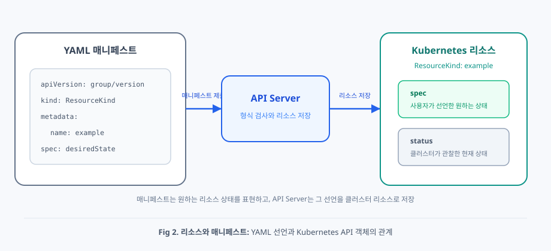
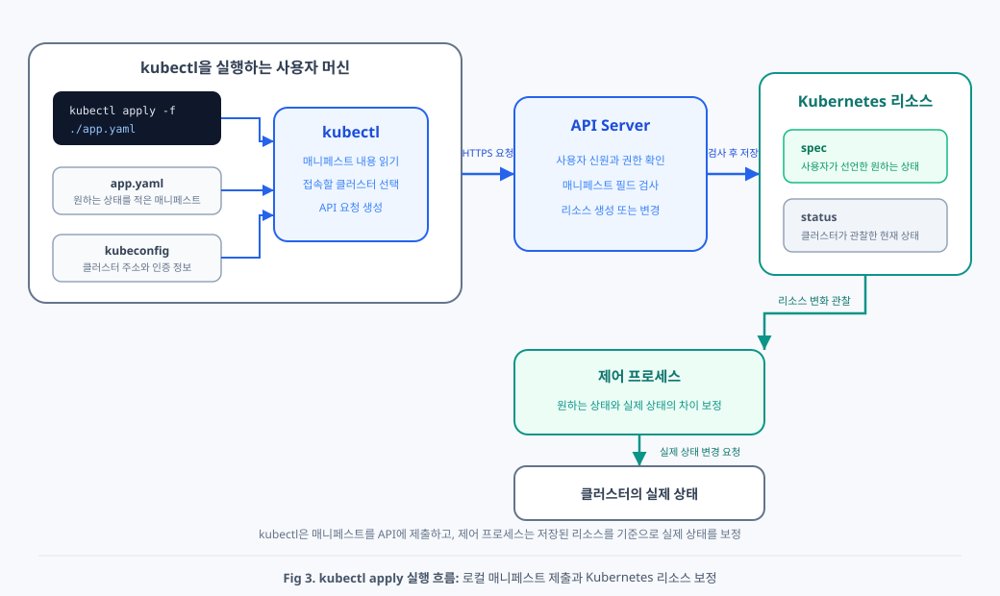
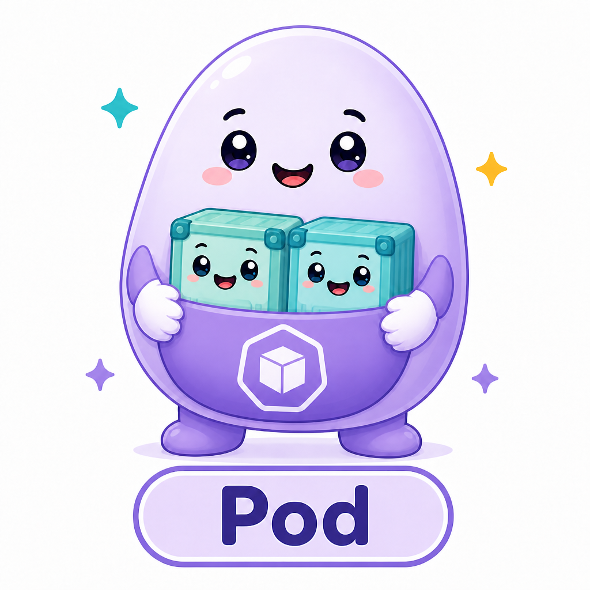
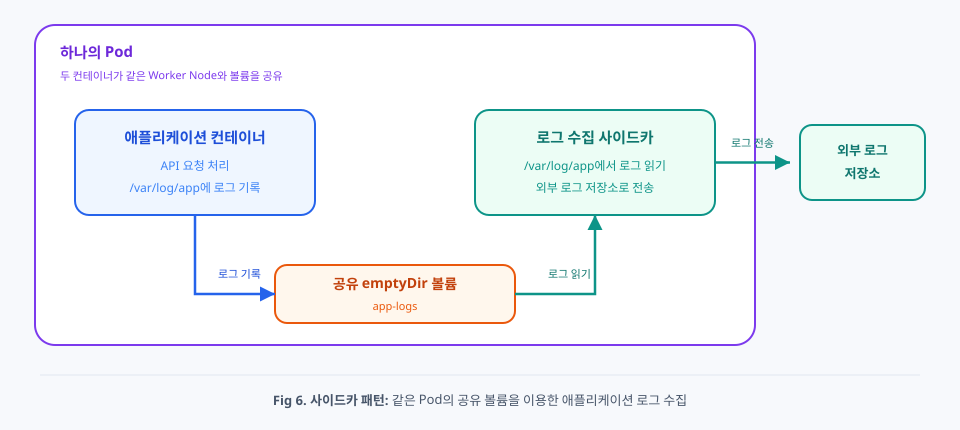
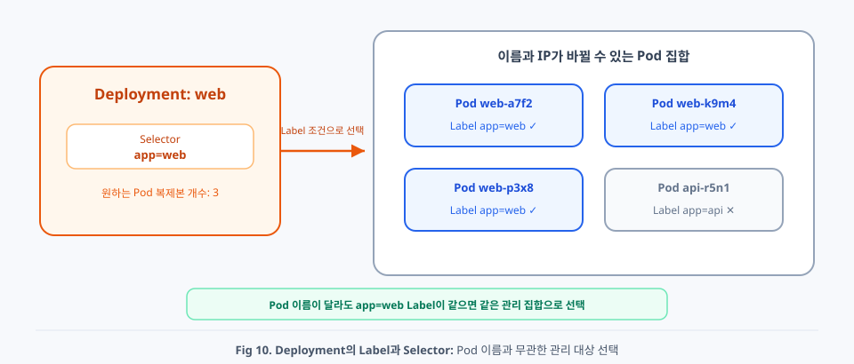
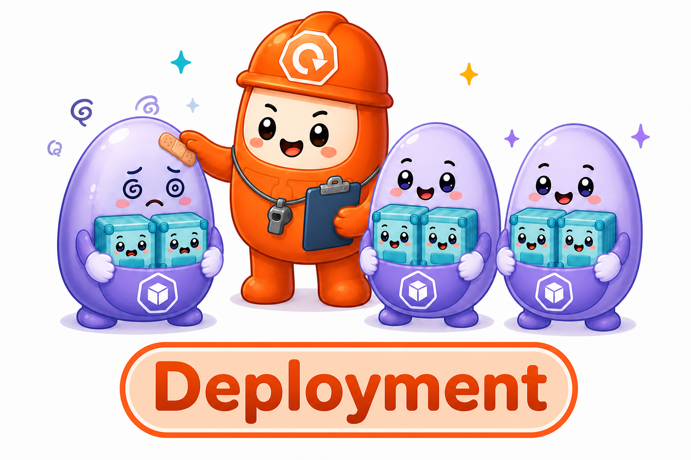

# Chap03. Pod와 Deployment

> 15주 연재의 셋째 글입니다. Kubernetes가 컨테이너를 실행하는 최소 단위인 Pod와 Pod 복제본 개수, 배포 상태를 관리하는 Deployment를 정리합니다.

## 들어가며

<div align="center">


</div>

이전 글에서는 Kubernetes를 단순히 컨테이너를 여러 서버에 배치하는 도구가 아니라, **애플리케이션의 원하는 상태를 지속해서 유지하는 플랫폼**으로 살펴보았습니다. 사용자는 컨테이너를 어느 순서로 만들고 장애가 발생했을 때 어떤 명령을 다시 실행할지 모두 지시하지 않습니다. 대신 애플리케이션이 어떤 상태로 유지되어야 하는지를 선언하고, Kubernetes가 실제 상태를 그 선언에 맞추도록 운영 책임을 나눕니다.

이러한 선언형 방식은 명령 한 번의 성공보다 **상태를 계속 유지하는 과정**을 중요하게 봅니다. 실행 중인 컨테이너가 사라지거나 실제 컨테이너 개수가 원하는 컨테이너 개수와 달라지면 Kubernetes는 그 변화를 실패한 명령으로만 보지 않습니다. 원하는 상태와 실제 상태 사이에 차이가 생긴 것으로 판단하고, 제어 루프를 반복하면서 실제 상태를 다시 맞춥니다. 한 번 실행하고 끝나는 자동화가 아니라, 시간이 지나도 선언한 상태를 유지하려는 설계입니다.

Kubernetes의 구성 요소가 서로에게 실행 순서를 직접 명령하기보다 API에 기록된 상태를 함께 관찰하는 것도 같은 철학에서 나옵니다. 각 구성 요소는 자신이 맡은 상태 변화를 확인하고, 실제 상태를 보정하는 작업을 수행합니다. 특정 구성 요소가 잠시 멈추더라도 원하는 상태는 API에 남아 있으므로, 구성 요소가 다시 동작할 때 실제 상태 보정을 이어갈 수 있습니다. 운영 절차보다 상태를 중심에 두면 구성 요소 사이의 결합을 줄이고, 장애와 변화에 계속 대응할 수 있습니다.

이번 글에서는 이 철학이 컨테이너 실행과 Pod 복제본 유지라는 관리 단위로 어떻게 표현되는지를 살펴봅니다. Kubernetes는 함께 실행할 컨테이너를 Pod로 묶고, Deployment로 Pod 집합의 개수와 배포 상태를 관리합니다. 먼저 사용자가 원하는 상태를 적는 매니페스트와 Kubernetes가 지속해서 관리하는 리소스의 관계부터 구분하겠습니다.

## 1. 리소스와 매니페스트

2장에서 살펴본 선언형 방식은 사용자가 원하는 상태를 API에 남기고, Kubernetes가 실제 상태를 원하는 상태에 계속 맞추는 방식이었습니다. 여기서 먼저 구분해야 할 대상이 있습니다. 사용자가 원하는 상태를 **어디에 적는지**와 Kubernetes가 그 상태를 **무엇으로 저장하고 관리하는지**는 서로 다릅니다.

이 구분이 없으면 YAML 파일과 클러스터 안의 대상을 모두 리소스라고 부르거나, 로컬 파일을 수정하면 실행 중인 애플리케이션도 바로 바뀐다고 오해하기 쉽습니다. Kubernetes가 제어 루프로 관찰하는 대상은 로컬의 YAML 파일이 아니라 API에 저장된 객체입니다. 따라서 사용자가 API에 제출하는 선언과 API가 보관하는 관리 대상을 나누어 이해해야 합니다.

<div align="center">



</div>

**매니페스트**(manifest)는 어떤 리소스를 어떤 상태로 두고 싶은지를 적은 선언입니다. 실무에서는 매니페스트를 YAML 형식으로 작성하는 경우가 많지만, JSON도 사용할 수 있습니다. YAML은 내용을 표현하는 파일 형식이고, 매니페스트는 Kubernetes API에 제출할 선언이라는 역할을 가리킵니다.

**리소스**(resource)는 매니페스트를 제출한 결과로 Kubernetes API가 저장하고 관리하는 객체입니다. 각 리소스는 사용자가 선언한 원하는 상태인 `spec`과 Kubernetes가 관찰한 현재 상태인 `status`를 가질 수 있습니다. 제어 프로세스는 로컬 매니페스트 파일이 아니라 API에 저장된 리소스를 관찰하고, 리소스의 `spec`을 실제 상태로 만들기 위해 필요한 작업을 수행합니다.

정리하면 매니페스트는 API에 전달하는 **입력**이고, 리소스는 클러스터 안에서 지속해서 관리되는 **대상**입니다. 하나의 매니페스트 파일에는 여러 리소스 선언을 넣을 수 있고, 여러 매니페스트 파일이 하나의 애플리케이션 운영 상태를 함께 표현할 수도 있습니다.

대부분의 매니페스트에는 다음 네 가지 필드가 반복해서 등장합니다. `apiVersion`에는 사용할 API 버전을 적고, `kind`에는 만들 리소스의 종류를 적습니다. `metadata`에는 리소스 이름과 분류 정보를 적습니다. `spec`에는 사용자가 원하는 상태를 적습니다. Kubernetes는 리소스를 만든 뒤 실제 상태를 `status`에 기록하지만, 사용자가 매니페스트에 `status`를 직접 작성하는 경우는 드뭅니다.

```yaml
# Kubernetes 매니페스트의 공통 구조를 보여 주는 예시
apiVersion: <API 그룹과 버전>
kind: <리소스 종류>
metadata:
  name: <리소스 이름>
spec:
  <원하는 상태>
```

**kubectl**은 사용자의 명령과 매니페스트를 Kubernetes API에 전달하는 명령줄 클라이언트입니다. kubectl이 Pod나 컨테이너를 직접 실행하는 것이 아니라, API에 원하는 상태의 변경을 요청합니다. Kubernetes의 제어 프로세스는 API에 저장된 변경을 관찰한 뒤 실제 상태를 원하는 상태에 맞춥니다.

### 1.1 매니페스트로 원하는 상태를 관리하는 이점

매니페스트를 사용하면 운영 설정이 터미널에 입력한 일회성 명령으로만 남지 않습니다. 어떤 리소스가 필요하고 각 리소스를 어떤 상태로 유지할지가 파일에 기록됩니다. 다른 환경에서도 같은 매니페스트를 제출하면 같은 원하는 상태를 다시 요청할 수 있으므로, 작업자의 기억에 의존하는 수동 설정을 줄일 수 있습니다.

파일로 남은 매니페스트는 Git으로 버전을 관리할 수 있습니다. 팀은 애플리케이션 코드처럼 매니페스트 변경 내용을 검토하고, 누가 어떤 설정을 바꾸었는지 변경 이력을 확인할 수 있습니다. 문제가 생기면 이전 버전의 매니페스트를 다시 제출해서 이전 매니페스트가 표현한 원하는 상태로 되돌리는 기준도 마련할 수 있습니다.

매니페스트는 자동화의 입력으로도 사용할 수 있습니다. 사람이 매번 같은 명령을 다시 조합하지 않아도 배포 파이프라인이 검토된 파일을 Kubernetes API에 제출할 수 있습니다. 다만 로컬 매니페스트 파일과 API의 리소스가 자동으로 연결되는 것은 아닙니다. 파일을 수정한 뒤 `kubectl apply`로 매니페스트를 다시 제출하거나, GitOps 도구처럼 파일 변경을 감지해서 제출하는 별도의 동기화 과정이 있어야 클러스터의 리소스가 바뀝니다.

### 1.2 kubectl apply -f로 매니페스트 제출하기

<div align="center">



</div>

`kubectl apply -f`는 일반적으로 개발자의 로컬이나 CI 서버처럼 `kubectl`과 클러스터 접속 설정이 준비된 머신의 터미널에서 실행합니다. Worker Node에 직접 접속해서 명령을 실행하는 방식이 아닙니다. `kubectl`을 실행하는 머신이 네트워크를 통해 API Server에 접근할 수 있으면 됩니다.

`apply`는 매니페스트의 설정을 Kubernetes 리소스에 반영하라는 하위 명령입니다. `-f`는 `--filename`의 줄임말이며, 뒤에 적용할 매니페스트 파일의 경로를 받습니다. 아래 명령에서 `./app.yaml`은 터미널의 현재 디렉터리를 기준으로 찾는 로컬 파일입니다. 절대 경로를 적거나, 매니페스트가 들어 있는 디렉터리와 URL을 지정하는 방법도 있습니다. 즉 `-f`는 입력으로 읽을 매니페스트를 선택하고, kubeconfig의 현재 컨텍스트는 매니페스트를 제출할 클러스터를 선택합니다.

```bash
# 현재 디렉터리의 매니페스트를 선택된 Kubernetes 클러스터에 제출하는 예시
kubectl apply -f ./app.yaml
```

명령을 실행하면 `kubectl`은 먼저 `app.yaml`의 매니페스트를 읽습니다. 이어서 **kubeconfig**(kubectl이 접속할 클러스터와 사용자 인증 정보를 찾는 설정)에서 현재 선택된 클러스터의 API Server 주소와 인증 정보를 확인합니다. `kubectl`은 매니페스트 내용을 API 요청으로 변환하고, 네트워크를 통해 선택된 API Server에 요청을 보냅니다.

API Server는 요청한 사용자의 신원과 권한을 확인하고, 매니페스트의 필드가 API 형식에 맞는지 검사합니다. 요청이 유효하면 API Server는 리소스가 없을 때 리소스를 새로 만들고, 같은 리소스가 있으면 매니페스트의 변경 내용을 기존 리소스에 반영합니다. 여기서 같은 리소스인지는 리소스 종류와 이름을 포함한 식별 정보로 판단합니다.

API Server가 리소스를 저장했다고 해서 `kubectl`이 Worker Node에서 컨테이너를 직접 실행한 것은 아닙니다. 리소스가 저장된 뒤 제어 프로세스가 리소스의 변화를 관찰하고, `spec`에 적힌 원하는 상태와 실제 상태의 차이를 줄입니다. 따라서 `created`, `configured`, `unchanged` 같은 `kubectl apply`의 결과는 API 리소스의 반영 결과를 뜻하며, 애플리케이션이 실행 준비를 모두 마쳤다는 뜻은 아닙니다.

## 2. 컨테이너를 함께 실행하는 Pod

<div align="center">


*Fig 4. Kubernetes 공식 Pod 리소스 마크: Kubernetes Community 공개 아이콘 에셋*

</div>

### 2.1 Kubernetes가 배치하는 최소 실행 단위

<div align="center">


</div>

**Pod**(파드)는 Kubernetes가 생성하고 Worker Node에 배치하는 최소 실행 단위입니다. Kubernetes는 컨테이너를 하나씩 독립적으로 배치하지 않습니다. Scheduler가 Pod를 실행할 Worker Node 하나를 정하면, 해당 노드의 Kubelet이 Pod 안에 선언된 컨테이너들을 실행합니다. Kubernetes가 배치하고 교체하는 경계는 개별 컨테이너가 아니라 Pod입니다.

Pod에는 컨테이너를 하나 이상 넣을 수 있습니다. 실제로는 애플리케이션 컨테이너 하나만 넣는 구성이 가장 흔합니다. 컨테이너가 하나뿐이어도 Kubernetes는 Pod를 통해 배치 위치와 네트워크, 스토리지, 수명주기를 일관된 단위로 관리할 수 있습니다.

컨테이너를 여러 개 넣는 기능은 서로 밀접하게 협력해야 하는 프로세스들을 하나의 실행 단위로 묶기 위해 존재합니다. 함께 배치되어야 하고 같은 네트워크나 파일을 사용해야 하며, Pod가 사라질 때 함께 정리되어야 하는 컨테이너들이 이 경계에 들어갑니다. 따라서 Pod는 단순히 컨테이너를 담는 형식이 아니라, **어떤 컨테이너들을 하나의 애플리케이션 실행 단위로 관리할지 정하는 경계**입니다.

<div align="center">



</div>

*성수선임과 함께 배우는 쿠버네티스 : Pod 캐릭터*

Pod 캐릭터는 캥거루처럼 앞주머니에 **Container**들을 품고 있습니다. 주머니의 육각, 큐브 표시는 Kubernetes의 최소 실행 단위를, 주머니 안 컨테이너가 둘인 모습은 한 Pod에 컨테이너를 여러 개 둘 수 있다는 점을 떠올리게 합니다.

### 2.2 Pod 안에서 함께 사용하는 것

같은 Pod 안의 모든 컨테이너는 항상 같은 Worker Node에 배치됩니다. Pod가 생성되어 노드에 배치되고 삭제되는 수명 경계도 함께 따릅니다. 다만 수명 경계를 공유한다는 말이 모든 컨테이너가 언제나 동시에 재시작된다는 뜻은 아닙니다. 컨테이너 하나가 종료되면 Kubelet은 Pod를 유지한 채 설정된 재시작 정책에 따라 해당 컨테이너만 다시 실행할 수 있습니다.

네트워크는 Pod 단위로 공유합니다. 같은 Pod의 컨테이너들은 하나의 Pod IP와 포트 공간을 함께 사용합니다. 각 컨테이너는 서로 다른 포트를 사용해야 하며, 다른 컨테이너의 프로세스에는 `localhost`로 접근할 수 있습니다. 외부에서 컨테이너 하나를 직접 찾는 대신 Pod IP를 통해 Pod의 프로세스에 접근하는 이유도 이 공유 네트워크에 있습니다.

스토리지도 Pod 안에서 공유할 수 있습니다. **볼륨**(volume)은 컨테이너가 사용할 저장 공간을 Pod에 연결하는 방식입니다. Pod에 볼륨을 한 번 선언하고 여러 컨테이너가 같은 볼륨을 각자의 경로에 연결하면, 컨테이너들이 같은 파일을 읽고 쓸 수 있습니다. 각 컨테이너의 기본 파일 시스템까지 하나로 합쳐지는 것은 아니며, 같은 볼륨을 연결한 경로만 공유합니다.

이러한 공유 범위 때문에 관련이 적은 애플리케이션을 하나의 Pod에 모아서는 안 됩니다. 웹 서버와 데이터베이스처럼 배포 시점과 확장 기준이 다른 애플리케이션은 서로 다른 Pod로 나누는 편이 좋습니다. 함께 배치하고 함께 삭제해야 하며 네트워크나 파일을 긴밀하게 공유하는 컨테이너만 같은 Pod에 둡니다.

### 2.3 사이드카 패턴

Pod의 공유 특성을 활용하는 대표 사례가 **사이드카 패턴**(sidecar pattern)입니다. 사이드카 패턴은 애플리케이션의 주 기능을 실행하는 컨테이너 옆에 보조 기능을 맡는 컨테이너를 함께 두는 구성입니다. 로그 수집, 프록시, 설정 갱신처럼 애플리케이션과 같은 실행 환경을 사용해야 하는 기능에 활용할 수 있습니다.

<div align="center">



</div>

예를 들어 애플리케이션 컨테이너가 파일에 로그를 쓰고, 로그 수집 컨테이너가 같은 파일을 읽어 외부 저장소로 보낼 수 있습니다. 두 컨테이너는 같은 Pod에 배치되고 같은 로그 볼륨을 연결하므로, 별도의 네트워크 파일 공유 없이 로그 파일을 함께 사용할 수 있습니다. 다음 매니페스트는 이러한 구조를 보여 주는 예시입니다.

```yaml
# 한 Pod 안의 두 컨테이너가 임시 볼륨을 공유하는 예시
apiVersion: v1
kind: Pod
metadata:
  name: api-server
spec:
  containers:
  - name: api
    image: my-api:1.0
    volumeMounts:
    - name: app-logs
      mountPath: /var/log/app
  - name: log-agent
    image: fluentd:v1.18
    volumeMounts:
    - name: app-logs
      mountPath: /var/log/app
  volumes:
  - name: app-logs
    emptyDir: {}
```

위 매니페스트에서 두 컨테이너는 `app-logs`라는 같은 볼륨을 각자의 `/var/log/app` 경로에 연결합니다. `emptyDir`은 Pod가 노드에서 실행되는 동안 사용하는 임시 볼륨이므로, Pod가 삭제되면 `emptyDir`에 저장한 로그도 함께 사라집니다. 영구 보관이 필요한 로그에는 Pod의 수명과 분리된 별도의 저장 방식을 사용해야 합니다.

Pod는 교체될 수 있는 실행 단위입니다. 한 번 Worker Node에 배치된 Pod가 다른 노드로 이동하는 것은 아닙니다. 기존 Pod를 대체해야 하면 Kubernetes는 새로운 이름과 IP를 가진 Pod를 만듭니다. 단독으로 만든 Pod를 삭제하면 Kubernetes가 같은 Pod를 자동으로 다시 만들지 않으므로, 장기간 운영할 애플리케이션에는 Pod 복제본 개수와 Pod 교체 과정을 관리하는 상위 리소스가 필요합니다.

## 3. Pod 복제본과 배포를 관리하는 Deployment

<div align="center">


*Fig 7. Kubernetes 공식 Deployment 리소스 마크: Kubernetes Community 공개 아이콘 에셋*

</div>

<div align="center">


</div>

Pod는 애플리케이션이 실제로 실행되는 최소 단위지만, Pod 하나의 이름과 IP를 계속 보존하는 것을 Kubernetes 운영의 목표로 삼지는 않습니다. Pod는 장애나 배포 과정에서 사라질 수 있고, 새로운 이름과 IP를 가진 Pod로 교체될 수 있습니다. 운영에서 유지해야 하는 대상은 특정 Pod 한 개의 정체성이 아니라, **같은 역할을 하는 Pod 집합의 상태**입니다.

**Deployment**(디플로이먼트)는 이 Pod 집합의 원하는 상태를 선언하고 유지하는 상위 리소스입니다. 사용자는 어떤 구성의 Pod를 몇 개 유지할지와 Pod 구성을 어떤 방식으로 교체할지를 Deployment에 선언합니다. Deployment는 현재 Pod 집합과 원하는 Pod 집합의 차이를 계속 확인하고, 필요한 Pod를 만들거나 기존 Pod를 줄이면서 그 차이를 보정합니다. 이는 2장에서 살펴본 선언형 방식과 제어 루프가 애플리케이션 배포에 적용된 모습입니다.

여기서 **복제본**(replica)은 같은 Pod 구성을 바탕으로 만들어져 같은 역할을 수행하는 각각의 Pod를 뜻합니다. `Replica Pod`이라는 별도의 리소스 종류가 있는 것은 아닙니다. 복제본 세 개를 유지한다는 선언은 한 Pod 안에 같은 컨테이너를 세 개 넣는다는 뜻도 아닙니다. 같은 Pod 템플릿으로 만든 독립적인 Pod 세 개를 클러스터에 유지한다는 뜻입니다. 각 Pod는 서로 다른 이름과 IP를 가지며, 장애와 교체도 각각의 Pod 단위로 일어납니다.

Deployment는 내부에서 **ReplicaSet**(레플리카셋, 같은 Label 조건을 가진 Pod의 복제본 개수를 유지하는 리소스)을 만들고 관리합니다. Deployment가 Pod 템플릿과 배포 변경 과정을 관리한다면, ReplicaSet은 Selector와 일치하는 Pod를 세어서 원하는 Pod 복제본 개수와 맞추는 일을 담당합니다. 원하는 Pod가 부족하면 ReplicaSet이 Pod 객체를 만들고, 원하는 Pod보다 많으면 ReplicaSet이 초과한 Pod를 줄입니다.

이 관계는 Deployment, ReplicaSet, Pod 순서로 이어집니다. 사용자는 일반적으로 Deployment의 `replicas`와 Pod 템플릿을 변경하고, Deployment는 그 선언에 맞는 ReplicaSet을 관리합니다. Deployment가 관리하는 ReplicaSet의 복제본 개수를 직접 바꾸면 Deployment가 선언한 상태와 충돌할 수 있으므로, 배포 중인 애플리케이션의 복제본 개수와 Pod 템플릿은 Deployment를 통해 변경하는 편이 안전합니다.

그림 아래쪽은 같은 ReplicaSet이 만든 Pod 세 개가 서로 다른 Worker Node에 배치된 예시입니다. ReplicaSet은 Pod 객체를 만들고 Pod 복제본 개수를 유지하지만, 각 Pod를 어느 Worker Node에 배치할지는 정하지 않습니다. Scheduler가 아직 Node가 정해지지 않은 각 Pod를 독립적으로 확인하고 실행할 Worker Node를 선택합니다.

<div align="center">


</div>

Scheduler는 먼저 각 노드가 Pod가 요청한 CPU와 메모리를 수용할 수 있는지 확인합니다. 이어서 Pod를 실행할 수 있는 노드의 조건을 정한 배치 제약을 확인하고, 조건을 통과한 후보 노드들의 점수를 계산해서 적합한 노드를 선택합니다. 별도의 배치 제약을 선언하지 않으면 복제본들이 서로 다른 노드에 하나씩 분산된다고 보장되지 않으며, 여러 Pod가 같은 노드에 배치될 수도 있습니다. 복제본을 여러 Node에 의도적으로 분산하려면 **Pod 안티어피니티**(특정 Pod끼리 같은 위치에 배치하지 않도록 정하는 조건)나 **Topology Spread Constraints**(Node와 가용 영역 같은 토폴로지 단위에 Pod 분포를 맞추는 조건)를 추가해야 합니다.

Pod의 이름과 IP가 계속 바뀔 수 있으므로 Deployment는 그 값을 기준으로 Pod 집합을 구분하지 않습니다. Kubernetes는 리소스에 붙이는 키와 값 형태의 분류 정보인 **Label**(레이블)을 사용합니다. Deployment는 **Selector**(셀렉터)에 적힌 Label 조건과 일치하는 Pod들을 자신이 관리할 집합으로 봅니다. 새 Pod를 만들 때도 Pod 템플릿에 같은 Label을 붙여, 새 Pod가 같은 관리 집합에 포함되도록 합니다.

<div align="center">



</div>

Label과 Selector를 사용하면 Deployment가 특정 Pod 이름을 미리 알지 않아도 Pod 집합을 계속 관리할 수 있습니다. 예를 들어 `app: web`이라는 Label을 관리 기준으로 삼으면, 기존 Pod가 사라지고 새로운 Pod가 만들어져도 같은 Label을 가진 Pod를 웹 애플리케이션의 복제본으로 셀 수 있습니다. 원하는 Pod 복제본 개수가 세 개인데 조건에 맞는 Pod가 두 개뿐이면 ReplicaSet이 새 Pod 하나를 만들고, 네 개이면 Pod 하나를 줄입니다. 삭제된 Pod 자체를 되살리는 대신 같은 역할을 하는 새 Pod로 원하는 상태를 회복하는 방식입니다.

Deployment는 개별 Pod 목록을 직접 보관하지 않고 Label 조건으로 관리할 Pod 집합을 선언합니다. 이 구조는 리소스들이 API의 공유 상태를 기준으로 느슨하게 연결되는 Kubernetes의 철학과도 이어집니다.

Deployment는 Pod 복제본 개수만 유지하지 않습니다. 컨테이너 이미지처럼 Pod 구성이 바뀌면 기존 Pod 집합을 새 구성의 Pod 집합으로 점진적으로 교체하고, 배포 도중에도 사용 가능한 Pod를 유지하도록 변경 과정을 관리합니다. 따라서 Deployment의 핵심은 Pod를 한 번 생성하는 기능이 아니라, **Pod 집합의 개수와 구성, 변경 과정을 원하는 상태로 계속 관리하는 것**입니다.

<div align="center">



</div>

*성수선임과 함께 배우는 쿠버네티스 : Deployment 캐릭터*

Deployment 캐릭터는 안전모와 점검표를 든 관리자처럼 여러 **Pod**를 살피고 있습니다. 같은 모습을 가진 Pod들을 일정하게 유지하고 문제가 생긴 Pod를 돌보는 모습은 Deployment가 원하는 Pod 복제본 개수와 배포 상태를 계속 관리한다는 점을 보여 줍니다.

### 3.1 Pod 템플릿과 셀렉터

앞에서 설명한 Pod 구성과 복제본 개수, 관리할 Pod의 Label 조건은 Deployment 매니페스트의 `spec`에 기록합니다. 이 개념들이 각각 `template`, `replicas`, `selector`라는 필드로 표현됩니다.

**Pod 템플릿**(Pod template)은 Deployment가 새 Pod를 만들 때 사용할 공통 구성을 적은 부분입니다. 템플릿에는 Pod에 붙일 Label과 컨테이너 이미지, 포트 같은 설정이 들어갑니다. 템플릿이 같아도 이 템플릿으로 생성된 각 Pod는 서로 다른 이름과 IP를 가진 독립적인 실행 단위입니다.

Deployment의 `spec.selector`에는 Deployment가 관리할 Pod를 고르는 Label 조건을 적습니다. `spec.selector.matchLabels`와 `spec.template.metadata.labels`는 같은 Label을 가리켜야 합니다. 두 값이 다르면 새로 만드는 Pod가 Deployment의 관리 조건에 포함되지 않으므로 API가 Deployment 생성을 거절합니다.

```yaml
# Pod 복제본 세 개와 Pod 템플릿을 선언하는 Deployment 예시
apiVersion: apps/v1
kind: Deployment
metadata:
  name: web
  labels:
    app: web
spec:
  replicas: 3
  selector:
    matchLabels:
      app: web
  template:
    metadata:
      labels:
        app: web
    spec:
      containers:
      - name: web
        image: my-web:1.0
        ports:
        - containerPort: 8080
```

최상단의 `metadata.labels`는 Deployment 자체를 검색하고 분류할 때 사용합니다. `spec.selector.matchLabels`는 Deployment가 관리할 Pod를 고릅니다. `spec.template.metadata.labels`는 새로 생성할 Pod에 실제로 붙일 레이블입니다. 세 위치에 같은 값이 자주 등장하지만, 각 필드가 고르는 대상은 서로 다릅니다.

### 3.2 ReplicaSet과 자동 복구

<div align="center">


</div>

Deployment는 Pod를 직접 하나씩 유지하지 않습니다. Deployment가 **ReplicaSet**(레플리카셋)을 만들고, ReplicaSet이 지정한 Pod 복제본 개수를 유지합니다. Deployment 매니페스트에 `replicas: 3`을 적으면 ReplicaSet은 같은 템플릿을 사용하는 Pod 세 개가 실행되도록 상태를 맞춥니다.

Deployment가 만든 Pod 하나를 삭제하면 ReplicaSet은 실제 Pod 복제본 개수가 두 개로 줄었다는 사실을 확인합니다. ReplicaSet은 원하는 Pod 복제본 개수인 세 개를 맞추기 위해 새 Pod 하나를 만듭니다. 이 동작은 삭제된 Pod 자체를 되살리는 것이 아니라, 같은 템플릿을 사용하는 새 Pod를 만드는 방식입니다. 따라서 새 Pod의 이름과 IP는 이전 Pod와 달라질 수 있습니다.

하나의 ReplicaSet은 특정 시점의 Pod 템플릿을 기준으로 복제본 개수를 유지합니다. Deployment의 컨테이너 이미지를 `my-web:1.0`에서 `my-web:1.1`로 바꾸면 기존 ReplicaSet의 Pod를 직접 수정하지 않고, 새 Pod 템플릿을 가진 ReplicaSet을 만듭니다. Deployment는 기존 ReplicaSet의 복제본을 줄이는 동시에 새 ReplicaSet의 복제본을 늘려 Pod를 점진적으로 교체합니다. 이 과정을 **롤링 업데이트**(rolling update)라고 합니다. 이전 ReplicaSet의 배포 기록이 남아 있으면 이전 Pod 템플릿으로 되돌리는 롤백도 수행할 수 있습니다.

### 3.3 컨테이너 상태를 검사하는 Probe

<div align="center">


</div>

Pod가 `Running`이라고 해서 애플리케이션이 요청을 정상적으로 처리할 준비까지 끝났다는 뜻은 아닙니다. 컨테이너 프로세스는 살아 있어도 데이터베이스 연결이나 초기 데이터 로딩을 마치지 못했을 수 있습니다. Kubernetes는 컨테이너 상태를 주기적으로 검사하는 **Probe**(프로브)를 제공합니다.

**Liveness Probe**는 컨테이너가 계속 동작할 수 있는지를 검사합니다. Liveness Probe가 정해진 횟수만큼 실패하면 Kubelet이 해당 컨테이너를 재시작할 수 있습니다. **Readiness Probe**는 컨테이너가 요청을 받을 준비가 되었는지를 검사합니다. Readiness Probe가 실패하면 Kubernetes는 해당 Pod를 일반적인 요청 전달 대상에서 제외합니다. Readiness Probe 실패는 컨테이너 재시작을 뜻하지 않습니다.

```yaml
# Deployment의 Pod 템플릿에 HTTP Probe를 추가하는 예시
spec:
  template:
    spec:
      containers:
      - name: web
        image: my-web:1.0
        readinessProbe:
          httpGet:
            path: /ready
            port: 8080
          initialDelaySeconds: 5
          periodSeconds: 5
        livenessProbe:
          httpGet:
            path: /healthz
            port: 8080
          initialDelaySeconds: 15
          periodSeconds: 10
```

애플리케이션 기동이 느린데 Liveness Probe를 너무 일찍 시작하면, 애플리케이션이 준비를 마치기 전에 컨테이너 재시작이 반복될 수 있습니다. 이때는 애플리케이션의 실제 기동 시간을 먼저 확인하고 검사 시작 시점과 실패 기준을 조정해야 합니다.

## 다음 글로 넘어가기 전에

이번 글에서 다룬 내용은 이렇습니다. 매니페스트는 Kubernetes API에 원하는 상태를 전달하는 입력이고, 리소스는 클러스터 안에서 지속해서 관리되는 대상입니다. Pod는 함께 실행할 컨테이너를 묶고, Deployment는 Label과 Selector를 기준으로 Pod 복제본 개수와 배포 상태를 유지합니다.

다음 글에서는 변하는 Pod 집합에 고정 주소를 제공하는 Service와 외부 HTTP와 HTTPS 요청을 Service로 나누는 Ingress를 살펴봅니다.
