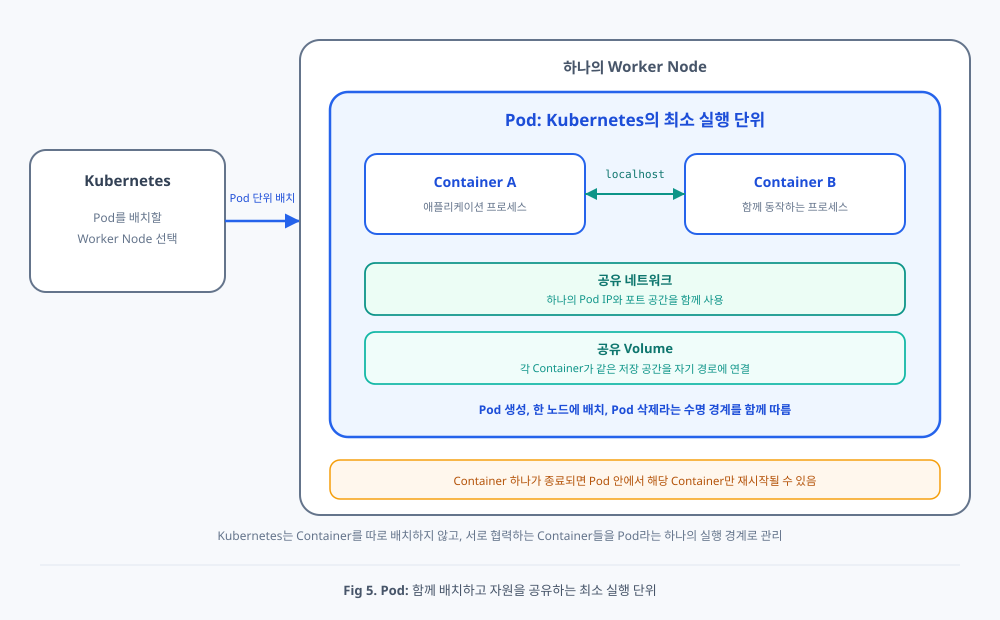
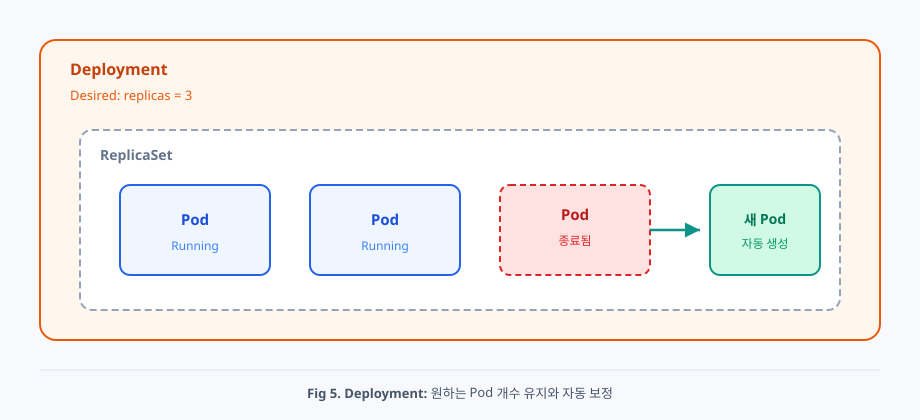
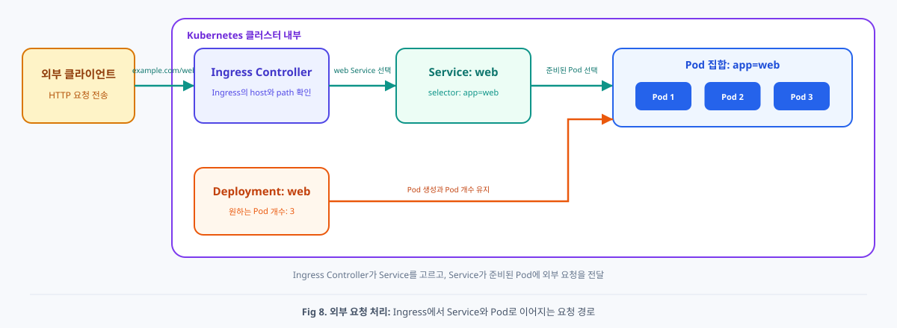

# 3주차. 서비스 운영에 필요한 핵심 리소스 (Pod부터 Namespace까지)

> **이전 글**에서 Kubernetes가 왜 필요한지, 설계 철학과 Control Plane / Worker Node, 선언이 Pod로 실행되기까지의 흐름을 살펴보셨을 거예요. 이번 글은 그 위에서, 실무에서 매일 손으로 만지는 **도면**(리소스) 쪽을 잡아 볼게요. Pod, Deployment, Service, Namespace가 각각 무엇을 맡는지, 어떻게 이어지는지에 초점을 둡니다.

---

## 서비스 운영에 필요한 핵심 리소스

앞 글에서 본 것은 도시의 서버와 그 위에서 도는 프로세스였다면, 이제 창구에 내는 **도면** 쪽을 봅니다. **리소스**는 YAML로 “무엇을 원하는가”를 적어 두는 API 객체예요. 실무에서 개발자가 매일 손으로 만지는 대상은 API Server나 Kubelet 자체보다, 서비스를 배포하기 위한 이 선언들에 가깝습니다.

가장 자주 만나는 네 가지(**Pod**, **Deployment**, **Service**, **Namespace**)를 개념으로만 잡아 볼게요. 매니페스트 예시는 Pod와 Deployment에 두고, Service와 Namespace는 말로 이해하시면 충분합니다. 실무에서 “쿠버네티스에 배포한다”는 말은 보통 이 네 가지를 조합해 서비스를 운영한다는 뜻에 가깝습니다.

### Pod

<div align="center">



</div>

앞에서 Pod를 “컨테이너를 묶어 함께 살게 하는 최소 실행 단위”로 짧게 소개했습니다. Docker에서는 컨테이너가 실행 단위라면, Kubernetes에서는 그 개념을 확장해 **Pod**가 최소 단위예요. 기숙사에서 같은 방을 쓰는 룸메이트처럼, 한 Pod 안의 컨테이너는 같은 노드에 살고, 네트워크와 볼륨을 자연스럽게 공유하죠.

“왜 컨테이너를 직접 실행하지 않나요?”라는 질문에 대한 답은, 실제 서비스에서 컨테이너가 단독으로만 동작하지 않는 경우가 많기 때문입니다. 예를 들어 하나의 API 서버는 메인 애플리케이션과 로그 수집기(**사이드카**(sidecar), 옆에 붙여 돕는 컨테이너)처럼 **함께 실행되고 네트워크와 스토리지를 공유해야 하는** 컨테이너로 구성될 수 있어요. Kubernetes는 “컨테이너 하나”가 아니라 “함께 살아야 하는 컨테이너 묶음”을 최소 단위로 다루기 위해 Pod를 사용합니다.

```yaml
# Pod가 컨테이너를 묶어 함께 살게 함을 보이는 매니페스트 예시
apiVersion: v1
kind: Pod
metadata:
  name: api-server
spec:
  containers:
  - name: api
    image: my-api:latest
  - name: log-agent
    image: fluentd:latest
```

한 Pod 안의 컨테이너는 같은 네트워크 공간을 나눕니다. 그래서 서로 **localhost**로 이야기할 수 있어요. 바깥에서 보면 Pod마다 클러스터 안 주소(Pod IP)가 하나씩 붙는 감각에 가깝고, 그 Pod가 떠 있는 노드에도 따로 노드 IP가 있습니다. 같은 Pod 안에서는 볼륨도 나누어 쓸 수 있어요. “함께 배치하고, 함께 생명주기를 나누며, 네트워크와 볼륨을 공유한다”가 Pod를 이해하는 네 키워드입니다.

감각만 짧게 비교하면, Docker Container는 보통 컨테이너 하나가 독립적으로 네트워크와 생명주기를 갖는 반면, Pod는 컨테이너를 하나 이상 묶어 같은 네트워크, 볼륨, 생명주기를 나눕니다. 즉 Kubernetes는 컨테이너를 직접 다루기보다, 컨테이너를 그룹화한 단위(Pod)를 관리한다고 보시면 됩니다.

다만 Pod를 하나 직접 올리는 것만으로는 “항상 Pod를 몇 개 유지”하기가 어렵습니다. 그래서 보통은 바로 아래 Deployment로 목표 Pod 개수를 선언합니다.

### Deployment

<div align="center">



</div>

**Deployment**(디플로이먼트) 는 Pod를 직접 한 번 실행하는 객체가 아니라, **원하는 상태를 정의해 “항상 그 상태가 유지되게 만드는”** 상위 리소스예요. 단지 관리사무소가 “이 서비스 Pod를 세 개 유지해 달라”는 규칙을 받아 두고 Pod 개수를 계속 맞추는 일과 비슷합니다. 앞에서 본 `replicas: 3` 한 줄이, Deployment 매니페스트에서는 대략 이렇게 자리합니다.

```yaml
# Deployment로 Pod 복제본 3개를 유지하라는 선언 예시
apiVersion: apps/v1
kind: Deployment
metadata:
  name: web
spec:
  replicas: 3
```

`replicas: 3`은 단순한 숫자가 아니라 운영 정책에 가깝죠. Kubernetes는 “언제나 3개의 Pod가 떠 있어야 한다”는 Desired State를 가지고, Current State가 그보다 적어지면 제어 루프가 자동으로 보정합니다.

Pod가 하나 죽으면 이를 감지하고 새 Pod를 만들어 상태를 복구하려는 흐름이 이어질 수 있어요. 사람이 개입하지 않아도 자동으로 이루어지는 경우가 많습니다. 이미지 버전을 바꾸면 배포가 롤링 업데이트로 이어지는 경우도 흔합니다. 내부적으로는 **ReplicaSet**(레플리카셋, “같은 종류의 Pod를 몇 개 유지한다”는 복제 집합)을 만들어 Pod 집합을 관리합니다.

자동 복구를 현실적으로 보면, Kubernetes는 Pod 개수만 맞추는 것이 아니라 “정상 상태”를 기준으로 조치합니다. 자주 쓰이는 장치가 **Probe**(프로브, 헬스체크) 예요. Probe는 “이 컨테이너가 건강한지”를 주기적으로 확인하는 검사라고 보시면 됩니다. 병원에 정기 검진이 있듯, 컨테이너에도 살아 있는지, 손님을 받을 준비가 됐는지를 묻는 검사가 있는 셈이죠.

**Liveness Probe**는 컨테이너가 “살아 있는가?”를 묻고, 실패하면 컨테이너 재시작으로 이어질 수 있습니다. **Readiness Probe**는 “요청을 받을 준비가 되었는가?”를 묻고, 실패하면 해당 Pod를 트래픽에서 제외하는 쪽에 가깝습니다.

장애가 반복될 때는 이벤트로 원인을 추적해 볼 수 있어요. `kubectl get events`처럼, kubectl로 클러스터에 “요즘 무슨 일이 있었는지”를 물어볼 수 있습니다.

### Service

<div align="center">


</div>

Pod는 새로 만들어질 때마다 주소가 바뀔 수 있어요. 그래서 클라이언트에게 Pod IP를 직접 외우게 하기는 어렵습니다. **Service**(서비스) 는 계속 변하는 Pod 집합 앞단에 **안정적인 진입점**(고정 가상 IP와 이름) 을 제공하는 리소스예요. 매장 직원이 자주 바뀌어도 “결제 창구”라는 간판은 그대로 두는 일과 비슷합니다.

어떤 Pod를 창구 뒤로 묶을지는 **레이블**(label) 로 고릅니다. 레이블은 리소스에 붙이는 키와 값 형태의 간단한 표식이에요. 예를 들어 `app: web`이라고 붙여 두면, Service는 “`app=web`인 Pod들”을 찾아 트래픽을 나눕니다. 이 “표식으로 대상을 고르는 규칙”을 **셀렉터**(selector) 라고 부릅니다.

클러스터 안에서는 DNS로 Service 이름을 찾을 수 있고, Pod가 새로 생겨 IP가 바뀌어도 클라이언트는 같은 이름과 고정 가상 IP로 접근할 수 있어요. 각 노드에서는 앞에서 본 **kube-proxy**가 이 Service 규칙을 실제 네트워크 경로로 구현합니다.

용도에 따라 노출 범위가 달라집니다. **ClusterIP**는 기본으로 클러스터 내부 전용 가상 IP입니다. **NodePort**는 각 노드의 고정 포트로 노출하고, **LoadBalancer**는 클라우드 로드 밸런서와 연동해 외부에 공개합니다. **Headless**(`clusterIP: None`)는 개별 Pod를 직접 해석할 때 씁니다. 핵심만 기억하면, **셀렉터로 Pod 집합을 정하고**, 서비스 포트에서 컨테이너 포트로 요청을 넘기며, **타입으로 노출 범위**를 정한다는 점이에요.

### Namespace

<div align="center">


</div>

지금까지의 Pod, Deployment, Service는 모두 Kubernetes API 객체입니다. **Namespace**(네임스페이스) 는 이 객체들을 클러스터 안에서 팀이나 서비스, 환경 단위로 구분하기 위한 **논리적 경계**예요. 한 도시 안에 구역을 나누어 주소를 겹치지 않게 관리하는 일과 비슷합니다. 클러스터를 물리적으로 쪼개지 않고도 운영 경계를 만들 수 있다는 점이 핵심이죠.

같은 이름의 리소스도 Namespace가 다르면 공존할 수 있고, 권한, 사용량 한도 같은 정책을 Namespace 단위로 나눌 수 있습니다. Service 이름 찾기도 Namespace를 포함해 동작해요. 예를 들어 DNS 이름이 `web.default.svc.cluster.local`과 `web.prod.svc.cluster.local`처럼 달라지면 서로 다른 대상입니다. 리소스 식별은 사실상 `namespace/name` 조합으로 이해하는 것이 안전합니다.

실무에서는 같은 클러스터 안에서도 `dev`, `staging`, `prod`처럼 Namespace를 분리해 쓰는 경우가 많아요.

```bash
# Namespace로 조회, 적용, 기본 공간을 나누는 명령 예시
kubectl get pods -n prod
kubectl apply -f deploy.yaml -n staging
kubectl config set-context --current --namespace=dev
```


### 리소스 연결 관계

<div align="center">



</div>

처음에는 Pod, Deployment, Service가 각각 별개처럼 보이지만, 실제 운영에서는 서로 다른 책임을 맡아 하나의 요청 경로를 완성합니다.

트래픽 관점에서 보면 보통 이렇게 이어집니다. 클라이언트는 Service라는 안정적인 이름으로 들어옵니다. Service는 셀렉터로 연결된 Pod 중 하나를 골라 요청을 전달하고, 선택된 Pod가 요청에 응답합니다. 그 뒤에서 Deployment가 Pod 개수와 업데이트 상태를 계속 유지하죠. 즉 경로의 골격은 **Service에서 Pod로** 이어지고, Deployment는 그 경로의 “처리 주체”를 안정적으로 지켜 줍니다. 이 관계는 보통 같은 Namespace 안에서 먼저 성립해요.

핵심은 **Deployment와 Service가 직접 연결되는 것이 아니라 Pod의 label로 간접 연결**된다는 점이에요. Deployment는 앞으로 만들 Pod에 `app: web` 같은 라벨을 붙이도록 적어 두고, Service는 같은 라벨을 가진 Pod 집합을 찾아 트래픽을 전달합니다. Pod가 교체되어 IP가 바뀌어도, 라벨만 일치하면 Service가 새 Pod를 찾아 연결하죠.

자주 헷갈리는 세 칸만 구분해 두면 초반 실수가 줄어듭니다. Deployment에서 **관리할 Pod를 고르는 기준 라벨**과 **앞으로 생성될 Pod에 실제로 붙일 라벨**은 보통 같게 맞춰야 합니다. 리소스 최상단에 붙는 메타 라벨은 객체 검색과 분류용이고, Pod 매칭의 주인공은 아닙니다.

---


## 다음 글로 넘어가기 전에

이번 주에 따라온 줄기는 이렇습니다. Pod로 컨테이너를 묶고, Deployment로 Pod 개수를 유지하며, Service로 고정 진입점을 두고, Namespace로 운영 경계를 나눕니다. Deployment와 Service는 Pod 라벨로 간접 연결됩니다.
다음 글에서는 로컬에 Kubernetes를 설치해 두고, 앞에서 본 선언과 명령을 실제로 눌러 보며 이어 갑니다.

---
