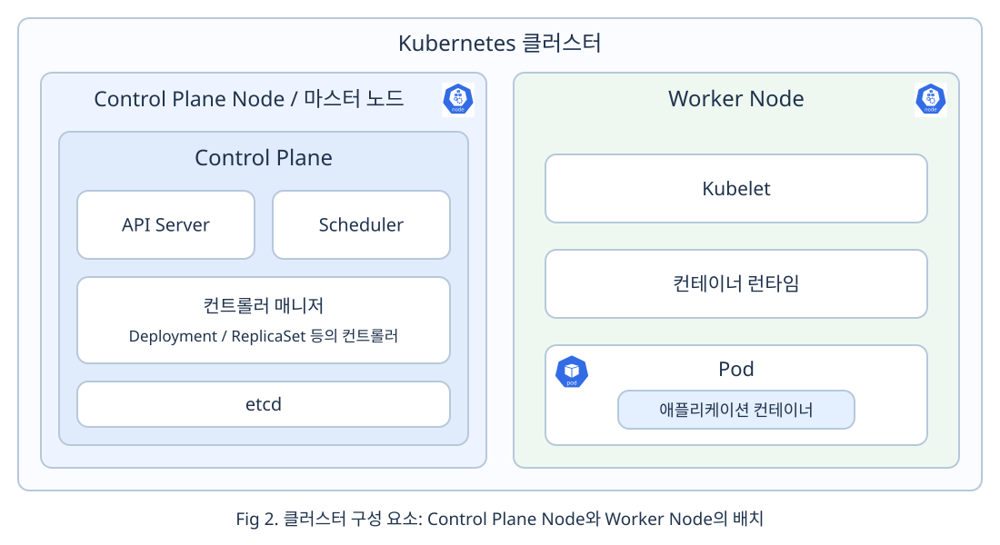
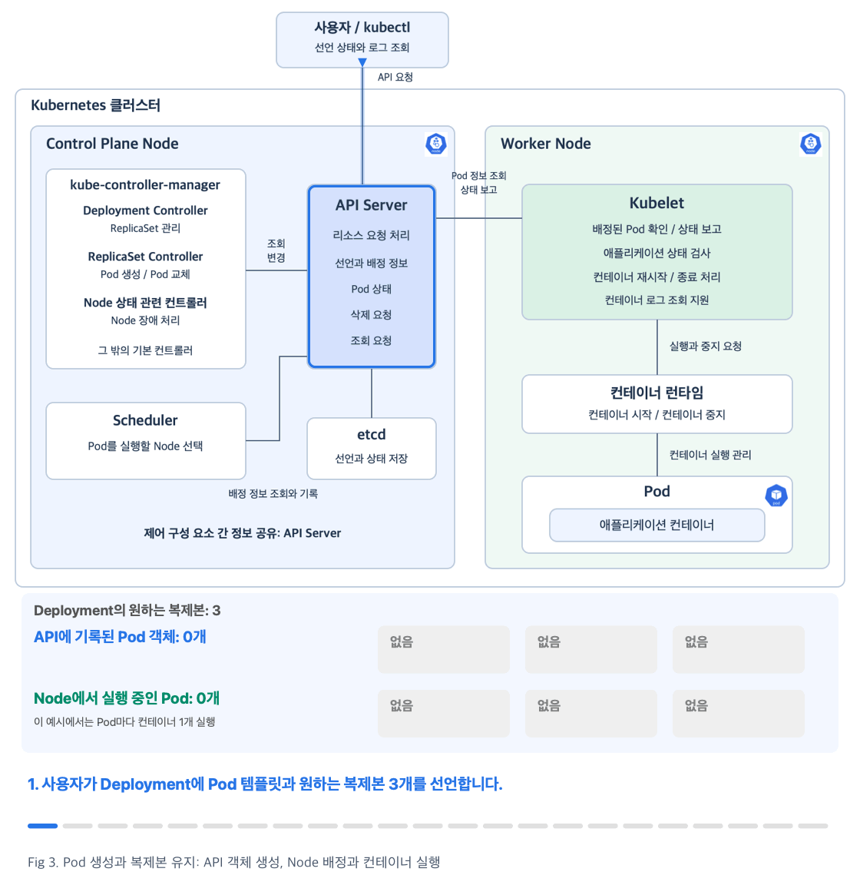
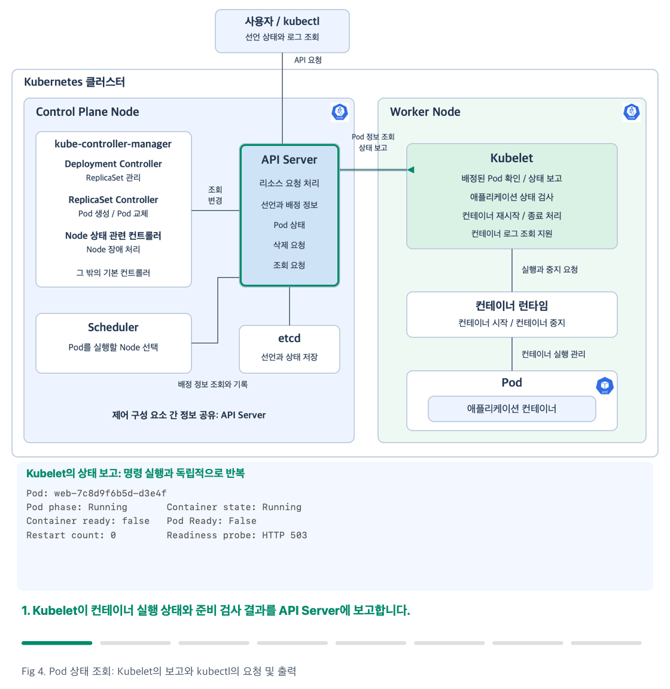
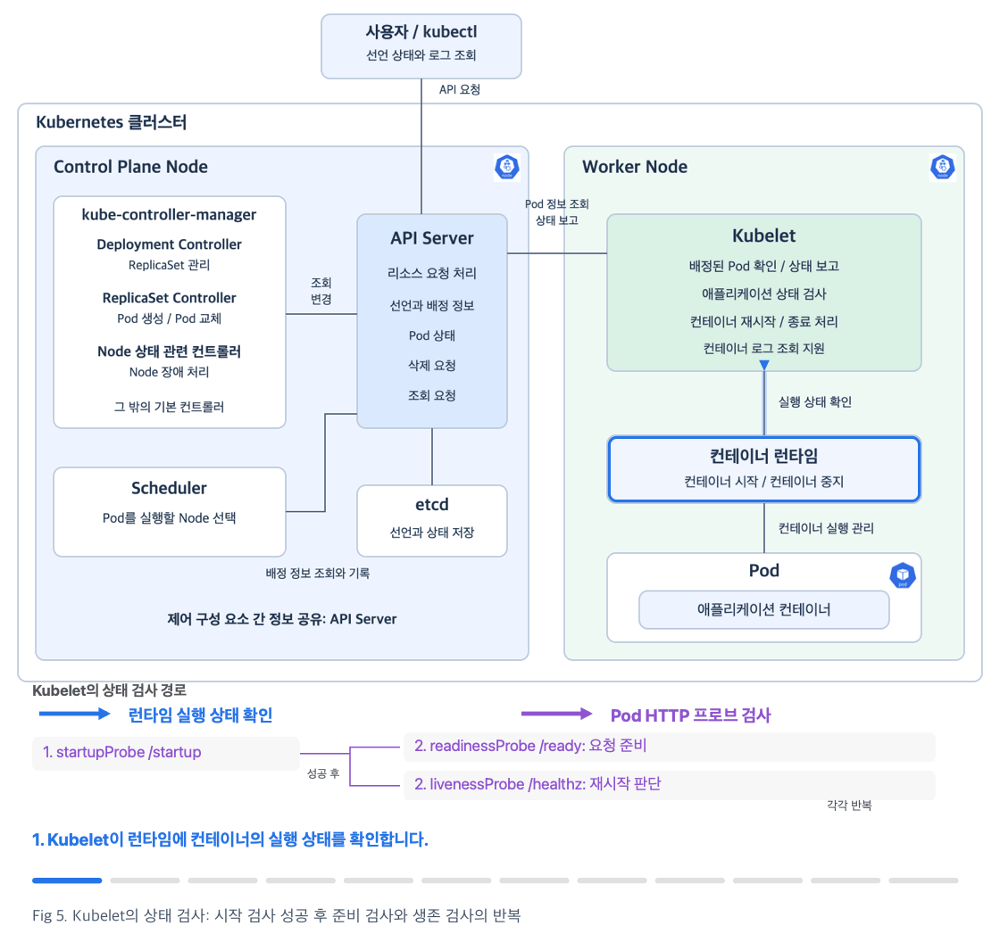
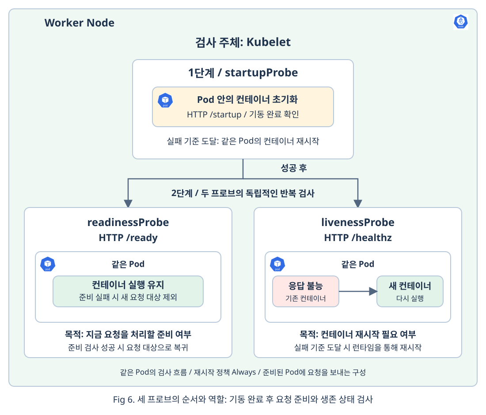
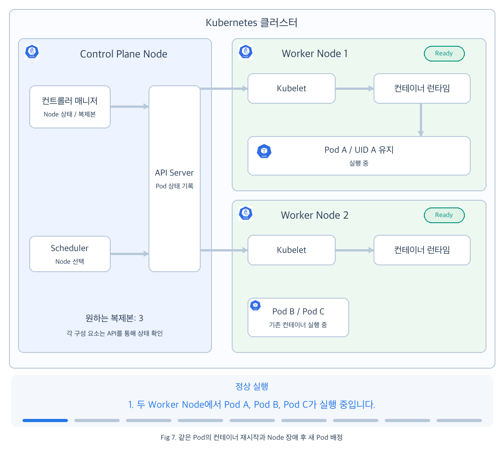
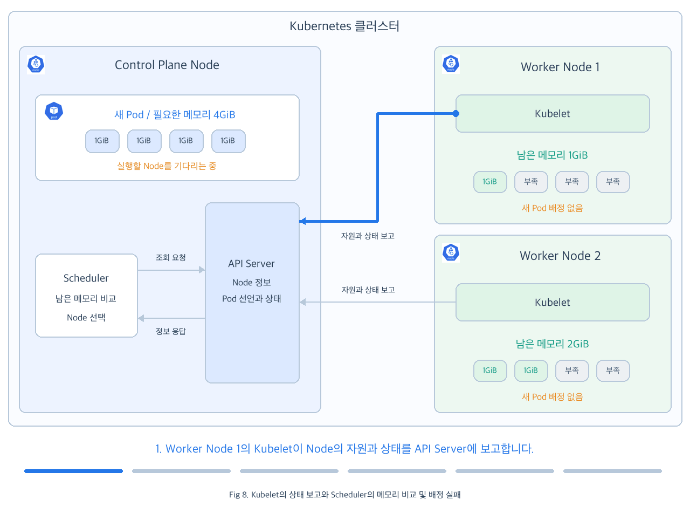

# Chap04. Pod의 상태 관리와 자동 복구: 생성부터 종료까지

> 15주 연재의 넷째 글입니다. Pod의 생성과 실행, 상태 확인, 프로브 검사, 장애 복구, 정상 종료를 살펴봅니다. 마지막에는 상태와 로그를 읽는 간단한 예시로 문제 진단 방법을 확인합니다.

## 들어가며

<div align="center">


</div>

Pod를 생성했다고 애플리케이션 운영이 끝나는 것은 아닙니다. 컨테이너가 요청을 처리할 준비를 마쳤는지 확인해야 하고, 장애가 발생하면 컨테이너를 재시작하거나 새 Pod를 만들어야 합니다. Pod를 삭제할 때는 애플리케이션이 처리 중인 작업을 마칠 시간도 필요합니다. 이렇게 Pod의 현재 상태를 확인하고 선언한 상태를 유지하도록 제어하는 일이 Kubernetes의 핵심입니다.

3장에서는 Pod와 Pod 집합을 관리하는 워크로드 리소스를 살펴보았습니다. 이번 글에서는 Deployment로 관리하는 Pod의 **생명주기**(Lifecycle), 즉 Pod가 생성되어 실행되고 종료되기까지의 과정을 살펴봅니다. Deployment가 이 과정을 혼자 처리하는 것은 아닙니다. 컨트롤러와 Scheduler, Kubelet이 각자의 역할을 맡아 Pod의 상태를 관리합니다.

먼저 Pod가 생성되고 Node에 배정되어 컨테이너가 실행되는 과정을 살펴봅니다. 실행 중에는 Pod의 실행 상태와 요청 준비 상태를 구분하고, 프로브로 애플리케이션의 상태를 검사합니다. 이어서 장애가 발생했을 때의 복구와 삭제 요청에 따른 정상 종료를 알아봅니다. 마지막으로 상태와 로그를 읽으며 Pod의 실행을 막는 원인을 확인합니다. 이번 장에서는 이러한 기본 동작과 문제 확인 방법까지 다룹니다.

## 1. Pod의 생성과 실행을 담당하는 구성 요소

### 1.1 클러스터 구성 요소의 위치와 역할

<div align="center">



</div>

그림은 각 구성 요소의 위치만 보여 주기 위해 Control Plane Node와 Worker Node를 하나씩 배치한 것입니다. **Control Plane**은 클러스터를 관리하는 구성 요소들의 집합이며, 흔히 마스터 노드라고 부르는 Control Plane Node에서 실행됩니다.

- **API Server**: Control Plane에서 리소스의 생성, 조회, 변경 요청을 받고, 각 구성 요소가 선언과 상태를 공유하도록 합니다.
- **컨트롤러**(Controller): 원하는 상태와 실제 상태를 비교해 차이를 줄이는 프로세스입니다. Control Plane의 컨트롤러 매니저(`kube-controller-manager`)가 Deployment Controller와 ReplicaSet Controller 등 여러 기본 컨트롤러를 실행합니다.
- **Scheduler**: Control Plane에서 아직 Node를 배정받지 못한 Pod의 실행 조건을 확인하고, Pod를 실행할 Node를 선택합니다.
- **Worker Node**: 애플리케이션의 컨테이너가 실행되는 Node이며, Kubelet과 컨테이너 런타임이 배정된 Pod의 실행을 처리합니다.
- **Kubelet**: 각 Node에서 자신에게 배정된 Pod를 확인하고, 컨테이너의 실행과 상태 검사, 종료를 관리하는 에이전트입니다.
- **컨테이너 런타임**: 이미지를 준비하고 컨테이너 프로세스를 실제로 시작하거나 중지하는 소프트웨어입니다.
- **etcd**: API Server가 리소스의 선언과 상태를 저장하는 저장소입니다.

이 그림에는 Pod의 생성과 실행을 이해하는 데 필요한 구성 요소만 표시했습니다. [[1]](#ref-1)

### 1.2 Pod의 생성과 컨테이너 실행 경로

<div align="center">



</div>

Fig 3은 Deployment로 Pod 세 개를 실행한 뒤, Pod 하나를 삭제했을 때 복제본을 회복하는 과정입니다. 파란색 행은 API에 남아 있는 Pod 객체 수를, 초록색 행은 Worker Node에서 컨테이너가 실행 중인 Pod 수를 표시합니다. 이 예시에서는 Pod마다 컨테이너 한 개를 실행합니다.

사용자가 `kubectl apply`로 Deployment를 선언하면 API Server가 요청을 받아 선언을 etcd에 저장합니다. 명령의 성공 메시지는 선언을 반영했다는 뜻이며, 컨테이너 실행 완료를 보장하지는 않습니다. 사용자가 Pod 상태를 조회할 때도 `kubectl`은 API Server에 요청을 보냅니다.

Deployment Controller는 API에 기록된 Deployment를 확인하고, 선언에 맞는 ReplicaSet을 관리합니다. 그림에서는 필요한 ReplicaSet이 없으므로 생성을 요청합니다. ReplicaSet Controller는 원하는 복제본 세 개와 현재 관리하는 Pod 수를 비교한 뒤, 부족한 Pod A, B, C의 생성을 API Server에 요청합니다. Deployment와 ReplicaSet은 API에 저장되는 리소스이고, 컨트롤러는 그 선언을 실현하는 프로세스입니다.

이때 생성된 Pod는 아직 API에 기록된 객체이며, 실행할 Node가 정해져야 컨테이너를 실행할 수 있습니다. Scheduler는 Pod의 자원 요청량과 배치 조건을 확인해 실행 가능한 Node를 선택하고 배정 결과를 API에 기록합니다. 이 과정을 **스케줄링**(scheduling)이라고 합니다. 조건을 만족하는 Node가 없으면 Pod는 배정을 기다립니다. 복제본을 세 개 선언했다고 반드시 서로 다른 Node에 배치되는 것은 아닙니다.

선택된 Node의 Kubelet은 API에서 자신에게 배정된 Pod를 확인합니다. Kubelet이 실행 환경을 준비하고 런타임에 컨테이너 실행을 요청하면, 런타임이 이미지를 준비해 컨테이너를 실행합니다. Kubelet은 실행 이후에도 컨테이너의 상태와 애플리케이션 검사 결과를 확인하고 Pod 상태를 API에 보고합니다. 이처럼 각 구성 요소는 API의 선언과 상태를 확인하며 작업하므로, 컨트롤러나 Scheduler가 Kubelet에 직접 실행 명령을 보내는 관계는 아닙니다.

Pod C의 삭제 요청도 API Server를 통해 처리됩니다. API에 삭제 요청이 기록되어도 Pod 객체와 컨테이너가 즉시 사라지지는 않습니다. Kubelet이 삭제 요청을 확인하고 런타임에 컨테이너 종료를 요청한 뒤, 종료 상태 보고와 최종 삭제 요청을 거쳐 API 객체가 제거됩니다. 그림에서도 삭제 중인 Pod C를 유지하면서 컨테이너 종료와 API 객체 제거를 구분합니다. [[2]](#ref-2)

ReplicaSet Controller는 원하는 복제본 수와 유효한 Pod 수의 차이를 계속 확인합니다. 삭제 중이거나 종료된 Pod는 유효한 복제본 수에서 제외하므로, Pod C의 삭제가 시작되면 새 Pod D를 생성해 부족한 복제본을 채울 수 있습니다. Pod D도 Scheduler의 Node 배정과 Kubelet의 실행 요청, 런타임의 컨테이너 실행을 거칩니다. 기존 Pod C를 되살리거나 다른 Node로 옮기는 것이 아닙니다.

애니메이션은 역할을 구분하기 위해 Pod C의 종료와 제거를 먼저 보여 준 뒤 Pod D의 생성을 보여 줍니다. 실제로는 Pod C의 종료가 끝나기 전에 대체 Pod 생성이 시작될 수 있고, 각 Pod의 배정과 실행 시점도 서로 다를 수 있습니다. 준비 검사와 종료 유예 시간의 세부 동작은 그림에서 생략했습니다.

## 2. Pod의 실행 상태와 준비 상태

Pod가 목록에 있다는 사실만으로 애플리케이션의 정상 동작을 판단할 수는 없습니다. 컨테이너가 실행을 기다리는지, 실행 중이지만 요청을 받지 못하는지, 반복해서 종료되는지를 구분해야 합니다. 상태를 조회하는 명령과 출력에서 그 차이를 확인해 보겠습니다.

다음은 `app: web` Label을 가진 Pod 세 개를 현재 `kubectl` 설정으로 조회할 수 있다고 가정한 명령 실행 예시입니다. 출력은 필드의 의미를 설명하기 위한 예시이며, 실제 클러스터에서 수집한 결과는 아닙니다. 직접 실행할 때는 자신의 Pod 이름과 Label을 사용해야 합니다.

<div align="center">



</div>

Fig 4는 Pod 상태가 명령 출력으로 나타나는 경로입니다. Kubelet은 확인한 Pod 상태를 API Server에 보고합니다. 사용자가 조회 명령을 실행하면 `kubectl`은 API Server에 저장된 정보를 요청하고, 응답을 명령에 맞는 형태로 표시합니다. 이러한 상태 조회 명령은 Pod에 직접 접속하거나 Kubelet에 새 검사를 요청하지 않습니다.

GIF는 `get pods`의 목록, `status.phase`를 선택한 출력, `describe pod`의 상세 정보를 차례로 보여 줍니다. 상태 보고는 사용자 조회와 독립적으로 반복되며, 명령 출력에는 API에 반영된 상태가 나타납니다. 그림의 Worker Node는 구성을 단순화한 것이고, 출력 예시에는 서로 다른 Node에 배정된 Pod와 아직 Node를 배정받지 못한 Pod를 함께 표시했습니다.

### 2.1 Pod 목록의 실행 상태와 준비 여부

먼저 `get pods`로 Pod 목록을 조회합니다. `-l app=web`은 해당 Label을 가진 Pod를 선택하고, `-o wide`는 Pod IP와 Node 등 추가 정보를 표시합니다.

```bash
# 웹 Pod의 준비 여부, 재시작 횟수, 실행 Node를 함께 조회
kubectl get pods -l app=web -o wide
```

```text
NAME                   READY   STATUS    RESTARTS   AGE   IP           NODE
web-7c8d9f6b5d-a1b2c    1/1     Running   0          5m    10.244.1.8   worker-1
web-7c8d9f6b5d-d3e4f    0/1     Running   0          5m    10.244.2.9   worker-2
web-7c8d9f6b5d-g5h6j    0/1     Pending   0          20s   <none>       <none>
```

위 출력은 주요 열만 발췌한 예시입니다.

- `READY`: 준비된 컨테이너 수와 전체 컨테이너 수입니다. `1/1`과 `0/1`을 비교해 요청 준비 여부를 확인합니다.
- `STATUS`: 실행 상태나 오류 이유를 요약합니다. `Running`이라고 요청 준비까지 끝난 것은 아닙니다.
- `NODE`: 배정된 Node입니다. `<none>`이면 아직 Node를 배정받지 못했습니다.

이름은 상세 조회할 Pod를 지정할 때 사용합니다. 나머지 열은 재시작 횟수, 경과 시간과 주소를 보여 주며, 여기서는 실행 상태와 준비 여부의 차이에 집중합니다.

두 번째 Pod는 `Running`이지만 `READY`가 `0/1`이므로 컨테이너 실행과 요청 준비가 서로 다른 상태임을 알 수 있습니다. 세 번째 Pod는 `NODE`가 `<none>`이므로 Node 배정을 기다리고 있습니다. 다만 Node 배정 후 이미지를 내려받는 Pod도 `Pending`일 수 있으므로 `STATUS` 하나만으로 원인을 단정하지 않습니다.

### 2.2 Pod 단계와 컨테이너 상태

**Pod 단계**(Pod Phase)는 `status.phase`에 기록되는 Pod 생명주기의 요약값입니다. 목록의 `STATUS` 열에는 오류 이유도 표시될 수 있으므로, API에 기록된 단계가 필요하면 해당 필드를 직접 조회합니다.

```bash
# API에 기록된 각 Pod의 단계를 별도 열로 조회
kubectl get pods -l app=web -o custom-columns='NAME:.metadata.name,PHASE:.status.phase'
```

```text
NAME                   PHASE
web-7c8d9f6b5d-a1b2c    Running
web-7c8d9f6b5d-d3e4f    Running
web-7c8d9f6b5d-g5h6j    Pending
```

이 명령은 `.status.phase`를 `PHASE` 열로 조회합니다.

- `PHASE: Running`: Node에 배치되고 모든 컨테이너가 생성되었으며, 하나 이상이 실행 중이거나 시작 또는 재시작 중인 단계입니다. 두 번째 Pod처럼 요청 준비를 마치지 못한 경우도 포함됩니다.
- `PHASE: Pending`: Node 배정이나 이미지 다운로드 등 컨테이너 실행 준비를 기다리는 단계입니다.

Pod 단계는 Pod 전체의 요약이고, **컨테이너 상태**(Container State)는 개별 컨테이너의 실행 상태입니다. 컨테이너가 재시작을 기다리는 `Waiting`이어도 Pod 단계는 `Running`일 수 있습니다. 기본 목록의 `STATUS`에 표시되는 `CrashLoopBackOff`는 재시작 대기를, `Terminating`은 삭제 진행을 나타내며 Pod 단계 자체와는 구분합니다. 전체 단계의 정의는 공식 문서[[3]](#ref-3)에서 확인할 수 있습니다.

### 2.3 준비 상태와 이벤트의 상세 확인

두 번째 Pod가 `Running`인데도 `0/1`인 이유는 상세 정보에서 확인합니다.

```bash
# 실행 중이지만 준비되지 않은 Pod의 컨테이너 상태와 이벤트 조회
kubectl describe pod web-7c8d9f6b5d-d3e4f
```

```text
Name:         web-7c8d9f6b5d-d3e4f
Node:         worker-2/192.168.1.12
Status:       Running
Containers:
  web:
    State:          Running
    Ready:          False
    Restart Count:  0
Conditions:
  Type              Status
  PodScheduled      True
  Initialized       True
  ContainersReady   False
  Ready             False
Events:
  Type     Reason     Age                From     Message
  Warning  Unhealthy  5s (x3 over 15s)    kubelet  Readiness probe failed: HTTP probe failed with statuscode: 503
```

출력은 관련 필드만 발췌했습니다. 이 예시에서는 실행 여부, 준비 여부, 실패 원인을 함께 봅니다.

- `State: Running`과 컨테이너의 `Ready: False`: 프로세스는 실행 중이지만 요청을 받을 준비는 끝나지 않았습니다.
- `Conditions`의 `Ready: False`: Pod 전체도 요청 준비를 마치지 못했습니다. 이처럼 특정 조건의 충족 여부를 기록한 값을 **Pod 조건**(Pod Condition)이라고 합니다.
- `Events`의 `Message`: 준비 검사가 HTTP 503 응답으로 실패했음을 보여 줍니다. **이벤트**(Event)는 이런 변화와 이유를 기록하며, 여기서는 `kubelet`이 검사 실패를 보고했습니다.

이름과 Node는 조회 대상을 식별하는 정보입니다. 다른 조건과 이벤트의 시간 정보보다 위 세 항목을 먼저 연결해 원인을 파악합니다.

이 Pod는 Node 배정이 끝났고 컨테이너도 실행 중이지만 준비 검사에 실패했습니다. 따라서 Pod를 배치하지 못했거나 컨테이너가 종료된 상황과 구분할 수 있습니다. 이벤트는 일정 시간이 지나면 사라질 수 있으므로 문제가 발생했을 때 최근 기록을 확인하는 편이 좋습니다. Kubelet이 실행 상태와 준비 상태를 각각 어떤 경로로 확인하는지는 3절에서 설명합니다.

## 3. 실행 중인 Pod의 애플리케이션 상태 검사

2절에서는 API에 보고된 상태를 조회하는 방법을 살펴보았습니다. 이번 절에서는 Kubelet이 그 상태를 어떻게 확인하는지 알아봅니다. Kubelet은 런타임에서 컨테이너 프로세스의 실행 여부를 확인하고, 프로브로 애플리케이션의 상태를 검사합니다. 컨테이너가 실행 중이라는 정보만으로 애플리케이션이 요청을 처리할 수 있는지 판단할 수는 없습니다.

**프로브**(Probe)는 Kubelet이 컨테이너의 애플리케이션 상태를 검사하는 기능입니다. 사용자는 검사 경로와 주기, 실패 기준을 Pod 설정에 선언합니다. Kubelet은 그 설정에 따라 검사를 수행하며, 검사 종류에 따라 준비 상태를 변경하거나 컨테이너를 재시작합니다.

### 3.1 Pod 템플릿의 프로브 선언

다음은 Deployment의 Pod 템플릿 일부입니다. `my-web:1.0`은 예시 이미지이며, 애플리케이션이 8080번 포트에서 세 검사 경로를 제공한다고 가정합니다. 그대로 실행하는 완성된 배포 파일이 아니라, 각 컨테이너에 프로브를 선언하는 위치를 보여 주는 예시입니다.

```yaml
# Deployment의 Pod 템플릿에 세 가지 HTTP 상태 검사를 선언하는 예시
spec:
  template:
    spec:
      containers:
      - name: web
        image: my-web:1.0
        startupProbe:  # 기동 완료 전에는 나머지 두 검사를 시작하지 않음
          httpGet:  # Pod의 HTTP 경로로 검사
            path: /startup  # 기동 완료 확인 경로
            port: 8080  # 검사 요청을 받을 포트
          periodSeconds: 5  # 5초 검사 간격
          timeoutSeconds: 2  # 응답 대기 한도 2초
          failureThreshold: 30  # 30회 연속 실패 시 실패 판정
        readinessProbe:  # 요청을 받을 준비 여부 검사
          httpGet:  # Pod의 HTTP 경로로 검사
            path: /ready  # 요청 준비 확인 경로
            port: 8080  # 검사 요청을 받을 포트
          periodSeconds: 5  # 5초 검사 간격
          timeoutSeconds: 2  # 응답 대기 한도 2초
          failureThreshold: 3  # 3회 연속 실패 시 실패 판정
        livenessProbe:  # 재시작이 필요한 고장 여부 검사
          httpGet:  # Pod의 HTTP 경로로 검사
            path: /healthz  # 생존 확인 경로
            port: 8080  # 검사 요청을 받을 포트
          periodSeconds: 10  # 10초 검사 간격
          timeoutSeconds: 2  # 응답 대기 한도 2초
          failureThreshold: 3  # 3회 연속 실패 시 실패 판정
```

- `startupProbe`: 기동 완료를 확인하며, 성공하기 전에는 준비 검사와 생존 검사를 시작하지 않습니다.
- `readinessProbe`: 요청을 받을 준비 여부를 검사하며, 실패하면 준비 상태를 변경합니다.
- `livenessProbe`: 재시작이 필요한 고장 상태를 검사하며, 실패하면 컨테이너 종료 후 재시작 정책을 적용합니다.
- `httpGet.path`와 `httpGet.port`: Pod에 HTTP 요청을 보낼 경로와 포트입니다. 세 검사는 각각 `/startup`, `/ready`, `/healthz`와 8080번 포트를 사용합니다.
- `periodSeconds`와 `timeoutSeconds`: 검사 간격과 한 번의 응답 대기 시간을 정합니다.
- `failureThreshold`: 실패 판정에 필요한 연속 실패 횟수입니다. 시작 검사는 30회, 나머지는 3회입니다.

이 코드는 Deployment의 Pod 템플릿 일부이며, `web` 컨테이너에서 세 검사 경로를 제공하는 `my-web:1.0` 이미지를 가정합니다. 생략한 `successThreshold`는 기본값 1이 적용됩니다.

Kubelet은 일반적으로 Pod IP의 지정된 포트로 HTTP 검사 요청을 보내고, 200 이상 400 미만의 응답 코드를 성공으로 판단합니다. 검사 경로를 YAML에 적는 것만으로 상태 확인 기능이 생기지는 않으므로, 애플리케이션이 각 경로에서 목적에 맞는 응답을 반환해야 합니다. 준비되지 않은 동안에는 준비 검사가 설정 주기보다 자주 수행될 수도 있습니다. [[4]](#ref-4)

<div align="center">



</div>

Fig 5는 Kubelet의 런타임 상태 확인과 세 HTTP 프로브 검사를 구분합니다. 파란색 화살표는 런타임에서 컨테이너 실행 상태를 확인하는 경로이고, 보라색 화살표는 Pod IP의 8080번 포트로 HTTP 검사 요청을 보내는 경로입니다. 그림의 프로브 번호와 경로는 다음과 같습니다.

- **1단계 `startupProbe` `/startup`**: 애플리케이션의 기동 완료 여부를 확인하며, 성공한 뒤 준비 검사와 생존 검사를 시작합니다.
- **2단계 `readinessProbe` `/ready`**: 현재 요청 처리 가능 여부를 반복해서 확인하며, 실패 기준에 도달하면 컨테이너를 유지한 채 준비 상태를 `False`로 바꿉니다.
- **2단계 `livenessProbe` `/healthz`**: 컨테이너 재시작이 필요한지를 반복해서 확인하며, 실패 기준에 도달하면 컨테이너를 종료하고 재시작 정책을 적용합니다.

`readinessProbe`와 `livenessProbe`는 순서대로 성공해야 다음 검사를 수행하는 단계가 아닙니다. 시작 검사 성공 이후 각각 반복되며, GIF는 두 검사의 차이를 보여 주기 위해 준비 실패와 생존 실패를 차례로 제시합니다. 예시에서는 준비 검사가 세 번 연속 실패해도 컨테이너 실행이 유지되고, 이후 생존 검사까지 세 번 연속 실패하면 `Always` 정책에 따라 같은 Pod 안의 컨테이너가 다시 실행됩니다. 새 실행에서는 시작 검사부터 다시 수행합니다.

준비 실패만 발생한 시점에는 2절에서 본 `Running`이면서 `READY`가 `0/1`인 상태로 조회될 수 있습니다. Kubelet은 Pod에 직접 HTTP 검사 요청을 보내며, 런타임을 통해 컨테이너 안의 명령을 실행하는 방식의 프로브와는 검사 경로가 다릅니다.

<div align="center">



</div>

Fig 6은 같은 흐름을 한 장으로 정리합니다. 위쪽의 1단계 `startupProbe`가 성공하면 아래쪽의 2단계 `readinessProbe`와 2단계 `livenessProbe`가 각각 반복됩니다. 준비 검사는 요청을 받을 수 있는지 판단하고, 생존 검사는 컨테이너를 다시 실행해야 하는지 판단합니다. 그림 안의 Pod는 서로 다른 복제본이 아니라 같은 Pod의 검사 상황을 구분한 것입니다.

### 3.2 기동 완료 전의 시작 프로브

Fig 6의 1단계처럼 애플리케이션이 초기 데이터를 읽는 동안에는 **시작 프로브**(Startup Probe)로 기동 완료 여부를 확인합니다. 위 매니페스트에서 Kubelet은 `/startup`으로 요청을 보냅니다. 애플리케이션이 초기 데이터를 읽는 동안 503을 반환하다가 기동을 마친 뒤 200을 반환한다면, Kubelet은 200 응답을 받은 시점에 시작 검사를 성공으로 판단합니다.

시작 검사가 성공하기 전에는 같은 컨테이너의 준비 검사와 생존 검사가 시작되지 않습니다. 초기화가 느린 애플리케이션을 생존 검사 실패로 반복 종료하는 일을 방지하기 위한 구분입니다. 시작 검사가 한 번 성공하면 해당 실행의 시작 검사는 끝나고, 준비 검사와 생존 검사가 각각 동작합니다.

예시 설정에서는 실패 횟수가 30회에 도달하기 전까지 Kubelet이 시작 검사를 반복합니다. 30회 연속 실패하면 Kubelet이 컨테이너를 종료하고 재시작 정책을 적용합니다. Deployment의 일반적인 `Always` 정책에서는 같은 Pod 안에서 컨테이너를 다시 실행하고 시작 검사도 다시 수행합니다. 검사 주기와 실패 횟수는 애플리케이션의 정상 기동 시간을 고려해 정해야 합니다.

### 3.3 요청 준비 여부를 확인하는 준비 프로브

Fig 6의 `readinessProbe` 영역은 컨테이너가 실행 중이지만 새 요청을 처리할 준비가 부족한 상황을 보여 줍니다. **준비 프로브**(Readiness Probe)는 현재 요청 처리 가능 여부를 검사합니다. 예를 들어 기동을 마친 애플리케이션이 요청 처리에 필요한 외부 시스템과 연결하지 못했다면 `/ready`에서 503을 반환하도록 구현할 수 있습니다. 예시 설정에서 준비 검사가 세 번 연속 실패하면 컨테이너의 준비 상태가 `False`로 바뀌고, Pod의 `Ready` 조건도 `False`가 됩니다. 2절의 `Running`이면서 `0/1`인 Pod가 이런 경우입니다.

여러 Pod에 요청을 나누어 보내는 구성에서는 준비 상태를 기준으로 요청을 받을 Pod를 구분합니다. 준비되지 않은 Pod는 새 요청을 받을 대상에서 빠지고, 준비된 다른 Pod가 요청을 처리합니다. Kubelet이 보고한 준비 상태는 이처럼 새 요청을 전달할 대상을 정하는 기준이 됩니다.

준비 검사 실패만으로 컨테이너가 재시작되거나 Pod가 교체되지는 않습니다. Kubelet은 같은 컨테이너의 준비 검사를 계속합니다. 이 예시에서 `/ready`가 다시 200을 반환하고 다른 준비 조건도 충족되면, 같은 Pod가 요청 대상으로 돌아올 수 있습니다. 따라서 외부 시스템이 잠시 응답하지 않아도 준비 검사로 새 요청을 받지 않도록 하면서 애플리케이션의 회복을 기다릴 수 있습니다.

준비 상태가 바뀌었다고 기존 연결이 즉시 끊기거나 Pod IP로 직접 들어오는 모든 요청이 차단되지는 않습니다. 또한 준비 프로브를 생략하면 애플리케이션의 데이터 로딩 완료 여부를 Kubernetes가 알아서 판단할 수 없습니다. 컨테이너 실행 이후에도 준비 시간이 필요하다면 그 기준을 준비 프로브에 선언해야 합니다.

### 3.4 응답 불능을 감지하는 생존 프로브

Fig 6의 `livenessProbe` 영역은 컨테이너 프로세스가 실행 중이어도 애플리케이션이 응답하지 못하는 상황을 보여 줍니다. **생존 프로브**(Liveness Probe)는 이러한 문제가 컨테이너 재시작이 필요한 고장 상태인지를 검사합니다. 이 경우 컨테이너의 실행 상태만 보면 `Running`이지만, `/healthz` 검사에는 응답하지 못합니다.

예시 설정에서는 Kubelet이 10초 간격으로 검사하며, 2초 안에 응답이 없으면 한 번의 검사 실패로 판단합니다. 세 번 연속 실패하면 Kubelet은 컨테이너를 종료합니다. Deployment의 `Always` 정책에서는 런타임을 통해 같은 Pod 안에 컨테이너를 다시 실행합니다. 새 컨테이너의 시작 검사가 성공하면 준비 검사와 생존 검사가 다시 시작되며, 준비 검사 결과에 따라 요청을 받을 수 있는지가 결정됩니다.

준비 검사와 생존 검사는 시작 검사 성공 이후 각각 반복됩니다. 준비 검사가 성공해야 생존 검사가 실행되는 직렬 단계는 아닙니다. 외부 데이터베이스의 일시적인 장애까지 생존 검사 실패로 처리하면 여러 컨테이너가 불필요하게 재시작될 수 있습니다. 생존 검사 기준은 컨테이너 재시작으로 회복할 수 있는 문제에 맞춰야 합니다.

HTTP 외에도 포트 연결 여부를 확인하는 TCP 검사와 컨테이너 안의 명령이 종료 코드 0으로 끝나는지 확인하는 명령 실행 검사를 사용할 수 있습니다. 어떤 방식이든 애플리케이션의 준비 여부와 재시작 필요 여부를 구분할 수 있는 기준이 먼저입니다.

## 4. Pod의 장애와 자동 복구

웹 애플리케이션의 Pod 세 개를 Deployment로 실행했다고 가정해 보겠습니다. 이 절에서는 자동 복구가 필요한 상황을 **Pod에 장애가 발생한 경우**와 **Node에 장애가 발생한 경우**로 나누어 살펴봅니다. 여기서 Pod 장애는 Node는 정상인 상태에서 Pod 안의 애플리케이션 컨테이너가 종료되거나 응답하지 못하는 상황을 뜻합니다.

- **Pod 장애**: 정상 동작하는 Node의 Kubelet이 같은 Pod 안의 컨테이너를 다시 실행합니다.
- **Node 장애**: 해당 Node의 정상 동작을 확인할 수 없는 상황이 지속되면, Control Plane의 컨트롤러와 Scheduler가 대체 Pod의 생성과 다른 Node의 배정을 담당합니다.

핵심 차이는 같은 Pod 안의 컨테이너를 다시 실행하는지, 다른 Node에 새 Pod를 만들어 실행하는지입니다. 준비 검사만 실패한 경우에는 컨테이너를 바로 재시작하거나 Pod를 교체하지 않고, 요청을 받을 준비가 되었는지 검사를 계속합니다.

<div align="center">



</div>

Fig 7은 Pod A와 Pod B, Pod C를 두 Worker Node에 나누어 실행한 상태에서 두 장애 상황을 구분해 보여 줍니다. 첫 번째는 Pod 장애입니다. Worker Node 1의 Kubelet이 Pod A의 컨테이너 종료를 확인하고 런타임에 재실행을 요청합니다. Control Plane에 기록된 Pod A와 고유 식별자인 **UID**는 그대로 유지되며, 컨테이너 프로세스만 새로 실행됩니다. 이때 Scheduler는 다른 Node를 선택하지 않습니다.

두 번째는 Node 장애입니다. Worker Node 1의 생존 신호가 끊기고 장애가 지속되면 해당 Node의 Pod 제거가 시작됩니다. ReplicaSet Controller는 부족한 복제본을 채울 새 Pod D 생성을 요청합니다. Scheduler는 `NotReady`인 Worker Node 1을 제외하고 실행 조건을 만족하는 Worker Node 2를 선택합니다. Worker Node 2의 Kubelet과 런타임은 Pod D의 컨테이너를 처음부터 실행합니다. Kubernetes가 Pod A를 다른 Node로 옮기는 것이 아니라 별개의 Pod D를 만드는 과정입니다.

### 4.1 Pod 장애와 같은 Pod 안의 컨테이너 재시작

Pod 세 개 중 하나의 `web` 컨테이너가 애플리케이션 오류로 종료되었다고 가정하겠습니다. Pod 객체와 Node는 여전히 존재합니다. Kubelet은 컨테이너 종료를 확인하고, Pod에 선언된 재시작 정책에 따라 런타임에 컨테이너 실행을 다시 요청합니다. Pod를 새로 만들거나 Scheduler가 Node를 다시 고르는 과정은 필요하지 않습니다.

**재시작 정책**(restart policy)은 종료된 컨테이너를 다시 실행할 조건입니다. 일반적인 Deployment의 Pod는 `restartPolicy: Always`를 사용하므로 종료 이유와 관계없이 컨테이너를 다시 실행합니다. 독립적인 Pod 등에서 사용하는 `OnFailure`는 실패로 종료된 컨테이너만 다시 실행하고, `Never`는 다시 실행하지 않습니다. 이 장의 Deployment 예시는 `Always`를 기준으로 설명합니다.

다음은 한 차례 재시작한 뒤 요청 준비까지 마친 컨테이너를 조회한 예시입니다.

```bash
# 재시작 이후 Pod 이름, 준비 상태, 재시작 횟수 확인
kubectl get pod web-7c8d9f6b5d-a1b2c
```

```text
NAME                   READY   STATUS    RESTARTS      AGE
web-7c8d9f6b5d-a1b2c    1/1     Running   1 (20s ago)   8m
```

Pod 이름은 그대로이고 `RESTARTS`가 0에서 1로 증가했습니다. `AGE`는 Pod 생성 시점부터 지난 시간이므로, 컨테이너가 재시작되어도 0부터 다시 계산하지 않습니다. `1/1`은 새 컨테이너가 준비 상태를 회복했다는 뜻입니다. 재시작 직후에는 초기화 때문에 잠시 `0/1`로 보일 수도 있습니다.

Pod의 UID도 유지됩니다. 일반적인 컨테이너 재시작에서는 Pod IP도 유지됩니다. 다만 새 컨테이너 프로세스가 이전 프로세스의 메모리를 이어받지는 않습니다. 애플리케이션은 초기화와 외부 연결을 다시 수행해야 합니다.

컨테이너가 종료되지 않았어도 생존 검사가 실패 기준에 도달하면 Kubelet이 컨테이너 종료와 재시작을 처리합니다. 반면 준비 검사 실패는 새 요청의 전달 대상을 조정하는 근거입니다. `READY`가 `0/1`이라는 이유만으로 컨테이너가 재시작된다고 해석하면 안 됩니다.

### 4.2 Node 장애와 다른 Node에서의 새 Pod 실행

Worker Node 한 대가 꺼지면 해당 Node의 Kubelet도 컨테이너를 재시작할 수 없습니다. Control Plane은 Node가 보내는 상태와 주기적인 생존 신호를 확인합니다. 신호가 끊겼다고 즉시 모든 Pod를 교체하지는 않습니다. 일시적인 통신 장애일 수 있으므로, 장애 판단과 Pod 제거까지 대기 과정이 필요합니다.

```bash
# Node 장애 상황에서 실행 가능한 Node 확인
kubectl get nodes
```

```text
NAME       STATUS     ROLES    AGE   VERSION
worker-1   NotReady   <none>   10d   v1.34.0
worker-2   Ready      <none>   10d   v1.34.0
```

이 출력은 장애 상황의 예시입니다. `NotReady`인 Node에 있던 컨테이너의 현재 상태를 Control Plane이 정상적으로 확인하지 못할 수 있습니다. 특히 통신만 끊어진 경우에는 기존 Node에서 프로세스가 계속 실행 중일 수도 있습니다. Node의 `NotReady`만 보고 모든 기존 컨테이너가 종료되었다고 판단해서는 안 됩니다.

장애가 지속되어 해당 Node의 Pod 제거가 시작되면 ReplicaSet Controller가 부족한 복제본을 대체할 Pod를 생성할 수 있습니다. Scheduler는 실행 가능한 Node 중 조건에 맞는 Node를 선택합니다. `worker-2`에 충분한 자원이 있다면 그 Node에서 새 컨테이너를 실행할 수 있습니다. Kubernetes가 기존 Pod나 그 메모리를 다른 Node로 옮기는 것은 아닙니다. 새 Pod를 생성하고 애플리케이션을 처음부터 실행하는 과정입니다. [[5]](#ref-5)

다른 Node의 CPU나 메모리가 부족하면 새 Pod는 `Pending` 상태로 기다립니다. 저장소 연결이 필요한 애플리케이션은 연결 준비에도 시간이 걸릴 수 있습니다. Deployment로 복제본을 관리해도 장애 복구에는 시간이 필요하고, 그동안 요청이 실패할 수 있습니다. 여러 복제본을 서로 다른 Node에 배치하고 여유 자원을 확보해야 Node 한 대의 장애 중에도 남은 Pod가 요청을 처리할 수 있습니다.

### 4.3 Pod 삭제를 통한 대체 Pod 생성 확인

앞의 두 장애 상황과 별도로, Pod를 직접 삭제하면 컨트롤러가 대체 Pod를 만드는 과정을 관찰할 수 있습니다. 여기서는 Deployment가 관리하는 Pod 하나를 학습 목적으로 삭제합니다. 기존 Pod 객체는 삭제 대상이므로 그 안에서 컨테이너를 다시 실행하는 것으로 복제본 수를 회복할 수 없습니다. ReplicaSet Controller는 원하는 복제본 세 개와 남은 유효한 복제본 두 개의 차이를 확인하고, 같은 Pod 템플릿으로 새 Pod를 생성합니다.

다음 명령은 이 동작을 관찰하기 위해 학습용 Deployment의 Pod 하나를 삭제하는 예시입니다. 자신의 학습 환경에서 조회한 Pod 이름을 사용해야 합니다.

```bash
# 학습용 Deployment의 Pod 하나를 삭제해 대체 Pod 생성 확인
kubectl delete pod web-7c8d9f6b5d-a1b2c
kubectl get pods -l app=web
```

```text
pod "web-7c8d9f6b5d-a1b2c" deleted
NAME                   READY   STATUS              RESTARTS   AGE
web-7c8d9f6b5d-d3e4f    1/1     Running             0          10m
web-7c8d9f6b5d-g5h6j    1/1     Running             0          10m
web-7c8d9f6b5d-k7m8n    0/1     ContainerCreating   0          2s
```

출력은 다른 두 Pod가 정상 실행 중인 상황을 가정한 예시입니다. 기존 이름의 Pod가 사라지고 `k7m8n`으로 끝나는 새 Pod가 생겼습니다. 새 Pod의 `AGE`는 2초이며, `RESTARTS`는 0부터 시작합니다. 기존 Pod의 재시작 이력을 이어받는 것이 아닙니다. 새 Pod에는 다른 UID가 부여되고, IP도 달라질 수 있습니다.

새 Pod가 생성되면 Scheduler가 실행할 Node를 선택하고, 그 Node의 Kubelet이 컨테이너를 실행합니다. 이미지 준비와 애플리케이션 초기화, 준비 검사가 끝나야 요청을 받을 수 있습니다. 따라서 Pod 개수가 다시 세 개가 되었다는 사실과 요청을 처리할 복제본이 세 개라는 사실은 다릅니다. 기존 Pod가 아직 종료 중이면 `Terminating`인 Pod와 새 Pod가 잠시 함께 보일 수도 있습니다.

ReplicaSet은 준비된 Pod 수만 세어 부족한 만큼 새 Pod를 만드는 것은 아닙니다. 실행 중인 Pod 하나가 준비 검사에 실패해도 Pod 세 개가 여전히 관리 대상이면 그 실패만으로 네 번째 Pod를 만들지 않습니다. 반대로 상위 컨트롤러 없이 만든 단독 Pod를 삭제하면 복제본 수를 회복할 주체가 없으므로 대체 Pod도 자동으로 생기지 않습니다.

### 4.4 반복 장애와 자동 복구의 한계

컨테이너가 시작할 때마다 필수 설정을 찾지 못해 종료된다면, 같은 설정으로 컨테이너를 다시 실행해도 같은 오류가 발생합니다. Kubernetes는 컨테이너 실행을 재시도할 수 있지만 누락된 설정값을 알아서 채우지는 못합니다. 이것이 자동 복구와 원인 수정의 차이입니다.

반복해서 종료되는 컨테이너에는 **백오프**(backoff), 즉 재시도 사이의 대기 시간이 적용됩니다. 목록에서 `CrashLoopBackOff`가 보이면 Kubernetes가 복구를 포기했다는 뜻이 아니라, 반복 실패 이후 다음 재시작을 기다리고 있다는 뜻입니다. 이전 컨테이너의 종료 이유와 로그를 읽고 애플리케이션 설정이나 코드를 수정해야 합니다.

복구 결과는 Pod 수뿐 아니라 준비 상태까지 확인해야 합니다. 같은 Pod의 `RESTARTS`가 늘었다면 컨테이너 재시작을, 이름과 UID가 달라졌다면 Pod 교체를 확인할 수 있습니다. 그다음 `Ready` 조건과 실제 애플리케이션 응답을 확인해야 요청 처리까지 회복했는지 판단할 수 있습니다.

## 5. Pod의 정상 종료

Pod 삭제 요청이 들어왔다고 실행 중인 프로세스가 즉시 사라지는 것은 아닙니다. 애플리케이션이 처리 중인 요청이나 파일 기록을 마무리할 수 있도록 Kubernetes는 종료 시간을 제공합니다.

Pod 삭제 상태를 확인한 Kubelet은 컨테이너 런타임에 종료 처리를 요청합니다. 애플리케이션은 일반적으로 정상 종료를 요청하는 SIGTERM 신호를 받은 뒤 진행 중인 작업을 정리합니다. **종료 유예 기간**은 이 작업에 제공하는 시간이며, `terminationGracePeriodSeconds`의 기본값은 30초입니다. 유예 기간이 지나도 프로세스가 남아 있으면 강제 종료가 진행됩니다. [[2]](#ref-2)

종료 중인 Pod를 새 연결 대상에서 제외하는 네트워크 갱신은 컨테이너 종료와 병행됩니다. 또한 ReplicaSet은 기존 Pod의 종료가 끝나기 전에 대체 Pod를 만들 수 있습니다. 따라서 Pod를 교체하는 동안에는 종료 중인 Pod와 새 Pod가 잠시 함께 보일 수 있습니다.

Deployment가 관리하는 Pod 하나를 삭제하면 ReplicaSet이 복제본 수를 회복합니다. 반면 일반적인 방식으로 Deployment 자체를 삭제하면 그 아래의 ReplicaSet과 Pod도 함께 정리됩니다. Pod 하나를 교체하는 작업과 애플리케이션 배포 전체를 제거하는 작업을 구분해야 합니다.

## 6. Pod의 상태와 로그를 통한 장애 원인 확인

자동 복구가 반복되어도 애플리케이션이 정상 동작하지 않는다면 원인을 찾아 수정해야 합니다. Pod 상태와 이벤트는 어느 단계에서 문제가 생겼는지 알려 주고, 컨테이너 로그는 애플리케이션이 남긴 오류 내용을 보여 줍니다.

이 절에서는 먼저 Pod 목록에서 문제가 있는 대상을 찾고, 대표적인 두 상황의 원인을 확인합니다. 컨테이너가 반복 종료되는 `CrashLoopBackOff` 사례에서는 이전 실행의 로그를 살펴보고, 실행 준비가 지연되는 `Pending` 사례에서는 Node 배정 여부와 이벤트를 살펴봅니다. 출력은 상태를 읽는 방법을 설명하기 위한 예시이며, Pod 이름과 시간, 재시작 횟수는 실행 환경에 따라 달라집니다.

### 6.1 Pod 상태 조회와 문제 대상 식별

요청이 실패할 때는 먼저 Pod가 존재하는지와 컨테이너가 준비되었는지를 확인합니다. `RESTARTS`가 증가한다면 컨테이너가 반복해서 종료되는지 조사해야 합니다. `READY`는 준비된 컨테이너 수와 전체 컨테이너 수를 보여 줍니다. Pod 전체의 요청 준비 여부는 상세 정보의 `Ready` 조건과 함께 확인합니다.

```bash
# 웹 Pod의 준비 상태와 컨테이너 재시작 횟수를 조회하는 예시
kubectl get pods -l app=web
```

```text
NAME                   READY   STATUS             RESTARTS   AGE
web-7c8d9f6b5d-a1b2c    0/1     CrashLoopBackOff   4          4m
web-7c8d9f6b5d-d3e4f    1/1     Running            0          4m
web-7c8d9f6b5d-g5h6j    1/1     Running            0          4m
```

이 예시에서는 Pod 세 개가 존재하지만 첫 번째 Pod의 컨테이너가 반복해서 종료되고 있습니다. 원하는 Pod 복제본 수가 유지되어도 모든 복제본이 요청을 처리하는 것은 아닙니다.

### 6.2 대표적인 장애 사례: 컨테이너의 반복 종료

6.1절에서 `CrashLoopBackOff`로 표시된 첫 번째 Pod는 컨테이너가 실행된 뒤 반복해서 종료되는 사례입니다. 이 Pod의 상세 상태를 조회하면 종료 이유와 최근 이벤트를 함께 확인할 수 있습니다.

```bash
# 반복 종료되는 컨테이너의 종료 이유와 최근 이벤트를 확인하는 예시
kubectl describe pod web-7c8d9f6b5d-a1b2c
```

```text
Containers:
  web:
    State:          Waiting
      Reason:       CrashLoopBackOff
    Last State:     Terminated
      Reason:       Error
      Exit Code:    1
    Ready:          False
    Restart Count:  4
Events:
  Type     Reason   Message
  Warning  BackOff  Back-off restarting failed container web in pod ...
```

위 출력은 전체 결과 중 컨테이너 상태와 이벤트만 발췌한 예시입니다. 종료 코드 1은 이전 실행이 실패했음을 보여 주지만 실패 원인까지 설명하지는 않습니다. 이전에 종료된 컨테이너의 로그를 조회하면 애플리케이션이 남긴 오류 메시지를 확인할 수 있습니다.

```bash
# 직전에 종료된 웹 컨테이너의 오류 로그를 조회하는 예시
kubectl logs web-7c8d9f6b5d-a1b2c -c web --previous
```

```text
ERROR: required environment variable DATABASE_HOST is missing
```

이 예시의 원인은 필수 환경 변수 누락입니다. 애플리케이션이 `DATABASE_HOST` 값을 전달받도록 Deployment의 Pod 템플릿을 수정해야 합니다. 재시작 정책을 유지하거나 Pod를 반복해서 삭제하는 것만으로는 누락된 설정이 복구되지 않습니다. `--previous`는 직전에 종료된 컨테이너 실행의 로그를 요청하며, 컨테이너가 여러 개라면 `-c`로 조회할 컨테이너를 지정합니다.

### 6.3 대표적인 장애 사례: Pod의 Pending

<div align="center">



</div>

이번에는 컨테이너 실행 준비를 마치지 못해 Pod가 `Pending`에 머무르는 별도의 사례를 살펴보겠습니다. 잠시 `Pending`을 거치는 것은 정상적인 생성 과정이지만, 이 상태가 지속되면 실행을 막는 원인을 확인해야 합니다. 이번 예시에서는 새 Pod 하나의 컨테이너가 메모리 4GiB를 요청했다고 가정합니다. 다른 실행 조건은 충족하지만, Worker Node 1에는 새 Pod에 배정할 메모리가 1GiB, Worker Node 2에는 2GiB만 남아 있습니다.

새 Pod는 필요한 메모리 4GiB를 한 Node에서 확보해야 합니다. 두 Node 모두 이 요청량을 충족하지 못하므로 Pod는 배정을 기다립니다. 그림의 ‘남은 메모리’는 순간적인 사용량이 아니라, 시스템 몫과 기존 Pod들의 요청량을 제외하고 새 Pod에 배정할 수 있는 양입니다.

Fig 8에서 각 Node의 Kubelet은 Node의 자원과 상태를 API Server에 보고합니다. Scheduler는 API Server에서 Node 정보와 Pod 선언을 확인하고, 기존 Pod들의 요청량을 반영해 남은 메모리를 계산합니다. Kubelet이 남은 메모리 계산 결과를 Scheduler에 직접 보내는 것은 아닙니다.

Scheduler가 조건에 맞는 Node를 찾지 못하면 배정 실패를 API에 기록합니다. 정상적인 생성 과정에서는 Kubelet이 API를 통해 자신에게 배정된 Pod를 확인한 뒤 컨테이너 실행을 요청하지만, 이 사례에서는 Node 배정 자체가 없습니다. 따라서 그림에는 Kubelet이 새 Pod를 실행하는 화살표가 없으며, Pod는 `Pending`에 머무릅니다.

다음은 이 상황에서 나타날 수 있는 명령 출력 예시이며, 실제 출력의 이름과 시간은 환경에 따라 달라집니다.

```bash
# 실행을 기다리는 Pod의 상태와 Node 배정 여부 확인
kubectl get pod web-7c8d9f6b5d-g5h6j -o wide
```

```text
NAME                   READY   STATUS    RESTARTS   AGE   IP       NODE
web-7c8d9f6b5d-g5h6j    0/1     Pending   0          2m    <none>   <none>
```

- `STATUS: Pending`: 컨테이너 실행 준비를 마치지 못했습니다.
- `NODE: <none>`: Scheduler가 이 Pod를 실행할 Node를 아직 배정하지 못했습니다.

상세 정보를 조회하면 배정을 막은 이유를 확인할 수 있습니다.

```bash
# Pod의 메모리 요청량 및 배정 실패 이벤트 확인
kubectl describe pod web-7c8d9f6b5d-g5h6j
```

```text
Node:         <none>
Status:       Pending
Containers:
  web:
    Requests:
      memory:  4Gi
Conditions:
  Type           Status
  PodScheduled   False
Events:
  Type     Reason            From               Message
  Warning  FailedScheduling  default-scheduler  0/2 nodes are available: 2 Insufficient memory.
```

위 출력은 관련 필드와 이벤트 메시지만 발췌한 예시입니다.

- `Requests.memory: 4Gi`: 컨테이너가 메모리 4GiB를 요청했습니다.
- `FailedScheduling` 이벤트의 `2 Insufficient memory`: 두 Node 모두 요청한 메모리를 확보할 수 없어 배정에 실패했습니다.

이 문제를 해결하려면 애플리케이션에 필요한 메모리 요청량을 검토해 과도한 설정을 수정하거나, 요청량을 충족하는 Node를 확보해야 합니다. 같은 요청량으로 Pod를 삭제하고 다시 만들어도 배정 실패는 반복됩니다. [[6]](#ref-6)

Node 배정을 마친 뒤에도 이미지 이름의 오타나 이미지 저장소 접근 실패로 컨테이너를 시작하지 못할 수 있습니다. 이 경우 Pod 단계는 `Pending`이지만 `kubectl get pods`의 `STATUS`에는 `ErrImagePull`이나 `ImagePullBackOff`가 표시될 수 있습니다. `kubectl describe pod`의 이벤트에서 이미지 다운로드 실패 메시지를 확인하고, 이미지 이름이나 접근 설정을 수정해야 합니다. `Pending`이라는 단계만 보고 원인을 단정하지 않고, Node 배정 여부와 이벤트를 함께 확인하는 이유입니다. [[7]](#ref-7)

## 다음 글로 넘어가기 전에

이번 글에서 다룬 내용은 이렇습니다. 컨트롤러는 Pod를 생성하고, Scheduler는 Node를 선택하며, Kubelet은 컨테이너 실행을 관리합니다. Pod의 실행 상태와 요청 준비 상태는 서로 다르므로 프로브로 애플리케이션의 상태를 검사합니다. Pod 내부의 컨테이너 장애는 같은 Pod 안에서 재시작으로 복구하고, Node 장애가 지속되면 다른 Node에 대체 Pod를 생성합니다. Pod를 삭제할 때는 애플리케이션이 작업을 정리할 시간을 제공합니다. 문제가 계속되면 상태와 이벤트, 로그로 원인을 확인해야 합니다.

다음 글에서는 Service가 Pod의 이름과 IP가 바뀌어도 안정적인 접근점을 제공하는 방법을 살펴봅니다. 이어서 ClusterIP, NodePort, LoadBalancer, ExternalName이 클라이언트의 위치와 연결 대상에 따라 어떤 접근점을 제공하는지 비교합니다.

## 참고문헌

- <a id="ref-1"></a>[1] [Kubernetes 구성 요소 공식 문서](https://kubernetes.io/docs/concepts/overview/components/)
- <a id="ref-2"></a>[2] [Pod 종료 과정 공식 문서](https://kubernetes.io/docs/concepts/workloads/pods/pod-lifecycle/#pod-termination)
- <a id="ref-3"></a>[3] [Pod 단계 공식 문서](https://kubernetes.io/docs/concepts/workloads/pods/pod-lifecycle/#pod-phase)
- <a id="ref-4"></a>[4] [프로브 설정 공식 문서](https://kubernetes.io/docs/tasks/configure-pod-container/configure-liveness-readiness-startup-probes/)
- <a id="ref-5"></a>[5] [Node 장애 처리 공식 문서](https://kubernetes.io/docs/concepts/architecture/nodes/#node-controller)
- <a id="ref-6"></a>[6] [자원 요청과 Node 배정 공식 문서](https://kubernetes.io/docs/concepts/configuration/manage-resources-containers/)
- <a id="ref-7"></a>[7] [Pod 문제 해결 공식 문서](https://kubernetes.io/docs/tasks/debug/debug-application/debug-pods/)
