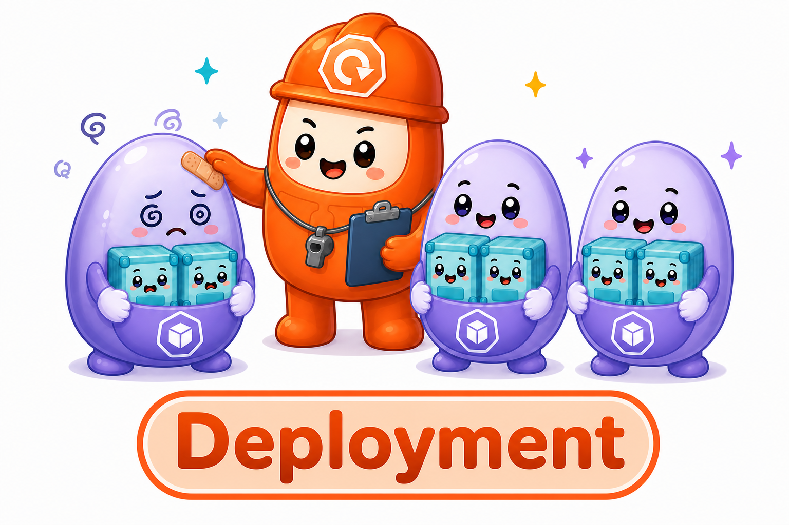
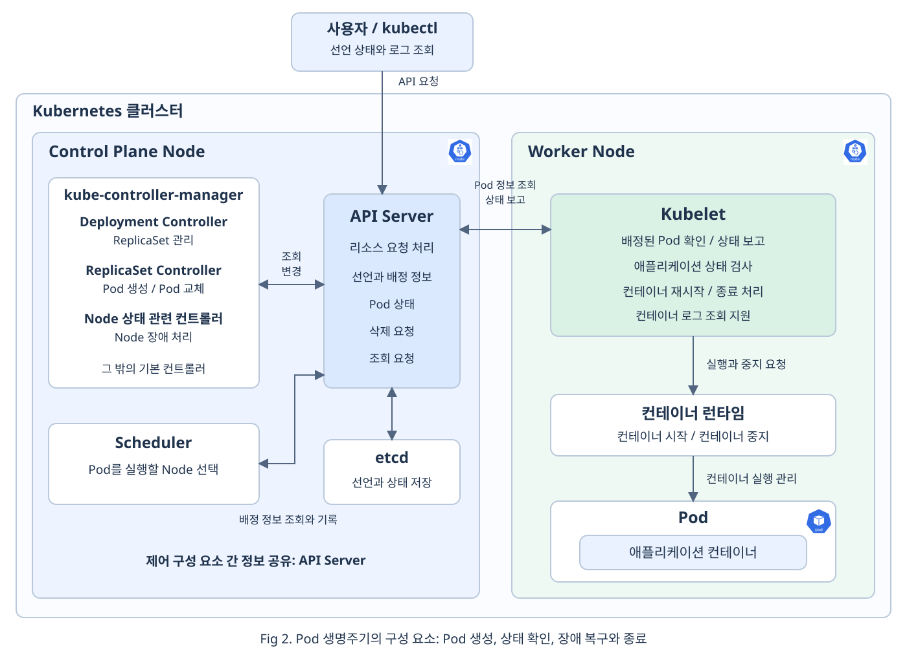
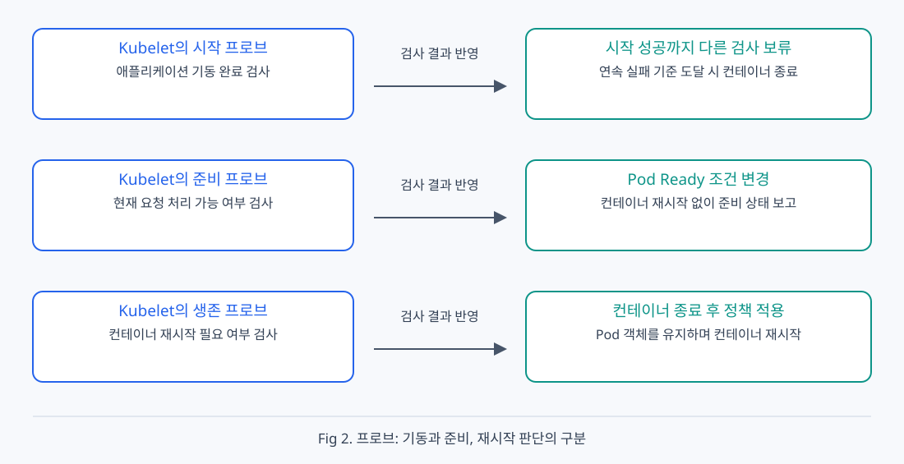
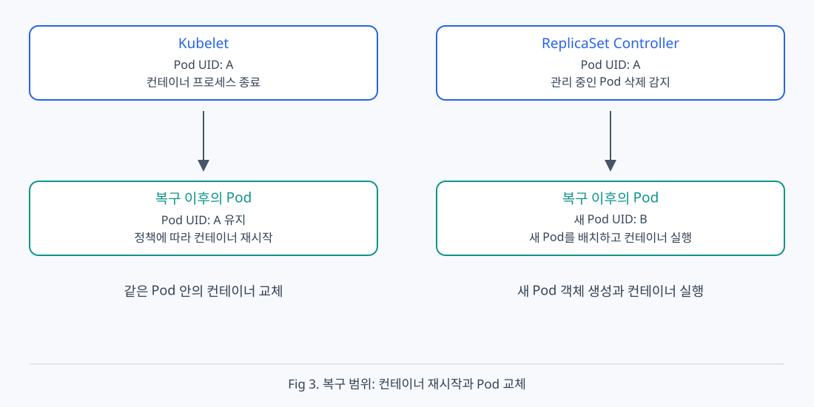

# Chap04. Pod의 생명주기와 자동 복구

> 15주 연재의 넷째 글입니다. Pod의 생성과 실행, 상태 확인, 프로브 검사, 장애 복구, 정상 종료를 살펴봅니다. 마지막에는 상태와 로그를 읽는 간단한 예시로 문제 진단 방법을 확인합니다.

## 들어가며

<div align="center">



</div>

Pod를 실행한 뒤에는 어떤 일이 필요할까요? 컨테이너가 요청을 처리할 준비를 마쳤는지 확인해야 하고, 장애가 발생하면 컨테이너를 재시작하거나 새 Pod를 만들어야 합니다. Pod를 삭제할 때는 애플리케이션이 처리 중인 작업을 마칠 시간도 필요합니다. 이렇게 Pod의 현재 상태를 확인하고 선언한 상태를 유지하도록 제어하는 일이 Kubernetes의 핵심입니다.

3장에서는 Pod와 Pod 집합을 관리하는 워크로드 리소스를 살펴보았습니다. 이번 글에서는 Deployment로 관리하는 Pod의 **생명주기**(Lifecycle), 즉 Pod가 생성되어 실행되고 종료되기까지의 과정을 살펴봅니다. Deployment가 이 과정을 혼자 처리하는 것은 아닙니다. 컨트롤러와 Scheduler, Kubelet이 각자의 역할을 맡아 Pod의 상태를 관리합니다.

먼저 Pod가 생성되고 Node에 배정되어 컨테이너가 실행되는 과정을 살펴봅니다. 실행 중에는 Pod의 실행 상태와 요청 준비 상태를 구분하고, 프로브로 애플리케이션의 상태를 검사합니다. 이어서 장애가 발생했을 때의 복구와 삭제 요청에 따른 정상 종료를 알아봅니다. 마지막으로 상태와 로그를 읽으며 Pod의 실행을 막는 원인을 확인합니다. 이번 장에서는 이러한 기본 동작과 문제 확인 방법까지 다룹니다.

## 1. Pod의 생성과 실행을 담당하는 구성 요소

Pod의 생성부터 컨테이너 실행까지는 여러 구성 요소가 관여합니다. 클러스터를 관리하는 **Control Plane**에서는 Pod 생성과 Node 배정을 처리하고, 애플리케이션을 실행하는 **Worker Node**에서는 배정된 Pod의 컨테이너를 실행합니다. Pod가 실제로 실행되기까지의 과정을 따라 각 구성 요소의 역할을 살펴보겠습니다.

### 1.1 Pod의 선언과 상태를 관리하는 API Server

**API Server**는 Pod를 비롯한 리소스의 생성과 조회, 변경 요청을 받는 Control Plane의 구성 요소입니다. Pod를 실행하려면 먼저 원하는 상태를 API에 선언해야 합니다. 사용자가 `kubectl apply`로 Deployment를 선언하면 API Server가 요청을 받아 처리합니다. **etcd**는 리소스의 선언과 상태를 저장하는 저장소이며, 다른 구성 요소는 API Server를 통해 해당 정보를 읽거나 변경합니다.

`kubectl apply`의 성공 메시지는 선언이 반영되었다는 뜻이며, 컨테이너 실행 완료를 보장하지는 않습니다. 컨트롤러와 Scheduler, Kubelet이 API에 기록된 정보를 확인하고 각자의 작업을 수행해야 컨테이너가 실행됩니다. 사용자가 Pod 상태를 조회할 때도 `kubectl`은 API Server에 요청을 보냅니다.

### 1.2 Pod 생성과 복제본 유지를 담당하는 Controller

Deployment에 Pod 복제본 세 개를 선언했다면, 그 선언에 맞는 Pod를 만드는 과정이 필요합니다. **컨트롤러**(Controller)는 원하는 상태와 실제 상태의 차이를 반복해서 확인하고, 그 차이를 줄이는 제어 프로세스입니다. **kube-controller-manager**는 여러 기본 컨트롤러를 실행하는 구성 요소입니다.

Deployment Controller는 Deployment의 선언에 맞는 ReplicaSet을 관리합니다. ReplicaSet Controller는 자신이 관리하는 Pod의 복제본이 부족하면 새 Pod 생성을 요청합니다. Node 상태 관련 컨트롤러들은 Node의 응답 상태를 확인하고 장애에 따른 처리를 담당합니다. Deployment와 ReplicaSet은 API에 저장되는 리소스이고, 컨트롤러는 해당 선언을 실현하는 프로세스라는 차이가 있습니다.

이 단계에서 만들어진 Pod는 API에 기록된 객체입니다. 컨트롤러가 Worker Node에서 컨테이너를 직접 실행하지는 않습니다. 각 컨트롤러는 API에 기록된 정보를 관찰하고 필요한 변경을 API Server에 요청합니다.

### 1.3 Pod의 실행 위치를 정하는 Scheduler

Pod가 생성되어도 실행할 Node가 정해지지 않았다면 컨테이너를 실행할 수 없습니다. **Scheduler**는 실행할 Node가 아직 지정되지 않은 Pod에 Node를 배정하는 구성 요소입니다. 이 과정을 **스케줄링**(scheduling)이라고 합니다. Scheduler는 Pod의 자원 요청량과 배치 조건을 기준으로 실행 가능한 Node를 찾고, 선택한 Node를 API에 기록합니다.

조건을 만족하는 Node가 없으면 Pod는 배정을 기다립니다. 또한 복제본을 세 개 선언했다고 각 Pod가 서로 다른 Node에 배치되는 것은 아닙니다. 여러 Pod가 같은 Node에 배치되면 그 Node의 장애로 여러 복제본이 동시에 영향을 받을 수 있습니다.

### 1.4 Pod의 실행과 종료를 담당하는 Kubelet과 런타임

Pod에 Node가 배정되면 해당 Node에서 컨테이너 실행을 준비합니다. **Kubelet**은 각 Node에서 자신에게 배정된 Pod의 실행을 관리하는 에이전트입니다. **컨테이너 런타임**(container runtime)은 이미지를 준비하고 컨테이너 프로세스를 실행하는 소프트웨어입니다. Kubelet은 API에서 Pod의 배정 정보를 확인하고, Pod 실행에 필요한 환경을 준비한 뒤 런타임에 컨테이너 실행을 요청합니다.

컨테이너가 실행된 뒤에도 Kubelet은 컨테이너의 상태를 확인하고 Pod 상태를 API에 보고합니다. 애플리케이션 상태 검사, 같은 Pod 안의 컨테이너 재시작, 삭제 요청에 따른 컨테이너 종료도 Kubelet이 처리합니다. 컨테이너 프로세스의 실제 시작과 중지는 런타임을 통해 수행합니다. [Kubernetes 구성 요소 공식 문서](https://kubernetes.io/docs/concepts/overview/components/)

<div align="center">



</div>

그림은 Pod의 생명주기를 담당하는 구성 요소의 연결 관계를 정리한 것입니다. Control Plane에는 API Server와 컨트롤러, Scheduler가 있고, Worker Node에는 Kubelet과 컨테이너 런타임이 있습니다. 이해를 돕기 위해 각각 하나의 Node로 표현했습니다. 컨트롤러는 이 장에서 다루는 이름을 표시하고, 나머지 기본 컨트롤러를 하나로 묶었습니다.

Pod 생성 시에는 컨트롤러가 Pod 생성을 요청하고 Scheduler가 실행할 Node를 정합니다. 배정된 Node의 Kubelet은 런타임에 컨테이너 실행을 요청합니다. 실행 중에는 Kubelet이 Pod 상태를 보고하고 애플리케이션 상태를 검사합니다. 장애가 발생하면 같은 Pod 안의 컨테이너 재시작과 새 Pod 생성이 서로 다른 구성 요소를 통해 처리됩니다. Pod 삭제 요청이 들어오면 Kubelet이 컨테이너 종료를 처리합니다. 각 구성 요소는 앞 구성 요소의 직접 명령을 기다리는 대신 API에 기록된 선언과 상태를 확인하며 자신의 작업을 수행합니다.

## 2. Pod의 실행 상태와 준비 상태

컨테이너 프로세스가 실행 중이어도 애플리케이션이 요청을 처리하지 못할 수 있습니다. 데이터베이스 연결을 기다리거나 초기 데이터를 읽는 경우가 대표적입니다. Pod 세 개가 존재하는 상황과 세 Pod가 모두 요청을 처리하는 상황도 다릅니다.

Kubernetes는 Pod 전체의 진행 단계, 개별 컨테이너의 실행 상태, 요청을 받을 준비 상태를 구분해서 기록합니다. 이 정보를 함께 읽어야 Pod가 어느 과정에서 기다리거나 실패했는지 판단할 수 있습니다.

### 2.1 Pod의 진행 단계

**Pod 단계**(Pod Phase)는 `status.phase`에 기록되는 Pod 생명주기의 요약값입니다. `Pending`은 Pod가 API에 받아들여졌지만 하나 이상의 컨테이너가 아직 실행 준비를 마치지 못한 상태입니다. Node 배치를 기다리는 시간뿐 아니라 이미지 다운로드를 기다리는 시간도 포함합니다.

`Running`은 Pod가 Node에 배치되고 모든 컨테이너가 생성되었으며, 하나 이상의 컨테이너가 실행 중이거나 시작 또는 재시작 과정에 있는 상태입니다. `Running`이라는 값만으로 애플리케이션이 요청을 정상적으로 처리한다고 판단할 수는 없습니다.

`Succeeded`는 Pod의 모든 컨테이너가 성공적으로 종료되었고 다시 시작되지 않는 상태입니다. `Failed`는 모든 컨테이너가 종료되었으며, 그중 하나 이상이 실패했고 자동으로 다시 시작되지 않는 상태입니다. `Unknown`은 Node와의 통신 문제 등으로 Pod 상태를 확인할 수 없는 경우를 나타냅니다. [Pod 단계 공식 정의](https://kubernetes.io/docs/concepts/workloads/pods/pod-lifecycle/#pod-phase)

### 2.2 컨테이너 상태와 재시작 횟수

**컨테이너 상태**(Container State)는 Pod 안의 개별 컨테이너가 실행을 기다리는지, 실행 중인지, 종료되었는지를 나타냅니다. `Waiting`은 이미지 다운로드와 같은 시작 전 작업을 기다리거나 오류 때문에 컨테이너를 시작하지 못하는 상태입니다. `Running`은 컨테이너 프로세스가 실행 중인 상태이고, `Terminated`는 컨테이너 실행이 끝난 상태입니다.

종료된 컨테이너에는 종료 이유와 **종료 코드**(exit code)가 기록됩니다. 종료 코드는 프로세스가 실행 결과를 숫자로 알리는 값이며, 일반적으로 0은 성공적인 종료를 뜻합니다. Kubelet이 같은 Pod 안에서 컨테이너를 다시 실행하면 컨테이너의 재시작 횟수가 늘어납니다.

`kubectl get pods`의 `STATUS` 열은 Pod 단계를 그대로 출력하는 열이 아닙니다. 예를 들어 `CrashLoopBackOff`는 반복해서 종료되는 컨테이너의 재시작 사이에 대기 시간이 적용되고 있음을 나타냅니다. `Terminating`은 Pod 삭제가 진행 중임을 나타냅니다. 두 표시 모두 별도의 Pod 단계는 아닙니다.

### 2.3 Pod의 준비 상태와 이벤트

**Pod 조건**(Pod Condition)은 Pod가 특정 조건을 만족하는지를 나타냅니다. 여기서는 Node 배치 여부를 나타내는 `PodScheduled`와, 요청을 받을 준비 여부를 나타내는 `Ready`를 중심으로 보면 됩니다. `Running`인 Pod도 `Ready`가 `False`이면 요청을 처리할 준비가 부족할 수 있습니다.

**이벤트**(Event)는 Pod 배치 실패나 이미지 다운로드 실패처럼 리소스에 발생한 변화와 이유를 알려 주는 기록입니다. 상태가 현재 결과를 보여 준다면, 이벤트는 그 결과에 이른 원인을 파악하는 데 도움을 줍니다. 이벤트는 영구 감사 로그가 아니므로 문제를 발견했을 때 최근 이벤트를 함께 확인하는 편이 좋습니다.

## 3. 실행 중인 Pod의 애플리케이션 상태 검사

**프로브**(Probe)는 Kubelet이 컨테이너의 애플리케이션 상태를 판단하기 위해 수행하는 검사입니다. 컨테이너 프로세스가 실행 중인지 확인하는 것만으로는 애플리케이션의 준비 완료 여부나 내부 응답 불능을 알 수 없습니다. 사용자는 애플리케이션이 제공하는 상태 확인 경로나 검사 명령을 Pod 설정에 선언할 수 있습니다.

<div align="center">



</div>

시작 프로브는 애플리케이션의 기동 완료 여부를 검사합니다. 준비 프로브는 현재 요청을 받을 준비가 되었는지를 검사합니다. 생존 프로브는 컨테이너를 재시작해야 하는지를 판단하기 위한 검사입니다. 세 프로브는 검사 목적과 실패했을 때의 처리가 다릅니다.

### 3.1 시작 프로브

**시작 프로브**(Startup Probe)는 애플리케이션의 기동 완료 여부를 확인하는 검사이며, `startupProbe` 필드에 선언합니다. 초기 데이터를 읽거나 실행 환경을 준비하는 데 시간이 오래 걸리는 애플리케이션에 사용할 수 있습니다.

시작 프로브가 있으면 Kubelet은 시작 검사가 성공할 때까지 같은 컨테이너의 준비 검사와 생존 검사를 시작하지 않습니다. 애플리케이션이 정상적으로 시작하는 도중에 생존 검사 때문에 컨테이너가 반복해서 종료되는 문제를 줄일 수 있습니다. 시작 검사가 설정된 횟수만큼 연속으로 실패하면 Kubelet은 해당 컨테이너를 종료하고 재시작 정책을 적용합니다.

시작 프로브는 컨테이너의 시작 구간을 검사합니다. 시작 검사가 한 번 성공한 뒤에는 준비 프로브와 생존 프로브가 실행 중인 애플리케이션의 상태를 검사합니다.

### 3.2 준비 프로브

**준비 프로브**(Readiness Probe)는 애플리케이션이 현재 요청을 처리할 준비가 되었는지 확인하는 검사이며, `readinessProbe` 필드에 선언합니다. 준비 검사가 실패 기준에 도달하면 컨테이너가 준비되지 않은 것으로 판정되고 Pod의 `Ready` 조건도 `False`가 됩니다.

**Service**는 Pod 집합에 안정적인 접근점을 제공하는 네트워크 리소스입니다. 일반적인 Service의 네트워크 경로는 Pod의 준비 상태를 반영해 새 연결의 전달 대상을 정합니다. 준비되지 않은 Pod는 이 전달 대상에서 제외될 수 있습니다. 준비 검사가 다시 성공하면 같은 Pod가 요청 대상으로 돌아올 수 있습니다.

3장에서 살펴본 롤링 업데이트에서도 준비 상태가 중요합니다. 새 Pod가 준비 검사에 계속 실패하면 새 버전을 사용할 수 없어 배포 진행이 멈출 수 있습니다.

준비 검사 실패는 컨테이너 재시작 명령이 아닙니다. 애플리케이션이 일시적으로 새 요청을 받지 못해도 컨테이너 프로세스는 계속 실행될 수 있습니다. 또한 준비 상태 변경이 기존 연결을 즉시 끊거나 Pod IP에 직접 들어오는 모든 요청을 차단하지는 않습니다.

준비 프로브를 선언하지 않으면 Kubernetes는 애플리케이션의 준비 여부를 검사할 사용자 정의 기준을 갖지 못합니다. 일반적인 컨테이너는 실행되면 준비된 것으로 취급될 수 있으므로, 데이터 로딩과 같은 추가 준비 시간이 있다면 준비 검사 조건을 선언해야 합니다.

### 3.3 생존 프로브

**생존 프로브**(Liveness Probe)는 애플리케이션이 응답 불능에 빠져 컨테이너 재시작이 필요한지 판단하기 위한 검사이며, `livenessProbe` 필드에 선언합니다. 생존 검사가 설정된 횟수만큼 연속으로 실패하면 Kubelet은 해당 컨테이너를 종료하고 재시작 정책에 따라 컨테이너를 다시 실행합니다.

이 과정에서는 보통 기존 Pod 객체가 유지됩니다. ReplicaSet이 생존 검사 실패를 직접 처리하면서 곧바로 새 Pod를 만드는 것은 아닙니다. 같은 Pod 안에서 컨테이너가 다시 실행되는 과정과 새 Pod가 만들어지는 과정을 구분해야 합니다.

검사 기준이 잘못되면 정상 컨테이너도 반복해서 재시작될 수 있습니다. 예를 들어 외부 데이터베이스가 잠시 응답하지 않는다고 모든 애플리케이션 컨테이너를 재시작해도 데이터베이스 장애는 해결되지 않습니다. 생존 검사는 컨테이너 재시작으로 회복할 수 있는 문제를 판단하도록 설계해야 합니다.

### 3.4 프로브 설정 예시

HTTP 검사는 애플리케이션의 상태 확인 경로에 요청을 보내고, 일반적으로 200 이상 400 미만의 응답 코드를 성공으로 판단합니다. TCP 검사는 지정한 포트에 연결할 수 있는지를 확인합니다. 명령 실행 검사는 컨테이너 안에서 명령을 실행하고 종료 코드가 0인지를 확인합니다.

포트가 열려 있다는 사실과 실제 요청 처리가 가능하다는 사실은 다릅니다. 검사 방식은 편의성뿐 아니라 애플리케이션의 고장을 얼마나 정확하게 드러내는지를 기준으로 선택해야 합니다.

다음 YAML은 3장의 Deployment에 추가할 Pod 템플릿 일부입니다. 애플리케이션이 8080번 포트에서 `/startup`, `/ready`, `/healthz` 경로를 실제로 제공한다고 가정한 설정 예시입니다. 경로 이름을 선언하는 것만으로 애플리케이션에 상태 확인 기능이 생기지는 않습니다.

```yaml
# Deployment의 Pod 템플릿에 세 가지 HTTP 상태 검사를 선언하는 예시
spec:
  template:
    spec:
      containers:
      - name: web
        image: my-web:1.0
        startupProbe:
          httpGet:
            path: /startup
            port: 8080
          periodSeconds: 5
          timeoutSeconds: 2
          failureThreshold: 30
        readinessProbe:
          httpGet:
            path: /ready
            port: 8080
          periodSeconds: 5
          timeoutSeconds: 2
          failureThreshold: 3
        livenessProbe:
          httpGet:
            path: /healthz
            port: 8080
          periodSeconds: 10
          timeoutSeconds: 2
          failureThreshold: 3
```

`periodSeconds`는 검사 주기를, `timeoutSeconds`는 한 번의 검사에서 응답을 기다릴 시간을 정합니다. `failureThreshold`는 실패 판정에 필요한 연속 실패 횟수입니다. 위의 시작 검사는 5초 간격으로 검사하고, 30회 연속 실패하면 컨테이너를 종료하도록 설정합니다. 검사 주기와 실패 횟수는 애플리케이션의 정상 기동 시간을 고려해 정해야 합니다. [프로브 설정 공식 문서](https://kubernetes.io/docs/tasks/configure-pod-container/configure-liveness-readiness-startup-probes/)

서로 다른 URL을 사용하는 것 자체가 목표는 아닙니다. 시작 완료, 요청 처리 가능 여부, 재시작 필요 여부를 애플리케이션이 어떻게 판단할지 먼저 정해야 합니다. 같은 URL을 사용하더라도 각 검사의 목적을 충족하는지 확인해야 합니다.

## 4. Pod의 장애와 자동 복구

Kubernetes의 자동 복구는 여러 제어 프로세스가 각자의 관리 대상을 보정하는 과정입니다. 컨테이너 프로세스가 종료된 경우에는 Kubelet이 대응합니다. Pod 복제본 수가 부족한 경우에는 ReplicaSet Controller가 새 Pod를 만듭니다. 준비 검사 실패는 일반적인 요청 대상 변경으로 이어지며, 실패 자체가 컨테이너 재시작이나 Pod 교체를 요구하지는 않습니다.

### 4.1 컨테이너 종료와 재시작

**재시작 정책**(restart policy)은 컨테이너가 종료되었을 때 Kubelet이 컨테이너를 다시 실행할 조건입니다. Pod의 `restartPolicy`가 `Always`이면 Kubelet은 종료 이유와 관계없이 컨테이너를 다시 실행합니다. `OnFailure`이면 실패로 종료된 컨테이너를 다시 실행하고, `Never`이면 종료된 컨테이너를 다시 실행하지 않습니다. 일반적인 Deployment의 Pod는 `Always` 정책을 사용합니다.

컨테이너 재시작에서는 Pod의 이름과 UID가 유지됩니다. **UID**는 API 객체를 구별하는 고유 식별자입니다. Pod의 네트워크 실행 환경이 유지되는 일반적인 컨테이너 재시작에서는 Pod IP도 유지됩니다. 컨테이너 프로세스가 바뀌었다고 Pod 객체까지 교체된 것은 아닙니다.

컨테이너 재시작과 Pod 교체는 데이터에도 다른 영향을 줍니다. 예를 들어 Pod의 임시 저장 공간인 `emptyDir`은 같은 Pod 안의 컨테이너 재시작 동안 데이터를 유지하지만, Pod가 교체되면 기존 데이터를 유지하지 않습니다.

반복해서 종료되는 컨테이너에는 **백오프**(backoff)가 적용됩니다. 백오프는 재시도를 계속 즉시 수행하지 않도록 재시도 사이에 대기 시간을 두는 방식입니다. `CrashLoopBackOff`가 보이면 재시작 횟수만 확인하지 말고, 이전 컨테이너의 종료 이유와 로그를 확인해야 합니다.

### 4.2 Pod 삭제와 교체

Pod 객체 자체가 삭제되면 기존 Pod 안에서 컨테이너를 재시작할 수 없습니다. 이 경우에는 상위 컨트롤러가 대체 Pod를 생성해야 합니다.

<div align="center">



</div>

Deployment가 관리하는 Pod 하나를 삭제하면 ReplicaSet Controller는 유효한 Pod 복제본 수가 부족해졌음을 확인합니다. ReplicaSet Controller는 Pod 템플릿을 사용해 새 Pod 객체를 만듭니다. Scheduler는 새 Pod를 실행할 Node를 선택하고, 해당 Node의 Kubelet은 컨테이너 실행을 요청합니다.

새 Pod는 삭제된 Pod와 다른 UID를 가집니다. Deployment의 대체 Pod는 이름도 새로 부여받으며 IP도 달라질 수 있습니다.

ReplicaSet은 준비된 Pod 수만 세어서 부족한 만큼 새 Pod를 만드는 방식으로 동작하지 않습니다. ReplicaSet은 자신이 관리하는 Pod 중 종료되었거나 삭제 중인 Pod를 제외한 복제본 수를 맞춥니다. Pod가 존재하면서 준비 검사만 실패한 경우에는 그 실패만으로 대체 Pod가 생성되지 않습니다. 상위 컨트롤러가 없는 단독 Pod를 삭제했을 때도 ReplicaSet이 자동으로 대체 Pod를 만들지 않습니다.

ReplicaSet은 Pod의 Label과 자신이 관리하는 Pod라는 정보를 함께 확인합니다. Label이 같다는 이유만으로 다른 컨트롤러가 관리하는 Pod를 가져오지는 않습니다. 이 장에서는 Deployment가 ReplicaSet을 관리하고, ReplicaSet이 자신의 Pod 복제본을 유지한다는 관계를 이해하면 됩니다.

Pod가 사라졌을 때 복제본 수를 회복하는 과정과 사용자가 `replicas`를 늘렸을 때 Pod를 추가하는 과정은 같은 원리를 사용합니다. 두 경우 모두 ReplicaSet이 원하는 Pod 복제본 수와 실제 복제본 수의 차이를 줄입니다.

### 4.3 Node 장애와 복구 지연

Node와의 통신이 끊기면 제어 영역은 일시적인 통신 문제인지 Node 자체의 장애인지 바로 구분할 수 없습니다. Kubernetes는 Node가 보내는 주기적인 생존 신호와 상태 정보를 확인하고, 장애 상태가 지속되면 해당 Node의 Pod를 제거 대상으로 처리할 수 있습니다.

장애 감지와 Pod 제거에는 시간이 필요합니다. 관리 중인 Pod의 제거가 시작되어 복제본 수가 부족해지면 상위 컨트롤러가 대체 Pod를 생성할 수 있습니다.

기존 Pod가 다른 Node로 이동하는 것은 아닙니다. 새 Pod가 만들어지고 Scheduler가 새 Pod의 Node를 정합니다. 다른 Node의 자원이 부족하거나 저장소 연결이 지연되면 대체 Pod의 실행도 늦어집니다. 따라서 Pod 복제본 수, Node 분산 배치, 여유 자원과 데이터 저장 방식은 함께 검토해야 합니다.

## 5. Pod의 정상 종료

Pod 삭제 요청이 들어왔다고 실행 중인 프로세스가 즉시 사라지는 것은 아닙니다. 애플리케이션이 처리 중인 요청이나 파일 기록을 마무리할 수 있도록 Kubernetes는 종료 시간을 제공합니다.

Pod 삭제 상태를 확인한 Kubelet은 컨테이너 런타임에 종료 처리를 요청합니다. 애플리케이션은 일반적으로 정상 종료를 요청하는 SIGTERM 신호를 받은 뒤 진행 중인 작업을 정리합니다. **종료 유예 기간**은 이 작업에 제공하는 시간이며, `terminationGracePeriodSeconds`의 기본값은 30초입니다. 유예 기간이 지나도 프로세스가 남아 있으면 강제 종료가 진행됩니다. [Pod 종료 과정](https://kubernetes.io/docs/concepts/workloads/pods/pod-lifecycle/#pod-termination)

종료 중인 Pod를 새 연결 대상에서 제외하는 네트워크 갱신은 컨테이너 종료와 병행됩니다. 또한 ReplicaSet은 기존 Pod의 종료가 끝나기 전에 대체 Pod를 만들 수 있습니다. 따라서 Pod를 교체하는 동안에는 종료 중인 Pod와 새 Pod가 잠시 함께 보일 수 있습니다.

Deployment가 관리하는 Pod 하나를 삭제하면 ReplicaSet이 복제본 수를 회복합니다. 반면 일반적인 방식으로 Deployment 자체를 삭제하면 그 아래의 ReplicaSet과 Pod도 함께 정리됩니다. Pod 하나를 교체하는 작업과 애플리케이션 배포 전체를 제거하는 작업을 구분해야 합니다.

## 6. Pod의 상태와 로그를 통한 장애 원인 확인

자동 복구는 잘못된 선언을 올바른 선언으로 고치는 기능이 아닙니다. 이미지 이름이 틀리면 Kubernetes는 올바른 이미지 이름을 추측하지 못합니다. 필수 설정이 없거나 애플리케이션 코드가 시작 직후 종료되는 경우에도 사용자가 원인을 수정해야 합니다.

다음 명령은 이미 배포된 `app: web` Pod를 조회하는 예시입니다. 현재 kubectl 문맥에서 해당 Pod를 조회할 수 있다고 가정합니다. 출력은 상태를 읽는 방법을 설명하기 위한 예시이며, Pod 이름과 시간, 재시작 횟수는 실행 환경에 따라 달라집니다.

### 6.1 Pod 상태 조회

요청이 실패할 때는 먼저 Pod가 존재하는지와 컨테이너가 준비되었는지를 확인합니다. `RESTARTS`가 증가한다면 컨테이너가 반복해서 종료되는지 조사해야 합니다. `READY`는 준비된 컨테이너 수와 전체 컨테이너 수를 보여 줍니다. Pod 전체의 요청 준비 여부는 상세 정보의 `Ready` 조건과 함께 확인합니다.

```bash
# 웹 Pod의 준비 상태와 컨테이너 재시작 횟수를 조회하는 예시
kubectl get pods -l app=web
```

```text
NAME                   READY   STATUS             RESTARTS   AGE
web-7c8d9f6b5d-a1b2c    0/1     CrashLoopBackOff   4          4m
web-7c8d9f6b5d-d3e4f    1/1     Running            0          4m
web-7c8d9f6b5d-g5h6j    1/1     Running            0          4m
```

이 예시에서는 Pod 세 개가 존재하지만 첫 번째 Pod의 컨테이너가 반복해서 종료되고 있습니다. 원하는 Pod 복제본 수가 유지되어도 모든 복제본이 요청을 처리하는 것은 아닙니다.

### 6.2 오류 원인 확인

첫 번째 Pod의 상세 상태를 조회하면 종료 이유와 최근 이벤트를 함께 확인할 수 있습니다.

```bash
# 반복 종료되는 컨테이너의 종료 이유와 최근 이벤트를 확인하는 예시
kubectl describe pod web-7c8d9f6b5d-a1b2c
```

```text
Containers:
  web:
    State:          Waiting
      Reason:       CrashLoopBackOff
    Last State:     Terminated
      Reason:       Error
      Exit Code:    1
    Ready:          False
    Restart Count:  4
Events:
  Type     Reason   Message
  Warning  BackOff  Back-off restarting failed container web in pod ...
```

위 출력은 전체 결과 중 컨테이너 상태와 이벤트만 발췌한 예시입니다. 종료 코드 1은 이전 실행이 실패했음을 보여 주지만 실패 원인까지 설명하지는 않습니다. 이전에 종료된 컨테이너의 로그를 조회하면 애플리케이션이 남긴 오류 메시지를 확인할 수 있습니다.

```bash
# 직전에 종료된 웹 컨테이너의 오류 로그를 조회하는 예시
kubectl logs web-7c8d9f6b5d-a1b2c -c web --previous
```

```text
ERROR: required environment variable DATABASE_HOST is missing
```

이 예시의 원인은 필수 환경 변수 누락입니다. Deployment의 Pod 템플릿과 설정 참조를 수정해야 합니다. 재시작 정책을 유지하거나 Pod를 반복해서 삭제하는 것만으로는 누락된 설정이 복구되지 않습니다. `--previous`는 직전에 종료된 컨테이너 실행의 로그를 요청하며, 컨테이너가 여러 개라면 `-c`로 조회할 컨테이너를 지정합니다.

Pod가 `Pending`인 경우에도 상세 이벤트가 원인 확인의 출발점입니다. 자원 부족이면 Pod의 요청량과 Node의 여유 자원을 확인하고, 이미지 다운로드 실패이면 이미지 이름과 저장소 접근 조건을 확인합니다. Pod를 다시 만드는 작업보다 실행을 막는 원인을 수정하는 작업이 먼저입니다.

## 다음 글로 넘어가기 전에

이번 글에서 다룬 내용은 이렇습니다. 컨트롤러는 Pod를 생성하고, Scheduler는 Node를 선택하며, Kubelet은 컨테이너 실행을 관리합니다. Pod의 실행 상태와 요청 준비 상태는 서로 다르므로 프로브로 애플리케이션의 상태를 검사합니다. 컨테이너 종료에는 재시작으로, Pod 삭제에는 새 Pod 생성으로 대응하며, 정상 종료에는 작업을 정리할 시간을 제공합니다. 문제가 계속되면 상태와 이벤트, 로그로 원인을 확인해야 합니다.

다음 글에서는 Namespace로 리소스의 범위를 구분하고, Service와 Ingress로 교체되는 Pod에 안정적인 요청 경로를 제공하는 방법을 살펴봅니다.
