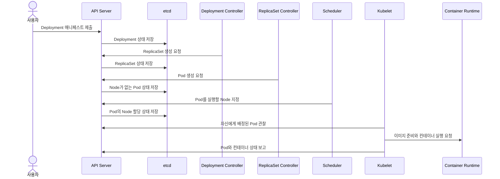
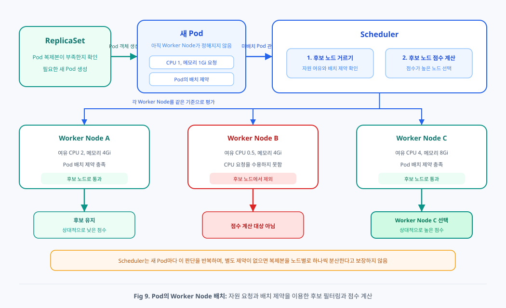
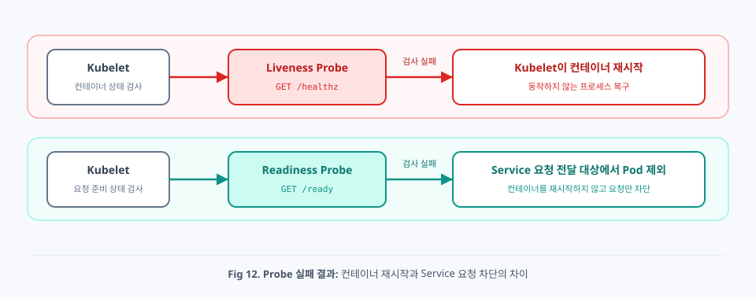
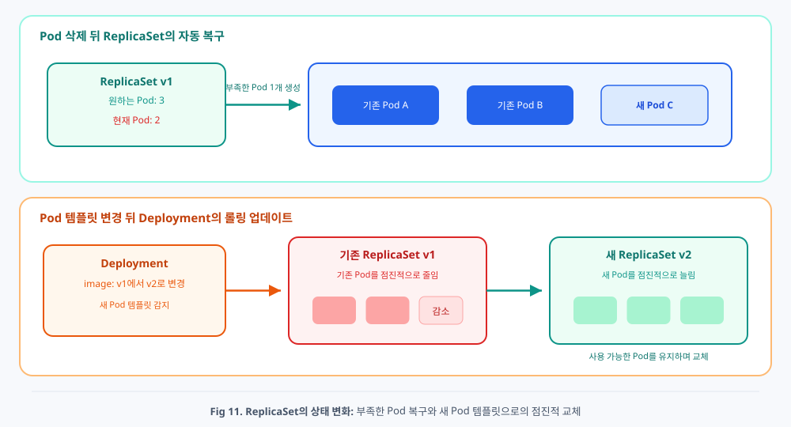
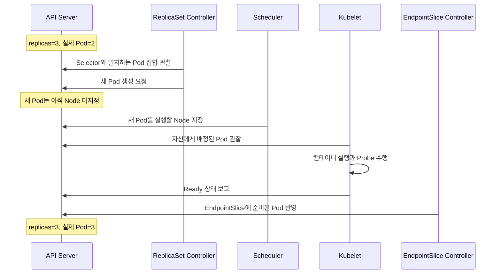

# Chap05. Pod의 생명주기와 자동 복구

> 15주 연재의 다섯째 글입니다. Deployment 선언이 Pod와 컨테이너 실행으로 이어지는 순서를 따라가고, Kubernetes가 관찰하는 상태와 Probe를 구분합니다. 이어서 Kubelet, ReplicaSet, Scheduler가 장애 상황에서 각각 어떤 범위의 복구를 담당하는지 살펴봅니다.

## 들어가며

앞 글에서는 Pod를 실행 단위로 사용하고, Deployment와 StatefulSet, DaemonSet 같은 워크로드 리소스로 Pod 집합을 관리하는 방법을 살펴보았습니다. Service는 준비된 Pod에 요청을 전달하고, Ingress는 외부 HTTP와 HTTPS 요청을 Service로 나눴습니다.

이 구조를 처음 접하면 Kubernetes가 애플리케이션의 모든 장애를 알아서 발견하고 복구한다고 생각하기 쉽습니다. 하지만 컨테이너 프로세스가 종료된 상황, 프로세스는 실행 중이지만 요청에 응답하지 않는 상황, Pod 자체가 사라진 상황은 서로 다른 장애입니다. Kubernetes가 이 상황을 발견하는 방법과 대응하는 구성 요소도 서로 다릅니다.

컨테이너가 종료되면 해당 Node의 Kubelet이 같은 Pod 안에서 컨테이너를 다시 실행할 수 있습니다. Pod가 삭제되어 복제본 수가 부족해지면 ReplicaSet Controller가 새 Pod를 만듭니다. 새 Pod는 Scheduler가 선택한 Node에서 실행됩니다. Readiness Probe가 실패하면 컨테이너를 재시작하는 대신 Service의 일반적인 요청 대상에서 제외합니다.

이번 글에서는 먼저 Deployment 매니페스트가 실행 중인 컨테이너가 되기까지의 순서를 따라갑니다. 이어서 Pod와 컨테이너의 상태, Startup, Readiness, Liveness Probe를 구분하고, 장애의 위치에 따라 복구 주체와 결과가 어떻게 달라지는지 정리합니다.

## 1. 실행 중이라는 것과 정상이라는 것은 다르다

컨테이너 프로세스가 존재한다는 사실만으로 애플리케이션이 정상이라고 판단할 수는 없습니다. 프로세스는 실행 중이지만 내부 교착 상태 때문에 응답하지 않을 수 있고, 데이터베이스 연결이나 초기 데이터 로딩을 마치지 못해 아직 요청을 받을 수 없을 수도 있습니다.

Pod 수준에서도 상태를 구분해야 합니다. Pod가 API에 생성되었더라도 실행할 Node를 찾지 못해 `Pending` 상태로 남을 수 있습니다. Node에 배치된 뒤 컨테이너 이미지를 내려받지 못할 수도 있습니다. 컨테이너가 실행되었더라도 Readiness Probe가 실패하면 Service 요청을 받지 못합니다.

따라서 상태를 확인할 때는 다음 질문을 나누어야 합니다.

- Pod 객체가 API에 생성되었는가
- Pod를 실행할 Node가 정해졌는가
- Node에서 컨테이너가 실행되었는가
- 애플리케이션 프로세스가 계속 동작할 수 있는가
- 애플리케이션이 지금 요청을 받을 준비가 되었는가
- 원하는 Pod 복제본 개수가 유지되고 있는가

각 질문의 답은 Pod Phase 하나만으로 알 수 없습니다. Kubernetes는 API에 기록된 Pod 상태, 컨테이너 상태, Condition, Probe 결과와 Event를 함께 사용해서 현재 상황을 표현합니다.

## 2. Deployment 선언이 Pod 실행으로 이어지는 과정

`kubectl apply`가 성공했다는 메시지는 API Server가 Deployment 리소스를 받아들였다는 뜻입니다. 이 시점에 Worker Node에서 컨테이너 실행까지 끝났다는 뜻은 아닙니다. API에 저장된 하나의 선언이 여러 제어 루프를 거치면서 ReplicaSet, Pod, 컨테이너로 이어집니다.



이 과정에서 구성 요소들이 서로 긴 명령 체인을 직접 호출하는 것은 아닙니다. 각 구성 요소는 API Server를 통해 자신이 관심을 두는 리소스의 상태를 관찰하고, 자신이 맡은 다음 상태를 API에 기록합니다.

### 2.1 Deployment Controller와 ReplicaSet Controller

Deployment Controller는 새 Deployment를 발견하면 Pod 템플릿에 해당하는 ReplicaSet이 있는지 확인합니다. 필요한 ReplicaSet이 없으면 API Server에 ReplicaSet 생성을 요청합니다. Deployment의 이미지나 Pod 템플릿이 바뀌면 새 템플릿을 나타내는 ReplicaSet을 만들고, 이전 ReplicaSet과 새 ReplicaSet의 복제본 수를 조절합니다.

ReplicaSet Controller는 ReplicaSet의 Selector와 일치하는 Pod를 관찰합니다. 실제 Pod 수가 `spec.replicas`보다 적으면 Pod Template을 바탕으로 새 Pod 객체를 만들고, 많으면 초과한 Pod를 줄입니다. 이 단계에서 만들어진 Pod에는 아직 실행할 Node가 정해지지 않았을 수 있습니다.

두 Controller는 컨테이너를 직접 실행하지 않습니다. API에 저장된 리소스의 원하는 상태와 현재 상태를 비교하고, 다음 리소스를 만들거나 개수를 조정하는 역할을 담당합니다.

### 2.2 Scheduler가 새 Pod를 배치하는 과정

<div align="center">



</div>

Scheduler는 아직 Node가 지정되지 않은 Pod를 관찰합니다. 먼저 각 Node가 Pod가 요청한 CPU와 메모리를 수용할 수 있는지 확인하고, Node Selector, Affinity, Taint와 Toleration 같은 배치 제약을 만족하지 못하는 Node를 후보에서 제외합니다. 이어서 남은 후보의 점수를 계산하고 적합한 Node 하나를 선택해서 그 결과를 API에 기록합니다.

별도의 배치 제약을 선언하지 않으면 Deployment의 복제본들이 서로 다른 Node에 하나씩 분산된다고 보장되지 않습니다. 여러 Pod가 같은 Node에 배치될 수도 있습니다. 복제본을 여러 Node나 가용 영역에 의도적으로 분산하려면 Pod Anti-Affinity나 Topology Spread Constraints 같은 조건을 선언해야 합니다.

조건에 맞는 Node가 하나도 없으면 Scheduler는 임의의 Node에 Pod를 억지로 배치하지 않습니다. Pod는 `Pending` 상태로 남고, Event에는 CPU나 메모리 부족 또는 배치 조건 불일치 같은 이유가 기록됩니다.

Scheduler는 장애를 감시해서 실행 중인 Pod를 다른 Node로 옮기는 복구 프로그램이 아닙니다. Scheduler가 다루는 대상은 기본적으로 아직 Node가 정해지지 않은 Pod입니다. 기존 Pod를 다른 Node로 이동해야 하는 상황에서는 상위 Controller가 대체 Pod를 새로 만들고, Scheduler가 그 새 Pod의 Node를 선택합니다.

### 2.3 Kubelet과 Container Runtime

각 Worker Node의 Kubelet은 API Server를 통해 자신에게 배정된 Pod를 관찰합니다. 새 Pod가 배정되면 필요한 Volume과 네트워크 실행 환경을 준비하고, Container Runtime에 이미지 준비와 컨테이너 실행을 요청합니다.

Container Runtime이 컨테이너를 실행하면 Kubelet은 컨테이너 상태와 Probe 결과를 계속 확인하고 Pod 상태를 API Server에 보고합니다. Control Plane은 Worker Node에 직접 접속해서 컨테이너 실행 명령을 내리는 대신, Pod의 Node 할당 상태를 API에 남기고 해당 Node의 Kubelet이 그 상태를 실제 실행 환경으로 만듭니다.

## 3. Kubernetes가 관찰하는 상태

Kubernetes에서 `상태`라고 부르는 값은 하나가 아닙니다. Pod 전체의 생명주기를 요약하는 Phase와 개별 컨테이너의 State, Pod가 특정 조건을 만족하는지 나타내는 Condition을 구분해야 합니다.

### 3.1 Pod Phase

Pod의 `status.phase`는 Pod가 생명주기의 어느 단계에 있는지를 간략하게 나타냅니다.

- `Pending`: Pod가 API에 받아들여졌지만 하나 이상의 컨테이너가 아직 실행 준비를 마치지 못한 상태입니다. Scheduling이나 이미지 다운로드가 끝나지 않은 경우도 포함됩니다.
- `Running`: Pod가 Node에 배치되었고 하나 이상의 컨테이너가 실행 중이거나 시작 또는 재시작 과정에 있는 상태입니다.
- `Succeeded`: Pod의 모든 컨테이너가 성공적으로 종료되었고 다시 시작되지 않는 상태입니다.
- `Failed`: 하나 이상의 컨테이너가 실패로 종료되었고 다시 시작되지 않는 상태입니다.
- `Unknown`: 일반적으로 Node와의 통신 문제로 Pod 상태를 확인할 수 없는 상태입니다.

`Running`은 애플리케이션이 요청을 정상 처리한다는 판정이 아닙니다. 컨테이너가 반복해서 종료되고 재시작되는 동안에도 Pod Phase가 `Running`으로 보일 수 있으므로 컨테이너 상태와 Ready Condition을 함께 확인해야 합니다.

### 3.2 Container State와 재시작 횟수

Pod 안의 각 컨테이너는 `Waiting`, `Running`, `Terminated` 중 하나의 State를 가집니다.

- `Waiting`: 이미지 다운로드, Secret 적용, 실행 준비처럼 시작 전 작업을 진행하고 있거나 오류 때문에 시작하지 못한 상태입니다.
- `Running`: 컨테이너 프로세스가 실행 중인 상태입니다.
- `Terminated`: 컨테이너 실행이 끝난 상태이며 종료 이유와 Exit Code를 함께 확인할 수 있습니다.

Kubelet이 컨테이너를 다시 실행하면 같은 Pod 안에서 컨테이너 실행 횟수가 늘어납니다. `kubectl get pods`의 `RESTARTS`나 `kubectl describe pod`의 Restart Count를 보면 재시작 여부를 확인할 수 있습니다.

`CrashLoopBackOff`는 Pod Phase가 아니라 컨테이너가 시작된 뒤 계속 종료되어 Kubernetes가 재시작 사이에 점점 긴 대기 시간을 두고 있음을 나타내는 kubectl 상태 표시입니다. 애플리케이션 오류, 잘못된 명령, 누락된 설정, Liveness Probe 실패 등이 원인일 수 있습니다.

### 3.3 Pod Condition과 Event

Pod Condition은 Pod가 특정 조건을 만족하는지를 나타냅니다. 대표적으로 `PodScheduled`는 Node 배치 여부를, `Initialized`는 Init Container 완료 여부를, `ContainersReady`는 모든 애플리케이션 컨테이너의 준비 여부를, `Ready`는 Pod가 요청을 받을 준비가 되었는지를 나타냅니다.

Event에는 Scheduling 실패, 이미지 다운로드 실패, 컨테이너 생성과 종료, Probe 실패 같은 변화의 이유가 기록됩니다. Event는 영구 감사 로그가 아니라 문제를 진단하기 위한 최근 정보이므로, 현재 상태와 함께 확인해야 합니다.

```bash
# Pod의 요약 상태와 Node 배치 위치 확인
kubectl get pods -o wide

# Container State, Condition과 최근 Event 확인
kubectl describe pod <pod-name>

# 이전에 종료된 컨테이너의 로그 확인
kubectl logs <pod-name> --previous
```

## 4. 컨테이너 상태를 검사하는 Probe

<div align="center">



</div>

Pod가 `Running`이라고 해서 애플리케이션이 요청을 정상적으로 처리할 준비까지 끝났다는 뜻은 아닙니다. 컨테이너 프로세스는 살아 있어도 데이터베이스 연결이나 초기 데이터 로딩을 마치지 못했을 수 있습니다. Kubernetes는 Kubelet이 컨테이너 상태를 주기적으로 진단하도록 **Probe**(프로브)를 선언할 수 있습니다.

### 4.1 시작 완료를 확인하는 Startup Probe

**Startup Probe**는 컨테이너 안의 애플리케이션이 기동을 마쳤는지 확인합니다. Startup Probe가 선언되어 있으면 이 검사가 성공할 때까지 같은 컨테이너의 Liveness Probe와 Readiness Probe를 시작하지 않습니다. 초기 데이터 로딩처럼 시작 시간이 긴 애플리케이션이 Liveness Probe 때문에 준비를 마치기 전에 재시작되는 문제를 막는 데 사용할 수 있습니다.

Startup Probe가 `failureThreshold`에 도달할 때까지 계속 실패하면 Kubelet은 컨테이너를 비정상으로 판단하고 재시작 정책에 따라 처리합니다. Startup Probe는 시작 구간을 보호하기 위한 검사이지, 실행 기간 내내 준비 상태를 판정하는 검사는 아닙니다.

### 4.2 요청 가능 여부를 확인하는 Readiness Probe

**Readiness Probe**는 컨테이너가 현재 요청을 받을 준비가 되었는지 검사합니다. 검사에 실패하면 Pod의 Ready Condition이 `False`로 바뀌고 EndpointSlice에 기록된 준비 상태에도 반영됩니다. Service의 일반적인 요청 경로는 준비되지 않은 Pod를 대상에서 제외합니다.

Readiness Probe 실패는 컨테이너 재시작을 뜻하지 않습니다. 데이터베이스 연결이 일시적으로 끊겼거나 과부하 때문에 새 요청을 받지 말아야 할 때, 프로세스는 유지하면서 트래픽만 차단할 수 있습니다. 이후 검사가 다시 성공하면 Pod는 요청 대상으로 돌아올 수 있습니다.

### 4.3 계속 동작할 수 있는지 확인하는 Liveness Probe

**Liveness Probe**는 컨테이너 안의 애플리케이션이 복구 불가능하게 멈춘 상태인지 검사합니다. Liveness Probe가 정해진 횟수만큼 실패하면 Kubelet은 해당 컨테이너를 종료하고 `restartPolicy`에 따라 다시 시작합니다.

Liveness Probe가 실패했다고 ReplicaSet이 곧바로 새 Pod를 만드는 것은 아닙니다. Pod 객체는 유지되고 Kubelet이 같은 Pod 안의 컨테이너를 다시 실행하는 것이 기본 동작입니다. 잘못 설계된 Liveness Probe는 부하가 높은 정상 컨테이너를 반복해서 재시작해서 장애를 더 크게 만들 수 있으므로, 일시적인 지연과 복구 불가능한 고장을 구분할 수 있어야 합니다.

### 4.4 Probe 선언과 검사 방식

Probe는 HTTP 요청, TCP 연결, gRPC 상태 확인 또는 컨테이너 안의 명령 실행 방식으로 구성할 수 있습니다. 다음 예시는 시작, 준비, 생존 상태를 HTTP로 확인합니다.

```yaml
# Deployment의 Pod 템플릿에 HTTP Probe를 추가하는 예시
spec:
  template:
    spec:
      containers:
      - name: web
        image: my-web:1.0
        startupProbe:
          httpGet:
            path: /startup
            port: 8080
          periodSeconds: 5
          failureThreshold: 30
        readinessProbe:
          httpGet:
            path: /ready
            port: 8080
          periodSeconds: 5
          failureThreshold: 3
        livenessProbe:
          httpGet:
            path: /healthz
            port: 8080
          periodSeconds: 10
          failureThreshold: 3
```

`periodSeconds`는 검사 주기를, `timeoutSeconds`는 한 번의 검사에서 응답을 기다리는 시간을, `failureThreshold`는 실패로 판정하기 전까지 허용할 연속 실패 횟수를 정합니다. 애플리케이션의 정상 기동 시간과 응답 특성을 측정한 뒤 값을 정해야 합니다.

Startup, Readiness, Liveness Probe가 같은 URL을 사용하면 세 검사의 목적을 구분하기 어렵습니다. 기동 완료, 요청 처리 가능 여부, 프로세스의 회복 불가능한 고장을 각각 판단할 수 있도록 검사 조건을 설계하는 편이 좋습니다.

## 5. 장애 위치에 따라 달라지는 복구 주체

Kubernetes의 자동 복구는 하나의 구성 요소가 모든 문제를 처리하는 기능이 아닙니다. 어느 객체가 사라졌고 어떤 상태 차이가 발생했는지에 따라 서로 다른 제어 루프가 동작합니다.

### 5.1 컨테이너가 종료되면 Kubelet이 다시 실행한다

컨테이너 프로세스가 종료되면 해당 Node의 Kubelet이 Pod의 `restartPolicy`에 따라 같은 Pod 안에서 컨테이너를 다시 실행할 수 있습니다. `Always`는 종료 이유와 관계없이, `OnFailure`는 실패로 종료되었을 때, `Never`는 컨테이너를 다시 시작하지 않도록 정합니다. Deployment 같은 장기 실행 워크로드의 Pod Template은 `Always`를 사용합니다.

이 과정에서는 기존 Pod 객체가 유지되므로 Pod 이름과 UID, 일반적으로 Pod IP도 바뀌지 않습니다. 컨테이너 파일 시스템의 임시 변경은 새 컨테이너 실행에서 사라질 수 있지만, Pod에 연결된 Volume의 데이터는 Volume 종류와 수명에 따라 유지될 수 있습니다.

반복해서 빠르게 종료되는 컨테이너는 즉시 무한히 재시작하지 않습니다. Kubelet은 재시작 사이에 Backoff를 적용합니다. 이때 원인을 고치지 않으면 `CrashLoopBackOff`가 계속 보이므로 현재 로그뿐 아니라 `kubectl logs --previous`로 이전 컨테이너 실행의 로그와 종료 코드를 확인해야 합니다.

### 5.2 Pod가 사라지면 ReplicaSet이 새 Pod를 만든다

<div align="center">



</div>

Deployment가 만든 Pod 하나를 삭제하면 ReplicaSet Controller는 Selector와 일치하는 Pod 수가 원하는 복제본 수보다 줄었다는 사실을 확인합니다. ReplicaSet은 원하는 개수를 맞추기 위해 Pod Template으로 새 Pod 객체를 만듭니다.

이 동작은 삭제된 Pod 자체를 되살리는 것이 아닙니다. 새 Pod는 새로운 UID와 이름을 가지며 IP도 달라질 수 있습니다. 새 Pod에는 처음에 Node가 정해져 있지 않고, Scheduler가 실행할 Node를 선택한 뒤 해당 Node의 Kubelet이 컨테이너를 실행합니다.

ReplicaSet은 Ready 상태인 Pod 수만 세어서 무조건 대체 Pod를 만드는 것이 아니라, 기본적으로 Selector와 일치하며 삭제 중이 아닌 Pod 집합을 원하는 개수와 맞춥니다. Pod가 존재하지만 Readiness Probe만 실패한 경우에는 Service 요청 대상에서 제외될 수 있지만, 그 이유만으로 ReplicaSet이 즉시 추가 Pod를 만드는 것은 아닙니다.

### 5.3 Node에 문제가 생기면 대체 Pod가 만들어지기까지 시간이 걸린다

Node와의 통신이 끊겨도 Control Plane은 일시적인 네트워크 문제인지 실제 Node 장애인지 바로 알 수 없습니다. Node 상태와 Heartbeat를 관찰한 뒤 사용할 수 없는 상태가 계속되면 해당 Node의 Pod가 제거 대상으로 처리될 수 있습니다. 상위 Controller가 관리하는 Pod라면 기존 Pod가 삭제되는 과정과 맞물려 대체 Pod가 생성됩니다.

Pod가 다른 Node로 이동하는 것은 아닙니다. 특정 UID를 가진 Pod는 한 번 Node에 배치되면 다른 Node로 다시 Scheduling되지 않습니다. 필요한 경우 기존 Pod와 비슷한 명세를 가진 새 Pod가 만들어지고, Scheduler가 새 Pod를 실행할 Node를 고릅니다.

Node 장애 감지와 Pod 제거에는 시간 제한과 Toleration 같은 정책이 관여하므로 복구가 항상 즉시 일어나는 것은 아닙니다. 또한 PersistentVolume을 다른 Node에 다시 연결해야 하는 워크로드는 스토리지의 분리와 연결 과정 때문에 추가 시간이 필요할 수 있습니다.

### 5.4 Readiness 실패는 복구보다 요청 차단에 가깝다

Readiness Probe가 실패하면 Kubelet은 Pod가 준비되지 않았다는 상태를 API에 보고합니다. EndpointSlice Controller는 이 변화를 Service의 EndpointSlice에 반영하고, 일반적인 Service 요청 경로에서 해당 Pod가 제외됩니다.

이 동작의 목적은 문제가 있는 인스턴스로 새 요청이 들어가지 않게 하는 것입니다. 컨테이너를 재시작하거나 Pod를 교체하는 동작과는 다릅니다. 애플리케이션이 스스로 회복해서 Readiness Probe가 다시 성공하면 같은 Pod가 요청 대상에 다시 포함될 수 있습니다.

## 6. Pod 복구 전체 흐름

다음 시퀀스는 Deployment가 관리하는 Pod 하나가 삭제된 뒤 원하는 복제본 수가 회복되는 과정을 보여 줍니다.



이 흐름을 장애 유형별로 줄이면 다음과 같습니다.

```text
컨테이너 종료 또는 Liveness 실패
→ Kubelet
→ 같은 Pod 안에서 컨테이너 재시작

Readiness 실패
→ Pod Ready 상태 변경
→ EndpointSlice 갱신
→ Service 요청 대상에서 제외

Pod 삭제
→ ReplicaSet Controller
→ 새 Pod 생성
→ Scheduler가 Node 선택
→ Kubelet이 컨테이너 실행
```

### 6.1 ReplicaSet의 소유 관계와 Selector

Deployment가 만든 ReplicaSet과 ReplicaSet이 만든 Pod에는 상위 객체를 가리키는 `ownerReferences`가 기록됩니다. 이 정보는 상위 리소스가 삭제될 때 종속 리소스를 정리하는 데 사용됩니다. 다만 ReplicaSet이 관리할 Pod 집합을 세는 기준 자체는 Selector와 Label의 일치 여부입니다.

Deployment, ReplicaSet과 Pod Template의 Selector 및 Label이 의도와 다르게 겹치면 다른 Pod를 잘못 관리 대상으로 볼 수 있습니다. 따라서 같은 Namespace 안에서는 워크로드마다 구분되는 Label을 사용하고, 상위 리소스가 관리하는 ReplicaSet의 복제본 수를 직접 바꾸기보다 Deployment의 선언을 변경해야 합니다.

### 6.2 Rolling Update에서 두 ReplicaSet이 함께 동작하는 이유

Deployment의 Pod Template이 바뀌면 기존 ReplicaSet의 Pod를 직접 수정하지 않습니다. 새 템플릿을 가진 ReplicaSet을 만들고, 이전 ReplicaSet의 복제본 수를 줄이면서 새 ReplicaSet의 복제본 수를 늘립니다.

새 Pod가 Ready 상태가 되지 못하면 Deployment의 진행이 멈출 수 있습니다. 이때 이전 Pod를 얼마나 유지하고 새 Pod를 얼마나 추가할지는 Rolling Update 전략의 `maxUnavailable`과 `maxSurge`가 결정합니다. Readiness Probe는 새 컨테이너를 재시작하지 않지만, Deployment가 새 Pod를 사용 가능한 복제본으로 판단하는 과정에는 영향을 줍니다.

이전 ReplicaSet은 롤백에 사용할 배포 기록으로 남을 수 있습니다. 사용자는 ReplicaSet을 직접 교체하기보다 Deployment의 이미지나 Pod Template을 변경하고, Deployment가 두 ReplicaSet의 규모를 조절하도록 맡깁니다.

## 7. 자동 복구가 해결하지 못하는 문제

Kubernetes의 제어 루프는 선언된 원하는 상태를 유지하지만, 선언 자체가 올바른지는 판단하지 못합니다. 존재하지 않는 이미지 이름을 선언하면 새 Pod를 계속 시도할 수는 있어도 올바른 이미지를 추측해서 고치지는 않습니다. 필요한 설정이나 Secret이 없거나, Pod가 요청한 자원을 제공할 Node가 없거나, 애플리케이션 코드가 시작 직후 계속 종료되는 경우도 원인을 수정해야 합니다.

Probe도 애플리케이션에 맞게 정의해야 합니다. Liveness Probe가 단순한 외부 의존성 장애까지 치명적인 고장으로 판단하면 정상 컨테이너가 반복해서 재시작될 수 있습니다. Readiness Probe가 너무 느슨하면 요청을 처리하지 못하는 Pod가 Service 뒤에 남고, 너무 엄격하면 순간적인 지연에도 사용 가능한 Pod가 한꺼번에 제외될 수 있습니다.

자동 복구를 이해한다는 것은 “Kubernetes가 알아서 살린다”는 문장을 외우는 것이 아니라, 원하는 상태와 실제 상태의 차이를 어떤 구성 요소가 관찰하고 어떤 새 상태를 만드는지 구분하는 것입니다.

문제를 확인할 때는 다음 순서로 범위를 좁힐 수 있습니다.

1. `kubectl get pods`로 Pod 수, Ready 상태, Restart Count를 확인합니다.
2. `kubectl describe pod`로 Container State, Condition과 Event를 확인합니다.
3. `kubectl logs`와 `kubectl logs --previous`로 현재 실행과 이전 실행의 로그를 확인합니다.
4. Pod가 `Pending`이면 Scheduling 실패 Event와 자원 요청, 배치 조건을 확인합니다.
5. Pod 수가 맞지 않으면 Deployment와 ReplicaSet의 원하는 복제본 수와 Selector를 확인합니다.
6. Pod는 Ready지만 요청이 도달하지 않으면 Service Selector와 EndpointSlice를 확인합니다.

## 다음 글로 넘어가기 전에

이번 글에서 다룬 내용은 이렇습니다. Deployment 선언은 Deployment Controller, ReplicaSet Controller, Scheduler, Kubelet과 Container Runtime의 제어 루프를 거쳐 실행 중인 컨테이너가 됩니다. Pod Phase, Container State, Condition과 Event는 서로 다른 상태를 나타내며, Startup, Readiness, Liveness Probe도 서로 다른 질문에 답합니다.

컨테이너 종료와 Liveness 실패는 주로 Kubelet이 같은 Pod 안의 컨테이너를 다시 실행해서 대응합니다. Pod 자체가 사라져 원하는 복제본 수가 부족하면 ReplicaSet이 새 Pod를 만들고 Scheduler가 새 Node를 선택합니다. Readiness 실패는 Pod를 교체하는 대신 Service 요청 대상에서 제외합니다. 자동 복구는 이처럼 장애 위치에 따라 서로 다른 구성 요소가 각자의 원하는 상태를 맞추는 과정입니다.

다음 글에서는 로컬에 Kubernetes 실습 환경을 구성하고, 지금까지 살펴본 매니페스트와 상태 확인 명령을 실제 클러스터에 적용합니다.
