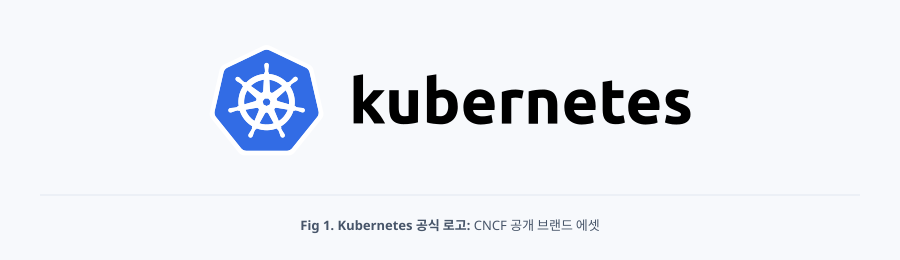
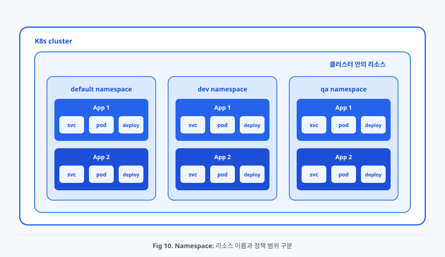
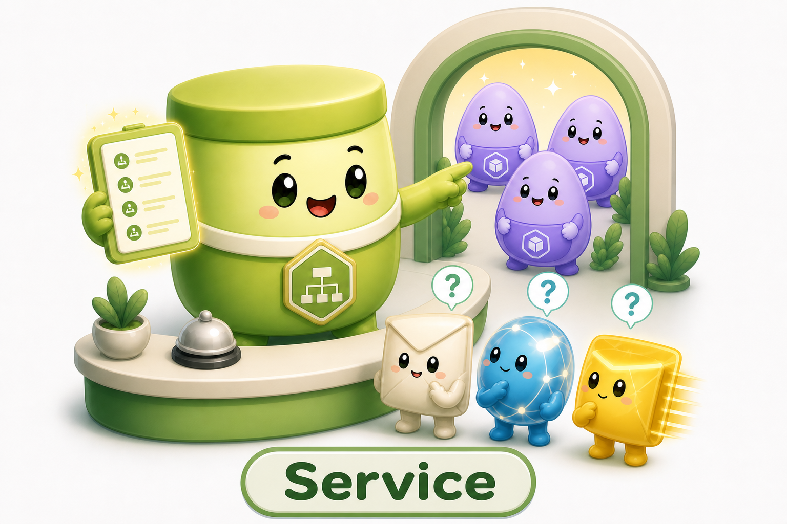
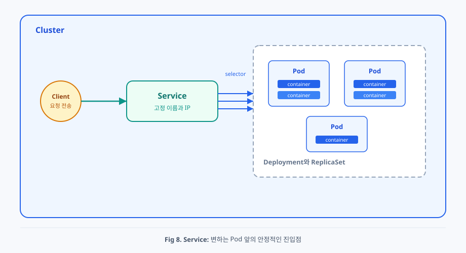
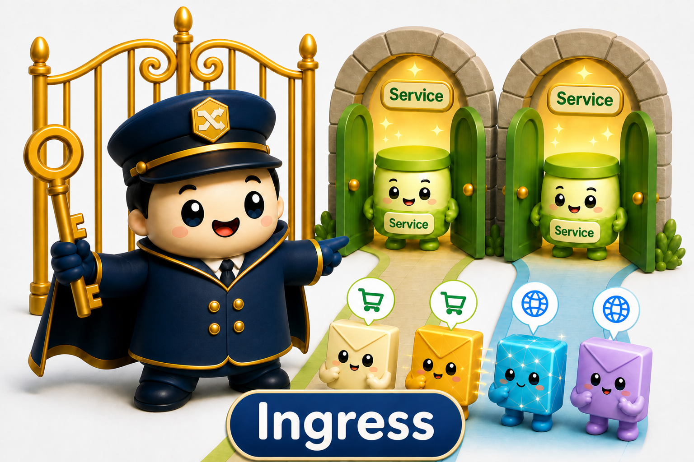
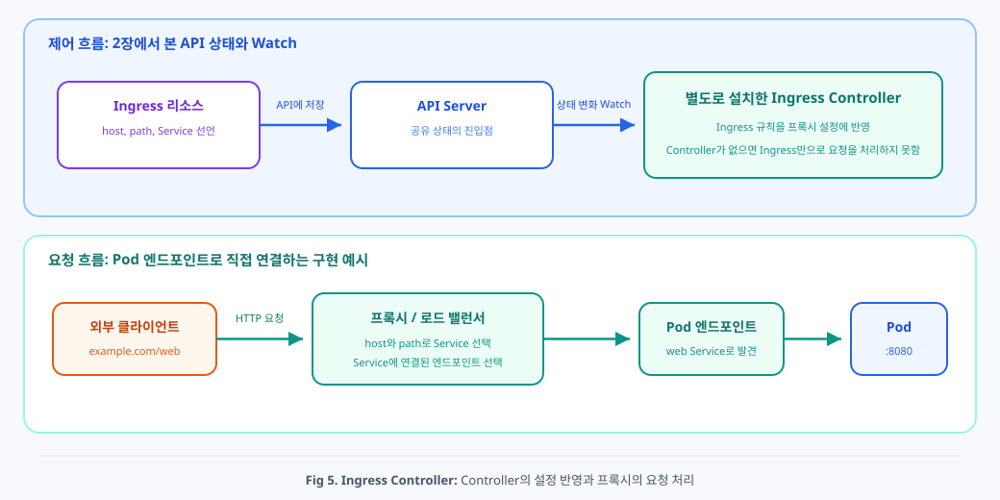
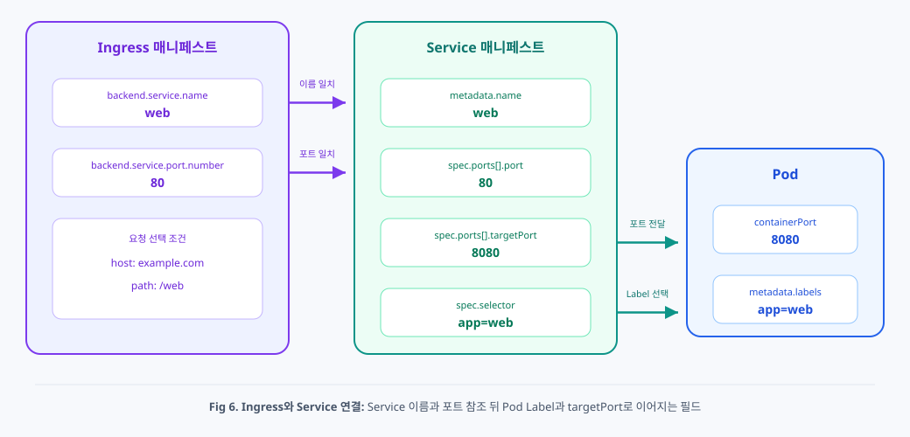
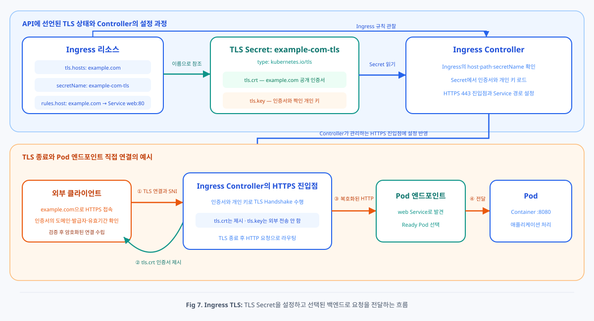

# Chap05. Service와 Ingress

> 15주 연재의 다섯째 글입니다. Namespace로 리소스의 범위를 나누고, Service로 교체되는 Pod에 안정적인 접근점을 제공합니다. 이어서 Ingress가 외부 HTTP와 HTTPS 요청을 Service에 연결하는 규칙과 TLS Secret의 역할을 살펴봅니다.

## 들어가며

<div align="center">



</div>

3장에서는 Pod와 워크로드 리소스를, 4장에서는 Pod의 실행과 상태 검사, 자동 복구를 살펴보았습니다. 컨테이너를 같은 Pod 안에서 재시작할 때와 달리, 상위 워크로드 리소스가 대체 Pod를 만들면 Pod의 UID가 바뀌며 이름과 IP도 달라질 수 있습니다.

애플리케이션이 교체되는 Pod IP를 직접 사용하면 Pod가 바뀔 때마다 연결 설정도 바꿔야 합니다. 여러 웹 애플리케이션을 외부에 공개할 때는 도메인과 URL 경로에 따라 요청을 나눌 진입점도 필요합니다. Kubernetes는 안정적인 내부 접근점을 Service로 표현하고, 외부 HTTP와 HTTPS 요청의 분기 규칙을 Ingress로 표현합니다.

이번 글에서는 먼저 Namespace가 리소스 이름과 정책의 범위를 어떻게 나누는지 살펴봅니다. 이어서 Service가 Label을 기준으로 Pod를 찾고, Ingress가 Service 이름과 포트를 참조해서 외부 요청을 전달하는 과정을 정리합니다. 4장에서 살펴본 Ready 상태가 요청 대상에 반영되는 과정과, 3장에서 소개한 Secret으로 HTTPS 인증서를 제공하는 방법도 함께 설명합니다.

## 1. 리소스 이름과 정책 범위를 나누는 Namespace

<div align="center">



</div>

**Namespace**(네임스페이스)는 하나의 클러스터 안에서 리소스 이름과 정책 적용 범위를 논리적으로 나누는 리소스입니다. 같은 클러스터를 여러 팀이나 서비스, 개발 환경이 함께 사용할 때 리소스를 구분하는 기준으로 사용합니다.

```yaml
# dev Namespace를 선언하는 매니페스트 예시
apiVersion: v1
kind: Namespace
metadata:
  name: dev
```

Namespace에 속하는 리소스의 `metadata.namespace`에 `dev`를 적으면 해당 리소스가 `dev` Namespace에 만들어집니다. 매니페스트와 명령에 Namespace를 지정하지 않으면 현재 kubectl 문맥에 설정된 Namespace를 사용하며, 별도 설정이 없을 때는 보통 `default` Namespace를 사용합니다.

Namespace에 속하는 리소스의 이름은 같은 리소스 종류와 Namespace 안에서 고유해야 합니다. `dev` Namespace와 `prod` Namespace에는 이름이 같은 `web` Deployment와 `web` Service가 각각 존재할 수 있습니다. 따라서 리소스를 정확히 식별하려면 Namespace와 리소스 이름을 함께 확인해야 합니다.

Service의 짧은 DNS 이름도 Namespace를 기준으로 해석됩니다. 같은 Namespace에 있는 Pod는 `web`이라는 이름으로 같은 Namespace의 Service에 접근할 수 있습니다. 다른 Namespace의 Service에 접근하려면 `web.prod`처럼 Service 이름과 Namespace 이름을 함께 적을 수 있습니다. 클러스터 도메인이 `cluster.local`인 환경에서 전체 DNS 이름은 `web.prod.svc.cluster.local`과 같은 형태입니다.

Namespace는 클러스터를 물리적으로 분리하지 않습니다. Namespace를 나눈 것만으로 서로 다른 Namespace 사이의 네트워크 통신이 자동으로 차단되거나 Node가 분리되는 것도 아닙니다. Kubernetes API 권한을 제한하려면 RBAC(역할 기반 접근 제어)을, 자원 사용량을 제한하려면 ResourceQuota를, 네트워크 통신을 제한하려면 NetworkPolicy를 별도로 적용해야 합니다.

Pod와 Deployment, Service, Ingress는 특정 Namespace에 속합니다. 반면 Node처럼 클러스터 전체를 대상으로 하는 리소스도 있습니다. 따라서 모든 Kubernetes 리소스가 Namespace에 속한다고 이해하면 안 됩니다.

## 2. 변하는 Pod 앞에 고정 주소를 제공하는 Service

<div align="center">


*Fig 2. Kubernetes 공식 Service 리소스 마크: Kubernetes Community 공개 아이콘 에셋*

</div>

### 2.1 변하는 Pod와 안정적인 서비스 정체성

Pod는 장애 복구와 배포 과정에서 계속 교체됩니다. Deployment가 같은 역할의 Pod 복제본 개수를 유지하더라도, 새로 만들어진 Pod는 이전 Pod와 다른 UID를 가지며 이름과 IP도 달라질 수 있습니다. 다른 애플리케이션이 이 Pod들의 IP를 직접 저장하면 Pod가 교체될 때마다 새로운 주소를 찾아서 연결 설정을 바꿔야 합니다.

여기서는 Selector가 있는 일반적인 **ClusterIP Service**부터 설명합니다. Kubernetes는 실행 인스턴스인 Pod의 정체성과, 클라이언트가 접근할 애플리케이션의 정체성을 분리합니다. **Service**(서비스)는 변하는 Pod 집합 앞에 오래 유지되는 DNS 이름과 가상 IP를 선언하는 네트워크 리소스입니다. 클라이언트는 개별 Pod의 존재를 알 필요 없이 Service 이름과 포트로 요청을 보냅니다. Service가 유지되는 동안 뒤의 Pod가 교체되더라도 클라이언트가 사용하는 접근 방식은 바뀌지 않습니다.

Service는 서버 프로세스나 로드 밸런서 프로그램 자체가 아닙니다. Service는 Kubernetes API에 저장되는 선언형 리소스입니다. Service에는 클라이언트에게 제공할 안정적인 접근점과, 어떤 Pod 집합을 요청 대상으로 삼을지에 대한 원하는 상태가 기록됩니다. Kubernetes의 컨트롤러와 노드 네트워크 구성 요소가 이 선언을 관찰하고 실제 요청 경로를 계속 맞춥니다.

Service는 **Selector**에 적힌 Label 조건으로 같은 Namespace의 요청 대상 Pod를 찾습니다. Deployment와 Service가 Pod Label을 통해 연결되는 구체적인 필드는 2.3절에서 함께 살펴보겠습니다.

<div align="center">



</div>

*성수선임과 함께 배우는 쿠버네티스 : Service 캐릭터*

Service 캐릭터는 안내 데스크에서 요청 목록을 확인한 뒤 뒤편의 **Pod**들을 가리키고 있습니다. 요청을 보내는 쪽은 매번 달라지는 Pod를 직접 찾지 않아도 되고, Service라는 고정된 입구를 이용하면 알맞은 Pod로 연결된다는 점을 표현합니다.

### 2.2 Service 선언이 실제 요청 경로가 되기까지

<div align="center">



</div>

Selector가 있는 Service를 API에 저장하면 **EndpointSlice Controller**(엔드포인트슬라이스 컨트롤러)가 Service와 Pod의 상태를 관찰합니다. 컨트롤러는 Service의 Selector와 일치하는 Pod를 찾고, Pod의 IP와 포트, 요청을 받을 준비 상태를 **EndpointSlice**(엔드포인트슬라이스, Service가 사용할 네트워크 대상 목록을 저장하는 리소스)에 기록합니다. Pod가 생성되거나 삭제되고 Pod의 준비 상태가 바뀌면 컨트롤러는 EndpointSlice를 다시 갱신합니다.

각 Worker Node의 네트워크 구성 요소는 Service와 EndpointSlice의 변화를 관찰합니다. 기본 구성에서는 kube-proxy가 이 역할을 맡지만, 클러스터의 네트워크 플러그인이 같은 기능을 대신할 수도 있습니다. 네트워크 구성 요소는 Service의 가상 IP와 포트로 들어온 요청을 EndpointSlice에 기록된 요청 가능 Pod 중 하나로 전달하도록 노드의 네트워크 규칙을 맞춥니다.

클라이언트는 Service의 DNS 이름을 가상 IP로 해석한 뒤 그 IP와 포트로 연결합니다. 일반적인 TCP 연결에서는 노드의 네트워크 규칙이 새 연결을 받을 준비가 된 Pod 하나를 선택하고, 요청의 목적지를 해당 Pod IP와 포트로 바꿔 전달합니다. Service 뒤의 Pod가 교체되면 EndpointSlice와 네트워크 규칙만 새로운 Pod 주소에 맞게 갱신됩니다. 클라이언트는 계속 같은 Service 이름과 포트를 사용합니다.

4장에서 Readiness Probe가 실패하면 Pod의 Ready Condition이 `False`로 바뀐다고 설명했습니다. EndpointSlice Controller는 이 변화를 엔드포인트의 준비 상태에 반영하고, 노드의 네트워크 구성 요소는 갱신된 대상을 사용합니다. Readiness가 회복되면 같은 Pod가 다시 요청 대상으로 포함될 수 있습니다.

삭제 중인 Pod도 EndpointSlice의 일반적인 준비 대상에서 제외됩니다. 이 갱신은 Pod 종료와 병행되며 반영까지 시간이 걸릴 수 있습니다. 기존 연결을 즉시 끊는 기능은 아닙니다. 여기서는 기본 동작을 설명하며, 준비되지 않은 주소도 공개하는 `publishNotReadyAddresses` 같은 별도 설정은 다루지 않습니다.

### 2.3 Deployment와 Service를 Pod Label로 연결하기

3장의 Deployment 매니페스트에서는 `spec.template.metadata.labels`에 `app: web`을 적어, Deployment가 새로 만드는 모든 Pod에 같은 Label을 붙였습니다. 그리고 Deployment의 `spec.selector.matchLabels`는 이 Label을 기준으로 복제본으로 관리할 Pod 집합을 찾았습니다.

Service도 이때 Pod에 붙은 Label을 그대로 이용합니다. 다만 같은 Label을 사용하는 목적은 다릅니다. Deployment의 Selector가 **관리할 워크로드 집합을 구분**한다면, Service의 `spec.selector`는 **네트워크 요청을 전달할 Pod 집합**을 고릅니다. Deployment와 Service가 서로의 이름을 직접 참조하는 것이 아니라, 각자 같은 Pod Label을 바라보면서 관리 대상과 요청 대상을 결정하는 구조입니다.

Service는 선택한 Pod가 어느 Deployment에서 만들어졌는지 확인하지 않습니다. 같은 Namespace에서 Service의 Selector 조건과 일치하는 Pod라면 요청 대상 후보가 됩니다. 따라서 Label은 단순한 메모가 아니라, 독립된 리소스들이 같은 Pod 집합을 찾기 위해 공유하는 **연결 계약**으로 보아야 합니다. 서로 다른 역할의 Pod에 같은 Label을 무심코 붙이면 Service가 의도하지 않은 Pod까지 선택할 수 있으므로, Label의 키와 값은 리소스 사이의 관계를 고려해 정해야 합니다.

두 리소스의 관계를 매니페스트에서 확인해 보겠습니다. 먼저 3장에서 사용한 Deployment 예시를 다시 보면 다음과 같습니다.

```yaml
# app=web Label을 가진 Pod 세 개를 유지하는 Deployment
apiVersion: apps/v1
kind: Deployment
metadata:
  name: web
  labels:
    app: web  # Deployment 리소스 자체의 Label
spec:
  replicas: 3
  selector:
    matchLabels:
      app: web  # Deployment가 관리할 Pod의 Label 조건
  template:
    metadata:
      labels:
        app: web  # 새로 만드는 Pod에 실제로 붙이는 Label
    spec:
      containers:
      - name: web
        image: my-web:1.0
        ports:
        - containerPort: 8080
```

여기서 Service와 직접 이어지는 부분은 Deployment 자체의 `metadata.labels`가 아니라 `spec.template.metadata.labels`입니다. Deployment는 Pod 템플릿으로 새 Pod를 만들 때 `app: web` Label을 실제 Pod에 붙입니다. `spec.selector.matchLabels`도 같은 Label을 사용하므로 Deployment와 그 하위 ReplicaSet은 소유 관계도 확인하며 이 Pod들을 관리합니다.

이제 Service의 Selector에 같은 `app: web`을 선언합니다. 그러면 Service는 Deployment를 선택하는 것이 아니라, Deployment가 만든 Pod에 붙어 있는 Label을 기준으로 요청 대상을 찾습니다.

```yaml
# Deployment가 app=web Label을 붙여 만든 Pod에 요청을 전달하는 Service
apiVersion: v1
kind: Service
metadata:
  name: web
spec:
  type: ClusterIP
  selector:
    app: web  # Deployment의 Pod 템플릿에 붙인 Label과 일치
  ports:
  - name: http
    port: 80
    targetPort: 8080
```

두 매니페스트를 함께 보면 Deployment의 `spec.template.metadata.labels.app`과 Service의 `spec.selector.app`이 `web`이라는 같은 값으로 이어집니다. EndpointSlice Controller는 이 조건과 일치하는 Pod를 찾아 Service의 네트워크 대상 목록에 반영합니다. 이후 Pod가 교체되더라도 Deployment가 새 Pod에 같은 Label을 붙이므로, Service는 새 Pod의 이름이나 IP를 미리 알지 못해도 같은 역할의 Pod를 다시 찾을 수 있습니다.

여기서 Service의 `metadata.labels`와 `spec.selector`를 혼동하지 않아야 합니다. `metadata.labels`는 Service 리소스 자체를 분류할 때 사용하고, `spec.selector`는 Service가 요청을 전달할 Pod를 선택할 때 사용합니다. Pod의 Label과 맞아야 하는 값은 Service의 `spec.selector`입니다.

`port`는 클라이언트가 Service에 요청을 보낼 때 사용하는 포트입니다. `targetPort`는 선택된 Pod 안에서 애플리케이션이 요청을 받는 포트입니다. 위 설정에서는 클라이언트가 Service의 80번 포트로 보낸 요청을 Pod의 8080번 포트로 전달합니다. `containerPort: 8080`을 적는 것만으로 애플리케이션이 해당 포트를 열지는 않으므로, 실제 프로세스도 Pod에서 접근 가능한 8080번 포트로 수신해야 합니다.

### 2.4 Service가 제공하는 접근 범위

Service의 기본 타입인 **ClusterIP**는 클러스터 내부에서만 사용할 가상 IP를 만듭니다. **NodePort**는 각 노드의 정해진 포트를 통해 Service를 외부에 노출합니다. **LoadBalancer**는 클라우드 제공자나 별도 로드 밸런서 구현과 연동해 Service를 노출합니다. 외부 주소를 할당할 구현이 준비되어 있어야 합니다.

`clusterIP: None`으로 선언하는 **Headless Service**는 하나의 가상 IP로 요청을 분산하는 대신, 뒤에 있는 Pod 주소를 DNS로 찾을 수 있게 합니다. StatefulSet은 Headless Service와 함께 사용해서 `database-0`, `database-1` 같은 각 Pod에 안정적인 네트워크 이름을 제공할 수 있습니다.

Headless Service는 별도의 `type` 값이 아니라 `clusterIP: None`으로 만드는 구성입니다. 일반적인 ClusterIP Service와 달리 가상 IP를 통한 분산을 제공하지 않으며, 클라이언트가 DNS로 찾은 주소에 연결합니다.

## 3. HTTP 요청을 Service로 나누는 Ingress

<div align="center">


*Fig 4. Kubernetes 공식 Ingress 리소스 마크: Kubernetes Community 공개 아이콘 에셋*

</div>

### 3.1 여러 Service로 외부 HTTP 요청을 나누는 이유

앞에서 살펴본 Service는 변하는 Pod 집합에 안정적인 이름과 가상 IP를 제공합니다. 클러스터 안의 다른 애플리케이션은 Service 이름으로 요청을 보내고, Service의 네트워크 경로는 요청을 받을 준비가 된 Pod로 연결합니다. 여기까지 해결된 문제는 **어떤 Pod가 현재 실행 중인지 몰라도 같은 애플리케이션에 접근하는 것**입니다.

하지만 여러 웹 애플리케이션을 외부에 공개하려면 한 단계 위의 문제가 남습니다. 웹 Service와 API Service가 따로 있을 때 외부 클라이언트가 각 Service의 주소를 모두 알아야 한다면 외부 접근점이 애플리케이션 구성에 따라 늘어납니다. `/web` 요청은 웹 Service로, `/api` 요청은 API Service로 보내는 HTTP 규칙도 각 클라이언트나 외부 장비에 흩어질 수 있습니다.

Kubernetes는 외부 클라이언트가 바라보는 HTTP 접근점과, 클러스터 안에서 Pod 집합을 대표하는 Service를 다시 분리합니다. **Ingress**(인그레스)는 클러스터 외부에서 들어오는 HTTP와 HTTPS 요청을 호스트나 URL 경로에 따라 어떤 Service로 전달할지 선언하는 리소스입니다. 예를 들어 `example.com/web`은 `web` Service로 보내고, `example.com/api`는 `api` Service로 보내도록 하나의 진입점에 규칙을 모을 수 있습니다.

Ingress는 Service를 대체하지 않습니다. Ingress는 HTTP 요청의 호스트와 경로를 기준으로 **Service를 선택**하고, 선택된 Service는 자신의 Selector와 일치하는 **Pod를 선택**합니다. 이 관계는 `Ingress → Service → Pod`라는 논리적인 참조 관계로 이해할 수 있습니다. 실제 패킷이 반드시 Service의 가상 IP를 거치는지는 Controller 구현과 설정에 따라 다릅니다. Ingress가 Pod 이름이나 Label을 직접 알 필요가 없는 이유도 각 리소스가 한 단계 아래의 변화에서 분리되어 있기 때문입니다.

<div align="center">



</div>

*성수선임과 함께 배우는 쿠버네티스 : Ingress 캐릭터*

Ingress 캐릭터는 열쇠를 든 문지기처럼 외부 요청을 확인하고 여러 **Service** 입구 중 알맞은 곳을 가리키고 있습니다. 쇼핑과 웹을 나타내는 요청이 서로 다른 길로 나뉘는 모습은 Ingress가 도메인과 URL 경로에 따라 요청을 해당 Service로 전달한다는 점을 보여 줍니다.

### 3.2 Ingress 선언이 실제 요청 경로가 되기까지

<div align="center">



</div>

Ingress도 Service와 마찬가지로 요청을 직접 처리하는 서버 프로그램이 아니라 Kubernetes API에 저장되는 선언형 리소스입니다. Ingress에는 외부 요청을 구분할 호스트와 경로, 요청을 넘길 Service 이름과 포트가 원하는 상태로 기록됩니다.

선언을 실제 요청 경로로 구현하는 구성 요소는 **Ingress Controller**(인그레스 컨트롤러)입니다. Ingress Controller는 Ingress 리소스의 변화를 관찰하고, 선언된 규칙을 자신이 관리하는 프록시나 로드 밸런서 설정에 반영합니다. 클러스터에 Ingress Controller가 설치되어 있지 않으면 Ingress 리소스만 생성해도 외부 요청을 처리할 실행 경로는 만들어지지 않습니다.

실제 HTTP 요청은 Controller가 설정한 프록시나 로드 밸런서가 처리합니다. 이 구성 요소가 요청의 호스트와 경로를 규칙과 비교하고, 백엔드 Service에 연결된 대상으로 전달합니다. Controller와 프록시가 함께 배포되는 구현도 있고, Controller가 외부 로드 밸런서를 설정하는 구현도 있습니다.

백엔드로 전달할 때 Service의 가상 IP를 사용할 수도 있고, Service에 연결된 엔드포인트를 조회해 Pod IP로 직접 전달할 수도 있습니다. 따라서 Ingress가 Service를 참조한다는 API 관계와, 프록시가 실제로 연결하는 네트워크 주소를 구분해야 합니다. 예를 들어 community ingress-nginx는 기본적으로 Pod 엔드포인트에 직접 연결하는 방식을 사용합니다. [구현 문서](https://kubernetes.github.io/ingress-nginx/user-guide/miscellaneous/#why-endpoints-and-not-services)

외부 클라이언트가 이 진입점에 도달할 경로도 필요합니다. 환경에 따라 LoadBalancer Service, NodePort 또는 외부 로드 밸런서로 진입점을 노출하고, 도메인의 DNS를 그 주소에 연결합니다. Ingress의 `host: example.com`은 요청을 구분할 조건이며 DNS 레코드를 자동으로 만드는 설정은 아닙니다.

### 3.3 Ingress가 Service 이름과 포트를 참조하는 방법

<div align="center">



</div>

Ingress 매니페스트를 이해하려면 먼저 백엔드로 참조할 Service를 함께 보아야 합니다. 앞 절의 `web` Service를 다시 살펴보면, 클라이언트에게 80번 포트를 제공하고 `app: web` Label을 가진 Pod의 8080번 포트로 요청을 전달합니다.

```yaml
# app=web Label을 가진 Pod 앞에 안정적인 접근점을 제공하는 Service
apiVersion: v1
kind: Service
metadata:
  name: web  # Ingress가 참조할 Service 이름
spec:
  type: ClusterIP
  selector:
    app: web
  ports:
  - name: http
    port: 80  # Ingress가 참조할 Service 포트
    targetPort: 8080
```

Ingress는 이 Service의 이름인 `web`과 Service가 제공하는 포트인 `80`을 백엔드에 적습니다. Ingress와 Service는 같은 Namespace에 있어야 하며, Ingress는 Service 뒤에 어떤 Pod가 있는지 직접 선택하지 않습니다.

```yaml
# example.com의 /web 요청을 web Service로 보내는 Ingress 예시
apiVersion: networking.k8s.io/v1
kind: Ingress
metadata:
  name: web
spec:
  ingressClassName: example-ingress  # 설치된 IngressClass 이름으로 변경
  rules:
  - host: example.com
    http:
      paths:
      - path: /web
        pathType: Prefix
        backend:
          service:
            name: web
            port:
              number: 80
```

두 매니페스트를 함께 보면 Ingress의 `backend.service.name: web`은 Service의 `metadata.name: web`과 이어지고, Ingress의 `backend.service.port.number: 80`은 Service의 `spec.ports[].port: 80`과 이어집니다. `targetPort: 8080`은 Service가 Pod로 요청을 전달할 때 사용하는 값이므로 Ingress 매니페스트에 직접 적을 필요가 없습니다.

`host`는 요청의 도메인을, `path`는 URL 경로를 고르는 조건입니다. `pathType: Prefix`는 `/`로 나눈 경로 요소를 기준으로 일치 여부를 판단합니다. `/web`과 `/web/item`은 일치하지만 `/website`는 일치하지 않습니다. 경로 매칭이 경로를 바꾸지는 않으므로 `/web/item`이 자동으로 `/item`으로 바뀌지는 않습니다. 경로 재작성은 Controller가 제공하는 별도 설정이 필요합니다. [Ingress 경로 규칙](https://kubernetes.io/docs/concepts/services-networking/ingress/#path-types)

`ingressClassName`은 이 Ingress를 처리할 IngressClass의 이름입니다. 위의 `example-ingress`는 예시 이름이며, 실제 설치된 Class의 이름으로 바꾸어야 합니다. 이름을 적는 것만으로 Controller가 설치되지는 않습니다.

Kubernetes 프로젝트는 community ingress-nginx의 유지보수 종료 시점을 2026년 3월로 발표했습니다. 이 글은 해당 구현의 신규 설치를 전제로 하지 않습니다. Ingress API 자체와 개별 Controller의 지원 상태는 구분해야 하며, 실습에서는 유지보수 중인 구현과 그에 맞는 IngressClass를 사용해야 합니다. [공식 발표](https://kubernetes.io/blog/2026/01/29/ingress-nginx-statement/)

### 3.4 Ingress에서 HTTPS 연결을 지원하는 방법

<div align="center">



</div>

HTTPS 진입점에는 도메인에 유효한 **TLS 인증서**와 짝을 이루는 **개인 키**가 필요합니다. 클라이언트는 인증서의 도메인, 신뢰 관계와 유효기간을 확인합니다. 인증서는 연결 과정에서 제시하지만 개인 키는 외부로 전달하지 않습니다.

Kubernetes에서는 인증서와 개인 키를 `kubernetes.io/tls` 타입의 **Secret**에 저장할 수 있습니다. `tls.crt`에는 PEM 형식 인증서의 Base64 인코딩 값을, `tls.key`에는 인증서와 짝을 이루는 PEM 형식 개인 키의 Base64 인코딩 값을 넣습니다.

```yaml
# example.com 인증서와 개인 키를 저장하는 TLS Secret
apiVersion: v1
kind: Secret
metadata:
  name: example-com-tls
type: kubernetes.io/tls
data:
  tls.crt: "<Base64로 인코딩한 example.com 인증서>"
  tls.key: "<Base64로 인코딩한 인증서의 개인 키>"
```

Base64 인코딩은 값을 암호화하지 않습니다. 운영 환경에서는 Secret을 읽을 수 있는 권한을 최소화하고, 클러스터 저장소의 암호화 설정과 인증서 갱신 방법도 함께 준비해야 합니다. 이미 인증서 파일과 개인 키 파일이 있다면 다음 명령으로 같은 구조의 TLS Secret을 만들 수도 있습니다.

```bash
kubectl create secret tls example-com-tls \
  --cert=example.com.crt \
  --key=example.com.key
```

Ingress에서는 `spec.tls[].secretName`에 이 Secret의 이름을 적습니다. TLS Secret과 Ingress는 같은 Namespace에 있어야 합니다. 다음 예시는 3.3의 Ingress에 HTTPS 설정을 추가한 모습입니다.

```yaml
# example.com의 HTTPS 요청을 web Service로 보내는 Ingress
apiVersion: networking.k8s.io/v1
kind: Ingress
metadata:
  name: web
spec:
  ingressClassName: example-ingress  # 설치된 IngressClass 이름으로 변경
  tls:
  - hosts:
    - example.com
    secretName: example-com-tls  # 같은 Namespace의 TLS Secret 참조
  rules:
  - host: example.com
    http:
      paths:
      - path: /web
        pathType: Prefix
        backend:
          service:
            name: web
            port:
              number: 80
```

`spec.tls[].hosts`는 어떤 호스트의 TLS 연결에 인증서를 사용할지 나타내고, `secretName`은 인증서와 개인 키가 들어 있는 Secret을 가리킵니다. `rules[].host`는 TLS 연결이 성립한 뒤 HTTP 요청을 어떤 라우팅 규칙과 비교할지 정합니다. 이 예시에서는 세 곳의 도메인이 모두 `example.com`으로 일치해야 하며, `tls.crt` 인증서에도 `example.com`이 유효한 도메인으로 포함되어 있어야 합니다.

Ingress Controller는 Ingress의 `secretName`을 따라 TLS Secret을 읽고 인증서와 개인 키를 HTTPS 진입점에 설정합니다. 클라이언트가 `example.com`으로 접속하면 설정된 HTTPS 진입점이 인증서를 제시하고 개인 키를 사용해 TLS 연결을 수립합니다. 이후 요청과 응답은 클라이언트와 이 진입점 사이에서 암호화됩니다.

이 구성을 **TLS 종료**(TLS termination)라고 합니다. HTTPS 진입점이 요청을 복호화한 뒤, 이 예시에서는 `web` Service가 가리키는 백엔드에 평문 HTTP로 전달합니다. Service 가상 IP를 경유하거나 Pod의 8080번 포트에 직접 연결하는 방식은 구현에 따라 달라집니다. HTTPS 진입점에서 백엔드까지의 구간도 암호화하려면 사용하는 Ingress Controller가 제공하는 별도의 백엔드 TLS 설정이 필요합니다.

Ingress는 HTTP와 HTTPS 요청을 대상으로 합니다. 다른 포트나 프로토콜을 외부에 노출하려면 일반적으로 NodePort나 LoadBalancer 타입의 Service 같은 다른 방식을 사용합니다. 현재 Kubernetes 프로젝트는 새로운 기능이 필요한 경우 Gateway API 사용을 권장하지만, Ingress API는 안정화된 상태로 계속 지원됩니다. [Ingress 공식 문서](https://kubernetes.io/docs/concepts/services-networking/ingress/)

## 4. Pod 교체와 요청 경로를 함께 이해하기

3장에서 살펴본 Deployment는 ReplicaSet을 통해 원하는 Pod 집합을 유지하고, 4장에서 살펴본 Kubelet은 컨테이너 실행과 준비 상태를 보고합니다. 이번 장의 EndpointSlice Controller와 네트워크 구성 요소는 그 상태를 요청 경로에 반영합니다.

| 연결 관계 | 기준 | 역할 |
|---|---|---|
| Deployment → ReplicaSet → Pod | Pod 템플릿, Selector, 소유 관계 | 원하는 복제본과 배포 상태 유지 |
| Service → Pod | 같은 Namespace의 Pod Label과 Service Selector | 요청 대상 후보 선택 |
| Service → EndpointSlice | Service와 Pod 상태를 관찰하는 Controller | 대상 주소·포트·준비 상태 반영 |
| Ingress → Service | 같은 Namespace의 Service 이름과 포트 | HTTP 호스트·경로별 백엔드 지정 |
| Ingress → TLS Secret | 같은 Namespace의 Secret 이름 | HTTPS 진입점의 인증서 설정 |

Deployment의 Pod 하나가 교체되면 새 Pod는 새로운 UID를 가지며 IP도 달라질 수 있습니다. 같은 Label을 가진 새 Pod가 준비되면 EndpointSlice와 요청 경로가 갱신됩니다. 클라이언트는 계속 같은 Service 이름이나 외부 도메인을 사용합니다. 이때 API의 상태 변경과 네트워크 반영 사이에는 시간이 걸릴 수 있습니다.

외부 요청을 처리하는 프록시나 로드 밸런서는 Ingress 규칙으로 백엔드를 선택합니다. `Ingress → Service → Pod`는 위 표의 참조 관계를 요약한 표현이며, 실제 전달 경로는 구현에 따라 달라집니다. 요청이 도달하지 않으면 DNS와 진입점 노출, Ingress의 Service 참조, Service Selector와 EndpointSlice의 준비 상태를 차례로 확인할 수 있습니다.

## 다음 글로 넘어가기 전에

Namespace는 리소스 이름의 범위를 나누고 Service DNS를 해석하는 기준이 됩니다. 일반적인 ClusterIP Service는 변하는 Pod 집합 앞에 안정적인 이름과 가상 IP를 제공하며, EndpointSlice와 네트워크 구성 요소가 준비된 대상에 맞게 요청 경로를 갱신합니다.

Ingress는 외부 HTTP와 HTTPS 요청을 호스트와 경로에 따라 Service에 연결하는 규칙입니다. Controller는 그 규칙을 프록시나 로드 밸런서에 반영하고, TLS Secret은 HTTPS 진입점에 사용할 인증서와 개인 키를 제공합니다.

다음 글에서는 로컬에 Kubernetes 실습 환경을 구성하고, 지금까지 살펴본 매니페스트와 상태 확인 명령을 실제 클러스터에 적용합니다.
