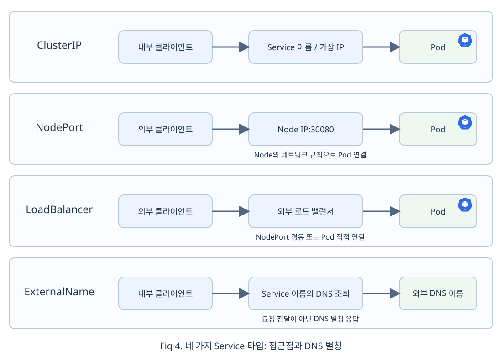

# Chap05. Service의 네 가지 타입: 내부 연결부터 외부 접근까지

> 15주 연재의 다섯째 글입니다. 교체되는 Pod 앞에 안정적인 접근점을 제공하는 Service의 동작을 이해하고, ClusterIP, NodePort, LoadBalancer, ExternalName을 하나의 흐름으로 비교합니다.

## 들어가며

<div align="center">


</div>


4장에서는 컨테이너 재시작과 Pod 대체 생성을 구분하고, Readiness Probe가 애플리케이션의 요청 준비 상태를 판단한다는 점을 살펴보았습니다. Deployment가 대체 Pod를 만들면 새 Pod는 이전 Pod와 다른 UID와 IP를 가질 수 있습니다. 새 Pod가 실행 중이더라도 Readiness Probe를 통과하기 전에는 아직 요청을 받을 대상으로 사용하면 안 됩니다.

클라이언트가 개별 Pod IP를 저장한다면 Pod가 교체될 때마다 연결 설정도 바꿔야 합니다. Kubernetes의 **Service**(서비스)는 이 문제를 해결하기 위해 변하는 Pod 집합과 클라이언트가 사용하는 접근점을 분리합니다. Service는 Label과 Selector로 같은 역할의 Pod를 찾고, EndpointSlice에 준비된 요청 대상이 반영되도록 합니다. 클라이언트는 Pod의 이름이나 IP 대신 Service의 안정적인 이름과 접근점을 사용합니다. [[1]](#ref-1)

이번 글에서는 먼저 Service의 정체성, Label과 Selector, EndpointSlice의 관계를 살펴봅니다. 이어서 DNS와 kube-proxy의 역할을 구분하고, 같은 Pod 집합을 기준으로 네 가지 Service 타입의 접근 경로를 비교합니다. 마지막에는 타입 선택 기준과 연결 문제의 진단 순서, Pod 교체 뒤에도 접근점이 유지되는 과정을 정리합니다. 본문에서는 선언과 동작에 집중하고, 직접 실행할 명령은 별도의 선택 실습에서 제공합니다.

## 1. 변하는 Pod와 Service의 정체성

### 1.1 Pod와 애플리케이션 접근점의 분리

Pod는 장애 복구와 배포 과정에서 교체되는 실행 단위입니다. Deployment가 같은 역할의 복제본 수를 유지하더라도 새 Pod의 이름과 IP는 달라질 수 있습니다. 반면 클라이언트가 찾는 대상은 특정 Pod 한 개가 아니라 웹 서버나 주문 API처럼 계속 유지되는 애플리케이션의 역할입니다.

<div align="center">


</div>

Service는 이 애플리케이션 역할에 안정적인 네트워크 정체성을 부여하는 API 리소스입니다. 일반적인 ClusterIP Service는 Service가 유지되는 동안 사용할 DNS 이름과 가상 IP를 제공합니다. Service는 요청을 직접 처리하는 서버 프로세스가 아닙니다. Kubernetes의 컨트롤러와 각 Node의 네트워크 구성 요소가 Service 선언을 관찰해 실제 요청 대상을 계속 맞춥니다.

Service의 기본 타입은 ClusterIP입니다. NodePort는 ClusterIP의 내부 접근점에 Node의 포트를 추가하고, LoadBalancer는 이를 처리할 구현에 외부 로드 밸런서 연결을 요청합니다. ExternalName은 트래픽 전달 경로 대신 DNS 별칭을 제공합니다. `clusterIP: None`으로 선언하는 Headless Service는 별도의 다섯 번째 타입이 아니라 ClusterIP 계열의 특수한 구성입니다. 이 글에서는 하나의 가상 IP를 제공하는 일반적인 ClusterIP를 다룹니다. [[1]](#ref-1)

### 1.2 Label과 Selector의 연결 계약

Deployment와 Service는 서로의 이름을 직접 참조하지 않습니다. Deployment의 Pod 템플릿은 새 Pod에 Label을 붙이고, Service의 Selector는 같은 Label을 가진 Pod를 요청 대상 후보로 선택합니다.

Deployment의 `spec.selector`와 Service의 `spec.selector`는 같은 Label을 사용할 수 있지만 목적은 다릅니다. Deployment의 Selector는 관리할 Pod 집합을 구분하고, Service의 Selector는 네트워크 요청을 전달할 Pod 집합을 찾습니다. Service는 Pod가 어느 Deployment에서 생성되었는지 확인하지 않습니다. 같은 Namespace에서 Selector와 일치하는 Pod라면 요청 대상 후보가 됩니다.

따라서 Label은 독립된 리소스가 같은 Pod 집합을 찾기 위해 공유하는 연결 계약입니다. Service 리소스 자체에 붙이는 `metadata.labels`와 요청 대상을 고르는 `spec.selector`도 구분해야 합니다. Pod의 Label과 맞아야 하는 값은 Service의 `spec.selector`입니다.

### 1.3 EndpointSlice와 준비 상태

Selector가 있는 Service를 만들면 **EndpointSlice Controller**(엔드포인트슬라이스 컨트롤러)가 Service와 Pod 상태를 관찰합니다. Controller는 Selector와 일치하는 Pod의 IP, 포트, 준비 상태를 **EndpointSlice**(엔드포인트슬라이스)에 기록합니다. EndpointSlice는 요청 대상 목록을 저장하는 API 리소스이며, 트래픽을 직접 전달하는 프로그램은 아닙니다. [[2]](#ref-2)

4장에서 살펴본 Readiness Probe가 실패하면 Pod의 Ready Condition이 `False`로 바뀝니다. 이 상태는 EndpointSlice의 엔드포인트 준비 상태에 반영되고, 일반적인 Service 요청 대상에서 제외됩니다. 준비 상태가 회복되면 같은 Pod가 다시 포함될 수 있습니다. Pod가 삭제되거나 대체되면 EndpointSlice에는 새 Pod 주소가 반영됩니다. [[3]](#ref-3)

이 갱신과 Node의 네트워크 규칙 반영에는 짧은 시간이 걸릴 수 있습니다. 또한 기존 Pod에 이미 맺어진 연결을 새 Pod로 옮겨 주는 것은 아닙니다. Service는 새 연결이 현재의 준비된 대상에 도달하도록 접근점을 유지합니다.

## 2. Service 이름과 실제 요청 전달

### 2.1 클러스터 DNS가 이름을 주소로 바꾸는 과정

**DNS 해석**은 클라이언트가 이름에 해당하는 주소를 알아내는 과정입니다. Pod가 `http://clusterip-service:80/`을 호출하면 먼저 Pod에 설정된 DNS 서버로 Service 이름을 조회합니다. 일반적인 Kubernetes 구성에서는 CoreDNS가 ClusterIP Service의 가상 IP를 응답합니다. DNS 조회가 끝난 뒤 클라이언트는 그 IP의 80번 포트로 별도의 연결을 시작합니다. CoreDNS가 HTTP 요청을 Pod로 중계하는 것은 아닙니다. [[4]](#ref-4)

같은 Namespace의 Pod는 `clusterip-service`처럼 짧은 이름을 사용할 수 있습니다. 완전한 이름은 `Service이름.Namespace.svc.클러스터도메인` 형태입니다. Namespace가 `service-lab`이고 클러스터 도메인이 `cluster.local`이라면 `clusterip-service.service-lab.svc.cluster.local`이 됩니다. Namespace와 클러스터 도메인이 다르면 완전한 이름도 달라집니다.

일반적인 ClusterIP Service의 DNS 응답은 Pod IP가 아니라 Service의 가상 IP입니다. Pod가 교체되더라도 Service 이름과 ClusterIP는 유지되므로 클라이언트가 새 Pod IP를 다시 찾을 필요가 없습니다.

### 2.2 kube-proxy가 구성하는 전달 규칙

Service의 가상 IP는 특정 네트워크 인터페이스에서 요청을 받는 일반 서버 주소가 아닙니다. **kube-proxy**는 각 Node에서 Service와 EndpointSlice의 변경을 관찰하고, Service 주소와 포트로 들어온 새 연결을 준비된 Pod 중 하나로 전달하도록 운영체제의 네트워크 규칙을 구성합니다. 실제 패킷은 이 규칙에 따라 처리되며, kube-proxy 프로세스가 HTTP 요청을 하나씩 받아 다시 보내는 구조는 아닙니다. [[5]](#ref-5)

예를 들어 Service 주소가 `10.96.10.20:80`이고 준비된 Pod 주소가 `10.244.1.5:80`, `10.244.2.8:80`이라면 새 연결은 이 대상 중 하나로 전달됩니다. 네트워크 플러그인이 kube-proxy의 기능을 대신하는 클러스터도 있습니다. 어떤 구현을 사용하더라도 API Server가 애플리케이션 요청의 중계 경로가 되는 것은 아닙니다.

CoreDNS와 kube-proxy의 역할을 함께 정리하면 다음과 같습니다.

- CoreDNS는 Service 이름에 해당하는 주소를 알려 줍니다.
- EndpointSlice Controller는 Selector와 준비 상태를 바탕으로 요청 대상 목록을 갱신합니다.
- kube-proxy 또는 이를 대신하는 구현은 Service 접근점을 현재 요청 대상에 연결할 규칙을 구성합니다.
- 클라이언트의 실제 요청은 API Server를 거치지 않고 Node의 네트워크 경로를 따라 Pod로 전달됩니다.

## 3. 타입 비교의 공통 구성

<div align="center">



</div>

Fig 1은 네 타입의 차이를 클라이언트가 사용하는 접근점과 요청 방향을 기준으로 요약합니다. ClusterIP, NodePort, LoadBalancer는 Selector로 Pod를 선택할 수 있습니다. ExternalName은 Pod를 선택하지 않고 Service 이름을 외부 DNS 이름에 연결합니다. 네 타입은 서로 다른 리소스 종류가 아니라 모두 `kind: Service`이며, `spec.type`으로 동작 방식을 선택합니다.

이후의 구성도는 Deployment가 같은 역할의 nginx Pod 두 개를 유지하는 상황을 가정합니다. Pod에는 `app: service-demo` Label이 붙고, nginx는 `http`라는 이름의 80번 포트에서 요청을 받습니다. ClusterIP, NodePort, LoadBalancer는 모두 이 Pod 집합을 선택하며, 타입에 따라 클라이언트의 진입점이 달라집니다. ExternalName은 별도로 외부 서버 이름을 참조합니다.

Service 선언 예시는 Pod와 같은 `service-lab` Namespace를 사용합니다. Namespace는 리소스를 구분하는 범위이며, 자세한 내용은 7장에서 다룹니다. 지금은 Service와 대상 Pod를 같은 범위에 둔다는 점만 기억하면 됩니다.

그림에서는 요청이 Node 사이를 이동하는 경로를 보여 주기 위해 Pod를 서로 다른 Node에 배치했습니다. Deployment의 복제본 수를 두 개로 지정하는 것만으로 이런 배치가 보장되지는 않습니다. 실제 앱 생성과 호출 명령은 글 끝의 선택 실습으로 분리했으므로, 아래에서는 실행 없이 선언과 요청 경로를 비교하면 됩니다.

## 4. 내부 접근점을 제공하는 ClusterIP

### 4.1 ClusterIP의 접근 범위

**ClusterIP**는 클러스터 내부에서 사용하는 Service 이름과 가상 IP를 제공합니다. `spec.type`을 생략했을 때 적용되는 기본 타입입니다. 내부 애플리케이션 간 통신에서는 먼저 ClusterIP를 검토합니다.

<div align="center">


</div>

Fig 2는 Service와 EndpointSlice의 정보가 네트워크 규칙에 반영되는 과정과 실제 HTTP 요청을 구분합니다. 회색 화살표는 설정의 관찰과 반영을, 파란색 화살표는 내부 요청과 응답을 나타냅니다. 주황색 화살표는 다음 장에서 설명할 Ingress 경유 외부 요청을 미리 보여 주며, 두 요청 모두 ClusterIP를 사용하도록 구성한 예시입니다. 설정 반영은 요청마다 반복되는 절차가 아니라 리소스가 바뀔 때 수행되는 별도 과정입니다. 애니메이션은 요청 흐름을 설명하기 위해 DNS 패킷과 TCP 연결 수립의 세부 단계를 생략합니다. [정지 구성도](../images/articles/05/03-clusterip-topology.svg)에서도 전체 배치를 확인할 수 있습니다.

### 4.2 ClusterIP 선언과 내부 호출

다음은 `clusterip-service.yaml`의 선언 예시입니다.

```yaml
# nginx Pod에 클러스터 내부 접근점 제공
apiVersion: v1
kind: Service
metadata:
  name: clusterip-service
  namespace: service-lab
spec:
  type: ClusterIP  # 클러스터 내부 가상 IP 제공
  selector:
    app: service-demo  # 공통 nginx Pod의 Label 선택
  ports:
  - name: http
    port: 80  # 클라이언트가 사용할 Service 포트
    targetPort: http  # Pod의 http 포트인 80번으로 전달
    protocol: TCP
```

- `spec.type: ClusterIP`: 클러스터 내부 접근점을 제공합니다.
- `spec.selector.app: service-demo`: 공통 구성의 nginx Pod를 요청 대상 후보로 선택합니다.
- `port: 80`과 `targetPort: http`: Service의 80번 포트로 받은 요청을 Pod의 `http` 포트로 전달합니다.

이 Service는 nginx Pod와 같은 `service-lab` Namespace에 생성하며, 이름으로 구분합니다. 포트 이름은 `http`이고 전송 프로토콜은 TCP입니다.

내부 클라이언트는 `http://clusterip-service:80/`으로 요청합니다. DNS가 Service의 가상 IP를 알려 주고, Node의 네트워크 규칙이 준비된 nginx Pod로 연결을 전달합니다.

일반적인 클러스터 외부 컴퓨터에는 ClusterIP로 가는 경로가 없습니다. 다만 ClusterIP 자체가 인증이나 접근 제어를 제공하는 것은 아니므로, 보안 정책은 별도로 구성해야 합니다.

## 5. Node의 포트를 여는 NodePort

### 5.1 세 포트의 구분

**NodePort**는 ClusterIP의 내부 접근점을 유지하면서 Node의 지정된 포트에도 진입점을 추가합니다. 클라이언트는 접근 가능한 `Node IP:nodePort`로 요청합니다.

<div align="center">


</div>

Fig 3에서 내부 Pod는 Service 이름과 `port`를 사용하고, 외부 클라이언트는 Node 주소와 `nodePort`를 사용합니다. 두 경로는 같은 Selector가 고른 nginx Pod 집합으로 이어집니다. Service 상자는 별도 중계 서버가 아니라 가상 접근점을 나타냅니다.

다음은 `nodeport-service.yaml`의 선언 예시입니다.

```yaml
# 같은 nginx Pod를 Node의 30080번 포트로 노출
apiVersion: v1
kind: Service
metadata:
  name: nodeport-service
  namespace: service-lab
spec:
  type: NodePort  # Node 포트 진입점 추가
  selector:
    app: service-demo  # 공통 nginx Pod의 Label 선택
  ports:
  - name: http
    port: 80  # 클라이언트가 사용할 Service 포트
    targetPort: http  # Pod의 http 포트인 80번으로 전달
    protocol: TCP
    nodePort: 30080  # Node IP로 접속할 때 사용할 포트
```

- `spec.type: NodePort`: 내부 접근점에 Node 포트 진입점을 추가합니다.
- `spec.selector.app: service-demo`: 공통 구성의 nginx Pod를 요청 대상 후보로 선택합니다.
- `port: 80`과 `targetPort: http`: Service의 80번 포트로 받은 요청을 Pod의 `http` 포트로 전달합니다.
- `nodePort: 30080`: 외부 클라이언트가 `Node IP:30080`으로 접근할 때 사용하는 포트입니다.

이 Service는 nginx Pod와 같은 `service-lab` Namespace에 생성하며, 이름으로 구분합니다. 포트 이름은 `http`이고 전송 프로토콜은 TCP입니다.

`port`, `targetPort`, `nodePort`는 서로 다른 위치의 포트입니다. 이 예시에서 내부 클라이언트는 `nodeport-service:80`을, 외부 클라이언트는 `Node IP:30080`을 사용합니다. nginx는 Pod의 80번 포트에서 실제 요청을 받습니다.

`nodePort`를 생략하면 클러스터에 설정된 범위에서 자동 할당됩니다. 기본 범위는 30000~32767이지만 클러스터 설정에 따라 달라질 수 있습니다. 30080번이 이미 다른 Service에 할당되어 있으면 다른 포트를 사용해야 합니다.

### 5.2 내부와 외부 호출

내부 클라이언트는 `nodeport-service:80`, 외부 클라이언트는 접근 가능한 `Node IP:30080`으로 같은 Pod 집합에 요청합니다. NodePort를 만들었다고 Node에 공인 IP가 생기지는 않습니다. 외부 호출에는 Node까지의 네트워크 경로와 해당 포트를 허용하는 방화벽 또는 클라우드 보안 그룹이 필요합니다.

기본 외부 트래픽 정책인 `externalTrafficPolicy: Cluster`에서는 요청을 받은 Node에 대상 Pod가 없어도 다른 Node의 준비된 Pod로 전달할 수 있습니다. NodePort는 여러 Node에 진입점을 제공하지만 클라이언트가 사용할 Node 주소를 자동으로 선택해 주지는 않습니다. 특정 Node 주소만 사용하다가 해당 Node에 장애가 나면 다른 Node의 Pod가 정상이어도 그 주소로는 접속할 수 없습니다.

## 6. 외부 로드 밸런서를 연결하는 LoadBalancer

### 6.1 LoadBalancer 선언과 실행 전제

**LoadBalancer**는 외부 로드 밸런서 구현에 Service 진입점 생성을 요청하는 타입입니다. 클라우드 연동이나 MetalLB 같은 구현이 준비되어 있어야 하며, 타입만 선언한다고 모든 클러스터에 외부 주소가 생기지는 않습니다.

<div align="center">


</div>

Fig 4는 AWS NLB가 Node를 대상으로 등록하는 `instance` 방식의 예시입니다. 외부 요청은 NLB의 80번 포트에서 NodePort를 거쳐 Pod로 전달됩니다. Pod IP를 대상으로 등록하는 `ip` 방식에서는 NLB가 NodePort를 거치지 않을 수 있습니다. LoadBalancer 구현마다 요청 경로와 설정 방식이 다르므로, 그림의 경로를 모든 환경에 일반화해서는 안 됩니다. [[6]](#ref-6)

다음은 `loadbalancer-service.yaml`의 선언 예시입니다. 필요한 구현과 환경별 설정이 갖춰졌을 때 외부 접근점이 생성됩니다.

```yaml
# 외부 로드 밸런서 구현에 nginx 진입점 생성 요청
apiVersion: v1
kind: Service
metadata:
  name: loadbalancer-service
  namespace: service-lab
spec:
  type: LoadBalancer  # 외부 로드 밸런서 연결 요청
  selector:
    app: service-demo  # 공통 nginx Pod의 Label 선택
  ports:
  - name: http
    port: 80  # 클라이언트가 사용할 Service 포트
    targetPort: http  # Pod의 http 포트인 80번으로 전달
    protocol: TCP
```

- `spec.type: LoadBalancer`: 외부 로드 밸런서 구현에 접근점 생성을 요청합니다.
- `spec.selector.app: service-demo`: 공통 구성의 nginx Pod를 요청 대상 후보로 선택합니다.
- `port: 80`과 `targetPort: http`: Service의 80번 포트로 받은 요청을 Pod의 `http` 포트로 전달합니다.

이 Service는 nginx Pod와 같은 `service-lab` Namespace에 생성하며, 이름으로 구분합니다. 포트 이름은 `http`이고 전송 프로토콜은 TCP입니다.

일반적인 구현은 LoadBalancer Service에 NodePort도 할당하지만, Pod로 직접 전달하는 구현은 `allocateLoadBalancerNodePorts: false`로 NodePort 할당을 생략할 수 있습니다. [[7]](#ref-7) 외부 로드 밸런서가 항상 인터넷에 공개되는 것도 아닙니다. 구현과 설정에 따라 사설 네트워크에서만 접근하는 주소를 만들 수 있습니다.

LoadBalancer와 Ingress도 구분해야 합니다. LoadBalancer Service는 외부에서 클러스터로 들어오는 접근점을 제공합니다. Ingress는 HTTP와 HTTPS 요청의 도메인이나 URL 경로를 해석해 여러 백엔드 Service로 나누는 규칙입니다. Ingress Controller의 진입점을 LoadBalancer Service로 제공하고, 애플리케이션은 ClusterIP Service로 연결하는 구성이 가능합니다.

## 7. 외부 이름을 연결하는 ExternalName

### 7.1 DNS 별칭의 동작

**ExternalName**은 Service 이름을 외부 DNS 이름의 별칭으로 연결합니다. 외부 사용자가 클러스터 안의 Pod에 들어오는 진입점을 만드는 타입이 아닙니다. 클러스터 안의 애플리케이션이 기존 외부 API를 일관된 내부 이름으로 찾을 때 사용할 수 있습니다.

<div align="center">


</div>

Fig 5에서 애플리케이션 Pod는 먼저 CoreDNS에 ExternalName Service를 조회합니다. CoreDNS는 외부 DNS 이름을 가리키는 CNAME 별칭을 응답하고, 클라이언트는 외부 이름의 주소를 해석한 뒤 외부 서버로 직접 연결합니다. 보라색 화살표는 DNS 조회와 응답을, 주황색 화살표는 외부 API로 향하는 실제 요청을 나타냅니다.

다음은 `externalname-service.yaml`의 선언 예시입니다.

```yaml
# 내부 Service 이름을 외부 API의 DNS 이름에 연결
apiVersion: v1
kind: Service
metadata:
  name: external-api  # Pod가 조회할 내부 Service 이름
  namespace: service-lab
spec:
  type: ExternalName  # 트래픽 중계 대신 DNS 별칭 제공
  externalName: api.example.com  # 별칭이 가리킬 외부 DNS 이름
```

- `metadata.name: external-api`: 클라이언트가 조회할 내부 Service 이름입니다.
- `spec.type: ExternalName`과 `spec.externalName`: Service 이름을 `api.example.com`이라는 외부 DNS 이름에 연결합니다. IP 주소나 URL 경로를 적는 필드가 아닙니다.

Service는 `service-lab` Namespace에 생성합니다. 나머지 공통 선언은 앞의 Service 예시와 같습니다.

`api.example.com`은 구조 설명을 위한 예시 이름입니다. 실제로 사용하는 외부 시스템의 DNS 이름으로 바꿔야 합니다. ExternalName에는 ClusterIP가 할당되지 않고 Selector와 EndpointSlice도 생성되지 않습니다. kube-proxy가 구성할 Service 전달 규칙도 없으며, DNS 해석 뒤의 요청은 외부 서버 주소로 직접 향합니다. [[8]](#ref-8)

ExternalName은 포트를 변환하거나 HTTP 요청을 프록시하지 않습니다. 외부 서버까지의 네트워크 경로도 별도로 준비되어야 합니다. 특히 HTTP `Host` 헤더나 HTTPS 인증서의 이름은 클라이언트가 사용한 Service 별칭과 외부 서버의 실제 이름이 달라 문제가 생길 수 있습니다. DNS 별칭만으로 외부 서버의 호스트 설정이나 인증서 이름이 바뀌지는 않습니다.

## 8. 접근 목적에 따른 Service 타입 선택

Service 타입은 Pod를 실행하는 방식이 아니라 클라이언트가 사용할 접근 경로를 결정합니다. 다음 순서로 선택하면 목적을 분명히 할 수 있습니다.

- 클러스터 내부 애플리케이션끼리 통신한다면 ClusterIP부터 검토합니다.
- Node의 주소와 포트로 직접 연결해야 한다면 NodePort를 사용합니다. Node 주소 선택과 장애 대응은 별도로 준비해야 합니다.
- 외부 로드 밸런서의 안정적인 접근점이 필요하고 이를 처리할 구현이 있다면 LoadBalancer를 사용합니다.
- 기존 외부 시스템을 클러스터 내부의 Service 이름으로 참조하려면 ExternalName을 검토합니다.
- 개별 Stateful Pod 주소를 DNS로 찾아야 한다면 네 타입을 하나 더 고르는 것이 아니라 `clusterIP: None`인 Headless Service가 목적에 맞는지 검토합니다.

ClusterIP, NodePort, LoadBalancer는 계층적으로 겹치는 접근점을 가질 수 있습니다. NodePort는 ClusterIP를 포함하고, 일반적인 LoadBalancer 구현은 ClusterIP와 NodePort도 함께 사용합니다. 그러나 실제 외부 전달 경로는 구현에 따라 NodePort를 생략할 수 있습니다.

네트워크 노출 범위만 보고 보안을 단정해서도 안 됩니다. ClusterIP는 보통 클러스터 외부에서 직접 접근할 수 없지만 인증이나 권한 검사를 제공하지 않습니다. NodePort와 LoadBalancer는 접근점을 추가할 뿐 방화벽, TLS, 애플리케이션 인증을 자동으로 완성하지 않습니다.

## 9. Service 연결 문제의 진단 순서

요청 실패는 Pod에서 바깥 방향으로 확인하면 범위를 좁히기 쉽습니다. 내부 호출도 실패한다면 먼저 Service와 Pod의 연결을 확인하고, 내부 호출이 성공할 때 외부 진입점을 확인합니다. [[9]](#ref-9)

- 대상 선택: Service Selector와 Pod Label이 일치하는지 확인합니다.
- 요청 준비: Pod가 준비되어 있고 EndpointSlice에 준비된 주소가 반영되었는지 확인합니다.
- 포트 연결: Service의 `port`, `targetPort`와 애플리케이션의 실제 수신 포트를 비교합니다. `containerPort` 선언만으로 프로세스의 수신 포트가 바뀌지는 않습니다.
- 외부 접근: 내부 호출은 성공하지만 외부 호출이 실패한다면 Node까지의 경로, 방화벽, 로드 밸런서 상태를 확인합니다.

이 순서는 Service 타입이 달라도 공통으로 적용할 수 있습니다. 각 단계의 명령과 출력 예시는 선택 실습에 모았습니다.

## 10. Pod 교체 뒤에도 유지되는 요청 경로

Deployment가 nginx Pod 하나를 교체한다고 가정해 보겠습니다. 이전 Pod는 종료되고 새 Pod는 다른 UID와 IP로 생성될 수 있습니다. Deployment는 Pod 템플릿의 `app: service-demo` Label을 새 Pod에도 붙입니다. 새 Pod가 Readiness 검사를 통과하면 EndpointSlice Controller는 준비된 새 주소를 대상 목록에 반영합니다.

ClusterIP, NodePort, LoadBalancer를 사용하는 클라이언트의 접근점은 이 과정에서 바뀌지 않습니다. 내부 클라이언트는 계속 Service 이름과 `port`를 사용하고, NodePort 클라이언트는 접근 가능한 Node 주소와 `nodePort`를 사용합니다. LoadBalancer 클라이언트도 외부 로드 밸런서 주소를 유지합니다. 달라지는 것은 Service 뒤의 요청 대상과 Node의 전달 규칙입니다.

한 요청의 전체 흐름은 다음과 같이 정리할 수 있습니다.

1. 클라이언트가 Service 이름을 사용하면 DNS가 접근 주소를 응답합니다.
2. 클라이언트가 Service의 접근점과 포트로 새 연결을 시작합니다.
3. Node의 네트워크 규칙은 EndpointSlice에 반영된 준비된 Pod 중 하나로 연결을 전달합니다.
4. Pod가 교체되면 같은 Label과 새 준비 상태를 기준으로 EndpointSlice와 전달 규칙이 갱신됩니다.
5. 클라이언트는 개별 Pod IP를 알지 않고 같은 Service 접근점을 계속 사용합니다.

ExternalName은 이 경로와 다릅니다. DNS가 외부 이름의 별칭을 응답한 뒤 클라이언트가 외부 서버로 직접 연결하므로 Pod Selector, EndpointSlice, kube-proxy의 Service 전달 규칙을 사용하지 않습니다.

## 11. 선택 실습: Service 접근 경로 확인

[Service 선택 실습](labs/05-service-types.lab.md)에서는 nginx Pod를 준비한 뒤 ClusterIP 내부 호출과 NodePort 외부 호출을 비교합니다. 지원되는 환경에서는 LoadBalancer 주소 생성도 확인할 수 있습니다. 환경 준비, 매니페스트 적용, 출력 확인, 문제 진단, 리소스 정리를 실행 순서대로 모았습니다.

## 다음 글로 넘어가기 전에

이번 글에서 다룬 내용은 이렇습니다. Service는 교체되는 Pod 집합과 클라이언트의 안정적인 접근점을 분리합니다. Label과 Selector가 요청 대상 후보를 연결하고, EndpointSlice는 Pod 주소와 준비 상태를 기록하며, kube-proxy 또는 이를 대신하는 구현이 Service 접근점을 준비된 Pod에 연결할 규칙을 구성합니다.

ClusterIP는 내부 접근점을 제공하고, NodePort는 Node의 포트를 추가합니다. LoadBalancer는 외부 로드 밸런서 구현에 접근점 생성을 요청하며, ExternalName은 트래픽 전달 없이 DNS 이름을 연결합니다. 연결 문제는 Selector와 Label, Pod 준비 상태, EndpointSlice, 포트를 먼저 확인한 뒤 Node와 외부 로드 밸런서 방향으로 범위를 넓혀야 합니다.

다음 글에서는 Ingress가 외부 HTTP와 HTTPS 요청을 도메인과 URL 경로에 따라 여러 Service로 연결하는 방법을 살펴봅니다. Ingress Controller가 선언을 실제 요청 경로에 반영하는 과정과 TLS Secret을 사용한 HTTPS 구성을 함께 확인합니다.

## 참고문헌

- <a id="ref-1"></a>[1] [Service 타입 공식 문서](https://kubernetes.io/docs/concepts/services-networking/service/#publishing-services-service-types)
- <a id="ref-2"></a>[2] [EndpointSlice 공식 문서](https://kubernetes.io/docs/concepts/services-networking/endpoint-slices/)
- <a id="ref-3"></a>[3] [Readiness Probe 공식 문서](https://kubernetes.io/docs/tasks/configure-pod-container/configure-liveness-readiness-startup-probes/)
- <a id="ref-4"></a>[4] [Service와 Pod DNS 공식 문서](https://kubernetes.io/docs/concepts/services-networking/dns-pod-service/)
- <a id="ref-5"></a>[5] [Service 가상 IP와 프록시 공식 문서](https://kubernetes.io/docs/reference/networking/virtual-ips/)
- <a id="ref-6"></a>[6] [AWS Load Balancer Controller의 NLB 공식 문서](https://kubernetes-sigs.github.io/aws-load-balancer-controller/latest/guide/service/nlb/)
- <a id="ref-7"></a>[7] [LoadBalancer의 NodePort 할당 공식 문서](https://kubernetes.io/docs/concepts/services-networking/service/#load-balancer-nodeport-allocation)
- <a id="ref-8"></a>[8] [ExternalName 공식 문서](https://kubernetes.io/docs/concepts/services-networking/service/#externalname)
- <a id="ref-9"></a>[9] [Service 문제 해결 공식 문서](https://kubernetes.io/docs/tasks/debug/debug-application/debug-service/)
