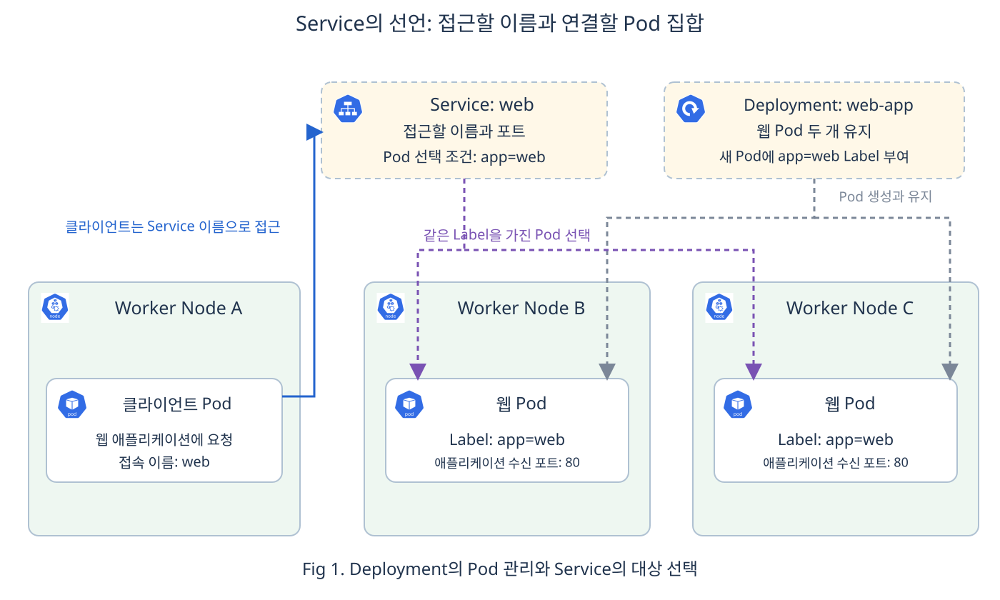
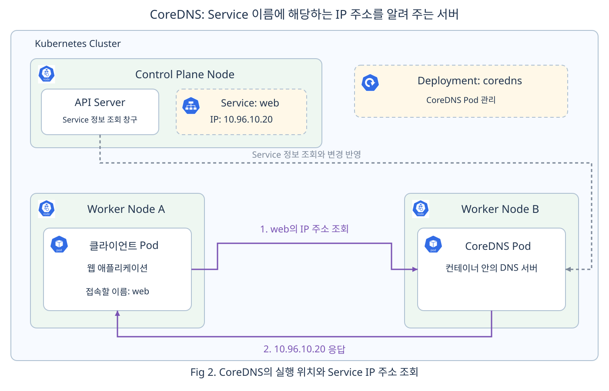
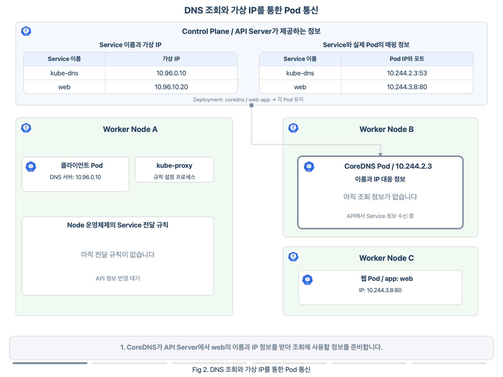
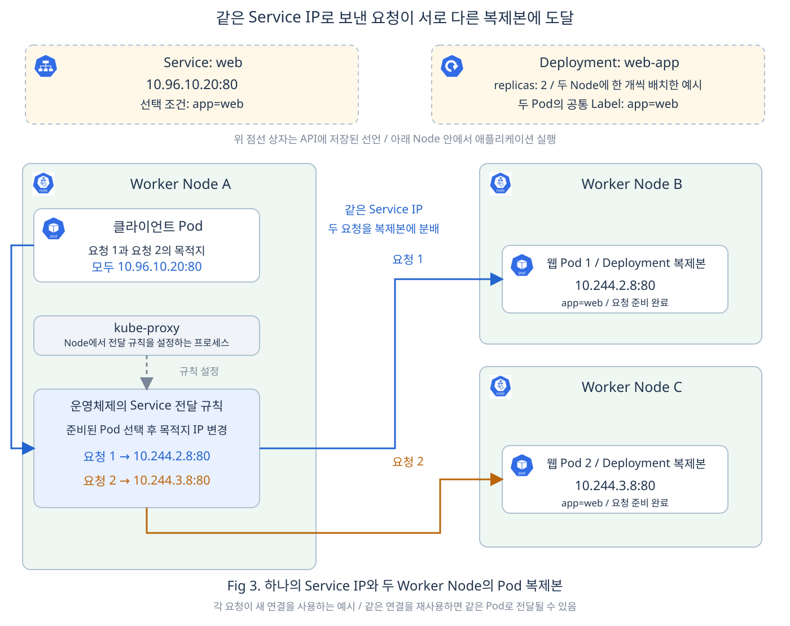
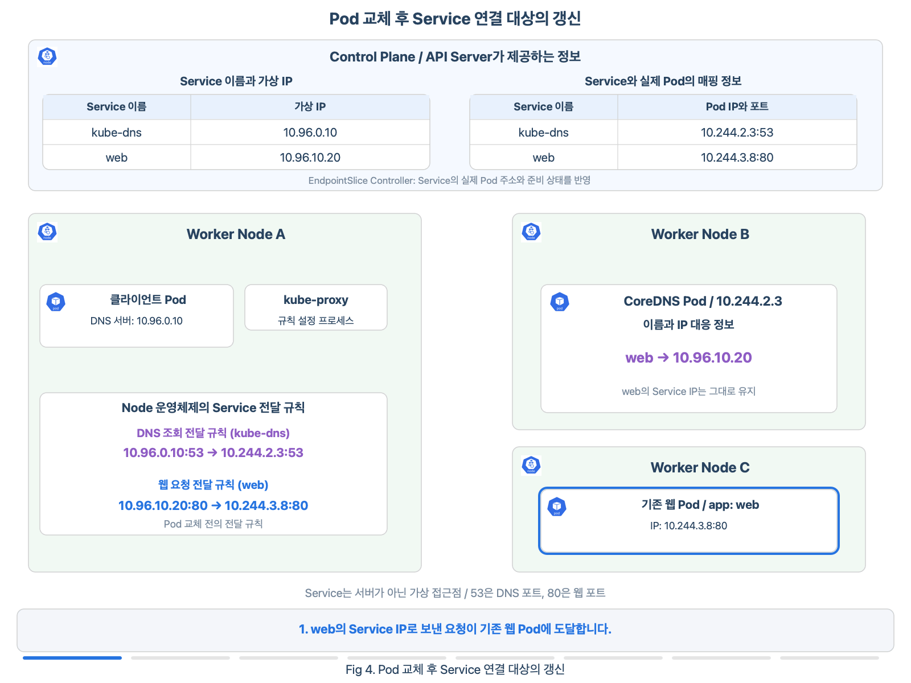
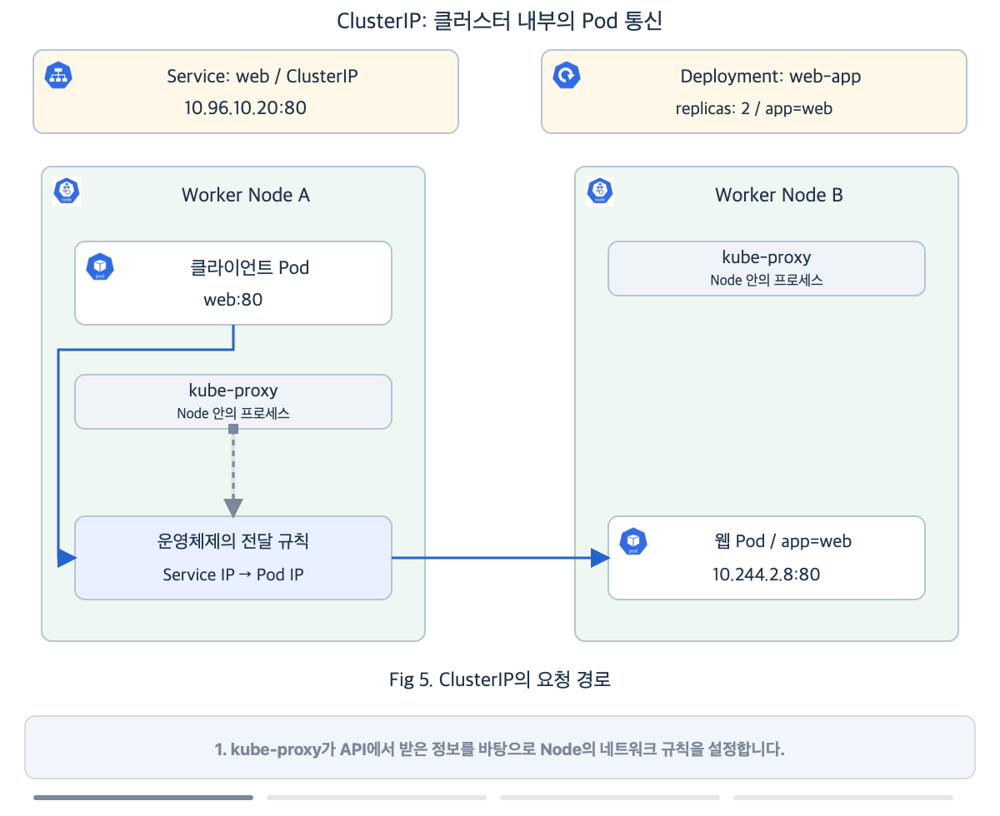
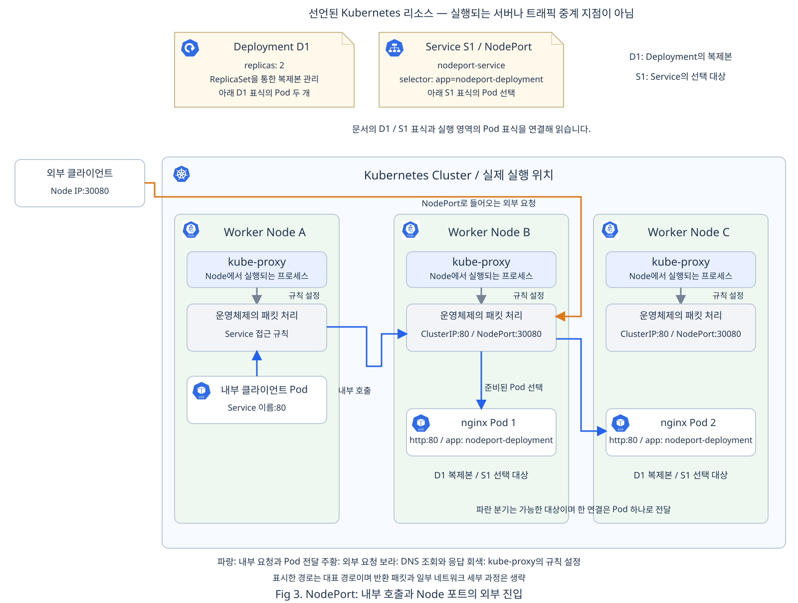
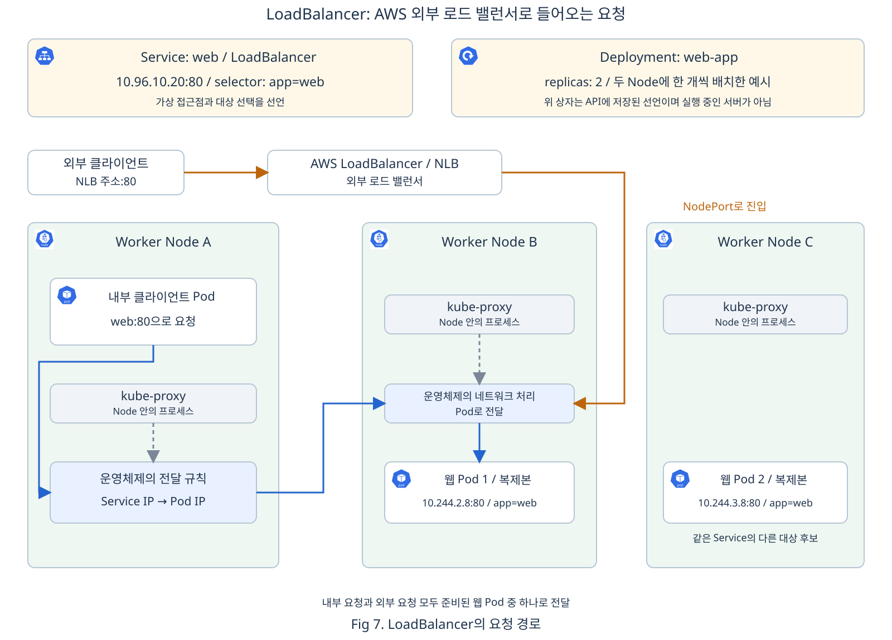
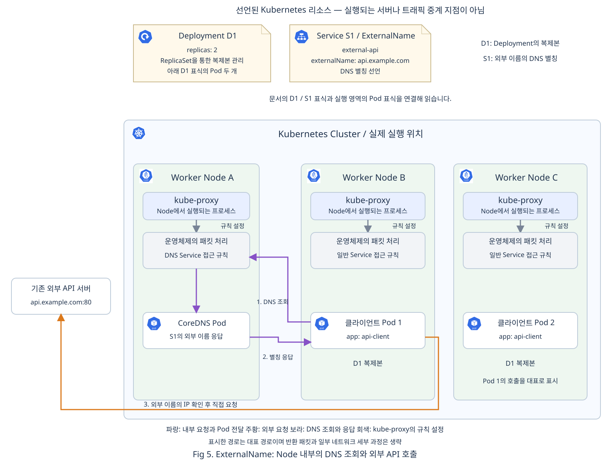

# Chap05. Service와 클러스터 통신: 이름을 통한 연결부터 네 가지 접근 방식까지

> 15주 연재의 다섯째 글입니다. Pod끼리 통신하는 방법과 Service가 필요한 이유를 먼저 살펴봅니다. Service 이름으로 접속할 IP 주소를 찾고 요청이 실제 Pod에 도달하는 과정을 이해한 뒤, 네 가지 Service 타입의 접근 범위를 비교합니다.

## 들어가며

<div align="center">


</div>

4장에서는 장애가 발생했을 때 컨테이너를 다시 실행하거나 Pod를 대체하는 과정을 살펴보았습니다. 그런데 애플리케이션이 다시 실행되었다고 해서 다른 애플리케이션과의 연결까지 모두 해결되는 것은 아닙니다. 새 Pod의 IP가 달라졌다면, 이전 주소로 요청하던 쪽은 새 실행 위치를 알아내야 합니다.

쇼핑몰의 웹 화면을 만드는 애플리케이션과 상품 정보를 반환하는 API가 서로 다른 Pod에서 실행된다고 가정해 보겠습니다. 웹 애플리케이션은 상품 목록을 가져오기 위해 API에 요청합니다. API Pod가 교체되거나 여러 개로 늘어나더라도, 웹 애플리케이션이 그때마다 접속 주소 목록을 고쳐야 한다면 자동 복구와 배포의 이점을 충분히 활용하기 어렵습니다.

이번 글에서는 먼저 **Pod가 서로 통신하는 방법과 주소 변경 문제**를 살펴보고, 이를 해결하는 **Service의 역할과 선언**을 알아봅니다. 이어서 **Service 이름으로 접속할 IP 주소를 찾고 요청을 Pod에 전달하는 과정**, **Pod 교체에 따라 Service가 연결할 Pod 주소 목록을 갱신하는 과정**을 살펴봅니다. 이 내부 통신 구조를 이해한 뒤에는 클러스터 내부의 Pod가 외부 시스템과 통신하는 방법과 외부 사용자가 내부 애플리케이션에 접근하는 방법을 살펴보고, Kubernetes가 제공하는 네 가지 Service 타입을 비교합니다.

## 1. Pod 사이의 통신과 Service의 필요성

### 1.1 Pod IP를 이용한 클러스터 내부 통신

3장에서 같은 Pod의 컨테이너는 네트워크를 공유하고 `localhost`로 통신할 수 있다고 설명했습니다. 서로 다른 Pod는 각자의 IP를 사용하므로, 다른 Pod에 있는 애플리케이션을 호출할 때는 그 Pod의 IP와 애플리케이션이 수신하는 포트가 필요합니다. 여기서 **클라이언트**는 요청을 보내는 애플리케이션을 뜻하며, 클러스터 내부의 Pod도 클라이언트가 될 수 있습니다.

예를 들어 웹 Pod가 상품 API Pod의 `10.244.2.8:80`으로 HTTP 요청을 보내면, 이 주소의 80번 포트에서 실행 중인 API 프로세스가 요청을 받아 응답합니다. 다른 Pod의 애플리케이션을 호출하는 데 Kubernetes 전용 HTTP 라이브러리가 필요한 것은 아닙니다.

클러스터에는 서로 다른 Node의 Pod도 IP로 연결할 수 있는 네트워크가 구성됩니다. 이 연결을 구현하는 것이 클러스터에 설치된 네트워크 플러그인입니다. 통신을 막는 별도 정책이 없고 네트워크와 수신 프로세스가 정상이라면, 웹 Pod와 API Pod가 서로 다른 Node에 있어도 통신할 수 있습니다. [[1]](#ref-1)

### 1.2 Pod 교체와 접속 주소 관리의 한계

IP를 알고 있을 때는 직접 통신할 수 있지만, 그 주소를 계속 사용할 수 있다는 보장은 없습니다. 상품 API Pod가 `10.244.2.8`에서 실행되다가 새 Pod로 교체되어 `10.244.1.9`를 받으면, 웹 애플리케이션에 저장한 이전 주소는 더 이상 같은 대상을 가리키지 않습니다.

API Pod를 두 개로 늘리면 문제도 넓어집니다. 웹 애플리케이션은 어느 주소로 연결할지 선택해야 하고, Pod가 사라지거나 추가될 때마다 목록을 갱신해야 합니다. Deployment는 실행할 Pod 개수를 유지하지만, 다른 애플리케이션에 안정적인 접속 주소를 제공하는 역할까지 맡지는 않습니다.

따라서 필요한 것은 특정 Pod의 주소를 외워 두는 방식 대신 **같은 역할의 애플리케이션에 계속 연결할 수 있는 접근점**입니다. [[2]](#ref-2)

### 1.3 애플리케이션의 접근점을 제공하는 Service

<div align="center">


</div>

**Service**(서비스)는 애플리케이션에 접근할 방법을 선언하는 Kubernetes의 네트워크 리소스입니다. 가장 일반적인 구성에서는 같은 역할의 Pod 집합에 하나의 이름과 가상 IP를 제공하고, 그 접근점으로 온 연결을 요청을 처리할 수 있는 Pod에 전달하도록 합니다. 클라이언트가 기억할 대상은 개별 Pod의 위치가 아니라 이 Service의 이름입니다. [[3]](#ref-3)

여기서 **가상 IP**는 Service라는 별도 서버에 접속한다는 뜻이 아닙니다. Service는 컨테이너를 실행하거나 HTTP 요청을 처리하는 프로세스가 아닙니다. API에 기록된 Service 선언을 바탕으로 클러스터가 주소와 실제 요청 대상의 연결을 구성합니다. 요청을 처리하고 응답을 만드는 주체는 여전히 Pod 안의 애플리케이션입니다.

Deployment와 Service의 역할을 나누면 관계가 분명해집니다. Deployment는 **어떤 Pod를 몇 개 실행할지**를 관리하고, Service는 **그 Pod 집합에 어떤 접근점으로 연결할지**를 선언합니다. Service를 생성한다고 Pod가 함께 생성되는 것은 아니며, Service 하나가 연결할 Pod는 하나일 수도 여러 개일 수도 있습니다.

먼저 클러스터 안의 애플리케이션이 다른 Pod의 애플리케이션에 요청하는 기본 통신 흐름을 살펴보겠습니다. 이어서 클러스터 밖의 사용자가 접근하는 경우와 내부 애플리케이션이 외부 시스템을 호출하는 경우로 범위를 넓혀 보겠습니다.

## 2. Service의 선언과 대상 Pod의 연결

<div align="center">



</div>

### 2.1 애플리케이션과 접근점의 연결 관계

Fig 1은 클러스터 안의 애플리케이션이 웹 서버에 요청하는 상황입니다. 웹 서버는 두 Pod에서 실행되고, Deployment는 이 Pod들이 유지되도록 관리합니다. 클라이언트는 개별 웹 Pod 대신 Service의 이름을 사용합니다.

그림 위의 Deployment와 Service는 실행 중인 서버가 아니라 **Pod를 관리하거나 접근 방법을 정하는 선언**입니다. 실제 애플리케이션은 아래 Node 안의 Pod에서 실행됩니다. 두 선언은 같은 Pod 집합에 관여하지만, Deployment는 실행할 Pod를 유지하고 Service는 그 Pod들에 연결할 접근점을 제공합니다.

이후에는 이 접근점의 이름을 간단히 **`web`**이라고 부르겠습니다. 클라이언트가 웹 Pod의 개수나 위치를 모르더라도 `web`으로 요청할 수 있게 만드는 것이 목표입니다. Service는 Deployment의 이름이 아니라 Pod에 붙은 Label을 기준으로 대상을 선택합니다. 실제 네트워크 전달 경로는 3절에서 살펴봅니다.

### 2.2 Service가 선언하는 이름과 대상 및 포트

Service를 선언할 때 정하는 핵심은 다음 세 가지입니다.

- **접근할 이름**: 클라이언트가 애플리케이션을 찾을 때 사용할 이름입니다. 여기서는 `web`입니다.
- **연결할 Pod의 조건**: 같은 역할의 Pod를 찾는 기준입니다. Pod에 붙인 Label을 Service의 Selector로 선택합니다.
- **연결할 포트**: 클라이언트가 사용할 Service 포트와, 실제 애플리케이션이 요청을 받을 Pod 쪽 포트를 연결합니다.

예를 들어 클라이언트에게는 80번 포트를 제공하면서, 실제 애플리케이션의 8080번 포트로 전달할 수 있습니다. Service는 이 연결을 선언할 뿐, 애플리케이션의 수신 포트를 바꾸지는 않습니다. 아래 예시에서는 관계에 집중할 수 있도록 양쪽 모두 80번을 사용합니다.

### 2.3 매니페스트로 확인하는 Label과 Selector의 연결

그림의 관계를 선언으로 옮겨 보겠습니다. Deployment는 웹 Pod 두 개를 만들고 각각에 `app: web`이라는 Label을 붙입니다. Service는 이 Label이 있는 Pod를 요청 대상 후보로 선택합니다.

```yaml
# 웹 Pod 두 개를 유지하고 각 Pod에 공통 Label 부여
apiVersion: apps/v1
kind: Deployment
metadata:
  name: web-app
spec:
  replicas: 2  # 웹 Pod 두 개 유지
  selector:
    matchLabels:
      app: web
  template:
    metadata:
      labels:
        app: web  # 생성되는 Pod에 붙이는 Label
    spec:
      containers:
      - name: nginx
        image: nginx:1.28
        ports:
        - containerPort: 80
```

- `replicas`와 `template`: 유지할 Pod 개수와 새 Pod의 공통 구성을 정합니다.
- `template.metadata.labels`: 생성되는 Pod에 웹 애플리케이션임을 구분할 Label을 붙입니다. Deployment의 `selector.matchLabels`도 이 Label에 맞춥니다.

웹 서버 프로그램으로 nginx를 사용합니다. 컨테이너는 80번 포트에서 요청을 받으며, 이 Pod들을 선택할 Service는 다음과 같습니다.

```yaml
# 웹 Pod 집합에 web이라는 내부 접근점 제공
apiVersion: v1
kind: Service
metadata:
  name: web  # 클라이언트가 사용할 Service 이름
spec:
  selector:
    app: web  # Pod의 Label과 일치하는 선택 조건
  ports:
  - port: 80  # 클라이언트가 접속할 Service 포트
    targetPort: 80  # Pod의 애플리케이션 수신 포트
```

- `metadata.name`: 클라이언트가 조회할 이름입니다.
- `spec.selector`: 요청 대상 후보인 Pod를 고르는 조건입니다. 앞의 Pod 템플릿에 붙인 Label과 연결됩니다.
- `port`와 `targetPort`: Service의 접근 포트와 실제 애플리케이션 포트를 연결합니다.

두 선언의 이름은 `web-app`과 `web`으로 서로 다릅니다. **연결 기준은 리소스 이름이 아니라 Pod의 Label과 Service의 Selector**이기 때문입니다. 새 Pod로 교체되어도 같은 Label이 붙으면 계속 같은 Service의 대상 후보가 됩니다.

## 3. Service 이름으로 주소를 찾고 Pod에 요청을 전달하는 과정

`http://web:80/`을 호출하는 과정은 두 단계로 나뉩니다. 먼저 이름에 해당하는 주소를 알아내고, 그 주소로 연결해 요청을 보냅니다. **주소 조회와 애플리케이션 통신은 서로 다른 과정**입니다. [[2]](#ref-2)

### 3.1 Service의 주소를 알려 주는 CoreDNS

클라이언트가 `web`이라는 이름으로 요청을 보내면, 먼저 “`web`에 접속하려면 어느 IP 주소를 사용해야 할까?”를 확인해야 합니다. 이때 이름에 해당하는 IP 주소를 알려 주는 것이 **DNS**(Domain Name System)이며, 이렇게 주소를 알아내는 과정을 **이름 해석**이라고 합니다. [[4]](#ref-4) Kubernetes에서는 보통 **CoreDNS**라는 DNS 서버 프로그램이 이 질문에 답합니다. 앞에서 웹 서버를 Pod 안의 컨테이너로 실행했듯이, CoreDNS도 Pod 안에서 실행되며 클러스터의 애플리케이션들이 이름으로 서로를 찾을 수 있도록 돕습니다. [[5]](#ref-5)

CoreDNS를 직접 설치한 기억이 없어도 클러스터에서 발견할 수 있습니다. 예를 들어 `kubeadm`으로 클러스터를 만들면 CoreDNS가 기본으로 설치됩니다. 다만 설치 도구와 클러스터 구성에 따라 다른 DNS 서버를 사용할 수도 있으므로, 모든 Kubernetes 클러스터에 반드시 같은 형태로 존재하는 것은 아닙니다. 보통은 `coredns`라는 Deployment가 Pod 개수를 관리하며, 웹 애플리케이션과 마찬가지로 컨트롤러가 필요한 Pod를 유지합니다. [[5]](#ref-5)

<div align="center">



</div>

Fig 2에서는 CoreDNS Pod가 Worker Node B에 배치되어 있습니다. 모든 Worker Node에 하나씩 실행해야 하는 구성은 아니며, Control Plane Node에만 설치되는 프로그램도 아닙니다. 실제 배치 위치와 Pod 개수는 클러스터 설정에 따라 달라집니다. 다른 Node의 클라이언트도 클러스터 네트워크를 통해 CoreDNS에 주소를 물을 수 있습니다.

그렇다면 CoreDNS는 `web`의 주소를 어떻게 알까요? **API Server를 통해 Service의 이름과 IP 정보를 받아 두고, Service가 생성되거나 변경되면 그 정보를 반영합니다.** [[6]](#ref-6) 주소를 물을 때마다 API Server가 대신 답하는 것이 아니라, CoreDNS가 받아 둔 정보를 이용해 응답합니다.

일반적인 Pod에는 클러스터 DNS를 사용할 수 있도록 DNS 서버 주소가 설정됩니다. CoreDNS 앞에도 `kube-dns`라는 Service가 있어, CoreDNS Pod가 교체되더라도 다른 Pod들이 일정한 주소로 DNS 조회를 보낼 수 있습니다. 애플리케이션은 CoreDNS Pod의 위치를 직접 관리하지 않고 `web`이라는 이름으로 접속하면 됩니다. [[5]](#ref-5) CoreDNS의 배치 관계에 이어, 3.2절에서는 이 DNS용 Service를 거쳐 주소를 조회하고 웹 요청을 보내는 과정을 살펴봅니다.

실제 클러스터에서도 다음 명령으로 CoreDNS Pod와 실행 중인 Node를 확인할 수 있습니다. `-n kube-system`은 Kubernetes 운영 구성요소가 모여 있는 영역을 조회하는 옵션입니다.

```bash
# CoreDNS Pod의 실행 상태와 배치된 Node 확인
kubectl get pods -n kube-system -l k8s-app=kube-dns -o wide
```

다음은 CoreDNS Pod 두 개가 실행 중인 출력 예시입니다. 이름, IP, 개수와 배치 위치는 환경마다 다릅니다.

```text
NAME                       READY   STATUS    RESTARTS   AGE   IP            NODE       NOMINATED NODE   READINESS GATES
coredns-76f75df574-abcde     1/1     Running   0          1d    10.244.2.3    worker-b   <none>           <none>
coredns-76f75df574-fghij     1/1     Running   0          1d    10.244.3.4    worker-c   <none>           <none>
```

- `NAME`: 이름이 `coredns-`로 시작하는 Pod에서 DNS 서버가 실행되고 있음을 확인합니다.
- `NODE`: 각 CoreDNS Pod가 실제로 배치된 Node입니다.

기본적인 CoreDNS 설치 구성에서는 `kubectl get deployment coredns -n kube-system`으로 Pod를 관리하는 Deployment를, `kubectl get service kube-dns -n kube-system`으로 DNS 조회를 받을 Service를 확인할 수 있습니다. 여기서 `kube-dns`는 Service의 이름이며, 그 뒤에서 실행되는 프로그램은 CoreDNS일 수 있습니다.

위 출력의 IP는 CoreDNS Pod 자체의 주소입니다. CoreDNS가 클라이언트에게 알려 주는 웹 Service의 IP와는 구분해야 합니다.

### 3.2 DNS 조회부터 웹 Pod까지의 요청 경로

이제 `web`이라는 이름으로 보낸 요청이 실제 웹 Pod에 도달하는 과정을 살펴보겠습니다. 주소를 알아내는 것에 더해, **Service의 가상 IP와 실제 Pod를 연결할 정보**가 필요합니다.

이 연결을 준비하는 **kube-proxy**는 각 Node에서 실행되는 프로세스입니다. API Server에서 정보를 받아, Service IP로 온 연결을 실제 Pod IP와 포트로 전달할 규칙을 Node의 운영체제에 설정합니다. kube-proxy가 웹 요청을 직접 받아 다시 보내는 것이 아니라, 운영체제가 설정된 규칙에 따라 요청을 전달합니다. 여기서는 kube-proxy를 사용하는 대표 구성을 설명하며, 다른 네트워크 구현이 같은 역할을 대신할 수도 있습니다. [[7]](#ref-7)

어느 Pod에 전달할지는 **EndpointSlice**에 기록된 정보를 바탕으로 정합니다. EndpointSlice는 Service의 실제 연결 대상인 Pod의 주소, 포트와 준비 상태를 담는 API 리소스입니다. “이 Service가 어느 Pod의 어느 포트로 연결되는가”를 담은 **매핑 정보 테이블**로 이해하면 됩니다. CoreDNS가 알려 주는 Service 주소와 그 뒤에서 요청을 받을 Pod 주소는 이렇게 구분됩니다. [[8]](#ref-8)

Fig 2에서는 클라이언트 Pod가 Worker Node A에, CoreDNS Pod가 Worker Node B에, 웹 Pod가 Worker Node C에 있습니다. 서로 다른 Node에서도 조회와 요청 전달이 이루어지는 예시이며, 반드시 이처럼 나누어 배치해야 하는 것은 아닙니다. IP 주소는 예시입니다.

<div align="center">



</div>

1. **조회에 필요한 정보 준비(1~2단계)**: API의 정보가 CoreDNS의 이름 조회 정보와 Node의 전달 규칙에 반영됩니다. 이 준비가 끝난 뒤 클라이언트의 요청을 따라가 보겠습니다.
2. **DNS용 Service로 조회 전송(3단계)**: 클라이언트는 Pod에 설정된 DNS 서버 주소인 `10.96.0.10`으로 “`web`의 IP가 무엇인가?”를 묻습니다. 이 주소는 `kube-dns` Service의 IP입니다.
3. **CoreDNS Pod에 조회 전달(4단계)**: Node의 규칙이 목적지를 CoreDNS Pod의 IP로 바꾸어 전달합니다. Service라는 별도 서버를 거치는 것이 아니라 Node의 네트워크 처리가 연결을 이어 줍니다.
4. **이름에 맞는 IP 응답(5단계)**: CoreDNS는 받아 둔 정보에서 `web`의 Service IP인 `10.96.10.20`을 찾아 응답합니다. 클라이언트가 이 응답을 받으면 접속할 주소를 알게 됩니다.
5. **조회한 주소로 웹 요청 전송(6단계)**: 클라이언트는 알아낸 주소로 웹 요청을 보냅니다. 이 요청은 CoreDNS를 거치지 않고 Node의 규칙에 따라 웹 Pod에 도달합니다.

이 과정에서 클라이언트가 DNS 서버로 사용하는 주소는 `kube-dns`의 IP이고, DNS 응답으로 알아낸 웹 접속 주소는 `web`의 IP입니다. **주소를 묻는 통신과 웹 애플리케이션에 요청하는 통신은 목적지도 역할도 다릅니다.** 웹 요청은 CoreDNS나 API Server를 거치지 않습니다.

<div align="center">



</div>

Fig 2에서 한 웹 Pod에 도달하는 경로를 살펴보았다면, Fig 3은 **Deployment의 웹 Pod 복제본이 Worker Node B와 C에 한 개씩 있는 상황**입니다. 두 Pod 모두 `app=web`이라는 Label이 있고 요청할 준비가 되어 있어, 같은 `web` Service의 연결 대상이 됩니다. Deployment의 복제본 수를 두 개로 지정하는 것만으로 서로 다른 Node에 배치되는 것이 보장되지는 않으며, 여기서는 이미 나누어 배치된 상황을 가정합니다.

클라이언트 Pod는 **요청 1과 요청 2를 모두 같은 Service IP인 `10.96.10.20:80`으로 보냅니다.** Node A의 운영체제는 kube-proxy가 설정한 규칙에 따라 준비된 Pod 중 하나를 선택하고, 요청의 목적지를 그 Pod의 IP와 포트로 바꾸어 전달합니다. 클라이언트가 복제본의 IP를 직접 골라야 하는 것은 아닙니다.

- **요청 1**: Worker Node B의 웹 Pod 1인 `10.244.2.8:80`으로 전달됩니다.
- **요청 2**: Worker Node C의 웹 Pod 2인 `10.244.3.8:80`으로 전달됩니다.

이처럼 하나의 Service 주소로 받은 요청을 여러 복제본에 분배할 수 있습니다. Fig 3은 각 요청이 새 연결을 사용해 서로 다른 Pod로 전달된 예시입니다. 같은 연결을 재사용하는 요청은 같은 Pod로 갈 수 있으며, 항상 번갈아 선택되거나 정확히 절반씩 나뉘는 것은 아닙니다.

### 3.3 Pod 변경에 따른 연결 대상 갱신

웹 Pod가 교체되어 새 IP를 받으면 어떻게 될까요? 클라이언트가 계속 같은 Service 주소를 사용하려면, 앞에서 준비한 매핑 정보와 Node의 전달 규칙에 새 Pod 주소가 반영되어야 합니다. 이 작업은 다음 두 주체가 나누어 수행합니다.

- **EndpointSlice Controller**: Control Plane에서 Service와 Pod의 변화를 관찰하고, Service의 Selector에 맞는 Pod 주소와 준비 상태를 EndpointSlice에 반영합니다.
- **kube-proxy**: API Server를 통해 Service와 EndpointSlice의 변경 정보를 받아 각 Node의 전달 규칙을 갱신합니다.

<div align="center">



</div>

Fig 4에서는 웹 Pod의 IP가 `10.244.3.8`에서 `10.244.3.9`로 바뀝니다. 새 Pod가 준비되면 대상 목록이 먼저 바뀌고, kube-proxy가 변경 정보를 받아 Node의 규칙을 갱신합니다. CoreDNS가 알려 주는 Service IP인 `10.96.10.20`은 그대로이며, 갱신을 마친 뒤 같은 주소로 보낸 새 요청은 새 Pod에 도달합니다. Pod 생성의 세부 절차는 4장에서 다룬 과정을 따릅니다.

새 Pod에 같은 Label이 붙고 요청을 받을 준비가 끝나면, 이 과정을 통해 새 주소가 연결 대상에 포함됩니다. **Service가 유지되는 동안에는 이름과 가상 IP가 그대로이고, 실제로 요청을 받을 Pod 주소만 바뀝니다.** 따라서 클라이언트가 접속 설정에 새 Pod IP를 직접 적을 필요가 없습니다. CoreDNS Pod가 교체될 때도 같은 원리로 DNS용 Service인 `kube-dns`의 주소를 계속 사용할 수 있습니다. [[2]](#ref-2)

4장에서 살펴본 준비 검사가 실패하면 해당 Pod는 일반적인 Service의 새 연결 대상에서 제외됩니다. 준비 상태가 회복되면 다시 대상이 될 수 있습니다. 이러한 갱신은 Pod의 상태나 구성이 바뀔 때 이루어지며, 웹 요청마다 반복되는 절차는 아닙니다. [[9]](#ref-9)

다만 변경 반영에는 시간이 걸릴 수 있고, 끊어진 기존 연결이 새 Pod로 옮겨지지는 않습니다. 준비된 Pod가 하나도 없다면 Service 이름으로 IP를 알아내더라도 정상 응답을 받지 못합니다.

Kubernetes의 Service는 `spec.type`에 지정할 수 있는 값으로 **ClusterIP, NodePort, LoadBalancer, ExternalName** 네 가지를 지원합니다. 지금까지 살펴본 내부 통신을 바탕으로, 각 타입이 어디에서 들어오는 요청에 어떤 접근점을 제공하는지 비교하겠습니다.

## 4. 접근 범위에 따른 Service 타입

Service 타입은 누가 어디에서 접속하는지에 따라 선택합니다. 네 타입은 모두 `kind: Service`로 선언하며, `spec.type`으로 접근 방식을 정합니다.

- **ClusterIP**: 클러스터 내부의 애플리케이션이 다른 Pod에 접근할 때 사용합니다. 지금까지 살펴본 이름과 가상 IP를 통한 내부 접근점입니다.
- **NodePort**: 외부 클라이언트가 접근 가능한 Node의 IP와 지정된 포트로 접속할 수 있게 합니다.
- **LoadBalancer**: 외부 로드 밸런서를 연결해 외부 클라이언트가 사용할 접속 주소를 제공합니다.
- **ExternalName**: 내부에서 사용하는 Service 이름을 외부 시스템의 DNS 이름에 연결합니다. 앞의 세 타입처럼 Pod를 선택하거나 요청을 전달하는 방식이 아니라, 이름 조회에 별칭으로 응답합니다.

ClusterIP, NodePort, LoadBalancer는 같은 웹 Pod 집합에 연결하는 상황을 기준으로 비교합니다. 이 세 타입의 매니페스트는 하나의 `web` Service를 서로 다른 방식으로 선언한 예시입니다. ExternalName에서는 내부 Pod가 외부 API를 호출하는 상황을 살펴봅니다.

### 4.1 내부 접근점을 제공하는 ClusterIP

**ClusterIP**는 클러스터 내부에서 사용하는 Service 이름과 가상 IP를 제공합니다. `spec.type`을 생략했을 때 적용되는 기본 타입입니다. 내부 애플리케이션 간 통신에서는 먼저 ClusterIP를 검토합니다.

<div align="center">



</div>

Fig 5는 내부 클라이언트의 요청이 Node의 전달 규칙을 거쳐 선택된 웹 Pod에 도달하는 과정입니다. 클라이언트는 Service IP로 요청하고, Node A의 규칙이 선택한 웹 Pod가 Node B에서 요청을 처리합니다. 여기서는 Deployment가 관리하는 복제본 중 이 요청을 처리하는 Pod 하나를 살펴봅니다. [정지 구성도](../images/articles/05/03-clusterip-topology.svg)에서도 같은 배치를 확인할 수 있습니다.

2절의 Service 선언이 이 타입의 예시입니다. 내부 클라이언트는 `http://web:80/`을 사용하며, Pod가 어느 Node에 있는지에 따라 접속 주소를 바꾸지 않습니다. 웹 애플리케이션이 내부 API나 데이터베이스에 연결하는 경우처럼, 클러스터 안에서만 접근점을 사용할 때 적용할 수 있습니다.

일반적인 클러스터 외부 컴퓨터에는 ClusterIP로 가는 경로가 없습니다. 외부에서 들어올 경로가 필요하면 다음 절의 NodePort나 LoadBalancer 같은 진입점을 함께 검토합니다. 다만 내부 주소라는 사실만으로 인증과 접근 제어까지 제공되는 것은 아닙니다.

### 4.2 Node의 포트를 여는 NodePort

**NodePort**는 ClusterIP의 내부 접근점을 유지하면서 Node의 지정된 포트에도 진입점을 추가합니다. 클라이언트는 접근 가능한 `Node IP:nodePort`로 요청합니다.

<div align="center">



</div>

Fig 6에서 내부 Pod는 Service 이름과 `port`를 사용하고, 외부 클라이언트는 Node 주소와 `nodePort`를 사용합니다. 두 경로는 같은 Selector가 고른 nginx Pod 집합으로 이어집니다. Service 상자는 접근 방법을 선언하는 리소스이며, 실제 요청은 Node의 네트워크 처리를 통해 전달됩니다.

다음은 앞의 웹 애플리케이션에 이 접근 방식을 적용한 선언입니다.

```yaml
# 같은 nginx Pod를 Node의 30080번 포트로 노출
apiVersion: v1
kind: Service
metadata:
  name: web
spec:
  type: NodePort  # Node 포트 진입점 추가
  selector:
    app: web  # 웹 Pod의 Label 선택
  ports:
  - name: http
    port: 80  # 클라이언트가 사용할 Service 포트
    targetPort: 80  # 웹 애플리케이션의 수신 포트로 전달
    protocol: TCP
    nodePort: 30080  # Node IP로 접속할 때 사용할 포트
```

- `spec.type: NodePort`: 내부 접근점에 Node 포트 진입점을 추가합니다.
- `nodePort: 30080`: 클라이언트가 `Node IP:30080`으로 접근할 때 사용하는 포트입니다.

대상 Pod와 포트의 연결은 2절과 같고, 클라이언트가 들어올 접근 방식이 달라집니다.

`port`, `targetPort`, `nodePort`는 서로 다른 위치의 포트입니다. 이 예시에서 내부 클라이언트는 `web:80`을, 외부 클라이언트는 `Node IP:30080`을 사용합니다. 실제 요청은 웹 Pod의 애플리케이션이 처리합니다.

`nodePort`를 생략하면 클러스터에 설정된 범위에서 자동 할당됩니다. 기본 범위는 30000~32767이지만 클러스터 설정에 따라 달라질 수 있습니다. 30080번이 이미 다른 Service에 할당되어 있으면 다른 포트를 사용해야 합니다.

내부 클라이언트는 `web:80`, 외부 클라이언트는 접근 가능한 `Node IP:30080`으로 같은 Pod 집합에 요청합니다. NodePort를 만들었다고 Node에 공인 IP가 생기지는 않습니다. 외부 호출에는 Node까지의 네트워크 경로와 해당 포트를 허용하는 방화벽 또는 클라우드 보안 그룹이 필요합니다.

기본 외부 트래픽 정책인 `externalTrafficPolicy: Cluster`에서는 요청을 받은 Node에 대상 Pod가 없어도 다른 Node의 준비된 Pod로 전달할 수 있습니다. NodePort는 여러 Node에 진입점을 제공하지만 클라이언트가 사용할 Node 주소를 자동으로 선택해 주지는 않습니다. 특정 Node 주소만 사용하다가 해당 Node에 장애가 나면 다른 Node의 Pod가 정상이어도 그 주소로는 접속할 수 없습니다.

### 4.3 외부 로드 밸런서를 연결하는 LoadBalancer

**LoadBalancer**는 외부 로드 밸런서 구현에 Service 진입점 생성을 요청하는 타입입니다. 클라우드 연동이나 MetalLB 같은 구현이 준비되어 있어야 하며, 타입만 선언한다고 모든 클러스터에 외부 주소가 생기지는 않습니다.

<div align="center">



</div>

Fig 7은 AWS NLB가 Node를 대상으로 등록하는 `instance` 방식의 예시입니다. 외부 요청은 NLB의 80번 포트에서 NodePort를 거쳐 Pod로 전달됩니다. Pod IP를 대상으로 등록하는 `ip` 방식에서는 NLB가 NodePort를 거치지 않을 수 있습니다. LoadBalancer 구현마다 요청 경로와 설정 방식이 다르므로, 그림의 경로를 모든 환경에 일반화해서는 안 됩니다. [[10]](#ref-10)

다음은 앞의 웹 애플리케이션에 이 접근 방식을 적용한 선언입니다. 필요한 구현과 환경별 설정이 갖춰졌을 때 외부 접근점이 생성됩니다.

```yaml
# 외부 로드 밸런서 구현에 nginx 진입점 생성 요청
apiVersion: v1
kind: Service
metadata:
  name: web
spec:
  type: LoadBalancer  # 외부 로드 밸런서 연결 요청
  selector:
    app: web  # 웹 Pod의 Label 선택
  ports:
  - name: http
    port: 80  # 클라이언트가 사용할 Service 포트
    targetPort: 80  # 웹 애플리케이션의 수신 포트로 전달
    protocol: TCP
```

- `spec.type: LoadBalancer`: 외부 로드 밸런서 구현에 접근점 생성을 요청합니다.

대상 Pod와 포트의 연결은 2절과 같고, 클라이언트가 들어올 접근 방식이 달라집니다.

일반적인 구현은 NodePort를 함께 사용하지만, Pod IP로 직접 전달하는 구현에서는 NodePort를 생략할 수도 있습니다. [[11]](#ref-11) 외부 로드 밸런서가 항상 인터넷에 공개되는 것도 아닙니다. 구현과 설정에 따라 사설 네트워크에서만 접근하는 주소를 만들 수 있습니다.

LoadBalancer와 Ingress도 구분해야 합니다. LoadBalancer Service는 외부에서 클러스터로 들어오는 접근점을 제공합니다. Ingress는 HTTP와 HTTPS 요청의 도메인이나 URL 경로를 해석해 여러 백엔드 Service로 나누는 규칙입니다. Ingress Controller의 진입점을 LoadBalancer Service로 제공하고, 애플리케이션은 ClusterIP Service로 연결하는 구성이 가능합니다.

### 4.4 외부 이름을 연결하는 ExternalName

**ExternalName**은 Service 이름을 외부 DNS 이름의 별칭으로 연결합니다. 외부 사용자가 클러스터 안의 Pod에 들어오는 진입점을 만드는 타입이 아닙니다. 클러스터 안의 애플리케이션이 기존 외부 API를 일관된 내부 이름으로 찾을 때 사용할 수 있습니다.

<div align="center">



</div>

Fig 8에서 애플리케이션 Pod는 먼저 CoreDNS에 ExternalName Service를 조회합니다. CoreDNS는 외부 DNS 이름을 가리키는 CNAME 별칭을 응답하고, 클라이언트는 외부 이름의 주소를 해석한 뒤 외부 서버로 직접 연결합니다. 보라색 화살표는 DNS 조회와 응답을, 주황색 화살표는 외부 API로 향하는 실제 요청을 나타냅니다.

다음은 외부 API를 `api`라는 내부 이름으로 찾도록 하는 선언입니다.

```yaml
# 내부 Service 이름을 외부 API의 DNS 이름에 연결
apiVersion: v1
kind: Service
metadata:
  name: api  # Pod가 조회할 내부 Service 이름
spec:
  type: ExternalName  # 트래픽 중계 대신 DNS 별칭 제공
  externalName: api.example.com  # 별칭이 가리킬 외부 DNS 이름
```

- `metadata.name: api`: 클라이언트가 조회할 내부 Service 이름입니다.
- `spec.type: ExternalName`과 `spec.externalName`: Service 이름을 `api.example.com`이라는 외부 DNS 이름에 연결합니다. IP 주소나 URL 경로를 적는 필드가 아닙니다.

이 선언에는 Pod를 고르는 Selector가 없습니다. 대신 접속할 외부 이름을 지정합니다.

`api.example.com`은 구조 설명을 위한 예시 이름입니다. 실제로 사용하는 외부 시스템의 DNS 이름으로 바꿔야 합니다. ExternalName에는 ClusterIP가 할당되지 않고 Selector와 EndpointSlice도 생성되지 않습니다. kube-proxy가 구성할 Service 전달 규칙도 없으며, DNS 해석 뒤의 요청은 외부 서버 주소로 직접 향합니다. [[12]](#ref-12)

ExternalName은 포트를 변환하거나 HTTP 요청을 프록시하지 않습니다. 외부 서버까지의 네트워크 경로도 별도로 준비되어야 합니다. 특히 HTTP `Host` 헤더나 HTTPS 인증서의 이름은 클라이언트가 사용한 Service 별칭과 외부 서버의 실제 이름이 달라 문제가 생길 수 있습니다. DNS 별칭만으로 외부 서버의 호스트 설정이나 인증서 이름이 바뀌지는 않습니다.

## 5. 접근 목적에 따른 Service 타입 선택

Service 타입은 Pod를 실행하는 방식이 아니라 클라이언트가 사용할 접근 경로를 결정합니다. 다음 순서로 선택하면 목적을 분명히 할 수 있습니다.

- 클러스터 내부 애플리케이션끼리 통신한다면 ClusterIP부터 검토합니다.
- Node의 주소와 포트로 직접 연결해야 한다면 NodePort를 사용합니다. Node 주소 선택과 장애 대응은 별도로 준비해야 합니다.
- 외부 로드 밸런서의 안정적인 접근점이 필요하고 이를 처리할 구현이 있다면 LoadBalancer를 사용합니다.
- 기존 외부 시스템을 클러스터 내부의 Service 이름으로 참조하려면 ExternalName을 검토합니다.

ClusterIP, NodePort, LoadBalancer는 계층적으로 겹치는 접근점을 가질 수 있습니다. NodePort는 ClusterIP를 포함하고, 일반적인 LoadBalancer 구현은 ClusterIP와 NodePort도 함께 사용합니다. 그러나 실제 외부 전달 경로는 구현에 따라 NodePort를 생략할 수 있습니다.

네트워크 노출 범위만 보고 보안을 단정해서도 안 됩니다. ClusterIP는 보통 클러스터 외부에서 직접 접근할 수 없지만 인증이나 권한 검사를 제공하지 않습니다. NodePort와 LoadBalancer는 접근점을 추가할 뿐 방화벽, TLS, 애플리케이션 인증을 자동으로 완성하지 않습니다.

## 6. Service 연결 문제의 진단 순서

요청 실패는 Pod에서 바깥 방향으로 확인하면 범위를 좁히기 쉽습니다. 내부 호출도 실패한다면 먼저 Service와 Pod의 연결을 확인하고, 내부 호출이 성공할 때 외부 진입점을 확인합니다. [[13]](#ref-13)

- 대상 선택: Service Selector와 Pod Label이 일치하는지 확인합니다.
- 요청 준비: Pod가 준비되어 있고 EndpointSlice에 준비된 주소가 반영되었는지 확인합니다.
- 포트 연결: Service의 `port`, `targetPort`와 애플리케이션의 실제 수신 포트를 비교합니다. `containerPort` 선언만으로 프로세스의 수신 포트가 바뀌지는 않습니다.
- 외부 접근: 내부 호출은 성공하지만 외부 호출이 실패한다면 Node까지의 경로, 방화벽, 로드 밸런서 상태를 확인합니다.

이 순서는 Service 타입이 달라도 공통으로 적용할 수 있습니다. 각 단계의 명령과 출력 예시는 선택 실습에 모았습니다.

## 7. 선택 실습: Service 접근 경로 확인

[Service 선택 실습](labs/05-service-types.lab.md)에서는 nginx Pod를 준비한 뒤 ClusterIP 내부 호출과 NodePort 외부 호출을 비교합니다. 지원되는 환경에서는 LoadBalancer 주소 생성도 확인할 수 있습니다. 환경 준비, 매니페스트 적용, 출력 확인, 문제 진단, 리소스 정리를 실행 순서대로 모았습니다.

## 다음 글로 넘어가기 전에

이번 글에서 다룬 내용은 이렇습니다. Pod끼리는 클러스터 네트워크에서 IP와 포트로 통신하지만, Pod가 교체될 때마다 클라이언트가 새 주소를 추적하는 방식은 관리하기 어렵습니다. Service는 그 앞에 일정한 접근점을 제공합니다. Deployment가 Pod 집합을 유지하는 역할과 Service가 통신할 접근점을 선언하는 역할은 서로 다릅니다.

클라이언트는 DNS에서 Service 주소를 알아낸 뒤 연결을 시작합니다. Node의 네트워크 규칙은 그 연결을 준비된 Pod로 전달하며, EndpointSlice Controller와 kube-proxy는 Pod 변화가 이 경로에 반영되도록 대상 정보와 규칙을 갱신합니다. 이름 해석의 성공과 실제 요청 처리의 성공은 구분해서 확인해야 합니다.

이 기본 동작을 바탕으로 ClusterIP의 내부 접근점, NodePort의 Node 포트, LoadBalancer의 외부 로드 밸런서, ExternalName의 DNS 별칭을 비교했습니다. 실행 명령은 선택 실습에서 필요한 경우 확인할 수 있습니다.

다음 글에서는 Ingress가 외부 HTTP와 HTTPS 요청을 도메인과 URL 경로에 따라 여러 Service로 연결하는 방법을 살펴봅니다. Ingress Controller가 선언을 실제 요청 경로에 반영하는 과정과 TLS Secret을 사용한 HTTPS 구성을 함께 확인합니다.

## 참고문헌

- <a id="ref-1"></a>[1] [Kubernetes 네트워크 모델 공식 문서](https://kubernetes.io/docs/concepts/services-networking/)
- <a id="ref-2"></a>[2] [제공된 『쿠버네티스 교과서』 3장: 3.1절과 3.5절, 인쇄 쪽수 80~84·103~107쪽](../Textbook/%E1%84%80%E1%85%B5%E1%86%B7%E1%84%89%E1%85%A5%E1%86%BC%E1%84%89%E1%85%AE_%E1%84%8F%E1%85%AE%E1%84%87%E1%85%A5%E1%84%82%E1%85%A6%E1%84%90%E1%85%B5%E1%84%89%E1%85%B3%20%E1%84%80%E1%85%AD%E1%84%80%E1%85%AA%E1%84%89%E1%85%A5_ocr_3%E1%84%8C%E1%85%A1%E1%86%BC.pdf)
- <a id="ref-3"></a>[3] [Service 개념과 타입 공식 문서](https://kubernetes.io/docs/concepts/services-networking/service/)
- <a id="ref-4"></a>[4] [Service와 Pod DNS 공식 문서](https://kubernetes.io/docs/concepts/services-networking/dns-pod-service/)
- <a id="ref-5"></a>[5] [Kubernetes의 CoreDNS 운영 공식 문서](https://kubernetes.io/docs/tasks/administer-cluster/coredns/)
- <a id="ref-6"></a>[6] [CoreDNS의 Kubernetes 정보 조회 공식 문서](https://coredns.io/plugins/kubernetes/)
- <a id="ref-7"></a>[7] [Service 가상 IP와 프록시 공식 문서](https://kubernetes.io/docs/reference/networking/virtual-ips/)
- <a id="ref-8"></a>[8] [EndpointSlice 공식 문서](https://kubernetes.io/docs/concepts/services-networking/endpoint-slices/)
- <a id="ref-9"></a>[9] [Readiness Probe 공식 문서](https://kubernetes.io/docs/tasks/configure-pod-container/configure-liveness-readiness-startup-probes/)
- <a id="ref-10"></a>[10] [AWS Load Balancer Controller의 NLB 공식 문서](https://kubernetes-sigs.github.io/aws-load-balancer-controller/latest/guide/service/nlb/)
- <a id="ref-11"></a>[11] [LoadBalancer의 NodePort 할당 공식 문서](https://kubernetes.io/docs/concepts/services-networking/service/#load-balancer-nodeport-allocation)
- <a id="ref-12"></a>[12] [ExternalName 공식 문서](https://kubernetes.io/docs/concepts/services-networking/service/#externalname)
- <a id="ref-13"></a>[13] [Service 문제 해결 공식 문서](https://kubernetes.io/docs/tasks/debug/debug-application/debug-service/)
