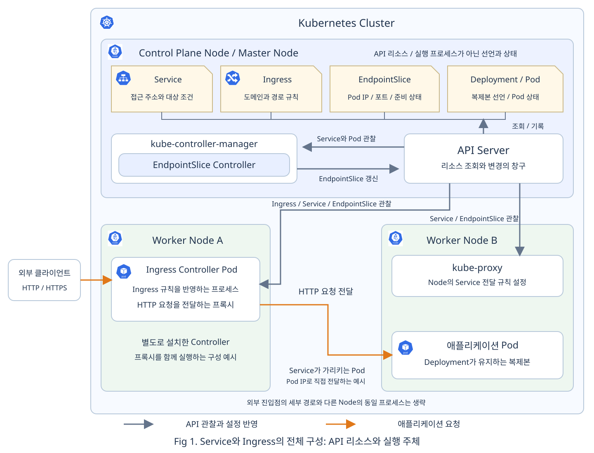
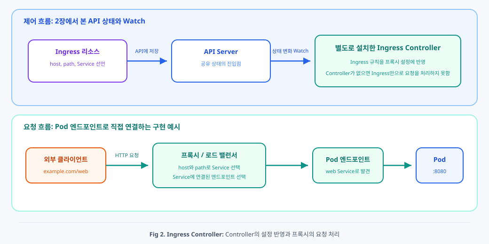
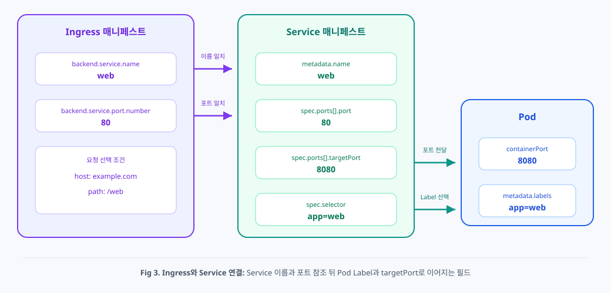
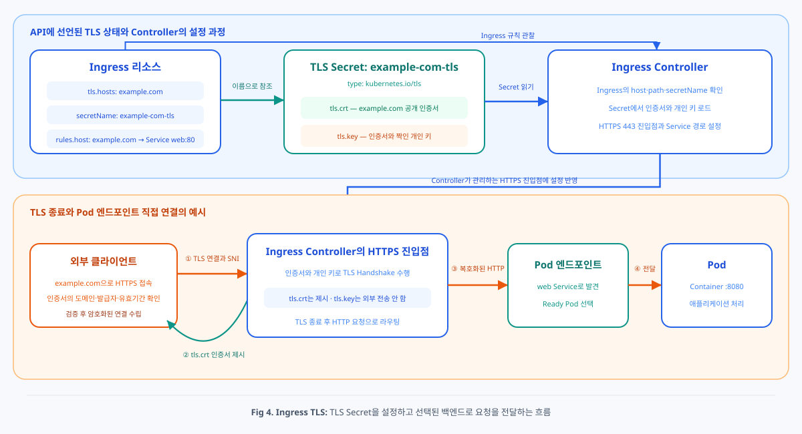

# Chap06. Ingress와 HTTPS: 외부 요청을 Service로 연결하기

> 15주 연재의 여섯째 글입니다. 5장에서 비교한 Service 타입을 바탕으로, Ingress가 외부 HTTP와 HTTPS 요청을 Service에 연결하는 방법과 Gateway API의 역할 분담을 살펴봅니다.

## 들어가며

<div align="center">


</div>


5장에서는 `ClusterIP`, `NodePort`, `LoadBalancer`, `ExternalName`의 접근 범위를 비교했습니다. `ClusterIP`는 클러스터 내부에 안정적인 접근점을 만들고, `NodePort`와 `LoadBalancer`는 클러스터 밖에서 들어오는 연결의 진입점을 제공합니다.

하지만 여러 웹 애플리케이션을 공개할 때 Service마다 별도 외부 주소를 제공하는 것만으로는 충분하지 않습니다. `shop.example.com`과 `api.example.com`처럼 호스트별로 요청을 나누거나, `/web`과 `/api`처럼 경로별로 서로 다른 Service에 전달할 규칙이 필요합니다. HTTPS를 사용한다면 인증서와 개인 키를 안전하게 참조하고 TLS 연결을 끝낼 위치도 정해야 합니다.

이번 글에서는 Ingress와 Controller의 역할을 먼저 구분하고, Ingress가 Service 이름과 포트를 참조하는 방법을 확인합니다. 이어서 TLS Secret을 이용한 HTTPS 종료를 이해하고, Gateway API가 진입점과 라우팅 규칙을 어떻게 나누는지 살펴봅니다. 본문의 매니페스트는 리소스 사이의 참조 관계를 읽기 위한 예시입니다. 앱 배포부터 호출 검증까지의 실행 절차는 별도의 선택 실습으로 제공합니다.

## 1. 외부 HTTP 요청을 나누는 Ingress

### 1.1 Service 다음에 필요한 HTTP 규칙

Service는 변하는 Pod 집합에 안정적인 이름과 가상 IP를 제공합니다. 클러스터 안의 애플리케이션은 Service 이름으로 요청하고, Service의 네트워크 경로는 준비된 Pod로 연결합니다. 여기까지 해결한 문제는 **현재 Pod의 이름과 IP를 몰라도 같은 애플리케이션에 접근하는 것**입니다.

여러 웹 Service를 외부에 공개하면 한 단계 위의 문제가 생깁니다. 외부 클라이언트가 Service마다 다른 주소를 알아야 한다면 공개 주소가 애플리케이션 수만큼 늘어납니다. `/web` 요청은 웹 Service로, `/api` 요청은 API Service로 보내는 HTTP 규칙도 외부 장비나 클라이언트 설정에 흩어질 수 있습니다.

<div align="center">


</div>

**Ingress**(인그레스)는 클러스터 외부에서 들어오는 HTTP와 HTTPS 요청을 호스트나 URL 경로에 따라 어떤 Service로 전달할지 선언하는 API 리소스입니다. 예를 들어 하나의 진입점에서 `example.com/web`은 `web` Service로, `example.com/api`는 `api` Service로 보낼 수 있습니다. Ingress는 Service를 대체하지 않습니다. Ingress는 Service를 선택하고, Service는 자신의 Selector와 일치하는 Pod를 선택합니다. [[1]](#ref-1)

<div align="center">



</div>

Fig 1에서 Service와 Ingress는 Kubernetes API에 저장되는 선언형 리소스입니다. Service는 Pod 집합의 안정적인 접근점을 선언하고, Ingress는 호스트와 URL 경로에 따른 HTTP 요청 전달 규칙을 선언합니다. 실제 요청은 Ingress Controller가 구성한 프록시나 외부 로드 밸런서가 처리합니다. 회색 화살표는 API 정보의 관찰과 설정 반영을, 주황색 화살표는 실제 애플리케이션 요청을 나타냅니다.

### 1.2 선언을 구현하는 Ingress Controller

<div align="center">



</div>

Fig 2는 Ingress 선언을 관찰해 프록시 설정을 반영하는 제어 흐름과, 외부 요청을 선택된 백엔드로 전달하는 실행 흐름을 구분합니다. Ingress와 Service는 API 리소스이며, 실제 HTTP 요청은 Controller가 관리하는 프록시가 처리합니다.

Ingress 자체는 요청을 받는 서버 프로세스가 아닙니다. Ingress에는 호스트, 경로, 백엔드 Service가 원하는 상태로 기록됩니다. 이 선언을 실제 요청 경로로 구현하는 프로그램이 **Ingress Controller**(인그레스 컨트롤러)입니다.

Ingress Controller는 Ingress 리소스의 변화를 관찰하고 자신이 관리하는 프록시나 로드 밸런서 설정에 반영합니다. Controller와 프록시가 함께 Pod로 배포되는 구현도 있고, Controller가 클라우드 로드 밸런서를 설정하는 구현도 있습니다. 클러스터에 Controller가 없으면 Ingress 리소스만 생성해도 외부 요청을 처리할 경로는 만들어지지 않습니다. [[2]](#ref-2)

Controller가 백엔드에 연결할 때 Service의 가상 IP를 사용할 수도 있고, Service의 EndpointSlice를 조회해 Pod IP로 직접 연결할 수도 있습니다. 따라서 Ingress가 Service를 참조한다는 API 관계와 실제 패킷이 반드시 Service의 ClusterIP를 통과한다는 설명은 같지 않습니다.

외부 클라이언트가 Controller에 도달할 진입점도 필요합니다. 환경에 따라 Controller의 Service를 `LoadBalancer` 또는 `NodePort`로 노출하거나 외부 로드 밸런서와 연결합니다. Ingress의 `host`는 HTTP 요청을 구분할 조건이며 공개 DNS 레코드를 자동으로 만들지 않습니다.

Kubernetes는 새로운 기능이 필요한 경우 Gateway API 사용을 권장하지만, 안정화된 Ingress API는 계속 지원됩니다. 다만 Ingress API에는 새 기능이 추가되지 않는 동결 상태입니다. Controller 제품의 지원 주기와 Ingress API의 지원 상태도 따로 확인해야 합니다. [[1]](#ref-1)

## 2. Ingress와 Service의 백엔드 참조

Ingress 매니페스트를 이해하려면 먼저 백엔드 Service를 보아야 합니다. 다음 예시는 `app: web` Label의 Pod에 안정적인 내부 접근점을 제공하는 완성된 Service 매니페스트입니다.

<div align="center">



</div>

Fig 3은 Ingress의 `backend.service.name`과 `port`가 Service의 이름과 포트를 참조하고, Service의 Selector와 `targetPort`가 다시 Pod의 Label과 애플리케이션 포트로 이어지는 관계를 보여 줍니다. Ingress가 Pod 이름이나 Label을 직접 참조하지 않는다는 점이 핵심입니다.

```yaml
# app=web Label의 Pod를 Ingress 백엔드로 제공하는 Service
apiVersion: v1
kind: Service
metadata:
  name: web  # Ingress 백엔드에서 참조할 Service 이름
spec:
  type: ClusterIP
  selector:
    app: web  # 백엔드 Pod의 Label 선택
  ports:
  - name: http
    port: 80  # Ingress가 참조할 Service 포트
    targetPort: 8080  # 애플리케이션이 수신하는 Pod 포트
```

- `metadata.name: web`과 `spec.ports[].port: 80`: Ingress가 백엔드로 참조할 Service 이름과 포트입니다.
- `spec.selector.app: web`: 요청을 전달할 Pod의 Label 조건입니다.
- `spec.ports[].targetPort: 8080`: 선택된 Pod의 실제 애플리케이션 포트입니다.

앞 장에서 본 ClusterIP Service 구조이며, `http`는 Service 포트의 이름입니다.

Ingress는 같은 Namespace의 Service 이름과 Service 포트를 백엔드에 적습니다. 다음은 `example.com/web` 요청을 앞의 `web:80`으로 보내는 완성된 예시입니다. `example-ingress`는 실제 설치된 IngressClass 이름으로 바꿔야 합니다.

```yaml
# example.com의 /web 요청을 web Service로 전달하는 Ingress
apiVersion: networking.k8s.io/v1
kind: Ingress
metadata:
  name: web
spec:
  ingressClassName: example-ingress  # 이 Ingress를 처리할 클래스
  rules:
  - host: example.com  # 요청의 호스트 조건
    http:
      paths:
      - path: /web  # 요청 경로 조건
        pathType: Prefix  # 경로 요소 단위 접두 일치
        backend:
          service:
            name: web  # 백엔드 Service 이름
            port:
              number: 80  # Service 포트 참조
```

- `spec.ingressClassName`: 이 Ingress를 처리할 IngressClass를 지정합니다.
- `rules[].host`와 `http.paths[].path`, `pathType: Prefix`: 요청의 호스트와 경로를 비교해 적용할 규칙을 고릅니다.
- `backend.service.name`과 `port.number`: 요청을 보낼 Service 이름과 Service 포트입니다. Pod의 포트를 직접 적는 자리가 아닙니다.

API 버전과 `kind`는 Ingress 선언을 식별합니다. 리소스 이름은 관리용이며, 백엔드 Service은 Ingress와 같은 Namespace에 둡니다.

Ingress의 `backend.service.name: web`은 Service의 `metadata.name: web`과 이어지고, `backend.service.port.number: 80`은 Service의 `port: 80`과 이어집니다. Pod의 8080번 포트는 Service가 `targetPort`로 연결하므로 Ingress에 직접 적지 않습니다.

`pathType: Prefix`에서 `/web`과 `/web/item`은 일치하지만 `/website`는 일치하지 않습니다. 경로 일치는 요청 경로를 바꾸지 않습니다. `/web/item`을 `/item`으로 바꾸려면 Controller가 지원하는 별도 경로 재작성 설정이 필요합니다. [[1]](#ref-1)

## 3. TLS Secret과 HTTPS 종료

<div align="center">



</div>

Fig 4는 Ingress Controller가 Ingress의 TLS 설정과 Secret을 읽어 HTTPS 연결을 종료한 뒤, 선택된 Service 백엔드로 요청을 전달하는 흐름을 보여 줍니다. Secret은 인증서와 개인 키를 저장하지만 요청을 처리하는 서버는 아닙니다.

HTTPS 진입점에는 도메인에 유효한 TLS 인증서와 그 인증서에 대응하는 개인 키가 필요합니다. 클라이언트는 인증서의 호스트 이름, 신뢰 관계, 유효기간을 확인합니다. 서버는 인증서를 제시하지만 개인 키를 외부로 전달하지 않습니다.

Kubernetes에서는 인증서와 개인 키를 `kubernetes.io/tls` 타입의 Secret에 저장할 수 있습니다. 다음은 구조를 설명하기 위한 완성된 Secret 매니페스트입니다. 실제 값은 PEM 파일을 Base64로 인코딩한 문자열로 바꿔야 합니다.

```yaml
# example.com 인증서와 개인 키를 저장하는 TLS Secret
apiVersion: v1
kind: Secret
metadata:
  name: example-com-tls
type: kubernetes.io/tls  # 인증서와 개인 키를 저장하는 TLS Secret
data:
  tls.crt: "<Base64로 인코딩한 example.com 인증서>"  # 서버 인증서
  tls.key: "<Base64로 인코딩한 인증서의 개인 키>"  # 인증서에 대응하는 개인 키
```

- `type: kubernetes.io/tls`: TLS 인증서용 Secret 유형입니다.
- `data.tls.crt`와 `data.tls.key`: 인증서와 개인 키의 Base64 표현입니다. Base64는 암호화가 아닙니다.

Secret 이름 `example-com-tls`는 뒤의 Ingress에서 참조합니다. 꺾쇠괄호 값은 실제 인증서와 개인 키로 바꿀 자리입니다.

Base64는 암호화가 아닙니다. 운영 환경에서는 Secret 읽기 권한을 최소화하고, 저장 데이터 암호화와 인증서 발급·갱신 절차를 함께 준비해야 합니다. 인증서 파일로 Secret을 생성하는 절차는 선택 실습에서 확인할 수 있습니다.

Ingress는 `spec.tls[].secretName`으로 같은 Namespace의 TLS Secret을 참조합니다. 다음은 2절의 Ingress에 HTTPS 설정을 더한 완성된 매니페스트입니다.

```yaml
# example.com의 HTTPS 요청을 web Service로 전달하는 Ingress
apiVersion: networking.k8s.io/v1
kind: Ingress
metadata:
  name: web
spec:
  ingressClassName: example-ingress  # 이 Ingress를 처리할 클래스
  tls:
  - hosts:  # TLS를 적용할 호스트 목록
    - example.com
    secretName: example-com-tls  # 인증서와 개인 키를 담은 Secret
  rules:
  - host: example.com  # 요청의 호스트 조건
    http:
      paths:
      - path: /web  # 요청 경로 조건
        pathType: Prefix  # 경로 요소 단위 접두 일치
        backend:
          service:
            name: web  # 백엔드 Service 이름
            port:
              number: 80  # Service 포트 참조
```

- `spec.ingressClassName`: 이 Ingress를 처리할 IngressClass를 지정합니다.
- `spec.tls[].hosts`와 `secretName`: HTTPS 호스트와 그 인증서를 담은 TLS Secret을 연결합니다.
- `rules[].host`와 `http.paths[].path`, `pathType: Prefix`: 요청의 호스트와 경로를 비교해 적용할 규칙을 고릅니다.
- `backend.service.name`과 `port.number`: 요청을 보낼 Service 이름과 Service 포트입니다. Pod의 포트를 직접 적는 자리가 아닙니다.

API 버전과 `kind`는 Ingress 선언을 식별합니다. 리소스 이름은 관리용이며, 백엔드 Service와 TLS Secret은 Ingress와 같은 Namespace에 둡니다.

인증서의 SAN, `spec.tls[].hosts`, `spec.rules[].host`, 클라이언트가 요청하는 이름이 모두 `example.com`과 맞아야 합니다. **SAN**(Subject Alternative Name)은 인증서가 유효한 호스트 이름을 기록하는 확장 필드입니다.

Ingress Controller가 구성한 HTTPS 진입점은 인증서와 개인 키를 사용해 TLS 연결을 수립하고 요청을 복호화합니다. 그 뒤 이 예시에서는 백엔드에 평문 HTTP로 요청을 전달합니다. 이를 **TLS 종료**(TLS termination)라고 합니다. 진입점부터 백엔드까지도 암호화하려면 Controller가 제공하는 백엔드 TLS 기능을 별도로 구성해야 합니다. [[3]](#ref-3)

## 4. Gateway API로 진입점과 경로 분리

Ingress는 구현 선택, TLS 진입점, 호스트와 경로 규칙을 한 리소스에 모읍니다. **Gateway API**는 이 역할을 `GatewayClass`, `Gateway`, `HTTPRoute`로 나눕니다. 진입점과 요청 분기 규칙을 분리하면, 같은 진입점에 연결할 경로를 별도 리소스로 관리할 수 있습니다. [[4]](#ref-4)

### 4.1 세 리소스의 역할 분담

| 리소스 | 범위와 역할 |
|---|---|
| `GatewayClass` | 클러스터 범위에서 요청 경로를 구현할 Controller를 선택 |
| `Gateway` | Namespace 안에서 주소, 포트, 프로토콜, TLS 인증서를 가진 리스너 선언 |
| `HTTPRoute` | 호스트, 경로, 백엔드 Service와 트래픽 비중 선언 |

세 리소스도 패킷이 통과하는 서버가 아니라 API 선언입니다. Gateway API CRD와 이를 처리하는 Controller가 설치되어 있어야 합니다. Ingress Controller가 있다는 사실만으로 Gateway API가 동작하지는 않습니다.

아래 예시는 `nginx`라는 GatewayClass를 처리하는 Controller가 있고, `echo-sound` Namespace에 TLS Secret과 두 백엔드 Service가 준비되어 있다고 가정합니다. 설치 여부와 실제 동작을 확인하는 절차는 선택 실습에서 다룹니다.

### 4.2 HTTPS 진입점과 TLS Secret 참조

다음 선언에서 `echo-gateway`는 HTTPS 진입점을 정의하고, 같은 Namespace의 `echo-tls` Secret을 인증서로 참조합니다. 앞의 Ingress와 마찬가지로 인증서와 백엔드를 참조하되, 요청 경로 규칙은 별도의 HTTPRoute에 둡니다.

```yaml
# echo.example.test의 HTTPS 진입점을 Gateway로 선언
apiVersion: gateway.networking.k8s.io/v1
kind: Gateway
metadata:
  name: echo-gateway
  namespace: echo-sound
spec:
  gatewayClassName: nginx  # 이 Gateway를 처리할 클래스
  listeners:
  - name: https  # HTTPRoute가 선택할 리스너 이름
    protocol: HTTPS  # HTTPS 연결 수신
    port: 443  # 외부 HTTPS 진입 포트
    hostname: echo.example.test  # 허용할 호스트 이름
    tls:
      mode: Terminate  # Gateway에서 TLS 종료
      certificateRefs:  # 인증서 Secret 참조
      - kind: Secret
        name: echo-tls  # 리스너 인증서와 개인 키
    allowedRoutes:
      namespaces:
        from: Same  # 같은 Namespace의 Route만 연결 허용
```

- `spec.gatewayClassName`: Gateway를 처리할 구현을 선택합니다.
- `listeners[].name`, `protocol`, `port`, `hostname`: `https` 리스너가 `echo.example.test`의 HTTPS 연결을 443번 포트에서 받도록 지정합니다.
- `tls.mode: Terminate`와 `certificateRefs`: Gateway에서 TLS를 종료하며 `echo-tls` Secret의 인증서를 사용합니다.
- `allowedRoutes.namespaces.from: Same`: 같은 Namespace의 Route만 이 리스너에 연결하도록 허용합니다.

Gateway 이름은 `echo-gateway`이며 TLS Secret과 함께 `echo-sound` Namespace에 둡니다.

### 4.3 경로와 가중치 라우팅

두 백엔드 Service가 있다고 가정해 보겠습니다. `echo-service:8080`은 기존 버전의 Pod에, `echo-v2-service:80`은 새 버전의 Pod에 연결됩니다. 각 Pod 집합은 별도의 Deployment가 유지합니다. 여기서는 앱 배포 선언보다 두 Service 사이에서 요청을 나누는 규칙에 집중합니다.

다음 HTTPRoute 선언은 Gateway의 `https` 리스너에 연결됩니다. `/v2` 요청은 모두 v2 Service로 보내고, `/echo` 요청은 기존 Service와 v2 Service에 90 대 10의 상대 비중으로 나눕니다.

```yaml
# /v2 경로 분기와 /echo의 90:10 가중치 라우팅 선언
apiVersion: gateway.networking.k8s.io/v1
kind: HTTPRoute
metadata:
  name: echo-route
  namespace: echo-sound
spec:
  parentRefs:  # 연결할 Gateway 지정
  - name: echo-gateway
    sectionName: https  # Gateway의 https 리스너 선택
  hostnames:  # 이 Route에 적용할 호스트 목록
  - echo.example.test
  rules:
  - matches:
    - path:
        type: PathPrefix  # 접두 경로로 요청 구분
        value: /v2  # v2 전용 경로
    backendRefs:  # 요청을 전달할 Service와 포트
    - name: echo-v2-service
      port: 80
  - matches:
    - path:
        type: PathPrefix  # 접두 경로로 요청 구분
        value: /echo  # 가중치를 적용할 경로
    backendRefs:  # 요청을 전달할 Service와 포트
    - name: echo-service
      port: 8080
      weight: 90  # 기존 백엔드의 상대 비중
    - name: echo-v2-service
      port: 80
      weight: 10  # v2 백엔드의 상대 비중
```

- `parentRefs`와 `sectionName`: `echo-gateway`의 `https` 리스너에 Route를 연결합니다.
- `hostnames`: 이 Route에 적용할 호스트를 `echo.example.test`로 제한합니다.
- `matches[].path`: `PathPrefix` 조건으로 `/v2`와 `/echo` 요청을 구분합니다.
- `backendRefs`의 `name`과 `port`: 각 규칙이 전달할 Service와 Service 포트를 지정합니다.
- `backendRefs[].weight`: `/echo` 요청을 기존 백엔드와 v2 백엔드에 90 대 10의 상대 비중으로 분배합니다.

HTTPRoute는 Gateway와 같은 `echo-sound` Namespace에 생성합니다. 공통 API 선언과 리소스 이름은 앞의 예시와 같은 역할입니다.

가중치는 각 요청을 정확히 90번과 10번으로 고정하는 값이 아니라 장기적인 상대 비중입니다. 적은 횟수의 결과는 비율과 다를 수 있으며, 세션 고정이나 Controller 기능이 결과에 영향을 줄 수 있습니다. Controller가 사용하는 Gateway API 적합성 프로필과 가중치 지원 여부도 확인해야 합니다. [[5]](#ref-5)

## 5. 요청 실패 구간의 구분

외부 HTTPS 호출이 실패했을 때는 요청이 어디까지 도달했는지 나누어 생각합니다. Service 내부 호출이 성공하는지, Ingress 규칙이 요청과 일치하는지, HTTPS 연결이 정상인지 순서대로 확인하면 원인을 좁힐 수 있습니다.

| 실패 구간 | 확인할 관계 |
|---|---|
| Pod와 Service | Selector, Pod 준비 상태, EndpointSlice, 실제 수신 포트 |
| Ingress와 백엔드 | Controller 동작, 요청 호스트와 경로, Service 이름과 포트 |
| HTTPS 연결 | 요청한 이름과 인증서 이름의 일치, 인증서 신뢰와 유효기간 |
| 외부 진입점 | 클라이언트에서 진입점까지의 경로와 방화벽 허용 |
| Gateway와 HTTPRoute | Controller의 선언 수락, 리스너와 Route 연결, 백엔드 참조 |

HTTP 404는 호스트나 경로 규칙이 맞지 않을 때, 503은 백엔드가 준비되지 않았을 때 나타날 수 있습니다. 다만 상태 코드 하나로 원인을 확정하지 말고 Controller의 상태와 이벤트를 함께 확인해야 합니다. 구체적인 확인 명령과 출력은 선택 실습에 모았습니다.

## 6. 선택 실습: 내부 호출과 외부 HTTPS 비교

[Ingress와 HTTPS 선택 실습](labs/06-ingress-and-https.lab.md)에서는 같은 echo 앱을 Service로 직접 호출한 뒤 Ingress를 거쳐 호출하여 요청 경로의 차이를 확인합니다. 학습용 인증서 생성, TLS Secret 적용, 내부와 외부 HTTPS 검증, 리소스 정리는 이 문서에서 순서대로 진행할 수 있습니다.

TLS 버전 제한과 Gateway API의 경로·가중치 라우팅은 선택 심화 실습으로 구분했습니다. TLS 버전 제한은 인증서 참조와는 별개로, HTTPS 연결을 처리하는 서버가 허용할 프로토콜 버전을 정하는 설정입니다. 기본 요청 흐름을 이해한 뒤 필요한 경우에만 실행하면 됩니다.

## 다음 글로 넘어가기 전에

이번 글에서 다룬 내용은 이렇습니다.

- Ingress는 호스트와 URL 경로에 따라 외부 HTTP 요청을 Service로 전달하는 선언입니다.
- Ingress Controller가 설치되어야 선언이 실제 프록시나 로드 밸런서 설정으로 구현됩니다.
- Ingress는 Service 이름과 Service 포트를 참조하며 Pod 포트를 직접 선택하지 않습니다.
- TLS Secret은 인증서와 개인 키를 제공하고, HTTPS 진입점은 TLS를 종료한 뒤 백엔드로 요청을 전달할 수 있습니다.
- 외부 진입점에서 Ingress의 규칙을 적용하려면 요청이 Controller가 구성한 경로를 거쳐야 합니다.
- Gateway API는 구현, 리스너, 라우팅을 `GatewayClass`, `Gateway`, `HTTPRoute`로 나누고 경로 및 가중치 라우팅을 표준 필드로 표현합니다.

다음 글에서는 **Namespace와 RBAC**를 다룹니다. 리소스 이름과 작업 범위를 Namespace로 나누고, ServiceAccount에 Role과 RoleBinding을 연결하는 방법을 살펴봅니다. 이어서 ClusterRole과 ClusterRoleBinding으로 클러스터 범위 권한을 부여하고 검증합니다.

## 참고문헌

- <a id="ref-1"></a>[1] [Kubernetes 공식 문서: Ingress](https://kubernetes.io/docs/concepts/services-networking/ingress/)
- <a id="ref-2"></a>[2] [Kubernetes 공식 문서: Ingress Controllers](https://kubernetes.io/docs/concepts/services-networking/ingress-controllers/)
- <a id="ref-3"></a>[3] [Kubernetes 공식 문서: TLS Secrets](https://kubernetes.io/docs/concepts/configuration/secret/#tls-secrets)
- <a id="ref-4"></a>[4] [Kubernetes Gateway API 공식 문서: API 개요](https://gateway-api.sigs.k8s.io/api-types/gatewayclass/)
- <a id="ref-5"></a>[5] [Kubernetes Gateway API 공식 문서: 트래픽 분할](https://gateway-api.sigs.k8s.io/guides/traffic-splitting/)
