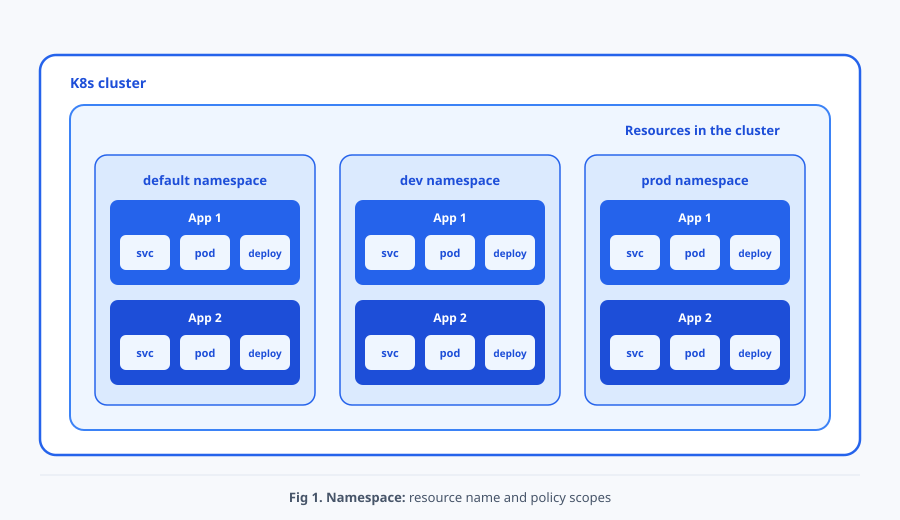

# Chap07. Namespace와 RBAC: 리소스 범위와 API 권한

> 15주 연재의 일곱째 글입니다. 이번 글에서는 Namespace로 리소스의 논리적 범위를 나누고, RBAC으로 Kubernetes API 작업 권한을 최소 범위로 부여하는 방법을 실습합니다.

## 들어가며

<div align="center">


</div>


결제팀과 분석팀이 같은 클러스터를 사용한다고 가정하겠습니다. 두 팀은 이름이 같은 애플리케이션을 실행할 수 있지만, 분석팀 계정이 결제 Pod의 로그까지 읽을 필요는 없습니다. 이때 Namespace는 리소스 이름과 작업 범위를 나누고, RBAC(Role-Based Access Control)은 API 요청을 수행할 주체와 허용 동작을 연결합니다.

두 기능은 목적이 다릅니다. Namespace를 만들었다고 접근 권한이나 네트워크 격리가 자동으로 생기지 않습니다. 이번 글은 Namespace의 범위를 확인한 뒤 Role·RoleBinding과 ClusterRole·ClusterRoleBinding을 차례로 적용하고, `kubectl auth can-i`와 실제 API 요청으로 허용과 거부를 모두 검증합니다. 본문의 출력은 이해를 위한 예시이며 실제 이름과 시간은 환경에 따라 달라집니다.

## 1. Namespace의 범위

<div align="center">



</div>

Namespace는 하나의 클러스터에서 리소스 이름과 정책 적용 범위를 논리적으로 나눕니다.[[1]](#ref-1) 개발과 운영 환경을 `dev`와 `prod`로 구분하거나 팀별로 `payments`와 `analytics`를 사용할 수 있습니다.

Pod, Deployment, Service, ServiceAccount, Role, RoleBinding은 특정 Namespace에 속하는 **Namespace 범위 리소스**입니다. Node, Namespace, PersistentVolume, ClusterRole, ClusterRoleBinding은 특정 Namespace에 속하지 않는 **클러스터 범위 리소스**입니다. 리소스의 실제 범위는 API 검색으로 확인할 수 있습니다.

```bash
# API 리소스가 Namespace 범위인지 확인
kubectl api-resources --namespaced=true
kubectl api-resources --namespaced=false
```

Namespace는 가상 클러스터가 아닙니다. 서로 다른 Namespace의 Pod가 같은 Node에서 실행될 수 있고, 별도 정책이 없으면 서로 통신할 수도 있습니다. Namespace 삭제는 그 안의 리소스를 함께 삭제하므로 공유 환경에서는 실습 전용 Namespace인지 먼저 확인해야 합니다.

## 2. Namespace 생성과 작업 범위 선택

다음 매니페스트를 `namespaces.yaml`로 저장합니다.

```yaml
# 개발과 운영 리소스의 논리적 범위를 만드는 매니페스트
apiVersion: v1
kind: Namespace
metadata:
  name: dev  # 개발 리소스의 Namespace 이름
---
apiVersion: v1
kind: Namespace
metadata:
  name: prod  # 운영 리소스의 Namespace 이름
```

- `metadata.name`: `dev`와 `prod`라는 서로 다른 Namespace를 만듭니다. 이후 리소스의 소속을 지정할 때 이 이름을 사용합니다.

두 문서 모두 `v1` API의 Namespace를 선언하며, `---`는 두 객체를 구분합니다.

```bash
# Namespace를 생성하고 현재 kubectl 작업 범위를 확인
kubectl apply -f namespaces.yaml
kubectl get namespaces
kubectl config view --minify -o jsonpath='{..namespace}'; echo
```

명령에 `-n` 또는 `--namespace`를 쓰면 해당 요청에만 Namespace가 적용됩니다. 생략하면 현재 kubeconfig 문맥의 Namespace를 사용하며, 별도 값이 없으면 일반적으로 `default`입니다. 반복해서 사용할 작업 범위는 문맥에 저장할 수 있습니다.

```bash
# 현재 문맥의 기본 Namespace를 dev로 바꾸고 명시적 범위와 비교
CH07_ORIGINAL_NAMESPACE=$(kubectl config view --minify -o jsonpath='{..namespace}')
: "${CH07_ORIGINAL_NAMESPACE:=default}"
kubectl config set-context --current --namespace=dev
kubectl get pods
kubectl get pods -n prod
kubectl get pods -A
```

공유 kubeconfig를 사용한다면 실습 후 원래 Namespace로 되돌립니다. 리소스를 찾지 못했을 때는 이름뿐 아니라 현재 문맥과 `-n` 값도 확인해야 합니다.

## 3. 같은 이름과 Namespace 간 Service DNS

리소스 이름은 같은 리소스 종류와 Namespace 안에서 고유해야 합니다. 따라서 `dev`와 `prod`에는 이름이 같은 `hello-nginx` Deployment와 `hello-svc` Service가 각각 존재할 수 있습니다.

```bash
# 두 Namespace에 이름이 같은 Deployment와 Service를 생성
for ns in dev prod; do
  kubectl create deployment hello-nginx -n "$ns" --image=nginx:1.28
  kubectl expose deployment hello-nginx -n "$ns" \
    --name=hello-svc --port=80 --target-port=80
done
kubectl get deployment,service,endpointslice -A
```

같은 Namespace의 Pod는 `hello-svc`라는 짧은 이름으로 Service를 찾습니다. 다른 Namespace에서는 `hello-svc.prod`처럼 Service와 Namespace를 함께 적습니다. 기본 클러스터 도메인이 `cluster.local`이면 전체 이름은 `hello-svc.prod.svc.cluster.local`입니다.[[2]](#ref-2)

```bash
# dev Pod에서 같은 Namespace와 prod Namespace의 Service DNS를 확인
kubectl run dns-check -n dev --image=busybox:1.36 --restart=Never \
  --command -- sleep 3600
kubectl wait -n dev --for=condition=Ready pod/dns-check --timeout=120s
kubectl exec -n dev dns-check -- nslookup hello-svc
kubectl exec -n dev dns-check -- nslookup hello-svc.prod
```

짧은 이름은 요청을 보내는 Pod의 Namespace를 기준으로 해석됩니다. Service의 Selector 역시 같은 Namespace의 Pod만 선택합니다. 이름이 같더라도 `dev/hello-svc`와 `prod/hello-svc`는 서로 다른 API 객체입니다.

## 4. Namespace는 권한 경계가 아니다

`payments` Namespace를 만들었다고 결제팀만 그 안의 리소스를 읽을 수 있는 것은 아닙니다. Namespace는 여러 정책이 적용될 범위를 제공하지만 그 자체로 다음 경계를 만들지 않습니다.

- API 권한: RBAC 같은 인가 정책으로 제한합니다.
- 자원 사용량: ResourceQuota, LimitRange와 컨테이너 requests·limits로 관리합니다.
- Pod 간 통신: 정책 집행을 지원하는 네트워크 구현과 NetworkPolicy로 제한합니다.
- Node 배치: Node Selector, Affinity, Taint와 Toleration으로 제어합니다.

따라서 보안 경계를 설계할 때 Namespace 생성만으로 격리가 끝났다고 판단하면 안 됩니다. 이번 글은 이 중 API 권한 경계인 RBAC에 집중합니다.

## 5. 인증, 인가와 RBAC 주체

Kubernetes API Server는 요청의 **인증(Authentication)** 단계에서 요청자가 누구인지 확인하고, **인가(Authorization)** 단계에서 그 주체가 요청한 작업을 수행할 수 있는지 판단합니다.[[3]](#ref-3) 인증에 성공해도 인가 규칙이 없으면 요청은 `Forbidden`으로 거부될 수 있습니다.

RBAC의 주체는 다음 세 종류로 구분합니다.

- `User`: 인증 시스템이 제공하는 사람 또는 외부 프로그램의 사용자 이름입니다. Kubernetes에는 일반 사용자 객체를 만드는 API가 없습니다.
- `Group`: 인증된 사용자를 묶는 문자열입니다. 하나의 Binding으로 여러 사용자에게 권한을 연결할 수 있습니다.
- `ServiceAccount`: Pod와 자동화 프로그램이 사용할 수 있는 Namespace 범위의 Kubernetes 신원입니다. 전체 사용자 이름은 `system:serviceaccount:<Namespace>:<이름>`입니다.

권한 객체와 연결 객체도 구분해야 합니다.

- `Role`: 한 Namespace에서 허용할 API 그룹, 리소스, 동작을 정의합니다.
- `RoleBinding`: Role 또는 ClusterRole을 주체에게 연결하되 권한 범위를 RoleBinding의 Namespace로 제한합니다.
- `ClusterRole`: 클러스터 범위 리소스의 권한 또는 여러 Namespace에서 재사용할 권한 집합을 정의합니다.
- `ClusterRoleBinding`: ClusterRole을 클러스터 전체 범위에서 주체에게 연결합니다.[[4]](#ref-4)

권한은 합산됩니다. RBAC에는 다른 허용 규칙을 취소하는 명시적 deny 규칙이 없습니다. 따라서 필요한 주체에게 필요한 리소스와 동작만 주는 **최소 권한 원칙**을 적용해야 합니다.

Secret 권한은 특히 위험합니다. Secret의 `get`, `list`, `watch`는 민감한 값을 직접 읽게 할 수 있습니다. Pod 생성 권한도 ServiceAccount나 Secret을 마운트한 Pod를 만들어 값을 간접적으로 획득하는 경로가 될 수 있습니다. `resources: ["*"]`, `verbs: ["*"]` 같은 포괄 권한을 편의상 부여하지 않습니다.[[4]](#ref-4)

## 6. Role과 RoleBinding 실습

실습에는 Namespace와 RBAC 리소스를 만들 권한이 필요합니다. 현재 문맥이 학습용 클러스터인지 먼저 확인합니다.

```bash
# RBAC 실습 대상 클러스터와 현재 신원을 확인
kubectl config current-context
kubectl cluster-info
kubectl auth whoami
```

### 6.1 Namespace, Pod와 ServiceAccount 준비

다음을 `rbac-lab.yaml`로 저장합니다.

```yaml
# RBAC 허용과 거부를 확인할 Namespace, Pod와 두 ServiceAccount
apiVersion: v1
kind: Namespace
metadata:
  name: payments
  labels:
    payflow.io/team: payments
---
apiVersion: v1
kind: Pod
metadata:
  name: rbac-test
  namespace: payments  # Pod와 ServiceAccount의 소속 Namespace
  labels:
    app: rbac-test
spec:
  containers:
  - name: app
    image: busybox:1.36
    command: ["sh", "-c", "while true; do echo rbac-test-running; sleep 30; done"]
---
apiVersion: v1
kind: ServiceAccount
metadata:
  name: payments-oncall  # 읽기 권한을 부여할 주체
  namespace: payments  # Pod와 ServiceAccount의 소속 Namespace
---
apiVersion: v1
kind: ServiceAccount
metadata:
  name: analytics-intern  # 권한이 없는 경우와 비교할 주체
  namespace: payments  # Pod와 ServiceAccount의 소속 Namespace
```

- Pod와 ServiceAccount의 `metadata.namespace: payments`: 실습 대상과 두 주체의 소속 Namespace를 지정합니다.
- ServiceAccount의 `metadata.name`: `payments-oncall`은 권한을 받을 주체이고, `analytics-intern`은 권한이 없는 경우와 비교할 주체입니다.

네 문서는 Namespace, 테스트 Pod와 두 ServiceAccount입니다. Label은 팀과 Pod를 식별하며, BusyBox 컨테이너는 30초마다 로그를 남겨 조회 실습에 사용합니다.

```bash
# 실습 기반 리소스를 적용하고 Pod 준비 상태를 확인
kubectl apply -f rbac-lab.yaml
kubectl wait --for=condition=Ready pod/rbac-test -n payments --timeout=120s
kubectl get pod,serviceaccount -n payments
```

### 6.2 Role로 읽기 동작 정의

다음을 `payments-pod-reader-role.yaml`로 저장합니다.

```yaml
# payments의 Pod와 Pod 로그만 읽도록 허용하는 Role
apiVersion: rbac.authorization.k8s.io/v1
kind: Role  # Namespace 범위 권한 규칙
metadata:
  name: payments-pod-reader
  namespace: payments  # Role의 권한이 적용되는 범위
rules:
- apiGroups: [""]  # Pod와 Node 등이 속한 핵심 API 그룹
  resources: ["pods", "pods/log"]  # 허용할 조회 대상
  verbs: ["get", "list", "watch"]  # 조회와 변경 감시만 허용
```

- `kind: Role`와 `metadata.namespace: payments`: 권한 규칙을 `payments` 범위에 정의합니다.
- `rules[].apiGroups`: 빈 문자열은 핵심 API 그룹을 뜻합니다.
- `rules[].resources: ["pods", "pods/log"]`: Pod와 로그 하위 리소스를 대상으로 합니다.
- `rules[].verbs`: `get`, `list`, `watch`만 허용합니다.

RBAC API 버전을 사용하며, 리소스 이름은 뒤의 Binding에서 권한 집합을 참조할 때 사용합니다.

Role에는 `create`, `patch`, `update`, `delete`가 없으므로 Pod를 바꾸는 권한은 생기지 않습니다.

### 6.3 RoleBinding으로 주체 연결

다음을 `payments-oncall-rolebinding.yaml`로 저장합니다.

```yaml
# payments-oncall에 payments-pod-reader Role을 연결하는 RoleBinding
apiVersion: rbac.authorization.k8s.io/v1
kind: RoleBinding  # Namespace 범위로 권한 연결
metadata:
  name: payments-oncall-reader
  namespace: payments  # 권한을 부여할 Namespace 범위
subjects:  # 권한을 받을 주체
- kind: ServiceAccount
  name: payments-oncall
  namespace: payments  # ServiceAccount 신원의 소속 Namespace
roleRef:  # 부여할 권한 집합 참조
  apiGroup: rbac.authorization.k8s.io
  kind: Role
  name: payments-pod-reader
```

- `kind: RoleBinding`과 `metadata.namespace`: 연결된 권한을 `payments` Namespace에서 부여합니다.
- `subjects`: `payments` Namespace의 `payments-oncall` ServiceAccount를 선택합니다. 주체의 `namespace`는 신원 구분에 사용합니다.
- `roleRef`: `payments-pod-reader` Role을 연결합니다.

Binding 이름은 연결 객체를 관리하기 위한 이름입니다. `roleRef.apiGroup`은 참조 대상이 RBAC API에 속함을 나타냅니다.

### 6.4 네 객체의 존재와 연결 확인

Role과 RoleBinding을 적용하기 전후로 결과를 비교합니다. ServiceAccount 임퍼소네이션을 사용하는 명령은 현재 사용자에게 `serviceaccounts`에 대한 `impersonate` 권한이 있어야 합니다. 그 권한이 없으면 이 절의 `--as` 명령 자체가 `Forbidden`이므로 클러스터 관리자에게 실습용 권한을 요청하거나 9절의 토큰 방식을 사용합니다.

```bash
# Binding 전 거부를 확인한 뒤 Role과 RoleBinding을 적용
kubectl auth can-i list pods -n payments \
  --as=system:serviceaccount:payments:payments-oncall
kubectl apply -f payments-pod-reader-role.yaml
kubectl auth can-i list pods -n payments \
  --as=system:serviceaccount:payments:payments-oncall
kubectl apply -f payments-oncall-rolebinding.yaml
```

Role만 만든 상태에서는 주체와 연결되지 않아 두 결과가 모두 `no`입니다. RoleBinding까지 적용한 뒤 객체와 참조를 확인합니다.

```bash
# Role과 RoleBinding의 생성 및 참조를 긍정·부정 조건으로 확인
kubectl get role payments-pod-reader -n payments
kubectl get rolebinding payments-oncall-reader -n payments
kubectl get rolebinding payments-oncall-reader -n payments \
  -o jsonpath='{.roleRef.kind}/{.roleRef.name}{" -> "}{.subjects[0].namespace}/{.subjects[0].name}{"\n"}'
kubectl get role missing-role -n payments
kubectl get rolebinding missing-binding -n payments
```

앞의 세 명령은 생성한 객체와 `Role/payments-pod-reader -> payments/payments-oncall` 연결을 보여 줍니다. 마지막 두 명령의 `NotFound`는 이름이 다른 객체가 자동으로 생기지 않았음을 확인하는 의도적인 부정 검사입니다.

## 7. `can-i`와 실제 허용·거부 검증

`kubectl auth can-i`는 인가 판단을 빠르게 확인하지만 실제 요청까지 성공한다는 보장은 아닙니다. 대상 리소스의 존재, 네트워크, Admission 정책 같은 후속 조건도 있기 때문입니다. 따라서 권한 질의와 실제 API 요청을 함께 확인합니다.

```bash
# RoleBinding 주체와 비주체의 읽기 및 삭제 권한을 비교
kubectl auth can-i list pods -n payments \
  --as=system:serviceaccount:payments:payments-oncall
kubectl auth can-i list pods -n payments \
  --as=system:serviceaccount:payments:analytics-intern
kubectl auth can-i delete pods -n payments \
  --as=system:serviceaccount:payments:payments-oncall
kubectl auth can-i list pods -n kube-system \
  --as=system:serviceaccount:payments:payments-oncall
```

예상 결과는 순서대로 `yes`, `no`, `no`, `no`입니다.

- 첫 `yes`: RoleBinding으로 연결한 주체가 `payments`의 Pod 목록을 조회할 수 있습니다.
- 나머지 `no`: 다른 주체, 삭제 동작, 다른 Namespace에는 해당 권한을 부여하지 않았습니다.

```bash
# 허용 주체와 거부 주체로 Pod 목록과 로그를 실제 요청
kubectl get pods -n payments \
  --as=system:serviceaccount:payments:payments-oncall
kubectl logs pod/rbac-test -n payments \
  --as=system:serviceaccount:payments:payments-oncall
kubectl get pods -n payments \
  --as=system:serviceaccount:payments:analytics-intern
kubectl logs pod/rbac-test -n payments \
  --as=system:serviceaccount:payments:analytics-intern
```

예시 환경에서 `payments-oncall`은 Pod 목록과 `rbac-test-running` 로그를 받습니다. 목록의 개별 열보다 실제 조회 결과를 받았는지가 중요합니다.

- `Forbidden`: `analytics-intern`의 두 요청이 권한 부족으로 거부되었다는 결과입니다.

공유 클러스터에서 예상과 달리 허용되면 `kubectl auth can-i --list --as=...`로 다른 Binding에서 부여한 권한을 함께 확인합니다.

RoleBinding을 잠시 제거하면 같은 Role이 남아 있어도 허용이 사라집니다.

```bash
# RoleBinding 제거 시 거부되고 복구 후 다시 허용되는지 확인
kubectl delete -f payments-oncall-rolebinding.yaml
kubectl auth can-i list pods -n payments \
  --as=system:serviceaccount:payments:payments-oncall
kubectl apply -f payments-oncall-rolebinding.yaml
kubectl auth can-i list pods -n payments \
  --as=system:serviceaccount:payments:payments-oncall
```

두 결과는 `no`, `yes`여야 합니다. 이 비교로 Role은 권한 정의이고 RoleBinding은 실제 주체 연결이라는 차이를 확인할 수 있습니다.

## 8. ClusterRole과 두 가지 Binding 범위

### 8.1 Node 읽기용 ClusterRole과 ClusterRoleBinding

Node는 클러스터 범위 리소스이므로 Namespace 범위 Role로 권한을 줄 수 없습니다. 다음 두 매니페스트를 각각 `node-reader-clusterrole.yaml`, `payments-node-reader-clusterrolebinding.yaml`로 저장합니다.

```yaml
# Node 조회 권한을 정의하는 ClusterRole
apiVersion: rbac.authorization.k8s.io/v1
kind: ClusterRole  # 클러스터 범위에서도 사용할 권한 규칙
metadata:
  name: payments-node-reader
rules:
- apiGroups: [""]  # Pod와 Node 등이 속한 핵심 API 그룹
  resources: ["nodes"]  # 허용할 조회 대상
  verbs: ["get", "list", "watch"]  # 조회와 변경 감시만 허용
```

- `kind: ClusterRole`: Namespace에 속하지 않는 권한 집합을 정의합니다. 실제 부여 범위는 Binding과 대상 리소스에 따라 결정됩니다.
- `rules[].apiGroups`: 빈 문자열은 핵심 API 그룹을 뜻합니다.
- `rules[].resources: ["nodes"]`: 클러스터 범위 리소스인 Node를 대상으로 합니다.
- `rules[].verbs`: `get`, `list`, `watch`만 허용합니다.

RBAC API 버전을 사용하며, 리소스 이름은 뒤의 Binding에서 권한 집합을 참조할 때 사용합니다.

```yaml
# payments-oncall에 Node 읽기 권한을 클러스터 범위로 연결
apiVersion: rbac.authorization.k8s.io/v1
kind: ClusterRoleBinding  # 클러스터 범위로 권한 연결
metadata:
  name: payments-oncall-node-reader
subjects:  # 권한을 받을 주체
- kind: ServiceAccount
  name: payments-oncall
  namespace: payments  # ServiceAccount의 소속이며 권한 범위 제한이 아님
roleRef:  # 부여할 권한 집합 참조
  apiGroup: rbac.authorization.k8s.io
  kind: ClusterRole
  name: payments-node-reader
```

- `kind: ClusterRoleBinding`: 참조한 권한을 클러스터 범위로 부여합니다.
- `subjects`: `payments` Namespace의 `payments-oncall` ServiceAccount를 선택합니다. 주체의 `namespace`는 신원 구분에 사용합니다.
- `roleRef`: `payments-node-reader` ClusterRole을 연결합니다.

Binding 이름은 연결 객체를 관리하기 위한 이름입니다. `roleRef.apiGroup`은 참조 대상이 RBAC API에 속함을 나타냅니다.

ClusterRole만 적용한 상태와 ClusterRoleBinding까지 적용한 상태를 비교합니다.

```bash
# ClusterRole 단독 거부와 ClusterRoleBinding 연결 후 허용을 비교
kubectl apply -f node-reader-clusterrole.yaml
kubectl auth can-i list nodes \
  --as=system:serviceaccount:payments:payments-oncall
kubectl apply -f payments-node-reader-clusterrolebinding.yaml
kubectl auth can-i list nodes \
  --as=system:serviceaccount:payments:payments-oncall
kubectl auth can-i list nodes \
  --as=system:serviceaccount:payments:analytics-intern
kubectl get nodes \
  --as=system:serviceaccount:payments:payments-oncall
```

예상 결과는 `no`, `yes`, `no`이며 마지막 명령은 Node 목록을 반환합니다. 이것이 ClusterRole과 ClusterRoleBinding의 긍정·부정 권한 검사입니다.

```bash
# ClusterRole과 ClusterRoleBinding의 생성 및 참조를 긍정·부정 조건으로 확인
kubectl get clusterrole payments-node-reader
kubectl get clusterrolebinding payments-oncall-node-reader
kubectl get clusterrolebinding payments-oncall-node-reader \
  -o jsonpath='{.roleRef.kind}/{.roleRef.name}{" -> "}{.subjects[0].namespace}/{.subjects[0].name}{"\n"}'
kubectl get clusterrole missing-clusterrole
kubectl get clusterrolebinding missing-clusterbinding
```

앞의 세 명령은 두 객체와 연결을 보여 주고 마지막 두 명령은 의도한 `NotFound`를 반환합니다. ClusterRoleBinding을 삭제한 뒤 Node 권한이 사라지는지 확인하고 다시 복구할 수도 있습니다.

```bash
# ClusterRoleBinding 제거 전후의 Node 권한을 부정·긍정으로 재검증
kubectl delete -f payments-node-reader-clusterrolebinding.yaml
kubectl auth can-i list nodes \
  --as=system:serviceaccount:payments:payments-oncall
kubectl apply -f payments-node-reader-clusterrolebinding.yaml
kubectl auth can-i list nodes \
  --as=system:serviceaccount:payments:payments-oncall
```

### 8.2 ClusterRole을 RoleBinding으로 재사용

같은 Pod 읽기 규칙을 여러 Namespace에서 재사용하려면 ClusterRole을 정의하고 각 Namespace의 RoleBinding에서 참조할 수 있습니다. 다음 두 객체를 `reusable-pod-reader.yaml`로 저장합니다.

```yaml
# Pod 읽기 규칙을 ClusterRole로 정의하고 payments에서만 연결
apiVersion: rbac.authorization.k8s.io/v1
kind: ClusterRole  # 재사용할 Pod 읽기 규칙
metadata:
  name: reusable-pod-reader
rules:
- apiGroups: [""]
  resources: ["pods"]  # Pod만 조회 대상
  verbs: ["get", "list", "watch"]  # 읽기 동작만 허용
---
apiVersion: rbac.authorization.k8s.io/v1
kind: RoleBinding  # 권한 부여는 Namespace 범위
metadata:
  name: payments-reusable-reader
  namespace: payments  # 권한을 부여할 Namespace 범위
subjects:  # 권한을 받을 analytics-intern 지정
- kind: ServiceAccount
  name: analytics-intern
  namespace: payments  # ServiceAccount 신원의 소속 Namespace
roleRef:  # 재사용할 ClusterRole 참조
  apiGroup: rbac.authorization.k8s.io
  kind: ClusterRole  # 재사용할 Pod 읽기 규칙
  name: reusable-pod-reader
```

- ClusterRole의 `rules.resources`와 `verbs`: Pod의 `get`, `list`, `watch` 권한을 정의합니다.
- `kind: RoleBinding`과 `metadata.namespace: payments`: ClusterRole을 참조하더라도 권한은 `payments` Namespace에 한정됩니다.
- `subjects`: `payments`의 `analytics-intern` ServiceAccount에 권한을 부여합니다.
- `roleRef.kind: ClusterRole`과 `roleRef.name`: 재사용할 `reusable-pod-reader` 권한 집합을 선택합니다.

두 문서는 RBAC API의 권한 정의와 연결 객체입니다. `apiGroups: [""]`는 Pod의 핵심 API 그룹이고, `subjects[].namespace`는 권한 범위가 아닌 주체의 소속입니다.

```bash
# ClusterRole 재사용 권한이 RoleBinding의 Namespace에만 한정되는지 확인
kubectl apply -f reusable-pod-reader.yaml
kubectl auth can-i list pods -n payments \
  --as=system:serviceaccount:payments:analytics-intern
kubectl auth can-i list pods -n kube-system \
  --as=system:serviceaccount:payments:analytics-intern
kubectl auth can-i list nodes \
  --as=system:serviceaccount:payments:analytics-intern
```

예상 결과는 `yes`, `no`, `no`입니다. ClusterRole을 참조했더라도 RoleBinding이 부여한 권한은 `payments` Namespace에만 유효합니다. 또한 이 ClusterRole에는 Node 규칙이 없습니다.

## 9. 선택 실습: 임시 토큰 kubeconfig

임퍼소네이션은 현재 사용자가 다른 주체의 인가 판단을 대신 요청하는 방식입니다. 실제 Pod와 자동화 도구는 보통 ServiceAccount 토큰으로 인증합니다. 다음 선택 실습은 TokenRequest API로 수명이 짧은 토큰을 만들고, 관리자 인증이 섞이지 않도록 서버와 CA 정보만 담은 임시 kubeconfig를 사용합니다.[[5]](#ref-5)

현재 사용자에게 두 ServiceAccount의 토큰 생성 권한이 필요합니다. 토큰은 인증 정보이므로 출력하거나 셸 기록과 파일에 장기 보관하지 않습니다.

```bash
# 수명이 짧은 ServiceAccount 토큰으로 허용과 거부를 확인
CH07_AUTH_DIR=$(mktemp -d)
CH07_SERVER=$(kubectl config view --minify -o jsonpath='{.clusters[0].cluster.server}')
kubectl config view --minify --flatten --raw \
  -o jsonpath='{.clusters[0].cluster.certificate-authority-data}' \
  | base64 --decode > "$CH07_AUTH_DIR/ca.crt"
kubectl --kubeconfig="$CH07_AUTH_DIR/config" config set-cluster lab \
  --server="$CH07_SERVER" --certificate-authority="$CH07_AUTH_DIR/ca.crt" >/dev/null
kubectl --kubeconfig="$CH07_AUTH_DIR/config" config set-context lab --cluster=lab >/dev/null
kubectl --kubeconfig="$CH07_AUTH_DIR/config" config use-context lab >/dev/null
CH07_TOKEN_OK=$(kubectl create token payments-oncall -n payments --duration=10m)
CH07_TOKEN_NG=$(kubectl create token analytics-intern -n payments --duration=10m)
kubectl --kubeconfig="$CH07_AUTH_DIR/config" --token="$CH07_TOKEN_OK" get nodes
kubectl --kubeconfig="$CH07_AUTH_DIR/config" --token="$CH07_TOKEN_NG" get nodes
unset CH07_TOKEN_OK CH07_TOKEN_NG
rm -rf "$CH07_AUTH_DIR"
```

첫 요청은 Node 목록을 반환하고 두 번째 요청은 `Forbidden`이어야 합니다. CA 데이터가 아닌 인증 플러그인만 사용하는 kubeconfig 등 환경에 따라 임시 설정 생성 방법은 달라질 수 있습니다. 장기 ServiceAccount Secret 토큰을 새로 만드는 방식보다 수명이 제한된 TokenRequest 토큰을 우선합니다.

## 10. RBAC 문제 진단과 정리

RBAC 문제가 발생하면 객체를 무작정 다시 만들기보다 요청의 신원, 범위, 리소스와 동작을 순서대로 확인합니다.

- `NotFound`: 먼저 `-n`과 리소스 이름을 확인합니다. 권한이 없을 때 정보 노출을 줄이기 위해 NotFound처럼 보이는 API도 있으므로 `can-i`도 함께 확인합니다.
- `Forbidden`: 오류 메시지의 사용자 이름, API 그룹, 리소스, verb, Namespace를 읽고 `kubectl auth can-i`로 같은 요청을 재현합니다.
- 예상과 달리 허용됨: `kubectl auth can-i --list --as=<주체> -n <Namespace>`와 다른 RoleBinding·ClusterRoleBinding을 확인합니다. RBAC 권한은 합산됩니다.
- 예상과 달리 거부됨: `subjects`의 `kind`, `name`, ServiceAccount `namespace`와 `roleRef`를 확인합니다. `roleRef`는 생성 후 직접 변경할 수 없으므로 잘못 연결했다면 Binding을 다시 만듭니다.
- 로그만 거부됨: `pods`와 `pods/log`는 별도 리소스이므로 둘 다 필요한지 확인합니다.
- 임퍼소네이션 자체가 거부됨: 실습 사용자의 `impersonate` 권한 문제입니다. 대상 ServiceAccount의 권한 문제와 구분합니다.

```bash
# RBAC 객체와 주체의 합산 권한 및 최근 인가 오류를 조사
kubectl describe role payments-pod-reader -n payments
kubectl describe rolebinding payments-oncall-reader -n payments
kubectl describe clusterrole payments-node-reader
kubectl describe clusterrolebinding payments-oncall-node-reader
kubectl auth can-i --list -n payments \
  --as=system:serviceaccount:payments:payments-oncall
kubectl get events -n payments --sort-by=.lastTimestamp
```

실습을 마치면 클러스터 범위 Binding부터 삭제하고, Namespace를 삭제하기 전에 그 안에 보존할 리소스가 없는지 확인합니다.

```bash
# 이 글에서 만든 RBAC과 Namespace 실습 리소스를 정리
kubectl delete -f payments-node-reader-clusterrolebinding.yaml --ignore-not-found
kubectl delete -f node-reader-clusterrole.yaml --ignore-not-found
kubectl delete -f reusable-pod-reader.yaml --ignore-not-found
kubectl delete -f payments-oncall-rolebinding.yaml --ignore-not-found
kubectl delete -f payments-pod-reader-role.yaml --ignore-not-found
kubectl delete -f rbac-lab.yaml --ignore-not-found
kubectl delete pod dns-check -n dev --ignore-not-found
for ns in dev prod; do
  kubectl delete deployment hello-nginx -n "$ns" --ignore-not-found
  kubectl delete service hello-svc -n "$ns" --ignore-not-found
done
kubectl delete -f namespaces.yaml --ignore-not-found
kubectl config set-context --current --namespace="${CH07_ORIGINAL_NAMESPACE:-default}"
```

`payments`가 공유 Namespace라면 `rbac-lab.yaml` 전체 삭제 대신 이 글에서 만든 객체만 개별 삭제합니다. 클러스터 관리자가 기존에 부여한 ClusterRole이나 Binding은 실습 정리 대상으로 포함하지 않습니다.

## 다음 글로 넘어가기 전에

이번 글에서 다룬 내용은 이렇습니다. Namespace는 리소스 이름과 정책 범위를 나누지만 권한 경계는 아닙니다. 인증은 주체를 확인하고 인가는 요청을 허용할지 판단합니다. Role과 ClusterRole은 권한을 정의하며 RoleBinding과 ClusterRoleBinding이 그 권한을 주체에게 연결합니다. `can-i`와 실제 요청의 긍정·부정 검사를 함께 수행하면 권한 범위와 연결 오류를 구분할 수 있습니다.

다음 글에서는 Pod의 CPU와 메모리 requests·limits를 선언하고, Scheduler의 배치 판단과 실행 중 자원 제한이 어떻게 다른지 살펴봅니다.

## 참고문헌

- <a id="ref-1"></a>[1] [Namespace 공식 문서](https://kubernetes.io/docs/concepts/overview/working-with-objects/namespaces/)
- <a id="ref-2"></a>[2] [Service와 Pod DNS 공식 문서](https://kubernetes.io/docs/concepts/services-networking/dns-pod-service/)
- <a id="ref-3"></a>[3] [인증 공식 문서](https://kubernetes.io/docs/reference/access-authn-authz/authentication/)
- <a id="ref-4"></a>[4] [RBAC 인가 공식 문서](https://kubernetes.io/docs/reference/access-authn-authz/rbac/)
- <a id="ref-5"></a>[5] [ServiceAccount 관리 공식 문서](https://kubernetes.io/docs/reference/access-authn-authz/service-accounts-admin/)
