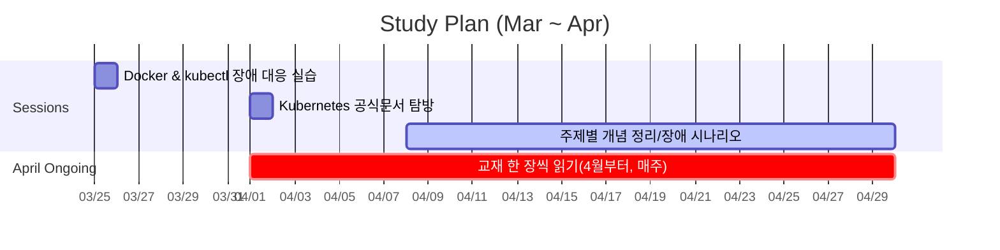

## 스터디 일정

- **3/25**: Docker 와 Kubectl 실습을 통한 장애 상황 대응
- **4/1**: Kubernetes 공식문서 탐방
- **4/8 ~ 5/27**: Kubernetes 주제별 개념 정리 및 장애 시나리오 풀이
- 6/10 ~ 6/24 : Amazon EKS 실습
- 6/24 : 끝
- **4월 부터**: 교재 한 장씩 읽기(매주 진행)

---

## Mermaid (Gantt)

